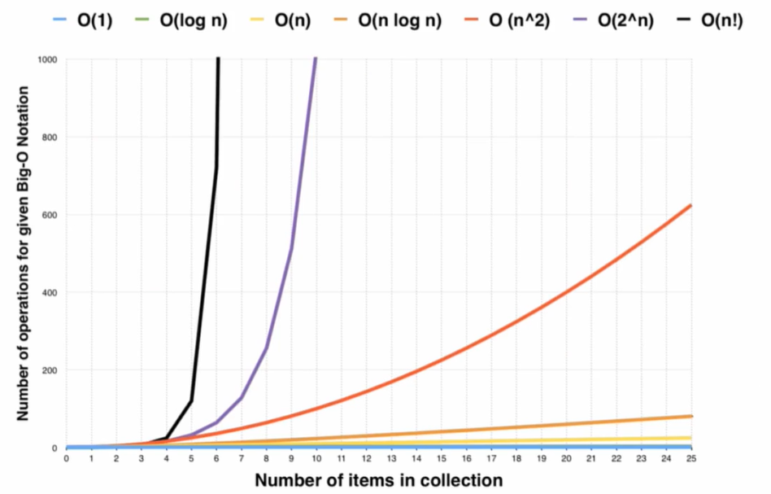

[TOC]

# 刷题法

## 坚持“三刷五步”训练法

初学建议分类刷 $\rightarrow$ 后期建议综合刷

**一刷：**

每个“小类别”的代表性题目，各刷几道，此时如果需要看题解，很正常

**二刷：**

复习代表性题目，“小类别” 合成 “大类别”，刷该分类更多的题目，举一反三，在尽量少的提示下完成

**三刷：**

综合性题目，尽量独立实现+测试

**第一步 理解题面**

想一想更多的例子和测试数据，看看有没有遗漏的地方

提炼题目中的关键信息、变化信息

面试的时候，跟面试官确认自己的理解

**第二步 部分实现**

无论什么题目，先尝试实现一个朴素解法（比如搜索）

或者是部分场景下的解法

尽量让自己的解法更优，覆盖跟多的场景

**第三步 有提示解答**

看提示 $\neq$ 看题解

可以看题解的一部分，试试能否找到突破口

例如题目类别，题解标题，时间复杂度，一个小结论

面试是一个交互性的过程，你可以与面试官交流获取适当的提示

要能明白面试官在引导你什么，这就要从平时练起

**第四步 独立解答**

独立完成求解，同时注意测试

初期训练时通常可以从第二步的搜索出发

- 搜索时关注了哪些信息？
- 它们有没有冗余？能不能更好地维护？
- 有没有同类的子问题？

**第五步 写题解**

尝试给别人讲（面试的时候也是要讲的），尝试分析对比各种不同解法的优劣

题解也可以写成日记的形式，记录自己遇到的难点

有助于加深自己的理解，以后也可以回看自己的题解，快速复习

## 例子

给定 $n$ 个二元组 $(x_1,y_1), (x_2,y_2),...,(x_n,y_n)$，已经按照 $x$ 从小到大排好序了，求 $y_i + y_j + |x_i - x_j|$ 的最大值 $(i\neq j)$ 

朴素 $O(n^2)$

```
for (int i = 1; i <= n; ++i)
	for (int j = 1; j <= n; j++)
		if (i != j) ans = max(ans, y[i] + y[j] + abs(x[i] - x[j]));
```

优化：上面的计算中有哪些冗余？

### 第一步优化

式子的值与 $i,j$ 的顺序无关，不妨设 $j < i$ 计算量减少了一半，可惜还是 $O(n^2)$ ，$x_i, x_j$ 大小关系已知，绝对值也可以拆了

 ```
 for (int i = 2; i <= n; i++)
 	for (int j = 1; j < i; j++)
 		ans = max(ans, y[i] + y[j] + x[i] - x[j]);
 ```

### 第二步优化

$y[i] + x[i]$ 并不随着 $j$ 而变化，可以提出来在外边计算，减少一些加法的次数，虽然用处不大，还是 $O(n^2)$

```
for (int i = 2; i <= n; i++) {
	int temp = -1000000000;
	for (int j = 1; j < i; j++)
		temp = max(temp, y[j] - x[j]);
	ans = max(ans, y[i] + x[i] + temp);
}
```

### 第三步优化

重点来了，请问对于每个 $i$，你都计算了哪些 $j$ 和哪些算式？

| $i = 2$ | $j = 1$          | $max\{y_1 - x_1\}$                                  |
| ------- | ---------------- | --------------------------------------------------- |
| $i = 3$ | $j = 1, 2$       | $max\{y_1 - x_1, y_2 - x_2\}$                       |
| $i = 4$ | $j = 1, 2, 3$    | $max\{y_1 - x_1, y_2 - x_2, y_3 - x_3\}$            |
| $i = 5$ | $j = 1, 2, 3, 4$ | $max\{y_1 - x_1, y_2 - x_2, y_3 - x_3, y_4 - x_4\}$ |

这里有大量的冗余！

$y_1 - x_1, y_2 - x_2, y_3 - x_3$ 的最大值明明已经在 $i = 4$ 的时候算过了， $i = 5$ 为啥还要再算一遍呢？

记 $temp = max\{y_1 - x_1, y_2 - x_2, y_3 - x_3\}$ 

$i = 5$  时我们只需要计算 $max(temp, y_4 - x_4)$

对于每个 $i$ ，我们只需要让已有的 temp 与最新的 “候选项” $y_{i - 1} - x_{i - 1}$ 取max！

**$O(n)$ 代码**

```
for (int i = 2; i <= n; i++) {
	temp = max(temp, y[i - 1] - x[i - 1]);
	ans = max(ans, y[i] + x[i] + temp);
}
```

# 时空复杂度分析方法

## 大 O 表示法

忽略常数、只看最高复杂度的运算

- O(1)：Constant Complexity 常数复杂度
- O(log(n))：Logarithmic Complexity 对数复杂度
- O(n)：Linear Complexity 线性时间复杂度
- O(n^2)：N square Complexity 平方
- O(n^3)：N cubic Complexity 立方
- O(2^n)：Exponential Growth 指数
- O(n!)：Factorial 阶乘

O(log(n)) 没有底数，为什么？

## 时间复杂度

**O(n)**

```
for (int i = 1; i <= n; i++) {
	cout << "Hey - I'm looking at: " << i << endl;
}
```

**O(n^2)**

```
for (int i = 1; i <= n; i++) {
	for (int j = 1; j <= n; j++) {
		cout << "Hey - I'm looking at: " << i << " and " << j << endl;
	}
}
```

**O(n log(n))**

```
void calc(int l, int r) {
	if (l >= r) return;
	for (int i = l; i <= r; i++) { /* print xxxx */}
	int mid = (l + r) / 2;
	calc(l, mid);
	calc(mid + 1, r);
}
calc(1, n)
```

**O(k^n)**

```
int fib (int n) {
	if (n < 2) return n;
	return fib(n - 1) + fib(n - 2);
}
```

**O(n!)**

```
void dfs(int depth) {
	if (depth == n) {
		//print per
		return ;
	}
	for (int i = 0; i < n; i++) {
		if (used[i]) continue;
		used[i] = true;
		per.add(i);
		dfs(depth + 1);
		per.remove(per.size() - 1);
		used[i] = false;
	}
}
dfs(0);
```



## 空间复杂度

- 静态数组的长度
- 递归的深度（栈上消耗的空间）
- 动态new的空间（堆上消耗的空间）


