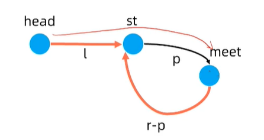

[TOC]

# 数组

数组的基本特点：支持随机访问

数组的关键：索引与寻址

数组必须要连续存储

**时间复杂度：**

- Lookup O(1)
- Insert O(n)
- Delete O(n)
- Append(push back) O(1)
- Prepend(push front) O(n)

**变长数组（resizable array）**

- C++: vector
- Java: ArrayList
- Python: list

**如何实现一个变长数组？**

- 支持索引与随机访问
- 分配多长的连续空间？
- 空间不够用了怎么办？
- 空间剩余很多如何回收？

**实现方法**

- 一个简易的实现方法
- 初始：空数组，分配常数空间
- Push back：若空间不够，重新申请2倍大小的连续空间，拷贝到新空间，释放旧空间
- Pop back：若空间利用率不到25%，释放一半的空间

**时间复杂度**

- 均摊O(1)
- 在空数组中连续插入n个元素，总插入/拷贝次数为 n + n/2 + n/4 + .... < 2n
- 一次扩容到下一次释放，至少需要再删除 (1 - 2*0.25)n=0.5n 次

**思考**

- 若释放空间的阈值设定为50%，会发生什么情况？
- 会导致释放一半空间之后，再插入会造成再次扩容，接着删除又会造成释放空间，时间复杂度会提升为O(n)


# 实战

[88.合并两个有序数组](https://leetcode-cn.com/problems/merge-sorted-array/)

主题思路：i、j两个索引，谁小放谁

细节：i和j的边界问题

```
class Solution {
public:
    void merge(vector<int>& nums1, int m, vector<int>& nums2, int n) {
    	for (int i = m + n - 1; i >= 0; i--) {
    		if (n == 0 || m > 0 && nums1[m - 1] > nums2[n - 1])
    			nums1[i] = nums1[m - 1], m--;
    		else 
    			nums1[i] = nums2[n - 1], n--;
    	}
    }
};
```

```
class Solution {
public:
    void merge(vector<int>& nums1, int m, vector<int>& nums2, int n) {
        int i = m - 1, j = n - 1;
        for (int k = m + n - 1; k >= 0; k--) {
            if (j < 0 || (i >= 0 && nums1[i] >= nums2[j])) {
                nums1[k] = nums1[i];
                i--;
            }
            else {
                nums1[k] = nums2[j];
                j--;
            }
        }
    }
};
```


[26. 删除有序数组中的重复项](https://leetcode-cn.com/problems/remove-duplicates-from-sorted-array/)

```
class Solution {
public:
    int removeDuplicates(vector<int>& nums) {
		int n = 0;
		for (int i = 0; i < nums.size(); i++) {
			if (i == 0 || nums[i] != nums[i - 1]) {
				nums[n] = nums[i];
				n++;
			}
		}
		return n;
    }
};
```

[283. 移动零](https://leetcode-cn.com/problems/move-zeroes/)

解法1：

```
class Solution {
public:
    void moveZeroes(vector<int>& nums) {
    	int n = 0;
    	for (int i = 0; i < nums.size(); i++) 
    		if (nums[i] != 0) nums[n++] = nums[i];
    	for (; n < nums.size(); n++)
    		nums[n] = 0;
    }
};
```

解法2：

```
class Solution {
public:
    void moveZeroes(vector<int>& nums) {
    	for (int l = 0, cur = 0; cur < nums.size; cur++) {
    		if (nums[cur] != 0) {
    			swap(nums[l++], nums[cur]);
    		}
    	}
    }
};
```


[206. 反转链表](https://leetcode-cn.com/problems/reverse-linked-list/)

迭代：

```
/**
 * Definition for singly-linked list.
 * struct ListNode {
 *     int val;
 *     ListNode *next;
 *     ListNode() : val(0), next(nullptr) {}
 *     ListNode(int x) : val(x), next(nullptr) {}
 *     ListNode(int x, ListNode *next) : val(x), next(next) {}
 * };
 */
class Solution {
public:
    ListNode* reverseList(ListNode* head) {
        ListNode *dummy = new ListNode(0);
        ListNode *p = dummy;
        while (head) {
            ListNode *temp = head;
            head = head->next;
            temp->next = p->next;
            p->next = temp;
        }
        return dummy->next;
    }
};
```

```
/**
 * Definition for singly-linked list.
 * struct ListNode {
 *     int val;
 *     ListNode *next;
 *     ListNode() : val(0), next(nullptr) {}
 *     ListNode(int x) : val(x), next(nullptr) {}
 *     ListNode(int x, ListNode *next) : val(x), next(next) {}
 * };
 */
class Solution {
public:
    ListNode* reverseList(ListNode* head) {
        ListNode* last = nullptr;
        while (head) {
            ListNode* nextHead = head->next;
            head->next = last;
            last = head;
            head = nextHead;
        }
        return last;
    }
};
```

递归：

```
/**
 * Definition for singly-linked list.
 * struct ListNode {
 *     int val;
 *     ListNode *next;
 *     ListNode() : val(0), next(nullptr) {}
 *     ListNode(int x) : val(x), next(nullptr) {}
 *     ListNode(int x, ListNode *next) : val(x), next(next) {}
 * };
 */
class Solution {
public:
    ListNode* reverseList(ListNode* head) {
        if (!head || !head->next) return head;
        ListNode* temp = reverseList(head->next);
        head->next->next = head;
        head->next = nullptr;
        return temp;
    }
};
```

[25. K 个一组翻转链表](https://leetcode-cn.com/problems/reverse-nodes-in-k-group/)

- 分组（找到每一组的开始、结尾），按组遍历
- 反转一组

```
/**
 * Definition for singly-linked list.
 * struct ListNode {
 *     int val;
 *     ListNode *next;
 *     ListNode() : val(0), next(nullptr) {}
 *     ListNode(int x) : val(x), next(nullptr) {}
 *     ListNode(int x, ListNode *next) : val(x), next(next) {}
 * };
 */
class Solution {
public:
    ListNode* reverseKGroup(ListNode* head, int k) {
        ListNode *protect = new ListNode(0);
        protect->next = head;
        ListNode *last = protect;
        while (head != nullptr) {
            ListNode *end = getEnd(head, k);
            if (end == nullptr) break;
            ListNode *nextGroupHead = end->next;
            reverseList(head, end);
            last->next = end;
            head->next = nextGroupHead;
            last = head;
            head = nextGroupHead;
        }
        return protect->next;
    }

    ListNode* getEnd(ListNode *head, int k) {
        while (head != nullptr) {
            k--;
            if (k == 0) break;
            head = head->next;
        }
        return head;
    }

    void reverseList(ListNode* head, ListNode *end) {
    	if (head == end) return ;
        ListNode* last = head;
        head = head->next;
        while (head != end) {
            ListNode* nextHead = head->next;
            head->next = last;
            last = head;
            head = nextHead;
        }
        end->next = last;
    }
};
```

```
/**
 * Definition for singly-linked list.
 * struct ListNode {
 *     int val;
 *     ListNode *next;
 *     ListNode(int x) : val(x), next(NULL) {}
 * };
 */
class Solution {
public:
    ListNode* reverseKGroup(ListNode* head, int k) {
        ListNode *dummy = new ListNode(0);
        dummy->next = head;
        ListNode *pre = dummy, *tail = dummy;
        while(1){
            int count = k;
            while(count && tail){
                count--;
                tail = tail->next;
            }
            if(tail == nullptr)break;
            head = pre->next;
            while(pre->next != tail){
                ListNode *cur = pre->next;
                pre->next = cur->next;
                cur->next = tail->next;
                tail->next = cur;
            }
            pre = head;
            tail = head;
        }
        return dummy->next;
        
    }
};
```

[141. 环形链表](https://leetcode-cn.com/problems/linked-list-cycle/)

哈希表

```
/**
 * Definition for singly-linked list.
 * struct ListNode {
 *     int val;
 *     ListNode *next;
 *     ListNode(int x) : val(x), next(NULL) {}
 * };
 */
class Solution {
public:
    bool hasCycle(ListNode *head) {
        unordered_map<ListNode *, bool> hash;
         while(head){
             if(hash.find(head) == hash.end()){
      			 hash[head] = true;
             }else{
                 return true;
             }
             head = head->next;
         }
        return false;
    }
};
```

双指针

```
/**
 * Definition for singly-linked list.
 * struct ListNode {
 *     int val;
 *     ListNode *next;
 *     ListNode(int x) : val(x), next(NULL) {}
 * };
 */
class Solution {
public:
    bool hasCycle(ListNode *head) {
        if (head == nullptr || head->next == nullptr) return false;
        ListNode *slow = head, *fast = head->next;
        while (fast && fast->next) {
            if (slow == fast) return true;
            slow = slow->next;
            fast = fast->next->next;
        }
        return false;
    }
};
```

[142. 环形链表 II](https://leetcode-cn.com/problems/linked-list-cycle-ii/)



- 相遇时，有2(l + p) = l + p + k*r，其中k为整数（套的圈数）
- 即 l = k\*r - p = (k - 1)\*r + (r - p)
- 含义：从head走到st，等于从meet走到st，然后再绕几圈
- 此时开始让慢指针与head同时移动，必定再环的起始点相遇

```
/**
 * Definition for singly-linked list.
 * struct ListNode {
 *     int val;
 *     ListNode *next;
 *     ListNode(int x) : val(x), next(NULL) {}
 * };
 */
class Solution {
public:
    ListNode *detectCycle(ListNode *head) {
        ListNode *slow = head, *fast = head;
        while(true){
            if(!(fast && fast->next))return NULL;
            fast = fast->next->next;
            slow = slow->next;
            if(slow == fast)break;
        }
        fast = head;
        while(fast != slow){
            fast = fast->next;
            slow = slow->next;
        }
        return fast;
    }
};
```

[136.邻值查找](https://www.acwing.com/problem/content/description/138/)

```
#include <bits/stdc++.h>
using namespace std;

struct Node {
    int val, idx;
    Node* pre; Node* next;
} head, tail;
int a[100005], rk[100005], ans[100005], n;
Node* pos[100005];

// 双链表，新建节点的操作模板
Node* AddNode(Node* p, int idx) {
    Node* q = new Node();
    q->idx = idx, q->val = a[idx];
    q->pre = p, q->next = p->next;
    p->next->pre = q, p->next = q;
    return q;
}

// 双链表，删除节点的操作模板
void DeleteNode(Node* p) {
    p->pre->next = p->next;
    p->next->pre = p->pre;
    delete p;
}

int main() {
    cin >> n;
    for (int i = 1; i <= n; i++) {
        scanf("%d", &a[i]);
        rk[i] = i;
    }
    // rank，每个结点的大小排名
    sort(rk + 1, rk + n + 1, [&a](int i, int j) { return a[i] < a[j]; });
    // 双链表，初始化两个保护节点
    head.val = a[rk[1]] - 1e9;
    tail.val = a[rk[n]] + 1e9;
    head.next = &tail;
    tail.pre = &head;
    for (int i = 1; i <= n; i++) {
        pos[rk[i]] = AddNode(tail.pre, rk[i]);
    }
    for (int i = n; i > 1; i--) {
        Node* pre = pos[i]->pre;
        Node* next = pos[i]->next;
        if (a[i] - pre->val < next->val - a[i] ||
            a[i] - pre->val == next->val - a[i] && pre->val < next->val) {
            ans[i] = pre->idx;    
        } else {
            ans[i] = next->idx;
        }
        DeleteNode(pos[i]);
    }
    for (int i = 2; i <= n; i++) printf("%d %d\n", abs(a[i] - a[ans[i]]), ans[i]);
}
```


# 栈、队列

 [20. 有效的括号](https://leetcode-cn.com/problems/valid-parentheses/)

```
class Solution {
public:
    bool isValid(string s) {
        std::stack<char> st;
        for (char ch : s) {
            if (ch == '(') st.push(')');
            else if (ch == '[') st.push(']');
            else if (ch == '{') st.push('}');
            else if (!st.empty() && ch == st.top()) st.pop();
            else return false;
        }
        return st.empty();
    }
};
```

[155. 最小栈](https://leetcode-cn.com/problems/min-stack/)

```
class MinStack {
private:
    stack<int> st1;
    stack<int> st2;
public:

    /** initialize your data structure here. */
    MinStack() {

    }
    
    void push(int val) {
        st1.push(val);
        if (st2.empty() || val <= getMin()) st2.push(val);
    }
    
    void pop() {
        if控制台 
贡献

执行代码

提交
控制台 
贡献

执行代码

提交
 (st1.top() == getMin()) st2.pop();
        st1.pop();
    }
    
    int top() {
        return st1.top();
    }
    
    int getMin() {
        return st2.top();
    }
};

/**
 * Your MinStack object will be instantiated and called as such:
 * MinStack* obj = new MinStack();
 * obj->push(val);
 * obj->pop();
 * int param_3 = obj->top();
 * int param_4 = obj->getMin();
 */
```

[150. 逆波兰表达式求值](https://leetcode-cn.com/problems/evaluate-reverse-polish-notation/)

**表达式求值**

前缀表达式

- 形如 “op A B”，其中op是一个运算符，A、B是另外两个前缀表达式
- 例如：* 3 + 1 2
- 又称波兰式

后缀表达式

- 形如 “ A B op”
- 1 2 + 3 *
- 又称逆波兰式

中缀表达式

- 3 * (1 + 2)

建立一个用于存数的栈，逐一扫描后缀表达式中的元素。

- 如果遇到一个数，则把该数入栈。
- 如果遇到运算符，就取出栈顶的两个数进行计算，然后把结果入栈。

扫描完成后，栈中恰好剩下一个数，就是该后缀表达式的值。

时间复杂度 O(n)

```
class Solution {
public:
    int evalRPN(vector<string>& tokens) {
        stack<long long> st;
        for (string& token : tokens) {
            if (token == "+" || token == "-" || token == "*" || token == "/") {
                long long b = st.top();
                st.pop();
                long long a = st.top();
                st.pop();
                st.push(calc(a, b, token));
            } else {
                st.push(stoi(token));
            }
        }
        return st.top();
    }
    long long calc (long long a, long long b, string op) {
        if (op == "+") return a + b;
        if (op == "-") return a - b;
        if (op == "*") return a * b;
        if (op == "/") return a / b;
        return 0;
    }
};
```

[224. 基本计算器](https://leetcode-cn.com/problems/basic-calculator/)

建立一个用于存运算符的栈，逐一扫描中缀表达式中的元素。

- 如果遇到一个数，输出该数。
- 如果遇到左括号，就把左括号入栈。
- 如果遇到右括号，不断取出栈顶并输出，直到栈顶为左括号，然后把左括号出栈。
- 如果遇到运算符，只要栈顶符号的优先级 >= 新符号，就不断取出栈顶并输出，最后把新符号进栈。优先级顺序为乘除号 > 加减号 > 左括号。
- 思考：如何辨别运算符是加减法运算还是正负号？

依次取出并输出栈中的所有剩余符号。

最终输出的序列就是一个与原中缀表达式的后缀表达式，再对后缀表达式求值，时间复杂度 O(n)

把中缀表达式转为后缀表达式。

```
class Solution {
public:
    int calculate(string s) {
        stack<char> ops;
        vector<string> tokens;
        long long val = 0;
        bool num_started = false; // 是否正在parse一个数值，数值后面遇到第一个符号时，要把parse好的数存起来
        bool needs_zero = true; // 是否需要补0，例如 "-48 + +48"，要补成"0-48 + 0+48"
        // leetcode这题不太严谨，官方 "1- -1"的答案是0，即"1-0-1"，而不是1减去负1得2，大家不要在意细节，无脑补0就行了
        for (char ch : s) {
            // Parse一个数值
            if (ch >= '0' && ch <= '9') {
                val = val * 10 + ch - '0';
                num_started = true;
                continue;
            } else if (num_started) { // 数值后面第一次遇到符号
                tokens.push_back(to_string(val));
                num_started = false;
                needs_zero = false; // 加减号跟在数值后面，不需要补0，例如"10-1"
                val = 0;
            }

            if (ch == ' ') continue;
            // 处理运算符
            if (ch == '(') {
                ops.push(ch);
                needs_zero = true; // 加减号跟在左括号后面，需要补零，例如"(-2)*3"变为"(0-2)*3"
                continue;
            }
            if (ch == ')') {
                while (ops.top() != '(') { // 两个括号之间的都可以计算了
                    // push back 包含一个符号的字符串
                    tokens.push_back(string(1, ops.top()));
                    ops.pop();
                }
                ops.pop();
                needs_zero = false; // 加减号跟在右括号后面，不需要补0，例如"3*(1-2)+3"
                continue;
            }
            // 处理+-*/
            if (needs_zero) tokens.push_back("0"); // 补0
            while (!ops.empty() && getRank(ops.top()) >= getRank(ch)) {
                // 前面的符号优先级更高，就可以计算了，例如1*2+3，遇到+时，*就可以算了
                tokens.push_back(string(1, ops.top()));
                ops.pop();
            }
            ops.push(ch);
            needs_zero = true; // +-后面跟着+-号，需要补0，例如"3 + -1"，变为"3 + 0-1"
        }
        if (num_started) tokens.push_back(to_string(val));
        while (!ops.empty()) { // 最后剩余的符号都要取出来
            tokens.push_back(string(1, ops.top()));
            ops.pop();
        }
        return evalRPN(tokens);
    }

    int getRank(char ch) {
        if (ch == '+' || ch == '-') return 1;
        if (ch == '*' || ch == '/') return 2;
        return 0;
    }

    int evalRPN(vector<string>& tokens) {
        stack<long long> s;
        for (string& token : tokens) {
            // is number
            if (token == "+" || token == "-" || token == "*" || token == "/") {
                long long b = s.top();
                s.pop();
                long long a = s.top();
                s.pop();
                s.push(calc(a, b, token)); 
            } else {
                s.push(stoi(token));
            }
        }
        return s.top();
    }

    long long calc(long long a, long long b, string op) {
        if (op == "+") return a + b;
        if (op == "-") return a - b;
        if (op == "*") return a * b;
        if (op == "/") return a / b;
        return 0;
    }
};
```

[227. 基本计算器 II](https://leetcode-cn.com/problems/basic-calculator-ii/)


