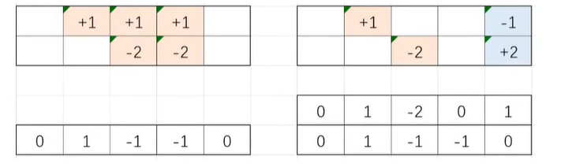

[TOC]

# 前缀和

## 一维前缀和


- 一维数组 A
- 前缀和数组 S

$$
s[i] = \sum_{j = 1}^{i} A[j] = S[i - 1] + A[i]
$$

- 子段和——A中第l个数到第r个数的和

$$
sum(l, r) = \sum_{i = l}^{r} A[i] = S[r] - S[l - 1]
$$

- 当A中都是非负数时，前缀和数组S单调递增

[1248. 统计「优美子数组」](https://leetcode-cn.com/problems/count-number-of-nice-subarrays/)

对数组中每个数对2进行取模

nums = [1, 1, 2, 1, 1]     
nums = [1, 1, 0, 1, 1]  

问题转换为有多少连续子数组和是k    

奇数看作1，偶数看作0，求前缀和数组s   
连续子数组 [l, r] 中的奇数个数为 S[r] - S[l - 1]   

枚举右端点i，只需要找到i前面有多少个j满足 S[i] - S[j] = k   
由于S单调递增，只要满足S[i] - S[j] = k (k > 0), j 必然在i前面   

所以只需用一个计数数组统计 S 中每个值的个数  
枚举右端点i，看一下等于 S[i] - k 的值有几个就行了    


```
class Solution {
public:
    int numberOfSubarrays(vector<int>& nums, int k) {
        int n = nums.size();
        vector<int> s(n+1);
        vector<int> count(n+1);

        count[s[0]]++;
        for (int i = 1; i <= n; i++) {
            s[i] = s[i - 1] + nums[i - 1] % 2;
            count[s[i]]++;
        }
        int ans = 0;
        for (int i = 1; i <= n; i++) {
            // s[i] - s[j] = k, 求j的数量
            // s[j] = s[i] - k
            if (s[i] - k >= 0) {
                ans += count[s[i] - k];
            }
        }
        return ans;
    }
};
```
## 二维前缀和


- 二维数组A
- 前缀和数组S

$$
S[i][j] = \sum_{x=1}^i \sum_{y = 1}^j A[x][y] = S[i - 1][j] + S[i][j-1] - S[i-1][j-1] + A[i][j]
$$

- 子矩阵和 —— 以(p, q) 为左上角、(i, j) 为右下角的A的子矩阵中数的和

$$
sum(p,q,i,j) = \sum_{x=p}^i \sum_{y = q}^j A[x][y] = S[i][j] - S[i][q-1] - S[p-1][j] + S[p-1][q-1]
$$

[304. 二维区域和检索 - 矩阵不可变](https://leetcode-cn.com/problems/range-sum-query-2d-immutable/)

```
class NumMatrix {
private:
    vector<vector<int>> sum;
    int get_sum(int i, int j) {
        if (i >= 0 && j >= 0) return sum[i][j];
        return 0;
    }
public:
    NumMatrix(vector<vector<int>>& matrix) {
        sum.clear();
        for (int i = 0; i < matrix.size(); i++) {
            sum.push_back({});
            for (int j = 0; j < matrix[i].size(); j++)
                sum[i].push_back(get_sum(i - 1, j) + get_sum(i, j-1) - get_sum(i - 1, j - 1) + matrix[i][j]);
        }
    }
    
    int sumRegion(int row1, int col1, int row2, int col2) {
        return get_sum(row2, col2) - get_sum(row1 - 1, col2) - get_sum(row2, col1 - 1) + get_sum(row1 - 1, col1-1);
    }
};


/**
 * Your NumMatrix object will be instantiated and called as such:
 * NumMatrix* obj = new NumMatrix(matrix);
 * int param_1 = obj->sumRegion(row1,col1,row2,col2);
 */
 ```

# 差分


- 一维数组 A
- 差分数组 B
- 其中 $B_1 = A_1, B_i = A_i - A_{i-1} \quad (2 \leq i \leq n)$
- 差分数组 B 的前缀和数组就是原数组A
- 把 A 的第 l 个数到第 r 个数加 d， B的变化为：$B_l$ 加 d，$B_{r+1}$ 减 d





