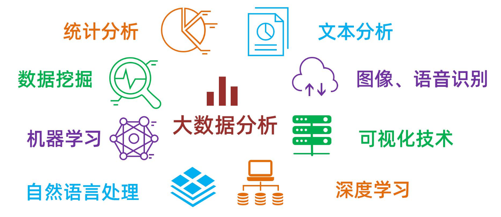
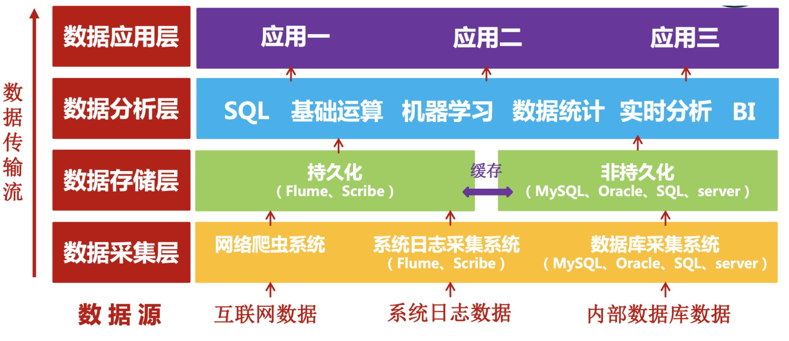
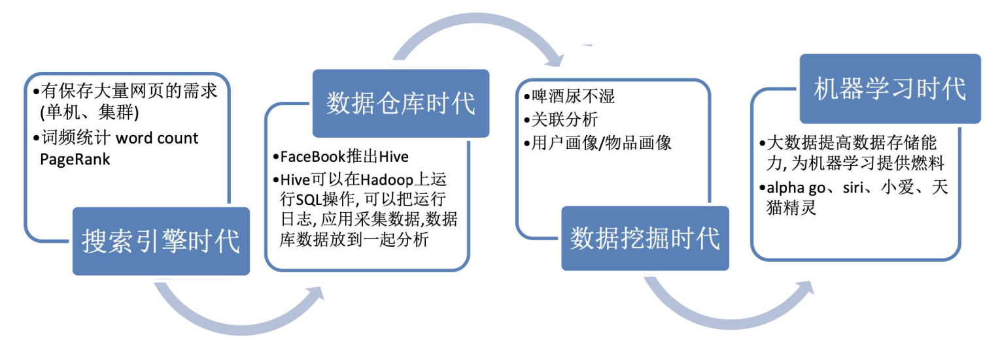
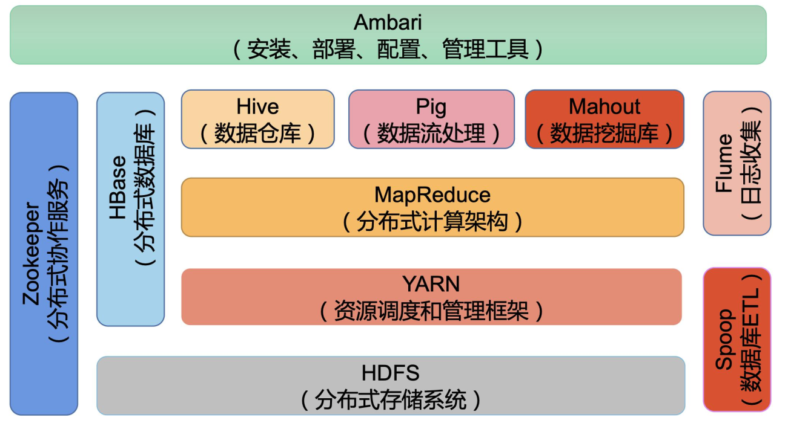
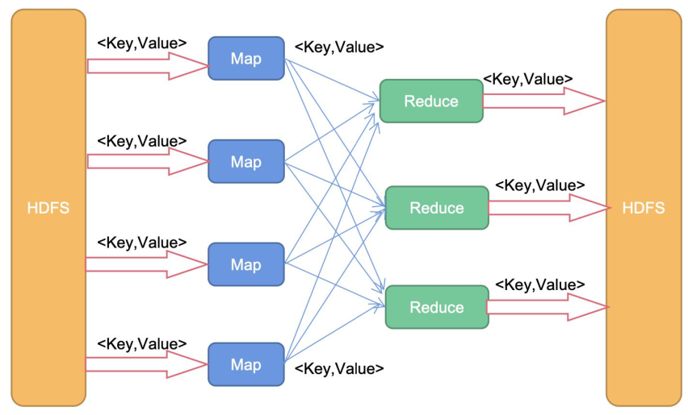
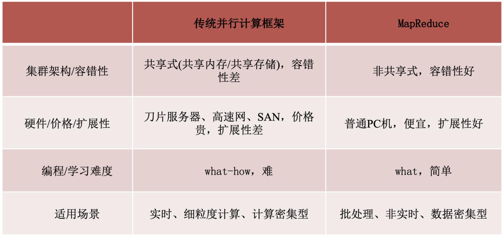
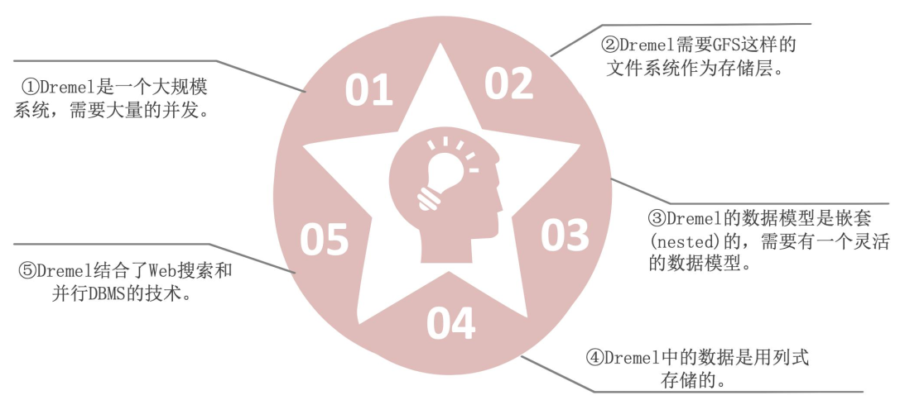
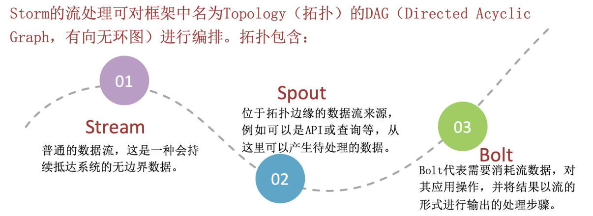
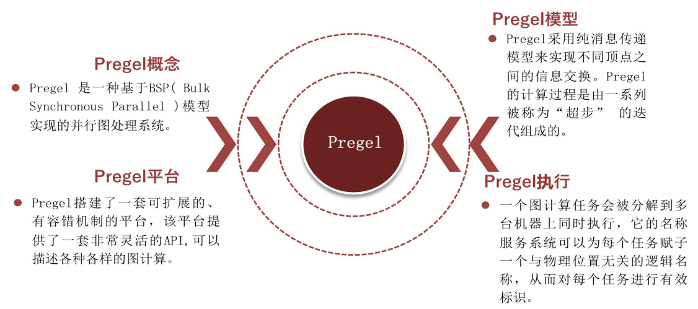
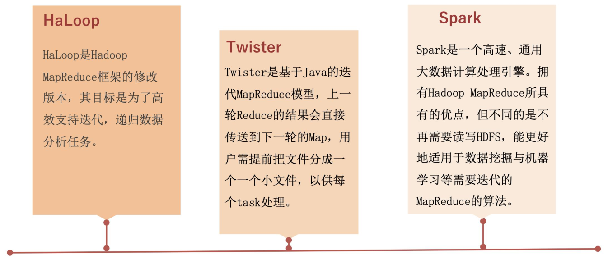

[TOC]

# 大数据绪论

**大数据的定义**

- 大数据：是一种规模大到在获取、存储、管理和分析方面大大超出了传统数据库软件工具能力范围的数据集合。
- 大数据：无法在一定时间范围内用常规软件工具进行捕捉、管理和处理，是需要新处理模式才能具有更强的决策力、洞察发现力和流程优化能力的信息资产。

**大数据特征**

5V特征

- 数量（volume）
  - TB级
  - 记录、日志
  - 事务
  - 表&文件
- 速度（velocity）
  - 批处理
  - 实时
  - 多进程
  - 数据流
- 种类（variety）
  - 结构化
  - 非结构化
  - 多因素
- 价值（value）
  - 统计学
  - 事件性
  - 相关性
- 真实性（veracity）
  - 可信性
  - 真伪性
  - 来源&信誉
  - 有效性
  - 可审计性

**大数据分析**

**大数据技术**

# 数据库技术历史和发展

**第一代数据库系统**
**层次数据库系统**

- 代表系统:

  - IMS (Information Management System)
    - 1969年，IBM公司研制，层次模型的数据库管理系统
  - DBTG报告
    - 20世纪60年代末70年代初，数据库任务组DBTG(DataBase Task Group)提出
- C.W.Bachman推动与促成了DBTG报告，提出数据库系统三级模式结构，确定了数据库系的基本结构。

**20世纪60年代的研究点**

- “数据独立性”思想的创新：数据和应用分离。
- 数据库系统的基本结构。

**第二代数据库系统**
关系数据库

- 典型代表：

  - IBM San Jose研究室开发的System R

  - Berkeley大学研制的INGRES
- 1970年，E.F.Codd发表《大型共享数据库数据的关系模型》论文，为关系数据库技术奠定了理论基础，他被称为“关系型数据库之父”。
- 在数据库和事务处理研究方面的原创性贡献，JamesGray于1998年获图灵奖。

**20世纪70、80年代的研究点**

- 关系模型是该时代数据库系统的创新。
- 非过程化语言的提成增加了应用开发的效率。
- 性能问题，可以通过技术进步来改善。
- 查询优化技术成为系统研究的重要主题。
- 支持ACID事务是关系数据库成功的重要因素。

**第三代数据库系统**
**新型数据库**

- 典型代表：

  - 流数据库Auraro

  - 列存储数据仓库C-Store

  - 高性能OLTP系统H-Store

  - 科学数据库SciDB

- M.R.Stonebraker是现代主流数据库系统架构的奠基人，2014年获图灵奖。

- 2009年至今，大数据系统的体系架构设计与实践逐渐登上历史舞台。

**21世纪的研究点**

- 按照应用需求与系统功能分，可以有各种不同类型的系统：OLTP(Oracle)，OLAP(TeraData)，Search(Hadoop)
- 大数据场景下数据库的新挑战
- 数据仓库多维分析
- 对海量非结构化数据的深度挖掘

# Hadoop

**Hadoop时代都做了什么**

**Hadoop项目组件**

**MapReduce**

- 两个函数:Map和Reduce
- 核心思想:分而治之
- 设计理念:计算向数据靠拢

# 分布式计算架构

**MapReduce和并行计算**

**分布式计算架构**

- 内存技术
- 流式计算
- 图计算
- 迭代计算

**内存计算**

- 随着内存价格的不断下降、服务器可配置内存容量的不断增长，使用内存计算完成高速的大数据处理已成为大数据处理的重要发展方向。
- 目前常用的内存计算系统有分布式内存计算系统Spark、全内存式分布式数据库系统HANA、 Google的可扩展交互式查询系统Dremel。

**流式计算**

- 流数据(或数据流)是指在时间分布和数量上无限的一系列动态数据集合体，数据的价值随着时间的流逝而降低，因此必须采用实时计算的方式给出秒级响应。
- 目前常用的流式计算系统有分布式实时计算系统Apache Storm、流处理框架Apache Samza。

**图计算**

- 在大数据时代，许多大数据都是以大规模图或网络的形式呈现，许多非图结构的大数据也常会被转换为图模型后再进行处理分析。
- 针对大型图的计算，需要采用图计算模式。其中最具有代表性的就是Pregel 。

**迭代计算**

- 针对MapReduce不支持迭代计算的缺陷，人们对Hadoop的MapReduce进行了大量 改进，HaLoop、Twister、Spark等都是典型的迭代计算系统。

