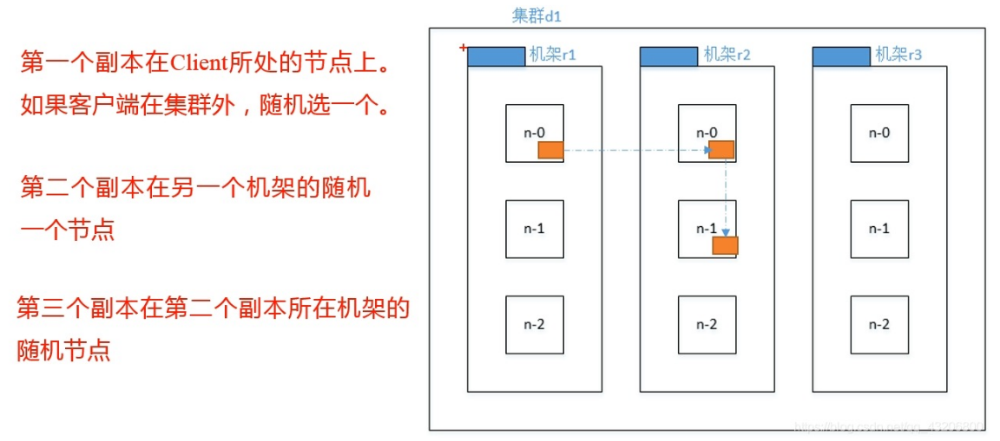

[TOC]

# HDFS的基本组成和原理

**Hadoop的文字简介**

- Hadoop是Apache的一个开源的分布式计算平台，核心是以HDFS分布式文件系统和MapReduce分布式计算框架构成，为用户提供了一套底层透明的分布式基础设施

- Hadoop框架中最核心设计就是：HDFS和MapReduce。HDFS提供了海量数据的存储,MapReduce提供了对数据的计算。

  - HDFS是Hadoop分布式文件系统，具有高容错性、高伸缩性，允许用户基于廉价硬件部署，构建分布式存储系统，为分布式计算存储提供了底层支持

  - MapReduce提供简单的API，允许用户在不了解底层细节的情况下，开发分布式并行程序，利用大规模集群资源，解决传统单机无法解决的大数据处理问题

  - 设计思想起源于Google GFS、MapReduce Paper

- Doug Cutting在Yahoo开发，2008年贡献给Apache基金会

**Hadoop核心项目**

- HDFS： Hadoop Distributed File System分布式文件系统
- MapReduce：编程模型和并行计算框架

## 分布式文件系统


**什么是分布式文件系统（Distributed File System）？**

- 网络文件系统(Network File System)

  - 存储资源非本地直连，通过网络连接

  - NFS、AFS

- 集群文件系统(Cluster File System)

  - 由多个服务器节点组成的DFS

  - ISLION、LoongStore、Lustre、Glusterfs、GFS、HDFS

- 并行文件系统(Parallel File System)

  - 所有客户端可以同时并发读写同一个文件

  - 支持并行应用(如MPI)

  - GPFS、StorNext、BWFS、GFS、Lustre、Panasas

**解决的问题**

- 名字空间与名字解析
- 资源可访问(协议、接口、性能)
- 透明性(访问、位置、迁移、重定位、复制、并发、故障)
- 开放性(标准、接口、互操作性、可移植性)
- 可扩展性(异步、分布、复制、缓存)
- 可用性(复制、RAID、纠删码)
- 一致性(复制、缓存、CAP理论*)
- 安全性(实体认证、访问控制、安全传输、加密)

**拓展*CAP理论**

- 一致性（Consistency）
- 可用性（Availability）
- 分区容错性（Partition tolerance）

**CAP三者不可兼得，该如何取舍：**

- (1) CA: 优先保证一致性和可用性，放弃分区容错。 这也意味着放弃系统的扩展性，系统不再是分布式的，有违设计的初衷。
- (2) CP: 优先保证一致性和分区容错性，放弃可用性。在数据一致性要求比较高的场合(如:ZooKeeper) 是比较常见的做法，一旦发生网络故障或者消息丢失，就会牺牲用户体验，等恢复之后用户才逐渐能访问。
- (3) AP: 优先保证可用性和分区容错性，放弃一致性。NoSQL中的Cassandra就是这种架构。跟CP一样，放弃一致性不是说一致性就不保证了，而是逐渐的变得一致。


**发展历史** 

**网络文件系统(1980s)**

- 历史背景

  - 以太网技术蓬勃发展

- 研究重点

  - 实现网络环境下的文件共享

  - 解决client与文件服务器的交互问题

- 主要成果

  - 1982年，CMU和IBM合作，启动面向PC机资源共享的ITC(Information TechnologyCenter)项目，研制出了著名的网络文件系统AFS（Andrew File System）;

  - 1983年，Novell发布了网络操作系统Netware;同年，Berkeley发布了支持 TCP/IP的BSD4.2操作系统;

  - 1985年，Sun发布了NFS文件系统

  - 1987年，AT&T推出RFS网络文件系统


**共享SAN文件系统(1990s)**

- 历史背景

  - 存储系统开始独立于计算机系统快速发展

  - 存储区域网络SAN*兴起

- 研究重点

  - 解决存储系统的可扩展性

  - 面向SAN的共享文件系统

- 主要成果

  - IBM研制的GPFS(General Parallel File System)

  - 目前由Redhat支持的GFS(Global File System)

**存储区域网络（Storage Area Network）通过交换机连接存储阵列和服务器，建立专用于数据存储的区域性网络。**


**面向对象并行文件系统(2000s)**

- 历史背景
  - 高速网络发展
  - 存储系统扩展性需求
  - 突破容量和性能瓶颈
- 研究重点
  - 对象存储
  - 并发访问
  - 元数据管理
- 主要成果
  - PVFS、Panasas、Lustre、Ceph、GFS


**HDFS**

Nutch是一个建立在Lucene核心之上的网页搜索应用程序。它在Lucene的基础上加了网络爬虫和一些网页相关的功能，目的就是从一个简单的站内检索推广到全球网络的搜索上，就像Google一样。
随着时间的推移，无论是Google还是Nutch，都面临搜索对象“体积”不断增大的问题。

2003年，Google发表了一篇技术学术论文，公开介绍了自己的谷歌文件系统GFS（Google File System）。这是Google公司为了存储海量搜索数据而设计的专用文件系统。


第二年，也就是2004年，Doug Cutting基于Google的GFS论文，实现了分布式文件存储系统，并将它命名为NDFS（Nutch Distributed File System）。
2006年，Doug Cutting加入了Yahoo（雅虎）公司，加盟Yahoo之后，Doug Cutting将NDFS和MapReduce进行了升级改造，并重新命名为Hadoop（NDFS也改名为HDFS，Hadoop Distributed File System）。

还是2004年，Google又发表了一篇技术学术论文，介绍自己的MapReduce编程模型。这个编程模型，用于大规模数据集（大于1TB）的并行分析运算。
第二年（2005年），Doug Cutting又基于MapReduce，在Nutch搜索引擎实现了该功能。

2006年，Google又发论文了，介绍了自己的BigTable。这是一种分布式数据存储系统，一种用来处理海量数据的非关系型数据库。
Doug Cutting在自己的Hadoop系统里面，引入了BigTable，并命名为HBase。

## HDFS架构


## Hadoop1.0架构


## HDFS 1.0角色

- NameNode：
  - 维护整个文件系统的文件目录树，文件目录的元信息和文件数据块索引
  - 以FsImage和EditLog形式存储在本地
  - 整个系统的单点，存在SPOF（Simple Point of Failure）
- SecondaryNameNode：
  - 又名CheckPoint Node，定期合并FsImage和EditLog
  - 不接收客户端的请求，作为NameNode的冷备
- DataNode：
  - 实际存储数据的单元
  - 以Block为单位
  - 数据以普通文件形式保存在本地文件系统
- Client：
  - 与HDFS交互，进行读写、创建目录、创建文件、复制、删除等操作
  - HDFS提供了多种客户端：命令行Shell、Java API、Thrift接口、C library、WebHDFS等


**Data Block**


- 文件由数据块集合组成
- 假设每块大小为 64MB
- 每个数据块在本地文件系统中是以单独的文件进行存储

**数据块分布**


**负载均衡, 快速访问, 容错**

**默认布局规则: （假设复制因子=3）**

- 第一份拷贝写入创建文件的节点 (快速写入)
- 第二份拷贝写入位于不同rack的节点 (应对交换机故障)
- 第三份拷贝写入和第二份副本同一个rack内的节点(减少跨rack的网络流量)

**HDFS各角色交互**


**HDFS读流程**


***机架感知：拓扑距离**
两个节点到达最近的共同祖先的距离总和


***机架感知：副本放置策略**



1.GlusterFs 没有元数据中心，当节点增加后，hash取模的值从6变为3，如何找到原来的文件？

使用一致性hash方法，节点变更后数据如何做迁移。

2.HDFS副本放置策略，为何副本3放到和副本2相同的rack里，而不是重新选择一个rack？

数据读写效率太低。

3.如何求解树的最近公共父节点？


**HDFS写流程**


**读写流程总结**


**HDFS故障恢复流程**
**故障类型:**

- 磁盘错误和故障
- DataNode故障
- 交换机/机架故障
- NameNode故障
- 数据中心故障

**DataNode容灾**


**NameNode容灾（HadoopV2）**


**NameNode宕机**

在没有HA的情况，下NameNode是单点故障，当NameNode宕机会怎么样？

NameNode内存元数据全部丢失。

**FsImage和EditLog的目的**

- NameNode的内存中有整个文件系统的元数据，例如目录树、块信息、权限信息等等。
- 当NameNode异常宕机时，内存中的元数据将全部丢失。
- 为了让重启的NameNode获得最新的宕机前的元数据，才有了FsImage和Editlog。

- FsImage是整个NameNode内存中元数据在某一时刻的快照（Snapshot）。
  - FsImage不能频繁的构建，生成FsImage需要花费大量的内存。
  - 目前FsImage只在NameNode重启时才构建。

- 而Editlog记录的是从这个快照开始到当前所有的元数据的改动。
  - 如果Editlog太多，重放Editlog会消耗大量时间。
  - 这会导致启动NameNode花费数小时之久。

那么有什么方法可以定时来构建FsImage，又不影响NameNode的服务呢？


**Sencondary NameNode**

为了解决上述问题，我们需要一个机制来帮助我们减小Editlog文件的大小和构建新的fsimage，以减小NameNode的压力。这跟Windows的恢复点是非常像的，Windows的恢复点机制允许我们对OS进行快照，这样当系统发生问题时，我们能够回滚到最新的一次恢复点上。


**NameNode Failure**

- NameNode进程挂了怎么办？重启
- NameNode进程挂了，启不起来怎么办？拷贝数据，重装系统
- NameNode所在机器操作系统进不去怎么办？拷贝数据，重装系统
- NameNode机器无法开机怎么办？用Secondary NameNode旧数据，损失部分数据。

# Hadoop2.0对HDFS的改进

## HDFS 1.0存在的问题
**HDFS 1.0的问题：**

- NameNode SPOF，NameNode挂掉整个集群不可用
- 内存受限，整个集群的size受限于NameNode的内存空间大小


**HDFS 2.0的解决方案**

| Hadoop1.0的问题                | Hadoop2.0的改进                   |
| ------------------------------ | --------------------------------- |
| 单一名称节点，存在单点失效问题 | HDFS HA，提供名称节点热备机制     |
| 单一命名空间，无法实现资源隔离 | HDFS Federation，管理多个命名空间 |

**NameNode HA概述**

**设计目的：解决单点故障问题**


- 两个名称节点：
  - Active NameNode
  - Standby NameNode
- 共享存储系统：实现名称节点的状态同步
- ZooKeeper：确保一个名称节点在对外服务
- 名称节点：维护映射信息
- 数据节点：同时向两个名称节点汇报信息
- 优点：热备份，提供高可用性
- 不足：无法解决可扩展性、系统性能和隔离性


**NameNode HA设计思路**

- 主备一致实现
  - 如何保持主和备NameNode的状态同步
- 脑裂的解决
  - 脑裂问题就是产生了两个leader，导致集群行为不一致了
  - 1）仲裁：当两个节点出现分歧时，由第3方的仲裁者决定听谁的。
  - 2）fencing：当不能确定某个节点的状态时，通过fencing把对方干掉，确保共享资源被完全释放。
- 透明切换（failover）
  - NameNode切换对外透明，主Namenode切换到另外一台机器时，不应该导致正在连接的客户端失败，主要包括Client、Datanode与NameNode的链接。

**HA设计之 主备一致实现**
如何保持主和备NameNode的状态同步


- Active NameNode启动后提供服务，并把Editlog写到本地和QJM*中。
- Standby NameNode周期性的从QJM中拉取Editlog，保持与active的状态同步。
- DataNode同时两个NameNode发送BlockReport。


**HA设计之 脑裂的解决**
脑裂问题就是产生了两个leader，导致集群行为不一致了


- QJM的fencing，确保只有一个NN能写成功。
- DataNode的fencing，确保只有一个NN能命令DN。
- 客户端fencing，确保只有一个NN能响应客户端请求。

**QJM的fencing**
QJM的fencing，确保只有一个NN能写成功。
1.高可用

- QJM全称是Quorum Journal Manager, 由JournalNode（JN）组成，一般是奇数个结点组成。当存活的节点数为偶数个时，无法提供正常服务。

2.基于Paxos

- NameNode会同时向所有JournalNode并行写文件，只要有N/2+1个结点写成功则认为此次写操作成功，遵循Paxos协议。

3.防止双写

- 这里面涉及一个很重要的概念Epoch Numbers
  - 当NN成为Active结点时，其会被赋予一个Epoch Number
  - 每个Epoch Number是惟一的，不会有相同的出现
  - Epoch Number有严格顺序保证，每次NN切换后其Epoch Number都会自增1

- NN把自己的Epoch Number通过发送给所有JN结点
- NN同步日志到JN的任何RPC请求都必须包含这个Epoch Number
- JN会对比每次请求中的Epoch Number和保存在本地的Epoch Number，小于则拒绝该请求，反之则更新本地保存的Epoch Number

**DataNode的Fencing**
DataNode的fencing，确保只有一个NN能命令DN。（HDFS-1972）

1.每个NN改变状态的时候，向DN发送自己的状态和一个序列号（类似Epoch Numbers）。

2.DN在运行过程中维护此序列号，当failover时，新的NN在返回DN心跳时会返回自己的active状态和一个更大的序列号。DN接收到这个返回则认为该NN为新的active。

3.如果这时原来的active NN恢复，返回给DN的心跳信息包含active状态和原来的序列号，这时DN就会拒绝这个NN的命令。


**客户端的fencing**

客户端fencing，确保只有一个NN能响应客户端请求。
让访问Standby NN的客户端直接失败：

- 1.在RPC层封装了一层，通过FailoverProxyProvider以重试的方式连接NN。
- 2.通过若干次连接一个NN失败后尝试连接新的NN，对客户端的影响是重试的时候增加一定的延迟。
- 3.客户端可以设置重试次数和时间。

**HA设计之 透明切换（failover）**
Failover时不应该导致正在连接的客户端失败，主要包括Client、Datanode与NameNode的链接。

- 主备切换的实现：ZKFC
  - ZKFC即ZKFailoverController，作为独立进程存在，负责控制NameNode的主备切换，ZKFC会监测NameNode的健康状况，当发现Active NameNode出现异常时会通过ZooKeeper集群进行一次主备选举，完成Active和Standby状态的切换。

ZKFC实现下述几个功能

- 1.监控NameNode的健康状态。
  2.向ZK定期发送心跳，使自己可以被选举。
  3.当自己被ZK选为主时，active ZKFC使相应的NN转换为active。


## HDFS 1.0命名空间
HDFS 1.0命名空间架构大致可以分为两层：

- Namespace：由目录、文件和数据块组成，支持常见的文件系统操作，例如创建、删除、修改和列出文件和目录。
- Block Storage Service：这个部分又由两部分组成
  - 数据块管理（Block Management），这个模块由NameNode提供
    - 通过处理DataNode的注册和定期心跳来提供集群中DataNode的基本关系；
    - 维护数据到数据块的映射关系，以及数据块在DataNode的映射关系；
    - 支持数据块相关操作，如创建、删除、修改和获取块位置；
    - 管理副本的放置、副本的创建，以及删除多余的副本。
  - 存储（ Storage） - 是由DataNode提供，主要在本地文件系统存储数据块，并提供读写访问。


## HDFS Federation
**设计特点:**

- NameNode共享底层的数据节点存储资源
- DataNode向所有NameNode汇报
- 属于同一个Namespace的块构成一个block pool
- 可以存在多个相互独立的NameNode
- 水平扩展的命名服务
- 独立管理Namespace和block pool
- 联邦(Federation)关系不需要彼此协调
- 向后兼容


**HDFS Federation的原理**


- 一个Namespace和一个Block Pool对应
- 一个Block Pool是属于某个namespace下的一系列block。
- DataNode是共享的，不同Block Pool的block在同一个DataNode上存储。
- 一个Namespace和它的block pool一起被叫做Namespace Volume。

**HDFS Federation的配置**

```
/foo/bar => nn-host1
/tmp/data => nn-host2
->
hdfs:///foo/bar或
hdfs://nn-host1:rpc-port/foo/bar
hdfs://nn-host2:rpc-port/tmp/data
```

```
<property> <!-- core-site.xml -->
	<name>fs.defaultFS</name>
	<value>hdfs://nn-host1:rpc-port</value>
</property>
<property> <!-- hdfs-site.xml -->
	<name>dfs.nameservices</name>
	<value>ns1,ns2</value>
</property>
<property>
	<name>dfs.namenode.rpc-address.ns1</name>
	<value>nn-host1:rpc-port</value>
</property>
<property>
	<name>dfs.namenode.rpc-address.ns2</name>
	<value>nn-host2:rpc-port</value>
</property>
```

**HDFS Federation存在的问题和ViewFS**


- 客户端都要更新配置文件，并维护多个Namespace
- 访问目录需要指定完整路径
- 当Namespace增多以后，管理和访问非常不方便

基于上述问题，社区提出了基于客户端的ViewFs（视图文件系统）

ViewFs简单的可以理解为这是一个虚拟的，逻辑上的文件系统。
因为这个文件系统实际并不真实存在，只是我们构建了这个文件系统，它的底层指向了实际意义上的多物理集群。
ViewFs实际上是使用挂载表（Mount Table）做到的。

**ViewFs配置**

```
/foo/bar => nn-host4
/tmp/data => nn-host1
->
viewfs://cluster1/foo/bar
viewfs://cluster1/tmp/data
```

```
<property> <!-- core-site.xml -->
	<name>fs.defaultFS</name>
	<value>viewfs://Cluster1</value>
</property>
<property> <!-- hdfs-site.xml -->
	<name>fs.viewfs.mounttable.Cluster1.link./data</name>
	<value>hdfs://nn-host1:rpc-port/data</value>
</property>
<property>
	<name>fs.viewfs.mounttable.Cluster1.link./project</name>
	<value>hdfs://nn-host2:rpc-port/project</value>
</property>
<property>
	<name>fs.viewfs.mounttable.Cluster1.link./user</name>
	<value>hdfs://nn-host3:rpc-port/user</value>
</property>
<property>
	<name>fs.viewfs.mounttable.Cluster1.link./tmp</name>
	<value>hdfs://nn-host4:rpc-port/tmp</value>
</property>
<property>
	<name>fs.viewfs.mounttable.Cluster1.linkFallback</name>
	<value>hdfs://nn-host1:rpc-port/</value>
</property>
```

**ViewFS存在的问题和3.0的解决**

ViewFS方案也存在一些问题：

- 对于已经发不出去的客户端，升级比较困难；
- 对于新增目录，需要添加挂在表与产品对接，维护起来比较困难。

社区在2.9和3.0发布了一个新的解决统一命名空间的方案RBF：Router-Based Federation （HDFS-10467）
该方案是基于服务端实现的，大大简化了升级和管理方面的难度。

