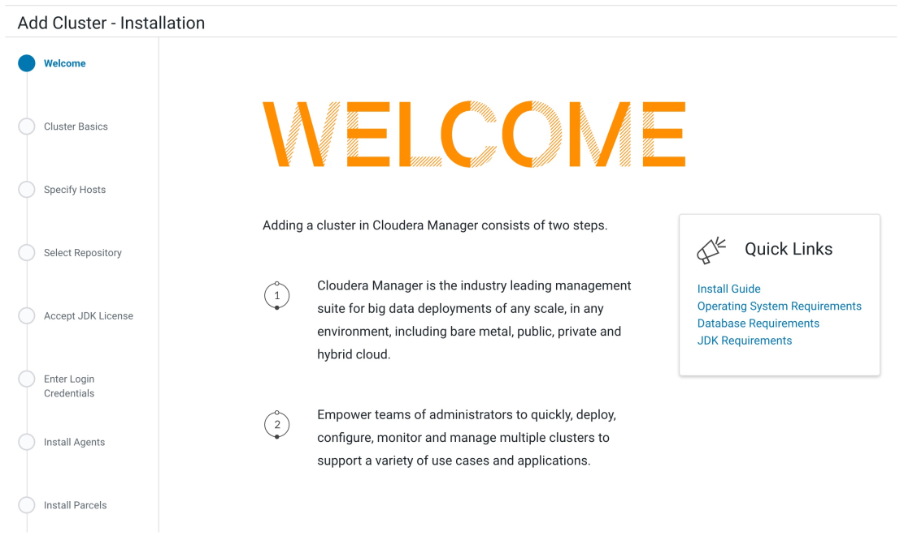
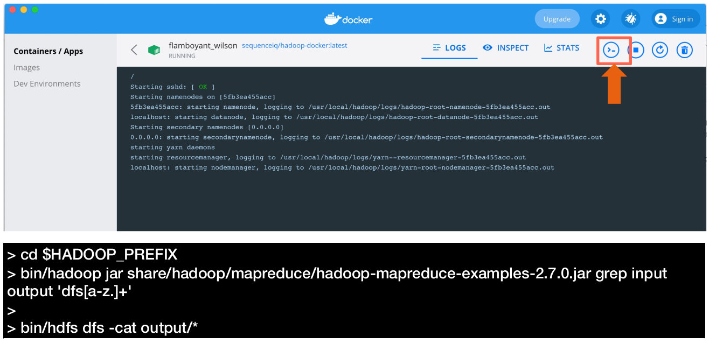
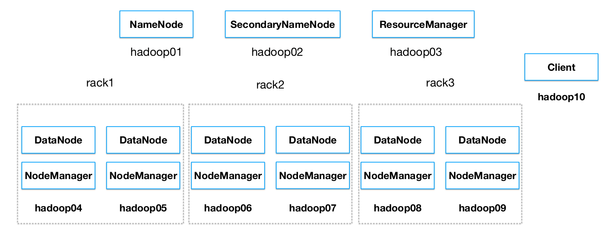
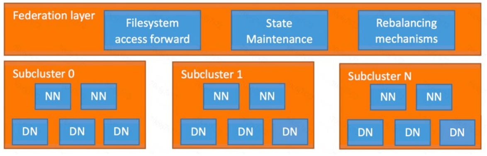
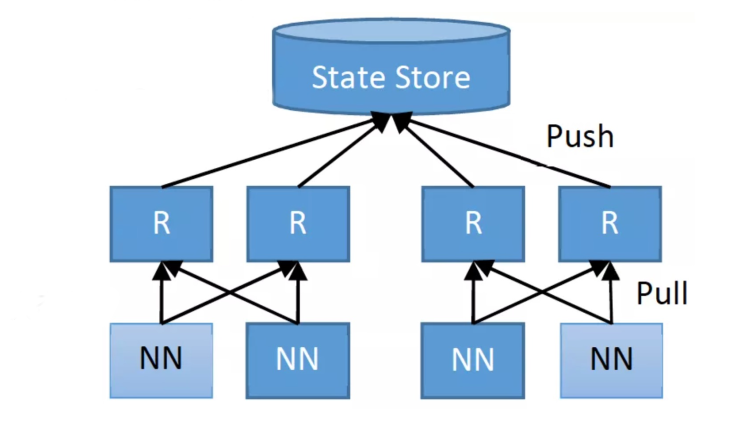
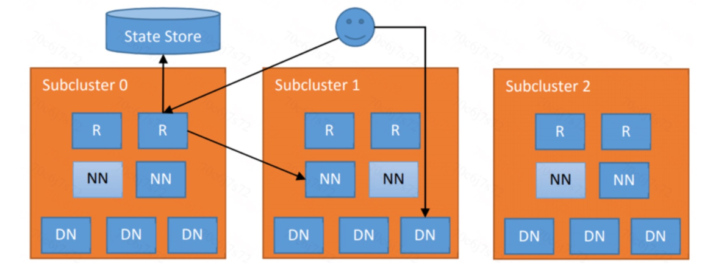
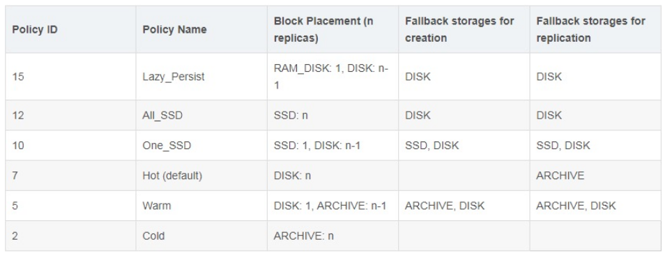
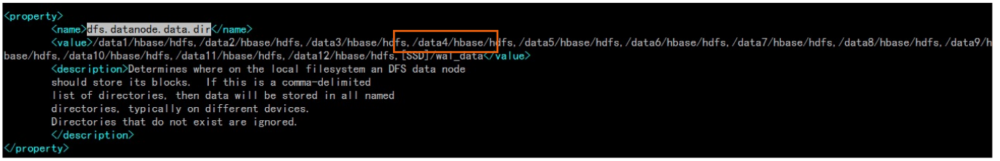

[TOC]

# Hadoop集群部署模式

An easy way to try Hadoop

1.在个人电脑上安装Docker App (https://docs.docker.com/get-docker/)
2.使用命令行拉取hadoop-docker的镜像
```
docker pull sequenceiq/hadoop-docker
```
3.启动Container

```
docker run -p 50070:50070 -p 9000:9000 -p 8088:8088 -it sequenceiq/hadoop-docker /etc/bootstrap.sh -bash
```


**CDH + CM**
http://47.101.202.85:7180/



**An easy way to try Hadoop**



**部署模式**

- Standalone模式
  - 只有一个进程，所有角色以线程形式模拟
  - 用于功能测试或者演示
- 伪分布式模式
  - 所有角色/进程均部署在一个节点上，用单节点模拟集群环境
- 分布式集群模式
  - 真正的生产环境，考虑性能和可用性，需要规划集群拓扑

**伪分布式模式**
各个角色对应的rpm

- HDFS NameNode: yum install hadoop-hdfs-namenode
- HDFS SecondaryNameNode: yum install hadoop-hdfs-secondarynamenode
- HDFS DataNode: yum install hadoop-hdfs-datanode
- YARN ResourceManager: yum install hadoop-yarn-resourcemanager
- YARN NodeManager: yum install hadoop-yarn-nodemanager
- MapReduce: yum install hadoop-mapreduce

配置文件

- 各个配置文件在/etc/hadoop/conf下
- 特别注意：由于单节点，HDFS block replica要设为1（默认3）

## 配置文件
配置文件：

- core-site.xml:
- hdfs-site.xml:
- mapred-site.xml:
- yarn-site.xml

**初始化和启动**

- 初始化HDFS
  - NameNode要format才能用
  - hadoop namenode -format
- 启动服务
  - service hadoop-hdfs-namenode start
  - service hadoop-hdfs-datanode start
  - service hadoop-yarn-resourcemanager start
  - service hadoop-yarn-nodemanager start
- 验证服务
  - NameNode: http://{hostname}:50070
  - ResourceManager: http://{hostname}:8088
- 命令行操作：
  - HDFS：hadoop fs -mkdir /user && hadoop fs -mkdir /user/{username}
  - MapReduce: hadoop jar /usr/lib/hadoop-mapreduce/hadoop-mapreduce-examples.jar

**分布式集群部署**
• 节点规划



## CDH
https://docs.cloudera.com/documentation/enterprise/latest/topics/installation.html
https://www.jianshu.com/p/610cce9f9026

# Hadoop命令和基本API

## 有关目录和文件的操作命令

HDFS创建目录

```
(1) 创建 user1 目录
hadoop fs -mkdir /user1
(2) 在user1目录下创建user1-1目录
hadoop fs -mkdir /user1/user1-1
(3) 在user-1目录下创建user1-1-1目录
hadoop fs -mkdir /user1/user1-1/user1-1/user1-1-1
(4) 一次创建所有子目录
hadoop fs -mkdir /user2/user2-1/user2-1-1
```

HDFS查看目录

```
(1) 查看所有目录
hadoop fs -ls -R /
(2) 查看子目录user1-1
hadoop fs -ls /user1/
```

HDFS创建文件

```
在user1-1的iron中创建文件iron.txt。
hadoop fs -touchz /user1/user1-1/iron/iron.txt
```

HDFS复制文件和目录

```
将/iron目录下所有文件及文件夹复制到/user1-1-1中，通过ls指令显示结果
hadoop fs -cp /user1/user1-1/iron/* /user/user1-1/user1-1-1
hadoop fs -ls /user1/user1-1/user1-1-1
```

HDFS移动文件和目录

```
将iron移动到文件目录/iron01中
hadoop fs -mv /user1/user1-1/iron /user1/user1-1/iron01
```

HDFS上传文件命令

```
创建上传目录，将要上传文件（Usr_course.csv）上传到目标文件夹，最后显示
hadoop fs -mkdir -p /user/hadoop/mapreduce/mooccount/input
hadoop fs -put /data/mooc/usr_course.csv /user/hadoop/mapreduce/mooccount/input
hadoop fs -ls /user/hadoop/mapreduce/mooccount/input
```

HDFS下载文件命令

```
将分布式文件系统iron01文件夹中的iron.txt 文件下载到本地/data/mooc目录中。
hadoop fs -get /user1/user1-1/iron01/iron.txt /data/mooc
```

HDFS删除文件命令

```
查看iron01文件夹中文件，将iron01中的iron.txt文件删除，并显示删除结果。
hadoop fs -ls /user1/user1-1/iron01
hadoop fs -rm /user1/user1-1/iron01/iron.txt
hadoop fs -ls /user1/user1-1/iron01
```

## Java API
Java抽象类org.apache.hadoop.fs.FileSystem定义了hadoop的一个文件系统接口。构造方法
通过以下两种静态工厂方法可以构建FileSystem实例：

```
public static FileSystem.get(Configuration conf) throws IOException
public static FileSystem.get(URI uri, Configuration conf) throws IOException
```


具体方法实现

- 1.public boolean mkdirs(Path f) throws IOException
  - 一次性新建所有目录（包括父目录）， f是完整的目录路径。

- 2.publicFSOutputStream create(Path f) throws IOException
  - 创建指定path对象的一个文件，返回一个用于写入数据的输出流。

- 3.public boolean copyFromLocal(Path src, Path dst) throws IOException
  - 将本地文件拷贝到文件系统

- 4.public boolean exists(Path f) throws IOException
  - 检查文件或目录是否存在

- 5.public boolean delete(Path f, Boolean recursive)
  - 永久性删除指定的文件或目录，当recursive＝true时，目录及其内容会被删除。

- 6.public boolean rename(Path src, Path dst) throws IOException
  - 重命名文件或目录

http://hadoop.apache.org/docs/current/api/org/apache/hadoop/fs/FileSystem.html
练习：使用Java API进行HDFS操作

# HDFS高级特性

## 背景

- HDFS的Master/Slave架构，使得Master节点在元数据存储与提供服务上都会存在瓶颈。
- 为了解决扩展性、性能、隔离等问题，社区提出了Federation方案（HDFS-1052）。
- 使用该方案之后，带来的问题就是同一个集群出现了多个命名空间（namespace）。客户需要知道读写的数据在哪个命名空间下才可以进行操作。为了解决统一命名空间的问题，社区提出了基于客户端（client-side）的解决方案 ViewFS（HADOOP-7257）。
- ViewFS同样也存在一些问题，例如对于已经发布出去客户端升级比较困难，对于新增目录需要增加挂载配置，维护起来比较困难。社区在2.9和3.0版本中发布了一个新的解决统一命名空间问题的方案Router-Based Federation（HDFS-10467），该方案是基于服务端进行实现的。

## HDFS RBF
基于路由的Federation方案是在服务端添加了一个Federation layer，这个额外的层允许客户端透明地访问任何子集群。Federation layer将Block访问引导至适当的子群集，维护namespaces的状态。
Federation layer包含多个组件。Router是一个与NameNode具有相同接口的组件，根据State Store的元数据信息将客户端请求转发给正确的子集群。StateStore组件包含了远程挂载表（和ViewFS方案里面的配置文件类似 ，但在客户端之间共享）。



**主要组件介绍**
Router（无状态）
一个系统中可以包含多个Router，每个Router包含两个作用：

- 1.为客户端提供单个全局的NameNode接口，并将客户端的请求转发到正确子集群中的Active NameNode 上。

- 2.收集NameNode的心跳信息，报告给State Store，这样State Store维护的信息是实时更新的。

**State Store（ 分布式）**
在State Store里面主要维护以下几方面的信息：

- 1.子集群的状态，包括块访问负载、可用磁盘空间、HA状态等；
- 2.文件夹/文件和子集群之间的映射，即远程挂载表；
- 3.Rebalancer操作的状态；
- 4.Routers的状态。



**RBF访问流程**

- 1.客户端向集群中任意一个Router发出某个文件的读写请求操作；
- 2.Router从State Store里面的Mount Table查询哪个子集群包含这个文件，并从State Store里面的Membership table里面获取正确的NN；
- 3.Router获取到正确的NN后，会将客户端的请求转发到NN上，然后也会给客户端一个请求告诉它需要请求哪个子集群；
- 4.此后，客户端就可以直接访问对应子集群的DN，并进行读写相关的操作。



**异构存储**
对需要频繁访问的数据我们称之为“热”数据，反之我们称之为“冷”数据，而处于中间的数据我们称之为“温”数据。 那么如何定义数据为冷热呢，eBay内部根据数据年龄和使用频率来定义：

| 数据age         | 使用频率 | 温度   |
| --------------- | -------- | ------ |
| Age < 7天       | 一天20次 | HOT    |
| 7天 < Age < 1月 | 1周5次   | WARM   |
| 1月 < Age < 3月 | 1月5次   | COLD   |
| 3月 < Age < 3年 | 1年2次   | FROZEN |

Hadoop从2.6.0版本开始支持异构存储


**异构存储**
HDFS定义了Lazy_Persist、All_SSD、One_SSD、Hot、Warm和Cold六种存储策略：


- 1.Lazy_Persist ：1份数据存储在[RAM_DISK]即内存中，其他副本存储在DISK中
- 2.All_SSD：全部数据都存储在SSD中
- 3.One_SSD：一份数据存储在SSD中，其他副本存储在DISK中
- 4.Hot：全部数据存储在DISK中
- 5.Warm：一份数据存储在DISK中，其他数据存储方式为ARCHIVE
- 6.Cold：全部数据以ARCHIVE的方式保存



**异构存储的配置**
HDFS异构存的配置比较简单，只需要将对应的类型添加到dfs.datanode.data.dir的配置项中即可，配置的时候需要申明存储类型和对应的目录，存储类型需要用中括号括起来，存储类型有[SSD]/[DISK]/[ARCHIVE]/[RAM_DISK]，如果不指定存储类型，则默认就是DISK。



设置/hbase/data/default为All_SSD的策略

- hdfs storagepolicies -setStoragePolicy -path /hbase/data/default -policy All_SSD

取消策略

- hdfs storagepolicies -unsetStoragePolicy -path

获取对应路径的策略

- hdfs storagepolicies -getStoragePolicy -path


