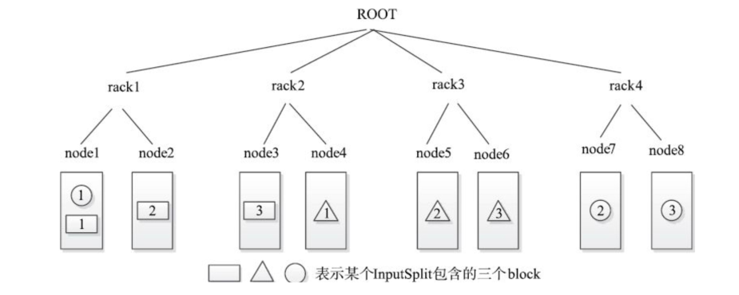

[TOC]

# MapReduce概述

**Hadoop的文字简介**

- Hadoop是Apache的一个开源的分布式计算平台，以HDFS分布式文件系统和MapReduce分布式计算框架为核心，为用户提供了一套底层透明的分布式基础设施
- Hadoop框架中最核心设计就是：HDFS和MapReduce。HDFS提供了海量数据的存储，MapReduce提供了对数据的计算。
- Hadoop框架中最核心的设计就是： HDFS 和MapReduce
  - HDFS是Hadoop分布式文件系统，具有高容错性、高伸缩性，允许用户基于廉价硬件部署，构建分布式存储系统，为分布式计算存储提供了底层支持
  - MapReduce提供简单的API，允许用户在不了解底层细节的情况下，开发分布式并行程序，利用大规模集群资源，解决传统单机无法解决的大数据处理问题
  - 设计思想起源于Google GFS、MapReduce Paper
- Doug Cutting在Yahoo开发，2008年贡献给Apache基金会

**MRv1**
第一代MapReduce。它由两部分组成：

- 编程模型
- 运行时环境（计算框架）

设计的目的：

- 主要解决搜索引擎面临的海量数据处理扩展性差的问题
- 易于编程，简化分布式程序设计，用户只需专注于自己的应用程序逻辑实现

# MRv1编程模型

编程模型：多线程编程模型

- 并行处理
- 数据共享
- 需要通过锁协调
- 写操作复杂


**编程模型：数据驱动型编程模型**

- 通过到达的数据触发
- 处理单元之间禁止数据共享
- 不需要通过锁做协调


**编程模型：MapReduce编程模型**


- 特殊的数据驱动型
- 分为map和reduce两个阶段
- 并发只在同一个作业中发生
- 不同作业的数据访问不需要协调


**举个例子**

- map()函数以key/value对作为输入。
- 产生另外一系列key/value对作为中间输出写入本地磁盘。
- MapReduce框架会自动将这些中间数据按照key值进行聚集，且key值相同的数据被统一交给 reduce()函数处理。
- 用户可设定聚集策略，默认情况下是对key值进行哈希取模。
- reduce()函数以key及对应的value列表作为输入，经合并key相同的value值后，产生另外一系列key/value对作为最终输出写入 HDFS。


**数据切分（Split）**
作用：

- 1.按照某个策略将数据切分成若干个split，确定Map Task个数
- 2.给定某个split，能将其解析成一个个key/value对。

**怎么切分？**

- 文件切分算法

Map任务启动在哪里？任务本地性？

- Host选择算法


**Split和Block的区别**

- Split是文件在逻辑上的划分，是程序中的一个独立处理单位，每一个split分配给一个task去处理。在实际的存储系统中并没有按split去存储。
- Block是文件在物理上的划分，HDFS系统上就是按照block来存储的。一个block的多个备份存储在不同的节点上。
- 一个split可能包含多个block，但一个block不一定只属于一个split。比如：split1完全包含block1，部分包含block2；block2一部分属于split1，一部分属于split2。


**文件切分算法**
文件切分算法主要用于确定InputSplit的个数以及每个InputSplit对应的数据段。


- 一个大文件会被切分成若干个InputSplit
- 对文件的切分是按照“固定”大小进行的，这个大小就是split size 
- splitSize=max{ minSize, min{ totalSize / numSplits, blockSize } }
  - numSplits为用户设定的 Map Task个数，默认情况下是1。
  - minSize为Split的最小值，由配置参数确定，默认是1。
  - blockSize为HDFS中的block大小 ，默认是64MB。现在一般是128MB和256MB
- 一旦确定splitSize值后，将文件依次切成大小为splitSize的InputSplit
- 最后剩下不足splitSize的数据块单独成为一个InputSplit


**Host选择算法**

- InputSplit对象包含四个属性，分别是文件名、起始位置、Split长度和节点列表；构成一个四元组<file, start, length, hosts>。
- 节点列表是关键，关系到任务的本地性（locality）。
- Hadoop将数据本地性按照代价划分成三个等级：Node、Rack和Any。
- 所谓任务的本地性，即优先让空闲资源处理本节点上的数据，如果节点上没有可处理的数据，则处理同一个机架上的数据，最差情况是处理其他机架上的数据。



**排序（Sort）**
MapReduce的Sort分为两种：

- Map Task中Spill数据的排序
  - 数据写入本地磁盘之前，先要对数据进行一次本地排序
  - 快排算法
  - 排序先按照分区编号partition进行排序，然后按照key进行排序。经过排序后，数据以分区为单位聚集在一起，且同一分区内所有数据按照key有序
- ReduceTask中数据排序
  - Reduce Task对所有数据进行排序
  - 归并排序算法
  - 小顶堆
  - Sort和Reduce可并行进行


# MRv1计算框架

**Hadoop1.0架构**


**Hadoop1.0的MapReduce框架文字简介**
MapReduce分布式计算框架：

- JobTracker：
  - 负责集群资源监控和作业调度
  - 通过心跳监控所有TaskTracker的健康状况
  - 监控Job的运行情况、执行进度、资源使用，交由任务调度器负责资源分配
  - 任务调度器可插拔：FIFO Scheduler、Capacity Scheduler、FIFO Scheduler
- TaskTracker：
  - 具体执行Task的单元
  - 以slot为单位等量划分本节点的资源，分为Map Slot和Reduce Slot
  - 通过心跳周期性向JobTracker汇报本节点的资源使用情况和任务运行进度
  - 接收JobTracker的命令执行相应的操作（启动新任务、杀死任务等）
- Client：
  - 提交用户编写的程序到集群
  - 查看Job运行状态

**MapReduce原理概述**


**MR Job生命周期文字描述**

- 1.作业提交与初始化
  - a.首先JobClient将作业的相关文件上传到HDFS
  - b.然后JobClient通知JobTracker
  - c.JobTracker的作业调度模块对作业进行初始化（ JobInProgress和 TaskInProgress）

- 任务调度与监控
  - a.JobTracker的任务调度器（TaskScheduler）按照一定策略，将task调度到空闲的TaskTracker

- 任务JVM启动

  - TaskTracker下载任务所需的文件，并为每个Task启动一个独立的JVM

- 任务执行
  - TaskTracker启动Task，Task通过RPC将其状态汇报给TaskTracker，再由TaskTracker汇报给JobTracker

- 完成作业
  - a.数据写到HDFS

**MR Job生命周期**


## JobTracker
JobTracker主要负责资源监控和作业调度 。JobTracker会跟踪任务的执行进度、资源使用量等信息，并将这些信息告诉任务调度器，而调度器会在资源出现空闲时，选择合适的任务使用这些资源。
**JobTacker涉及MR生命周期的步骤有：**

- 作业提交到JobTracker
- 任务的调度与监控

**其中做的操作包括：**

- 为作业创建JobInProgress对象
- 检查用户是否具有指定队列的作业提交权限
- 检查作业配置的内存使用量是否合理
- 通知任务调度器按照一定策略调度任务*

### 观察者模式
JobTracker采用观察者设计模式将新作业通知TaskScheduler


1. **主题Subject**
首先定义一个观察者数组，并实现增、删及通知操作。它的职责很简单，就是定义谁能观察，谁不能观察。
2. **抽象观察者Observer**
观察者一般是一个接口，每一个实现该接口的实现类都是具体观察者。
3. **具体主题**
继承Subject类，在这里实现具体业务。
4. **具体观察者**
实现Observer接口。


**优点**

- 观察者和被观察者是抽象耦合的
- 建立了一套触发机制

**缺点**

- 如果观察者对象有很多的话，通知一遍到会花费很多时间
- 如果观察者和观察目标间有循环依赖，可能导致系统崩溃

**JobTracker核心功能 — 作业控制**
(1)作业控制
JobTracker在其内部以“三层多叉树”的方式描述和跟踪每个作业的运行状态


**JobTracker核心功能 — 资源管理**
(2)资源管理

- JobTracker不断接收各个TaskTracker周期性发送过来的资源量和任务状态等信息，为TaskTracker分配最合适的任务。
- Hadoop引入了“slot”概念表示各个节点上的计算资源。为了简化资源管理，Hadoop将各个节点上的资源(CPU、内存和磁盘等)等量切分成若干份，每一份用一个slot表示，同时规定一个Task可根据实际需要占用多个slot。

- 三级调度模型：

  - 选择一个队列
  - 选择一个作业
  - 选择一个任务


## TaskTacker

TaskTracker是JobTracker与Task之间的“沟通桥梁”:

- 它从JobTracker端接收并执行各种命令，比如运行任务、提交任务、杀死任务等
- 它将本节点上的各个任务状态通过周期性心跳汇报给JobTracker


**TaskTracker核心功能介绍 — 心跳机制**
心跳是Jobtracker和Tasktracker的桥梁，它实际上是一个RPC函数，Tasktracker周期性的调用该函数汇报节点和任务状态信息，从而形成心跳。在Hadoop中，心跳主要有三个作用：

- 1、判断Tasktracker是否活着
- 2、及时让Jobtracker获取各个节点上的资源使用情况和任务运行状态
- 3、为Tasktracker分配任务

Tasktracker周期性的调用RPC函数heartbeat向Jobtracker汇报信息和领取任务，函数定义是：

```
HeartbeatResponse heartbeat(TaskTrackerStatus status,
							boolean restarted,
							boolean initialContact,
							boolean acceptNewTasks,
							short responseId)
```

**心跳机制源码剖析**
心跳是JobTracker和TaskTracker的桥梁，它实际上是一个RPC函数，TaskTracker周期性的调用该函数汇报节点和任务状态信息，从而形成心跳。在Hadoop中，心跳主要有三个作用：

- 1.判断TaskTracker是否活着
- 2.及时让JobTracker获取各个节点上的资源使用情况和任务运行状态
- 3.为TaskTracker分配任务

JobTracker与TaskTracker之间采用了Pull而不是Push模型，是JobTracker不会主动向TaskTracker发送任何信息，而是由TaskTracker主动通过心跳领取属于自己的消息，JobTracker只能通过心跳应答的形式为各个TaskTracker分配任务。

```
HeartbeatResponse heartbeat(TaskTrackerStatus status,
							boolean restarted,
							boolean initialContact,
							boolean acceptNewTasks,
							short responseId)
```

## 容错机制概述

- 在1.0.0以及之前版本中，Hadoop采用了任务级别的恢复机制，即以任务为基本单位进行恢复，这种机制是基于事务型日志完成作业恢复的，它只关注两种任务：运行完成的任务和未运行完成的任务。
- 一旦JobTracker重启，则可从日志中恢复作业的运行状态，其中已经运行完成的任务无须再运行，而未开始运行或者运行中的任务需重新运行。这种方案实现比较复杂，需要处理的特殊情况比较多。
- 为了简化设计，从0.21.0版本开始，Hadoop采用了作业级别的恢复机制。该机制不再关注各个任务的运行状态，而是以作业为单位进行恢复，它只关注两种作业状态：运行完成或者未运行完成。当JobTracker重启后，凡是未运行完成的作业将自动被重新提交到Hadoop中重新运行。

**JobTracker的容错**

- 作业恢复的机制处理比较简单。每个新的作业(Job)会在JobTracker的工作目录下为该作业创建一个以该作业的JobId为命名的目录，目录底下放该作业的Job-info和JobToken文件。如果该作业成功运行结束，那么就会在作业的Cleanup工作中删除掉该文件夹。
- 所以，当某个时刻JobTracker如果突然因为故障重启了，那么该工作目录下如果JobId工作目录，就说明重启之前还有作业未运行结束（因为运行结束的Job都会把自己的目录清除掉），此时就会把目录中包含的作业重新提交运行，并且JobTracker会把这些重新提交运行的Job的Id信息通过心跳信息的回复告知TaskTracker。
- 那些之前就已经运行在TaskTracker上的任务就是根据TaskID和JobID来更新JobTracker中的作业和任务的信息状态的。原本就正在运行的任务仍然能够正常的更新JobTracker。已经运行结束的Task会把新提交的作业的Task直接更新为运行结束。


**TaskTracker的容错**

- 如果一个TaskTracker故障了，那我们把该TaskTracker上所有满足以下两个条件的任务杀掉，并将它们重新加入任务等待队列中，以便被调度到其他健康节点上重新运行。
- 条件1 Task所属Job处于运行或者等待状态。
- 条件2 未运行完成的Task或者Reduce Task数目不为零的作业中已运行完成的Map Task。
- 所有运行完成的Reduce Task和无Reduce Task的Job中已运行完成的Map Task无须重新运行，因为它们将结果直接写入HDFS中。

## 利用MapReduce编写程序

- 题目：给出一些英文文本，用MapReduce求频率最高的K个单词（Top K）
- 思路：分成两个MR作业，第一MR就是wordcount，其输出作为第二个MR作业的输入，map函数中求前K个高频词， reduce()函数汇总并输出频率最高的前K个词。

- 题目：给出一些英文文本，用MapReduce求频率最高的K个单词（Top K）
- 思路：分成两个MR作业，第一MR就是wordcount，其输出作为第二个MR作业的输入，map函数中求前K个高频词， reduce()函数汇总并输出频率最高的前K个词。拓展：如何用一个MR作业完成TopK？

**Hadoop1.0到Hadoop2.0**
2013年，Hadoop 2.0发布，引入YARN、HDFS HA、Federation


## YARN？

- 下一代MapReduce框架YARN的基本设计思想是将JobTracker的两个主要功能，即资源管理和作业控制(包括作业监控、容错等)，分拆成两个独立的进程。
- MRv2实际上是一个资源统一管理平台。它的目标已经不再局限于支持MapReduce一种计算框架，而是朝着对多种框 架进行统一管理的方向发展。


