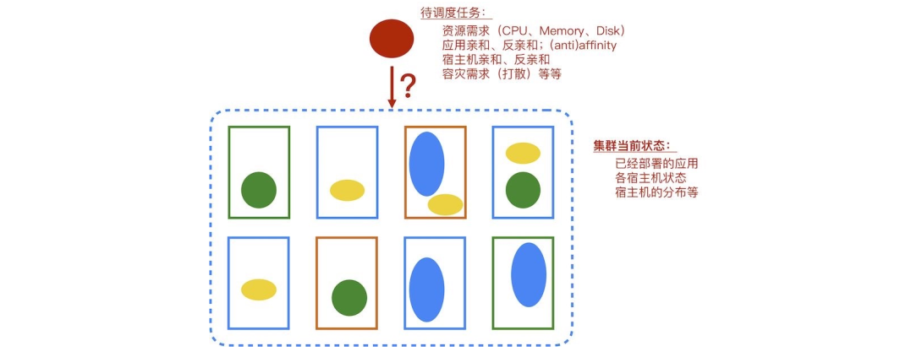

[TOC]

# 1.YARN的产生和发展

**MapReduceV1的不足**

- 扩展性差
  - JobTracker既要做资源管理，又要做任务监控，job的最大并发数受限制。
- 可用性差
  - JobTracker存在单点故障问题
- 资源利用率低
  - Map Slot和Reduce Slot的设计无法分享，造成资源浪费
- 无法支持更多计算模型
  - 只能进行MapReduce计算模型，无法调度流式计算、迭代计算、DAG计算等模型。


**YARN的设计思路**

- Yet Another Resource Negotiator
- 将资源管理和作业监控查分出独立的进程。
- 资源管理和应用无关，每个应用有单独的作业监控进程。


# YARN的组成架构

- ResourceManager：全局的资源管理器，负责整个系统的资源管理和分配

  - 启动/监控ApplicationMaster

  - 监控NodeManager

  - 资源分配和调度

- NodeManager：驻留在一个YARN集群中的每个节点上的代理

  - 处理客户端请求
  - 单个节点的资源管理
  - 处理来自ResourceManger的命令
  - 处理来自ApplicationMaster的命令

- ApplicationMaster：应用程序管理器，负 责系统中所有应用程序的管理工作

  - 数据切分
  - 为应用程序申请资源，并进行分配
  - 任务监控和容错


## ResourceManager


## ApplicationMaster


## NodeManager


## 基本工作流程


1.用户使用Client向Yarn提交应用程序

2.Resource Manager接收处理客户端的请求，为应用程序分配容器

3.在该容器中启动Application Master，并向Resource Manager注册

4.Application Master采用轮询的方式向Resource Manager申请资源

5.Resource Manager 以“容器”的形式向Application Master分配资源

6.在容器中启动任务（运行环境、脚本）

7.各个任务向Application Master汇报自己的状态和进度

8.应用程序运行完成后，注销并关闭

**YARN的目标**


**Hadoop2.0技术栈**


## YARN Container是什么

- YARN container是什么？资源分配的最小粒度
- 它与Linux Container是什么关系？没啥关系
- 它是否能像Linux Container那样为任务提供一个隔离环境？可以，cgroup
- 它代表计算资源，还是仅仅是一个任务处理进程？都是，既代表计算资源，又是一个任务处理进程

1.发出资源请求后，资源调度器并不会立马为它返回满足要求的资源。应用程序的ApplicationMaster不断与ResourceManager通信，探测分配到的资源。


2.ApplicatioMaster可从资源调度器获取以Container表示的资源，这里的Container可看做一个可序列化Java对象，包含的字段信息：


3.ApplicationMaster收到Container后，将运行在该Container的任务所需的运行环境信息（包含运行命令、环境变量、依赖的外部文件等）连同Container中的资源信息封装到StartContainerRequest对象中，发送给NodeManager，以启动该任务。

- Container是YARN中资源的抽象，它封装了某个节点上一定量的资源（CPU和内存两类资源）。它跟Linux Container没有任何关系，仅仅是YARN提出的一个概念（从实现上看，可看做一个可序列化/反序列化的Java类）。
- Container由ApplicationMaster向ResourceManager申请的，由ResouceManager中的资源调度器异步分配给ApplicationMaster。
- Container的运行是由ApplicationMaster向资源所在的NodeManager发起的，Container运行时需提供内部执行的任务命令（可以使任何命令，比如java、Python、C++进程启动命令均可）以及该命令执行所需的环境变量和外部资源（比如词典文件、可执行文件、jar包等）。

**ResourceManager**


**ApplicationMaster**

- ApplicationMaster实际上是特定计算框架的一个实例，每种计算框架都有自己独特的
- ApplicationMaster，负责与ResourceManager协商资源，并和NodeManager协同来
- 执行和监控Container。MapReduce只是可以运行在YARN上一种计算框架。
- 进阶：
  - ApplicationMaster源码分析
  - Spark的ApplicationMaster

# 资源调度器

## 资源调度算法
调度算法在是整个资源管理系统中的一个重要组成部分，简单地说，调度算法的作用是决定一个计算任务需要放在集群中的哪台机器上面。



**FIFO调度**

- 先来后到调度（ FIFO）
- 基本思路：先来的先被调用，先分配CPU、内存等资源，后来的在队列等待。
- 优点：这种方式适合平均计算时间、耗用资源情况差不多的作业，为了让后来的作业有机会提前运行，通常还会匹配优先级，即优先级高的先运行，优先级一样的按先来后到方式运行。
- 缺点：但是实际操作的时候，优先级容易碰到问题，如果用户都认为自己的作业优先，把自己提交的作业优先级都设置的最高，这样排在后面的作业还是要等很久才被调度，特别是前面有一个耗用资源特别久的作业，比如占用几个小时乃至几天的大部分机器的CPU和内存的训练算法作业，导致排在后面的大量很短时间运行完、耗用资源比较少的作业很久才被调度，实际上他们优先调度更适合。

**SJF调度**

- 短任务优先 （Shortest Job First，SJF）
- 为了改进FIFO算法，减少平均周转时间，人们提出了短作业优先算法。
- 基本思路：各个任务在开始执行之前，必须事先预计好它的执行时间，然后调度器将根据这些时间，从中选择用时较短的任务优先执行。
- 优点：这种方式已经解决FIFO算法的缺点，不会让短任务因为前面出现的大任务而堆积。
- 缺点： 但是这样也是有问题的，如果一个用户一次提交了大量作业，就为了优先得到执行，如果他提交的作业时间都比较短，那永远都是这个用户在占用计算平台集群资源，其他用户永远在等。

**时间片轮转调度**

- 时间片轮转算法（Round Robin，RR）
- 基本思路是：把系统当中的所有就绪任务按照先来先服务的原则，排成一个队列，然后再每次调度的时候，把处理器分派给队列当中的第一个任务，让它去执行一小段CPU时间（即时间片，time slice）。当这个时间片结束时，如果任务还没有执行完成的话，将会发生时钟中断，在时钟中断里面，调度器将会暂停当前任务的执行，并把它送到就绪队列的末尾，然后执行当前的队首任务。反之，如果一个任务在它的时间片用完之前就已经结束了或者阻塞了，那么它就会立即让出CPU给其他任务。
- 优点： 跟任务的大小无关，大家获得公平的资源分配。
- 缺点：该算法要求计算框架支持中断。此外， 时间片的大小要适当选取，如果选择不当，将会影响到系统的性能和效率。 如果时间片太大，每个任务都在一个时间片内完成，这就退化为先来先服务算法了，如果太小， 任务之间的切换次数增加，从而增大了系统的管理开销，降低了CPU的使用效率。

**最大最小公平调度**

- 最大最小公平调度（Min-Max Fair）
- 基本思路： 将资源平分成n份,每份都是S/n,把每份分给相应的用户，如果超过了用户的需求，就回收超过的部分， 然后把总体回收的资源，平均分给上一轮分配中尚未得到满足的用户，依次类推，直到没有回收的资源为止。
- 加权最大最小公平调度（Weighted Min-Max Fair）
- 基本思路： 令W=w1 + w2+ … + wn, 将资源按照权重分成n份，每份分别是：S\*w1/W,S\*w2/W,…, S\*wn/W。把每份分给相应的用户。 如果超过了用户的需求，就回收超过的部分，假设有m个用户尚未得到满足。然后把总体回收的资源，按照目前尚未满足的用户的权重分成m份，给对应的用户。依次类推，直到没有回收的资源为止。
- 优点：考虑到了公平性，无论是大任务还是小任务，都能相对公平的得到服务。
- 缺点：加权的设置对平台有着更高的要求，加权不合理可能会破坏公平性。

**容量调度**

- 容量调度（Capacity）
- 基本思路： 首先划分多个队列， 队列资源采用容量占比的方式进行分配 。 每个队列设置资源最低保证和资源使用上限。 如果队列中的资源有剩余或者空闲，可以暂时共享给那些需要资源的队列，而一旦该队列有新的应用程序需要资源运行，则其他队列释放的资源会归还给该队列。
- 优点：资源可以得到最大化的利用
- 缺点：但是小任务仍然会等待较多的时间。而且无法自定义优先级。

## YARN的三种调度器

ResourceManager作为YARN的核心组件，调度器就位于其中

FIFO Scheduler（先进先出调度器）

- FIFO先进先出调度器，同一时间队列中只有一个任务在执行。
- FIFO调度器以集群资源独占的方式来运行作业，这样的好处是一个作业可以充分利用所有的集群资源

有一个很大的job1先提交，并且占据了全部的资源。那么job2提交时发现没有资源了，则job2必须等待job1执行结束，才能获得资源执行。


**Capacity Scheduler（容量调度器）**

- 层次化队列设计，每个队列内部先进先出，同一时间队列中只有一个任务在执行。队列的并行度为队列的个数。
- 可以为每个队列分配一个资源占比
- 空闲的资源可以分配给任何队列，出现资源竞争时又按照占比再平衡
- 每个队列都有访问控制，用户只能提交到有权限的队列
- 队列支持树形嵌套
- YARN的默认调度器

有一个大的job1提交到queue A，并占据了全部资源。此时再提交一个小job2到queue B，因为queue A和queue B资源相互独立，job2可以立刻执行。


相关参数：

- capacity（队列资源容量百分比）
- maximum-capacity（队列资源使用上限百分比）
- user-limit-factor（每个用户自多可使用的资源量百分比）

**Fair Scheduler（公平调度器）**

- 层次化队列设计，每个队列内部的作业案缺额分配资源，同一时间队列中有多个任务执行。队列的并行度大于等于队列的个数。
- 可以让短的作业在合理的时间内完成，而不必一直等待长作业的完成。
- 所有队列的资源在无竞争时是共享的
- 作业可以设置优先级

先提交到队列A的job1占用了整个集群的资源，此时job 2提交到队列B。原先被job2占用的队列B的资源释放，job1和job2同时运行，各占一半。此时在队列
B再次提交一个job3，job2和job3将同时运行，各占四分之一。


- 在资源有限的情况下，每个job理想情况下获得的资源和实际获得的资源存在一个差距，这个差距叫缺额。
- 同一个队列中job的缺额越大，越先获得资源优先执行。
- 同时，还可以为job设置优先级，优先级越高，越先分配资源。

**Capacity Scheduler和Fair Scheduler的区别**

相同：
（1）以队列划分资源
（2）设定最低保证和最大使用上限
（3）在某个队列空闲时可以将资源共享给其他队列。
不同：
（1）Fair Scheduler队列内部支持多种调度策略，包括FIFO、Fair（队列中的N个作业，每个获得该队列1 / N的资源）、DRF（Dominant Resource Fairness）（多种资源类型e.g. CPU，内存的公平资源分配策略）
（2）Fair Scheduler可以使得小应用快速获得资源，避免了饿死的情况。

## Job提交流程


- 0.客户端提交作业job.waitForCompletion启动yarnRunner
- 1.yarnRunner 向rm 申请一个Application
- 2.rm 返回一个资源提交路径和application_id
- 3.客户端提交job所需要的资源（切片+配置信息+jar 包）到资源提交路径
- 4.资源提交完毕，客户端申请运行AppMaster
- 5.将用户请求初始化为task,放入队列
- 6.NodeManager 从队列领取任务
- 7.创建容器，启动AppMaster，读切片信息知道启动多少MapTask
- 8.AppMaster下载job资源到本地AppMaster
- 9.AppMaster申请运行MapTask容器
- 10.NodeManager通过心跳领取到任务，创建容器
- 11.NodeManager同时接受AppMaster发送来的启动脚本，启动MapTask
- 12.MapTask结束后，AppMaster申请运行ReduceTask容器
- 13.Reduce向Map获取对应分区的已排序数据

**Capacity Scheduler参数详解**
如何设置Capacity Scheduler：yarn-site.xml


# YARN的高级特性Node Label

**Node Label**

- HDFS异构存储只能设置让某些数据（以目录为单位）分别在不同的存储介质上，但是计算调度时无法保障作业运行的环境。
- 在节点标签（Node Label）出现之前，资源申请方是无法指定特定节点的资源的，比如需要运行GPU节点，需要有SSD存储的节点等等。应用是无法指定特定节点上面的特定资源的，我们也无法对集群中的各个节点进行分区。
- 同时，同一个集群中如果需要将作业跑在特殊的软件环境下，例如特定版本的JDK，特定版本的python库等等，我们也无法进行指定。
- 同一个集群中新采购的机器具有大内存和高CPU，机型的不同或者网络环境的不同等等导致同一个作业的不同任务执行时间差异过大。
- 同一个集群跨越不同机房，应尽量避免同一个作业跨机房执行的需求。

## Node Label的类型
目前只有Capacity Scheduler支持该功能。Fair Scheduler开发进行中（YARN-2497）

Node Label有两种类型：

- 节点分区（Node Partition）
  - 一个节点只属于一个分区
  - 和资源计划有关
- 节点限制 （Node Constraints）
  - 一个节点可以分配多个限制条件
  - 和资源计划无关

**Node Label的特性**

- 给集群中的node打上标签，每个node只能有一个标签。
- 整个集群node划分为互斥的若干分区，没有设置标签的node属于DEFAULT分区。
- 队列可以绑定多个标签，不设置默认标签的队列，使用DEFAULT分区的node。
- 通过队列的默认标签，和指定特定标签，实现节点分配控制

## Node Label配置
如何开启Node-label


**添加节点标签**
1.先按上述要求修改yarn-site.xml
2.添加集群便签
`yarn rmadmin -addToClusterNodeLabels label01,label02`

3.添加节点标签

```
yarn rmadmin -replaceLabelsOnNode node1:45454,label01
yarn rmadmin -replaceLabelsOnNode node2:45454,label02
```

需一个一个添加，节点较多时建议写成脚本执行
4.查看标签
`yarn node -status node1:45454`
也可以通过Yarn管理页面查看Node Label
node-label webUI
http://RM-Address:port/cluster/nodelabels

## Node Label的配置项


- yarn.scheduler.capacity.<queue-path>.default-node-label-expression
  - 队列默认的访问label，如果请求中未设置label，则设置为该值；默认为空，表现允许访问无label的节点
- yarn.scheduler.capacity.<queue-path>.accessible-node-labels
  - 队列可以访问的label列表,如"label01,label02",通过逗号分隔，另外队列均可以访问没有标签的node;默认继承父队列的accessible labels；如果只允许访问无标签的node，配置为一个空
- yarn.scheduler.capacity.<queue-path>.accessible-node-labels.<label>.capacity
  - 队列对某个label的容量设置，对于同一个label属于同一个父队列下面的capacity总和必须为100
- yarn.scheduler.capacity.<queue-path>.accessible-node-labels.<label>.maximum-capacity
  - 队列对某个label资源的最大访问容量，默认是100

**配置举例**


## YARN HA

RM存在单点故障问题。YARN的HA架构和HDFS HA类似，需要启动两个
ResourceManager，这两个ResourceManager会向ZooKeeper集群注册，通过ZooKeeper管理它们的状态（Active或Standby）并进行自动故障转移。


**ZKFC和RMStateStore**


- 和HDFS HA的ZKFC不同，这里的ZKFC是RM内部的一个线程
- ZKFC线程定期向zk发送心跳
- RMStateStore存储在zk的/rmstore目录下，相当于一个文件夹
- RM将状态写入RMStateStore中


# YARN高级特性Docker执行器

## YARN Docker执行器

Docker是一个开放源代码软件项目，让应用程序布署在软件容器下的工作可以自动化执行，借此 在Linux操作系统上，提供一个额外的软件抽象层，以及操作
系统层虚拟化的自劢管理机制。 Docker利用Linux核心中的资源分脱机制，例如cgroups，以及Linux核心名字空间(name space )，来创建独立的软件容器
(containers)。——维基百科

- Hadoop 2.6.0版本引入Docker Container Executor (DCE)
- 默认DefaultContainerExecutor，NodeManager启动container是启动Java子进程
- DockerContainerExecutor，NodeManager启动docker container
  - 环境隔离：container环境与NodeManager宿主机环境可以不一样，比如python版本 ，java版本，甚至hadoop版本，OS都可以不一样

## 配置
NodeManger的机器上必须预先安装好docker

```
<property>
	<name>yarn.nodemanager.docker-container-executor.exec-name</name>
	<value>/usr/bin/docker</value>
	<description>
	Name or path to the Docker client. This is a required parameter. If this is empty,
	user must pass an image name as part of the job invocation(see below).
	</description>
</property>
<property>
	<name>yarn.nodemanager.container-executor.class</name>
	<value>org.apache.hadoop.yarn.server.nodemanager.DockerContainerExecutor</value>
	<description>
	This is the container executor setting that ensures that all jobs are started with the DockerContainerExecutor.
	</description>
</property>
```

## 使用

```
hadoop jar $HADOOP_PREFIX/share/hadoop/mapreduce/hadoop-mapreduce-examples-2.7.4.jar \
teragen \
-Dmapreduce.map.env="yarn.nodemanager.docker-container-executor.image-name=sequenceiq/hadoop-docker:2.4.1" \
-Dyarn.app.mapreduce.am.env="yarn.nodemanager.docker-container-executor.image-name=sequenceiq/hadoop-docker:2.4.1" \
1000 \
teragen_out_dir
```

# YARN高级特性YARN Federation
**背景**
对于HDFS的扩展性问题来说，我们讲过了HDFS federation的几种方案，通过横向扩展命名空间的做法来延展其扩展性。 随着集群规模的扩张，不仅仅存储系统会有性能瓶颈问题，计算系统也会存在这样的问题。YARN的ResourceManager在管理这上千甚至上万个NodeManager节点时，会面临着许多性能问题，此外，大量在跑的应用会产生大量的event，也同样加重了RM的性能问题。一般这种情况，我们的一个简单直接的方案是再搭建一个新的YARN集群。

## YARN Federation
对于不方便增加一个YARN集群的情况来说，目前社区提供了一套类似HDFS Federation的方案：

YARN Federation

涉及的主要有以下两大模块:

- 1.多集群状态信息收集，存储（State Store）
  - 让众多独立小集群变为逻辑意义上的一个超大资源池

- 2.客户端请求路由服务实现（Proxy Store）
  - 对于客户端来说，它面对的将不是众多具体的独立小集群

**YARN Federation架构图**
了解完YARN Federation的大致原理之后，我们来看YARN Federation的架构设计图：


## AM跨集群资源调度

- YARN Federation支持跨集群资源调度的情况。它的原理是在AM和RM之间增添了一个Proxy Service做中间的拦截，此服务叫做AMRMProxy。
- AM不仅仅可以与本地的RM申请资源，还能够向其它集群申请资源。这里借助的角色就是上文提到的AMRMProxy服务。AMRMProxy负责和其他非本地RM进行通信。


