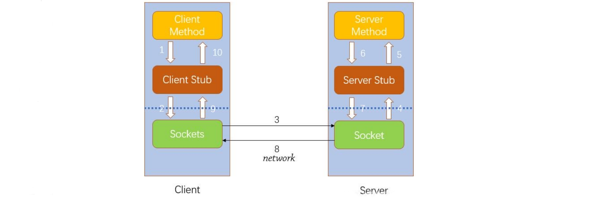
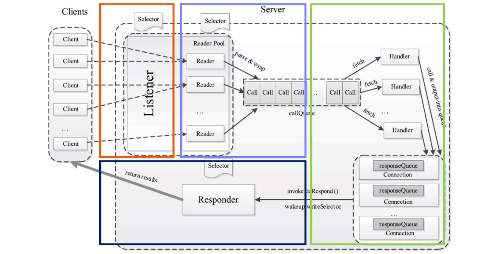

[TOC]

# 1.Hadoop RPC

**什么是RPC**
Remote Procedure call ，远程方法调用，它允许一台计算机程序远程调用另外一台计算机的子程序，而不用去关心底层的网络通信细节，对用户来说是透明的。经常用于分布式网络通信中。

- （1）透明性：远程调用其他机器上的程序，对用户来说就像是调用本地方法一样；
- （2）高性能：RPC server能够并发处理多个来自Client的请求；
- （3）可控性：jdk中已经提供了一个RPC框架——RMI，但是该PRC框架过于重量级并且可控之处比较少，所以Hadoop RPC实现了自定义的PRC框架。

**Hadoop RPC的设计**

- （1）序列化层：Client与Server端通信传递的信息采用了Hadoop里提供的序列化类或自定义的Writable类型；
- （2）函数调用层：Hadoop RPC通过动态代理以及java反射实现函数调用；
- （3）网络传输层：Hadoop RPC采用了基于TCP/IP的socket机制；
- （4）服务器端框架层：RPC Server利用java NIO以及采用了事件驱动的I/O模型，提高RPC Server的并发处理能力；


**Hadoop RPC涉及的技术：**

- 动态代理*
- 反射——动态加载类
- 序列化
- 非阻塞的异步IO（NIO）

**Hadoop的RPC机制**
hadoop RPC的总架构如图所示：


- Client端使用的是阻塞的Socket
- Client的Connection内部类负责Socket的操作
- Client没有使用NIO， 而是使用Connection线程的对象池，以ConnectionID为主键。
- Server端使用的是非阻塞的Socket 大量使用Selector
- Server的Listener内部类负责接收Socket请求，Listener中的Reader内部类负责读取数据
- Server的Handler内部类负责获取队列中的Call对象，并且调用处理类Call
- Server的Responder内部类负责写入相应信息

**代理模式**

- 代理模式是常用的java设计模式，它的特征是代理类与委托类有同样的接口。代理类主要负责为委托类预处理消息、过滤消息、把消息转发给委托类，以及事后处理消息等。
- 代理类的对象本身并不真正实现服务，而是通过调用委托类的对象的相关方法，来提供特定的服务。简单的说就是，我们在访问实际对象时，是通过代理对象来访问的，代理模式就是在访问实际对象时引入一定程度的间接性，因为这种间接性，可以附加多种用途。


**静态代理：**
在编译时就已经将接口，被代理类，代理类等确定下来。在程序运行之前，代理类的.class文件就已经生成。（其实就是我们平时写的代理模式）


**动态代理**
动态代理：代理类在程序运行时创建的代理方式。
我们上面静态代理的例子中，代理类(StudentProxy)是自己定义好的，在程序运行之前就已经编译完成。然而动态代理，代理类并不是在Java代码中定义的，而是在运行时动态生成的。相比于静态代理， 动态代理的优势在于可以很方便的对代理类的函数进行统一的处理，而不用修改每个代理类中的方法。 比如说，想要在每个代理的方法前都加上一个处理方法：

```java
public void geiveMoney() {
    //调用被代理方法前加入处理方法
    beforeMethod();
    stu.giveMoney();
}
```

在java的java.lang.reflect包下提供了一个Proxy类和一个InvocationHandler接口，通过这个类和这个接口可以生成JDK动态代理类和动态代理对象。

**创建动态代理**

```java
public class StuInvocationHandler<T> implements InvocationHandler {
    //invocationHandler持有的被代理对象
    T target;
    
    public StuInvocationHandler (T target) {
        this.target = target;
    }
    
    /**
    * proxy:代表动态代理对象
    * method:代表正在执行的方法
    * args:代表调用目标方法时传入的实参
    */
    @Override
    public Object invoke (Object proxy, Method method, Object[] args) throws Throwable {
        System.out.println("代理执行" + method.getName() + "方法");
        
        //代理过程中插入监测方法，计算该方法耗时
        MonitorUtil.start();
        Object result = method.invoke(target, args);
        MonitorUtil.finish(method.getName());
        return result;
    }
}
```

```java
public class ProxyTest {
    public static void main (String[] args) {
        //创建一个实例对象，这个对象是被代理的对象
        Person zhangsan = new Student("zhangsan");
        //创建一个与代理对象相关联的InvocationHandler
        InvocationHandler stuHandler = new StuInvocationHandler<Person>(zhangsan);
        
        //创建一个代理对象stuProxy来代理zhangsan，代理对象的每个执行方法都会替换执行Invocation中的invoke方法
        Person stuProxy = (Person) Proxy.newProxyInstance(Person.class.getClassLoader(), new Class<?>[]{Person.class}, stuHandler);
        //代理执行上交班费的方法
        stuProxy.giveMoney();
    }
}
```

**动态代理原理**


https://www.zhihu.com/question/20794107

## Hadoop RPC简述

1.首先需用定义一个协议，它描述了服务对外提供了哪些接口或者功能。

```java
public interface MyInterface extends VersionedProtocol {
    long versionID = 1L;
    int add (int number1, int number2);
}
```

2.Server端需要实现协议接口，并返回版本号：

```java
public class MyInterfaceImpl implements MyInterface {
    //实现加法
    @Override
    public int add (int number1, int number2) {
        System.out.println("number1 = " + number1 + " number2 = " + number2);
        return number1 + number2;
    }
    //返回版本号
    @Override
    public long getProtocolVersion(String protocol, long clientVersion) throws {
        return MyInterface.versionID;
    }
}
```

3.构建Server，绑定协议的实现类，并启动server。

```java
public static void main (String[] args) {
    RPC.Builder builder = new RPC.Builder(new Configuration());
    //服务器IP地址
    builder.setBindAddress("127.0.0.1");
    //端口号
    builder.setPort(12345);
    
    builder.setProtocol(MyInterface.class);
    builder.setInstance(new MyInterfaceImpl());
    
    try {
        RPC.Server server = builder.build();
        server.start();
    } catch (IOException e) {
        e.printStackTrace();
    }
}
```

4.构建客户端，并访问add服务。

```java
public static void main(String[] args) {
    try {
        MyInterface proxy = RPC.getProxy(MyInterface.class, 1L, new InetSocketAddress());
        int res = proxy.add(1, 2);
        System.out.println(res);
    } catch (IOException e) {
        e.printStackTrace();
    }
}
```

**Hadoop RPC调用流程和原理**

- Client和Server端的通过Socket连接进行通讯。
- 客户端会得一个代理对象RPC.getProxy，代理对像拦截调用的方法，拿到方法名称，参数序列化之后通过Socket发给server，Server反序列化得到相应的参数调用具体的实现对象。所以如果不使用基本类型，自定义对象需要实现Writeable



https://github.com/LantaoJin/geekbang-bigdata

**NIO**
https://github.com/LantaoJin/DistributedSystemUsingJavaNIO

**源码深入**
https://github.com/LantaoJin/commons-rpc

**PRC Client框架结构**

- 1.创建一个Connection对象，并将远程方法调用信息封装成Call对象，放到Connection对象中的哈希表calls中;
- 2.调用Connetion类中的sendParam()方法将当前Call对象发送给Server端;
- 3.Server端处理完RPC请求后，将结果通过网络返回给Client端，Client端通过receiveResponse()函数获取结果;
- 4.Client端检查结果处理状态(成功还是失败)，并将对应的Call对象从哈希表中删除。


**PRC Server框架结构**

- 1.建立连接
- 2.接受请求
- 3.处理请求
- 4.返回结果



# Hadoop 安全和Kerberos

**Hadoop安全问题**
在1.0版本之前，Hadoop几乎没有任何安全机制，因此面临着各方面的安全威胁：

- 缺乏用户与服务之间的认证机制
  - 用户可以在应用程序中设置自己的用户名和所在的用户组，这使得任意用户可以很容易伪装成其他用户
  - 用户只要知道Block ID，就能够获取对应Block的内容，和随便往一个DataNode上直接写入Block
- 缺乏服务与服务之间的认证机制
  - 用户可以任意启动DataNode或者TaskTracker等。
- 缺乏传输以及存储加密措施
  - Hadoop各节点间的数据采用明文传输，使其极易在传输的过程中被窃取。

**Hadoop安全机制目标**

- 引入授权机制，只有经授权的用户才可以访问Hadoop。
- 任何用户只能访问那些有权限访问的文件或者目录。
- 任何用户只能修改或者杀死自己的作业。
- 服务与服务之间引入权限认证机制，防止未经授权的服务接入Hadoop集群。
- 新引入的安全机制应对用户透明，且用户可放弃使用该机制以保证向后兼容。
- 引入安全机制后带来的性能开销应在可接受范围内。

**大安全基础**

- Hadoop RPC中采用了SASL(Simple Authentication and Security Layer，简单认证和安全层)进行安全认证，主要的认证方法为Kerberos
- SASL是一种用来扩充C/S模式验证能力的认证机制。它的核心思想是把用户认证和安全传输从应用程序中隔离出来。
- SASL支持多种认证方法： ANONYMOUS， PLAIN， DIGEST-MD5， GSSAPI
  - ANONYMOUS：无认证
  - PLAIN： 信息采用明文密码方式传输
  - DIGEST-MD5： 密钥不通过网络进行传输， 服务器通过对比客户端返回的应答与自己算出的应答是否相同，判断客户端所拥有的密钥是否正确。
  - GSSAPI： 是一套API，其最主要的实现是基于Kerberos的。

- JAAS是SUN公司为了增强Java 2安全框架提供的编程接口。主要由认证和授权两大部分构成。
  - 认证就是简单地对一个实体的身份进行判断
  - 授权则是向实体授予对数据资源访问权限的过程
  - 主要的类有Subject、Principal、Credential

**Subject类（主题）**

- 应用程序首先要对请求的来源进行认证，然后才能对该请求源访问的资源进行授权。JAAS框架定义“主题”这个术语代表请求的来源。主题可以是任何实体，如一个人或一项服务。

**Principal类（标识）**

- 一个主题可以具有多个标识，例如一个人可以有一个名字标识和一个身份证号标识。标识用于区别不同的主题。

**Credential类（ 凭据 ）**

- 主题也可以拥有与安全相关的属性，这些属性被称为凭据。 凭据通常分为两种，分别是公共凭据和私有凭据。共有凭据如公共证书，私有凭据如私钥。 JAAS类库没有对公共和私有凭据类做出规定，所以任何Java类都能代表凭据。
- JAAS库中自带了一些认证机制，包括Windows NT、LDAP(Lightweight Directory AccessProtocol，轻量目录访问协议)、 Kerberos等，而Hadoop则主要采用了Kerberos。

**Kerberos基本概念**
Kerberos是一种网络认证协议，主要用于计算机网络的身份鉴别(Authentication) 。其特点是用户只需输入一次身份验证信息就可以凭借此验证获得的票据(ticket-granting ticket)访问多个服务。

- 客户端(Client):客户端就是用户，也就是请求服务的用户。
- 服务器(Server):向用户提供服务的一方。
- 密钥分发中心(Kerberos Key Distribution Center, KDC):KDC存储了所有客户端密码和其他账户信息，它接收来自客户端的票据请求，验证其身份并对其授予服务票据。KDC中包含认证服务和票据授权服务两个服务。
- 认证服务(Authentication Service, AS):负责检验用户的身份。如果通过了验证，则向用户提供访问票据准许服务器的服务许可票据。
- 票据授权服务(Ticket-Granting Service, TGS):负责验证用户的服务许可票据。如果通过验证，则为用户提供访问服务器的服务许可票据。
- 票据(Ticket):用于在认证服务器和用户请求的服务之间安全地传递用户的身份，同时也传递一些附加信息。
- 票据授权票据(Ticket-Granting Ticket, TGT):客户访问TGS服务器需要提供的票据，目的是为了申请某一个应用服务器的服务许可票据。
- 服务许可票据:客户请求服务时需要提供的票据。

**Kerberos认证流程**

- 1.客户端向KDC中的认证系统AS发送服务许可票据请求。
- 2.AS查找对应的数据，如果该用户合法，则为其返回服务许可票据TGT。
- 3.客户端使用TGT向KDC中的票据许可服务器TGS发送服务票据请求。
- 4.TGS检查客户端的服务许可票据是否合法，如果合法，则为之返回服务票据Ticket。
- 5.客户端获取Ticket后，向对应的服务器请求服务。
- 6.服务器检查客户端的Ticket是否合法，如果合法，则为之返回服务器认证，从而可以安全地访问服务器。


**Kerberos的问题**

- 性能差：
  在Hadoop集群中单纯使用Kerberos，同一时刻可能有成千上万的任务正在运行。所有任务均需要KDC中AS提供的TGT，这可能使得KDC成为一个性能瓶颈。
- 更新麻烦：
  在Kerberos中，为了保证TGT或者服务票据的安全，通常为它们设置一个有效期，一旦它们到期，会对其进行更新。如果直接采用Kerberos验证，则需要将更新之后的TGT或者服务票据快速推送给各个Task，这必将带来实现上的烦琐。
- 覆盖太广：
  用户从Kerberos端获取TGT后，可凭借该TGT访问多个Hadoop服务，因此泄露TGT造成的危害非常大。

**令牌机制**
Kerberos只用于在客户端和服务端之间或者服务端和服务端之间建立一次认证。之后的安全认证我们使用令牌(Token) 。 Hadoop中共有三种令牌：

- 授权令牌(Delegation Token)
  - 授权令牌主要用于NameNode为客户端进行认证。
- 数据块访问令牌(Block Access Token)
  - 数据块访问令牌主要用于DataNode、SecondaryNameNode和Balancer为客户端存取数据块认证。
  - 客户端需凭借数据块访问密钥才可以读取一个DataNode上的数据块
  - NameNode会通过心跳将各个数据块访问密钥分发给DataNode、SecondaryNameNode和Balancer。
- 作业令牌(Job Token)
  - 作业令牌主要用于TaskTracker对任务进行认证。

**文件读写**


**作业提交和运行**


**中间件（其他服务）**


# Ozone

NameNode的问题

- HDFS虽然有了Federation，元数据容量可以通过拆分多个NameNode进行水平扩展，但是单个NameNode仍然存在着容量瓶颈，这是设计造成的。
- 一般来说当一个NameNode的block数和文件数总和在8～10亿左右时，就差不多是极限了。
- 此时NameNode也需要超过30分钟，FullGC也变的频繁起来。


**Ozone的产生**

- HDFS最初的设计是为了存储大文件（GB），但在使用的时候难免会产生大量小文件。
- Ozone是类似S3的对象存储系统，目的是解决HDFS上的小文件问题。
- 所以Ozone是Object store in HDFS，O就是Object的首字母
- Ozone提供了一套Restful的API和PRC接口。OzoneFS是兼容HadoopFS的
- 所以什么时候该选择使用Ozone呢？
  - 如果你的存储里有大量小文件
  - 如果你已经使用了HDFS
  - 如果你已经使用了S3
  - 如果你正在往K8S迁移且需要一个大数据存储系统

**Ozone的基本概念**

- Block
  Block 是数据块对象，真实存储用户的数据。此外，Block中包含存储的key值与存储此Block的所有Container的位置信息。
- Container
  Container是一个逻辑概念，是由一些相互之间没有关系的 Block 组成的集合。每个Container有大小（默认5G），且存在于DataNode中。
  Ozone的容器被一个叫做SCM（StorageContainerManager）的服务所管理。
- Pipeline
  Pipeline 来保证 Container实现想要的副本数（默认3副本）


****

## Ozone的基本概念
**Storage Container Manager(SCM)**
管理Container, Pipelines和Datanode，为KeySpaceManager提供Block和Container的操作和信息。SCM也监听 DataNode 发来的心跳信息，作为DataNode manager的角色, 保证和维护集群所需的数据冗余级别。


**Ozone Manager（OM）**
管理Ozone的 Namespace， 类似于现有HDFS中的NameNode的角色，提供元数据的新建，更新和删除操作。存储了Ozone的元数据信息，这些元数据信息包括 Volume、Bucket和Key，底层通过 Ratis（实现了Raft协议） 扩展元数据的副本数来实现元数据的HA。
**Volume**
Volume只能由admin进行创建，类似一个home目录或一级目录。 Volume用来存储Bucket。
**Bucket**
Bucket也是一个集合，用户可以在一个Volume中创建任意数量的Bucket ， Bucket中包含Key。
**Key**
Key就是存储对象的键，键值对象存储类似AWS的S3服务。Key和Object都是字节数组。
**Object**
Object被volumeName/bucketName/key 3部分所唯一标识


## Ozone架构


**Ozone如何进行元数据管理**
KeySpaceManager类似NameNode，也存储了上亿的元数据，在Ozone文档设计中，是明确说明能够支持存储10亿数量级别的Key的存储的，所以不可能如同NameNode一样全部放在内存中。
而是使用了外部存储LevelDB，只把近期活跃的数据hold在内存里。
LevelDB的数据存储格式是KV存储的，所以Ozone存入内容的格式如下：
Volume/Bucket/Key---->ObjectInfo
KSM用到1个LevelDB store，SCM是3个，总共就是4个。


**Ozone写过程**
创建一个新 Key


**Ozone读过程**
读取一个Key


# Ozone API


https://hub.docker.com/r/apache/ozone

https://hortonworks.com/blog/apache-hadoop-ozone-object-store-architecture/
https://blog.csdn.net/wypblog/article/details/106394344


