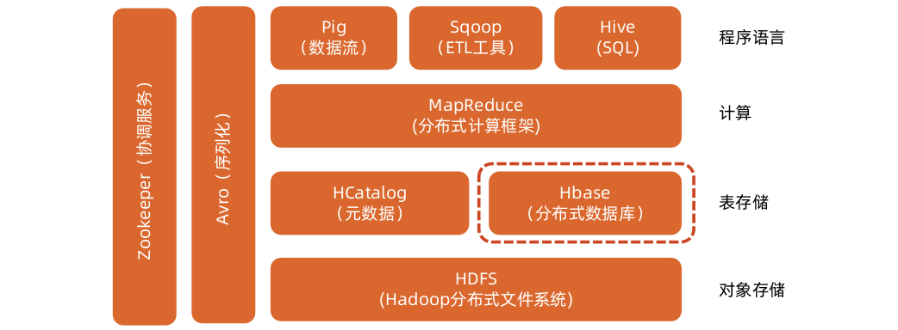
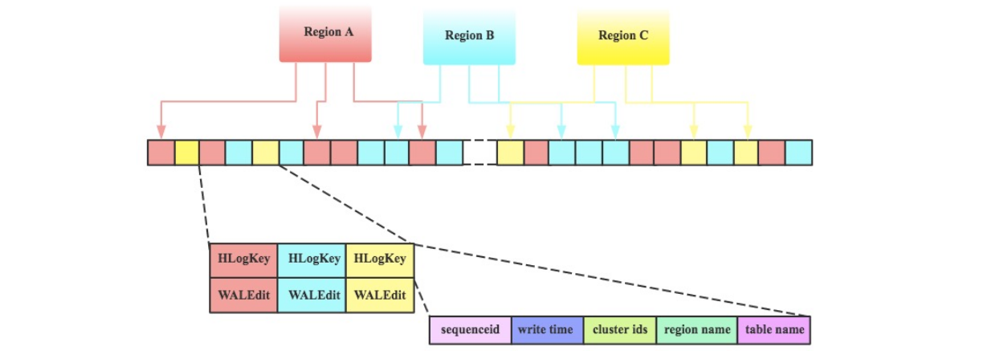

[TOC]

# HBase概述

适合半结构数据存储

**HBase也是Hadoop的一部分**

**分布式数据库**

**分布式数据库的特点**
从集中式数据库走向分布式数据库

**BigTable**
HBase的原型是谷歌的分布式存储系统 BigTable，是谷歌 BigTable的开源实现

**HBase是完美的分布式数据库吗？**

- 分布式数据库首先得是一个数据库
- 分布式数据库无法逃开CAP理论
- 分布式数据库的一些特征：
  - 数据分布式存储
  - Consistency
  - 行级事务管理
  - 水平拓展性好
  - 支持标准SQL
  - 数据一致性（强，最终）
  - 事务透明性
  - 两阶段提及

**当MySQL单表数据量暴涨时怎么办？**

**什么是分片分组**

**什么是分库分表**
**分表：分表从表面意思说就是把一张表分成多个小表**
关系型数据库在大于一定数据量的情况下检索性能会急剧下降。在面对互联网海量数据情况时，所有数据都存于一张表，显然会轻易超过数据库表可承受的数据量阈值。这个单表可承受的数据量阈值，需根据数据库和并发量的差异，通过实际测试获得。
**分库：**
单纯的分表虽然可以解决数据量过大导致检索变慢的问题，但无法解决过多并发请求访问同一个库，导致数据库响应变慢的问题。所以通常水平拆分都至少要采用分库的方式，用于一并解决大数据量和高并发的问题。这也是部分开源的分片数据库中间件只支持分库的原因。
**分库分表带来的问题？**
**分布式事务：**
但分表也有不可替代的适用场景。最常见的分表需求是事务问题。同在一个库则不需考虑分布式事务，善于使用同库不同表可有效避免分布式事务带来的麻烦。目前强一致性的分布式事务由于性能问题，导致使用起来并不一定比不分库分表快。目前采用最终一致性的柔性事务居多。
**跨库跨表的join问题：**
原本一次查询能够完成的业务，可能需要多次查询才能完成

## Google的分布式数据库之路

- 阶段一：BigTable
  - 实现了数据的分布式存储、行数据的事务性管理和较好的扩展性，从存储WEB页面而生，创造性提出了KEY-VALUE这种MAP数据结构，对应开源社区的HBASE。
- 阶段二：Dremel
  - Dremel产品采用了与Bigtable不同的数据结构，立足实时对于海量数据进行分析，据说在秒级可以完成PB级别的数据分析和处理，可以做是分布式数据库实时处理的杰作。
- 阶段三：Spanner
  - Spanner数据库在可以做到多数据表事务一致性管理，利用原子时钟（TrueTime）和Paxos协议解决了分布式数据库多表事务一致性管理的难题，打破的CAP理论神话，使得分布式数据库技术得到了革命性的进步。

## HBase和RDBMS的不同

# HBase逻辑视图

**数据模型（逻辑视图）**

**Row Key**
**行关键字（row key）：**行的主键，唯一标识一行数据，用于检索记录。可以是任意字符串，最大长度64KB。
存储时，按照row key字典序排序存储，利用该特性可以根据“位置相关性”设计row key。访问Hbase表有三种方式：

- 通过单个row key访问
- 通过row key的range
- 全表扫描

**Column family**
列族（Column Family）：行中的列被分为“列族”。（有的地方也翻译为“列簇”）同一个列族的所有成员具有相同的列族前缀。
一般的，存放在同一列族下的数据通常都属于同一类型（可以把同一个列族下的数据压缩在一起）一个表的列族必须在创建表时预先定义。
列键（Column Key）：也称为列名，必须以列族作为前缀，格式为列族：限定词

**Timestamp和Cell**
时间戳（Timestamp）：插入单元格时的时间戳，默认作为单元格的版本号。类型为64位整型
不同版本的数据按照时间戳倒序排序，即最新的数据排在最前面。
存储单元格（Cell）：在 HBase 中，值作为一个单元保存在单元格中。
要定位一个单元，需要满足“行键+列键+时间戳”三个要素。
每个Cell保存着同一份数据的多个版本。
Cell中没有数据类型，完全是字节存储。

# HBase的物理视图

**Key-Value**

**StoreFile**

**逻辑 vs 物理**

# HBase整体架构

**功能组件**

**HBase Master服务器**

**HBase Region服务器**

**HBase整体架构**

**HMaster**
每台 Region Server 都会与 Master 进行通信，HMaster 的主要任务就是告诉 Region Server 它需要维护哪些 Region，具体功能如下：

- 1.管理用户对表的增删改查操作；
- 2.管理 Region Server 的负载均衡，动态调整 Region 分布；
- 3.在 Region 分裂后，负责新的 Region 的分配；
- 4.在 Region Server 停机后，负责失效 Region Server 上的 Region 的迁移；

**Region**
Region：由多个Store组成，HBase使用表存储数据集，当表的大小超过设定的值时，HBase会自动将表划分为不同的Region，它是HBase集群上分布式存储和负载均衡的最小单位。
Store：由两部分组成：MemStore和StoreFile。首先用户写入的数据存放到MemStore中，当MemStore满了后刷入StoreFile。

**WAL技术**
WAL(Write Ahead Log)预写日志，是数据库系统中常见的一种手段，用于保证数据操作的原子性和持久性。

为什么需要使用WAL？举个例子，如果一个系统直接将变更应用到系统状态中，那么在机器掉电重启之后系统需要知道操作是成功了，还是只有部分成功或者是失败了（为了恢复状态）。如果使用了WAL，那么在重启之后系统可以通过比较日志和系统状态来决定是继续完成操作还是撤销操作。

hbase 实现 WAL 的方法将 HLog，hbase 的 RegionServer 会将数据保存在内存中（MemStore），直到满足一定条件，将其 flush 到磁盘上。这样可以避免创建很多小文件。内存存储是不稳定的，HBase 也是使用 WAL 来解决这个问题：每次更新操作都会写日志，并且写日志和更新操作在一个事务中。

**Zookeeper和Client**

ZooKeeper：存储的是 HBase 中的ROOT表（根数据表）和META表（元数据表），元数据表保存普通用户表的Region标识符信息，标识符格式为：表名+开始主键+唯一ID。 随着Region的分裂，标识符信息也会发生变化，分成多个Region后，需要由一个根数据表来贯穿多个元数据表。

此外，ZooKeeper还负责Region Server故障时，通知HMaster进行Region迁移，若HMaster出现故障，ZooKeeper负责恢复HMaster，并且保证有且只有一个HMaster正在运行。

Client：客户端访问HBase的单位，访问时首先访问Zookeeper--ROOT--META--table。

**HFile**

**HBase读写流程**

Client先访问ZK的META表，获取需要访问的Region Server

Client缓存META表在本地，从META表中找到相应row key需要访问的Region Server

**HBase写机制**

1.Client的Put操作会将数据先写入WAL。

2.当数据写入WAL，然后将数据拷贝到MemStore。 MemStore是内存空间，数据并未写入磁盘。

3.一旦数据成功拷贝到MemStore。 Client将收到ACK。

4.当 MemStore中的数据达到阈值，数据会写入HFile。

# HBase API和实验

**HBase Shell**

DDL

DML

**Shell操作**

1. 进入Shell
2. 创建数据表
3. 列出数据表
4. 插入数据
5. 扫描查询数据
6. 单条查询数据
7. 删除一行数据
8. 查看表结构
9. 修改表结构
10. 清空表

**Shell操作-练习**
HBase（hbase shell进入）：
（1）创建命名空间：create_namespace 'jinlantao_test'
（2）创建表：create 'test1', {NAME => 'f1', VERSION => 2}
（3）查询命名空间：list_namespace
（4）列出表：list
（5）创建表：create 'jinlantao_test:test1', 'cf1'
（6）描述表：describe 'jinlantao_test:test1'
（7）插入数据：put 'jinlantao_test:test1', 'r1', 'cf1:c1', 'value'
（8）获取数据：get 'jinlantao_test:test1', 'r1'
（9）扫描表：scan 'jinlantao_test:test1'
（10）统计总数：count 'jinlantao_test:test1'
（11）删除数据：delete 'jinlantao_test:test1', 'r1', 'cf1:c1'
（12）禁止表：disable 'jinlantao_test:test1'
（13）删除表：drop 'jinlantao_test:test1'

## HBase Java API
**常用API**

**Java API流程**

**API操作**
1.创建表
2.插入数据
3.查看数据
4.删除数据

# HBase Compaction

**为什么需要Compaction**
前面提到，HBase 的 MemStore 在满足阈值的情况下会将内存中的数据刷写成 HFile，一个 MemStore 刷写就会形成一个 Hfile。随着时间的推移，同一个 Store 下的HFile 会越来越多，文件太多会影响HBase查询性能，主要体现在查询数据的io次数增加。为了优化查询性能，HBase会合并小的HFile以减少文件数量，这种合并HFile的操作称为Compaction，这也是为什么要进行Compaction的主要原因。
1.将多个小的 HFile 合并成一个更大的 HFile 以增加查询性能
2.在合并过程中对过期的数据（超过TTL，被删除，超过最大版本号）进行真正的删除

**Major Compaction和Minor Compaction**

- Minor Compaction ：会将邻近的若干个 HFile 合并，在合并过程中会清理 TTL 的数据，但不会清理被删除的数据。
- Major Compaction：会将一个 store 下的所有 HFile 进行合并，并且会清理掉过期的和被删除的数据，即在 Major Compaction 会删除全部需要删除的数据。值得注意的是，一般情况下，Major Compaction时间会持续比较长，整个过程会消耗大量系统资源，对上层业务有比较大的影响。因此，**生产环境下通常关闭自动触发Major Compaction功能**，改为手动在业务低峰期触发。

**Compaction示意图**

**如何决定哪些HFile需要Minor Compaction**
首先内存中维护着一个filesToCompact（合并队列），在该队列中的Hfile将会被Minor合并。

当有新的HFile文件产生时，如果同一个列簇下的文件数大于等于hbase.hstore.compaction.min时，就会将符合合并规则的文件放入合并队列，合并规则如下：

- 如果该文件小于hbase.hstore.compaction.min.size， 则一定会被添加到合并队列中。
- 如果该文件大于hbase.hstore.compaction.max.size，则一定会从队列中被排除。
- 如果该文件小于它后面hbase.hstore.compaction.max（默认为10）个文件之和乘hbase.hstore.compaction.ratio（默认为1.2），则该文件也将加入到合并队列中。

**Compaction存在的问题**
**Compaction是一个IO密集型操作，必然对读写造成性能影响。**
对读的影响：
读性能会在 compaction 期间略微降低，而在 compaction 后又回到一个稳定的水平，从下图可以看到图中会有许多毛刺这是因为当进行 compaction 时读性能就会短暂的降低，而在完成后又回到正常水平。

对写的影响：
HFile个数超过hbase.hstore.blockingStoreFiles（默认为7）时， 系统将会强制执行compaction操作进行文件合并， 此时写情况会被阻塞。在数据生成速度很快时，HFile的不断快速生成就需要进行频繁的compaction操作，从而限制写请求速度。
第二个问题是compaction操作会导致写放大。 从下图可以看到一次写入的数据，被多次反复读取与写入，会导致集群 IO 资源的浪费。

## HBase调优

- GC调优
  - GC算法选择
  - 参数调整
- 存储调优（HDFS）
  - Linux系统参数（网络，内存，IO）
  - Short-Circuit Read
  - Data Locality
- 表结构调优
  - Row Key设计
  - 列族设计

## HBase RIT
Region-In-Trasition是hbase的一种变迁机制。

RIT问题是指例如在Region状态的变迁过程中（merge、split、assign、unssign等操作），出现了问题。然后导致region的状态一直保持在RIT， hbase出现异常

一般遇到hbase table 进入RIT怎么解决：
1.当在hbase webui看到某个表某个regin进入RIT时，可以重启该regin所在节点进行恢复。
2.停止hbase集群删除zk 上 /hbase节点，重启集群进行恢复。
3.重启不能恢复时，就需要查看hbase日志了，检查hdfs 文件是否异常，修复hdfs文件异常，通过hbase hbck命令进行修复。
4.reginserver 内存太小也会导致table进入RIT，加大reginserver内存解决，测试环境就碰到过这个问题
5.暴力删除异常table或table部分受损的数据分区，通过删除hdfs上/hbase 下的目录文件，修复hbase meta，这种方式会丢失数据。

# HBase高可用性和容灾

**HLog**
HBase采用类LSM*的架构体系，数据写入并没有直接写入数据文件，而是会先写入缓存（Memstore），在满足一定条件下缓存数据再会异步刷新到硬盘。

为了防止数据写入缓存之后不会因为Region Server进程发生异常导致数据丢失，在写入缓存之前会首先将数据顺序写入HLog中。如果不幸一旦发生Region Server宕机，这种设计可以从HLog中进行日志回放进行数据补救，保证数据不丢失。

**Hlog结构**
HBase中，WAL的实现类为HLog，每个Region Server拥有一个HLog日志，所有region的写入都是写到同一个HLog。下图表示同一个Region Server中的3个 region共享一个HLog。当数据写入时，是将数据对<HLogKey,WALEdit>按照顺序追加到HLog中，以获取最好的写入性能。

**Region Server故障恢复**
发现：
HBase检测宕机是通过Zookeeper实现的， 正常情况下RegionServer会周期性向Zookeeper发送心跳，一旦发生宕机，心跳就会停止，超过一定时间（SessionTimeout）Zookeeper就会认为RegionServer宕机离线，并将该消息通知给Master。
HLog切分：
一台Region Server只有一个HLog文件，即所有Region的日志都是混合写入该HLog的，然而，回放日志是以Region为单元进行的，因此在回放之前首先需要将HLog按照Region进行分组，这个分组的过程就称为HLog切分。
HLog回放：
重新回放HLog，写入MemStore，实际上就是HBase写入的过程。

**HMaster HA**
很少有人提HMaster发生故障时如何恢复，其实HMaster是有HA的，即主备模式。同一时间只有一个HMaster能成功在Zookeeper中注册/hbase/master节点，成为Active提供服务。

因为每台HMaster都和Zookeeper之间存在着心跳保持，当Active HMaster发生故障时，Zookeeper中的/hbase/master节点自动删除，其他HMaster此时如果成功注册该节点，则变为新的Active。成为Active的HMaster需要从Zookeeper中加载完相应的数据到内存，就可以提供服务。

# HBase 2.x

HBase 2.0
2018年4月30日，Hbase社区发布了2.0.0版本，主要包含如下核心功能：

- Read HA
- In-memory compaction
- OffHeap读写

**HBase Read HA**
由上图可知，Region将不再只保存在某一单独的Region Server上，而是选择其他的两个Region Server分别存储该Region的两个备份，这样某台Region Server挂掉时，客户端仍然可以从其它Region Server上备份的Region中读到数据，如此保证了HBase的读高可用，可用性达到了99.99%

**In-Memory Compaction**
In-Memory Compaction是HBase2.0中的重要特性之一，通过在内存中引入LSM*结构，减少多余数据，实现降低flush频率和减小写放大的效果。

在2.0版本中，MemStore中的数据先Flush成一个Immutable的Segment，多个Immutable Segments可以在内存中进行Compaction，当达到一定阈值以后才将内存中的数据持久化成HDFS中的HFile文件。

**OffHeap读写**
HBase服务读写数据较多依赖堆内内存实现，JVM采用的是stop-the-world的方式进行垃圾回收，很容易造成JVM进程因为GC而停顿时间比较长。 而HBase是一个低延迟、对响应性要求比较高的系统，GC很容易造成HBase服务抖动、延迟高。

HBase社区解决GC延迟的思路是尽量减少使用JVM 堆内内存，堆内内存使用减少了，GC也就随着减少了，社区为此支持了读写链路的offheap。

读链路的offheap化：

- 1.对BucketCache引用计数，避免读取时的拷贝

- 2.使用ByteBuffer做为服务端KeyValue的实现，从而使KeyValue可以存储在offheap的内存中写链路的offheap化：
- 3.在RPC层直接把网络流上的KeyValue读入offheap的bytebuffer中；
- 4.使用offheap的MSLAB pool；
- 5.使用支持offheap的Protobuf版本

**HBase的不足**

- 1.分布式事务：每个事务都应该遵循事务的ACID原则，但是HBase无法支持，它只能执行单行事务，一行数据中包含多个列（column），一个事务中可以操作同一行中的多个列。
- 2.强一致性数据同步：比如A要求B和C分别对数据进行运算，则必须在B和C无异常时才可进行，要是有一个人拒绝，则整个事务没法进行，得不到结果也就是事务被取消，资源得不到更新。
- 3.全球负载均衡：负载均衡是个很大的话题，包括存储负载（存储空间全球数据中心共享）、调度负载（在全球数据中心内平衡CPU/MEM利用）、网络负载（在全球数据中心内平衡网络流量）、距离负载（让数据紧贴应用进行全球移动）
- 注：ACID，指数据库事务正确执行的四个基本要素的缩写。包含：原子性（Atomicity）、一致性（Consistency）、隔离性（Isolation）、持久性（Durability）。一个支持事务（Transaction）的，必需要具有这四种特性。
