[TOC]

# Hive概述

**SQL on Hadoop**

- 对结构化数据进行分析查询的主流语言，是关系数据库的SQL语言。
- SQL语言简单易学。 随着关系数据库技术的关起和流行，大量的开发者、数据库管理员、甚至普通 用户通过SQL语言对数据库进行操作，以及进行简单的数据分析，他们熟悉SQL语言。
- 换句话说，SQL语言具有广泛的用户基础。
- Hadoop大数据平台及生态系统，使得人们可以对大规模的数据进行分析处理。 但是使用MapReduce(Java)编程模型进行编程、或者使用过程性语言比如Pig进行编程，对于广大用户来说，仍然是具有挑战性的任务。
- 人们希望能够使用熟悉的SQL语言，对Hadoop平台上的数据进行分析处理。 这就是SQL OnHadoop系统诞生的背景。
- SQL on Hadoop系统是一类系统的统称，这类系统利用Hadoop实现大量数据的管理，具体是利用HDFS实现高度可扩展的数据存储。
- 在HDFS之上，实现SQL的查询引擎，使得用户可以使用SQL语言， 对存储在HDFS上的数据进行分析。


**SQL on Hadoop分类**
SQL on Hadoop系统可以分为如下几类:
(1) Connector to Hadoop:
典型的代表，包括Oracle SQL Connector for Hadoop HDFS、Teradata Connector forHadoop等，这些连接器使得DBMS系统可以存取Hadoop里的数据，查询处理由RDBMS完成。
(2) SQL and Hadoop:
修改现有的SQL Engine，决定查询的哪部分由RDBMS执行， 哪部分由Hadoop(MapReduce)执行。这类系统包括Hadapt、RainStor、Citus Data、 Splice Machine、PolyBase等，其中PolyBase来自微软，它对SQL Server迕行了修改。
(3) SQL on Hadoop:
这类系统一般拥有一个全新设计的SQL Engine，能够直接处理HDFS里的数据，甚至无需使用MapReduce计算模型。这类系统包括Hive、Impala、 Presto、VectorH、 SparkSQL、Drill、HAWQ、IBM的Big SQL等。

**Hive的产生**

- Hive是基于Hadoop的一个数据仓库工具
- 学习成本低，可以通过类SQL语句快速实现简单的MapReduce统计，不必开发专门的MapReduce应用
- 适合数据仓库的ETL和统计分析
- 可以将结构化的数据文件映射为一张数据库表，并提供简单的类SQL(HQL)查询功能，可以将HQL语句转换为MapReduce任务进行运行
- 由Facebook开发并开源，贡献给Apache基金会

**Hive的特点**

- 简单易用
  - 基于SQL表达式语法，兼容大部分SQL-92语义和部分SQL-2003扩展语义
- 可扩展
  - Hive基于Hadoop实现，可以自由的扩展集群的规模，一般情况下不需要重启服务
- 延展性
  - Hive支持用户自定义函数，用户可以根据自己的需求来实现自己的函数
- 容错性
  - Hadoop良好的容错性，节点出现问题SQL仍可完成执行

**Hive适用场景**

- 最佳使用场合
  - 大数据集的批处理作业，例如：网络日志分析
- 不适用于
  - 不能在大规模数据集上实现低延迟快速的查询，例如：Hive在几百MB的数据集上执行查询一般有分钟级的时间延迟。
  - 不支持联机事务处理（OLTP）
    Hive不提供基于行级的数据更新操作（2.0版本开始支持Update）

**Hive实现WordCount**

```
CREATE TABLE wordcount (token String);
LOAD DATA LOCAL INPATH ‘wordcount/input’OVERWRITE INTO TABLE wordcount;
SELECT COUNT(*) FROM wordcount GROUP BY token;
```

**Hive和Hadoop的关系**

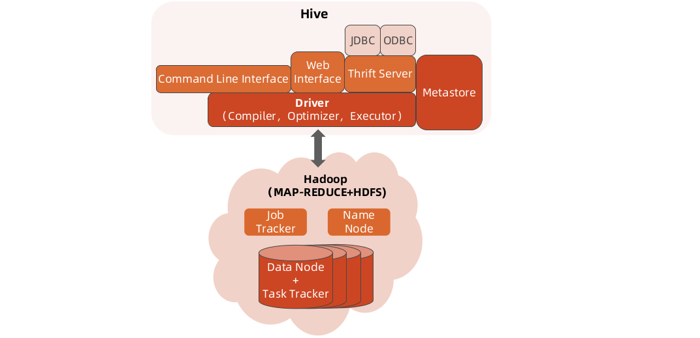

https://hub.docker.com/r/nagasuga/docker-hive

**安装配置**

- MetaStore部署
  支持derby/mysql/msserver/oracle/postgresql
  一般采用MySQL
  采用安装包自带的初始化脚本初始化
- Hive安装包部署
  安装包或者rpm包安装
- 配置文件：
  hive-env.sh（Hive环境变量相关）
  hive-site.xml（Hive应用配置）

**Hive命令**
不仅仅可以在CLI中输入HQL，还支持command命令

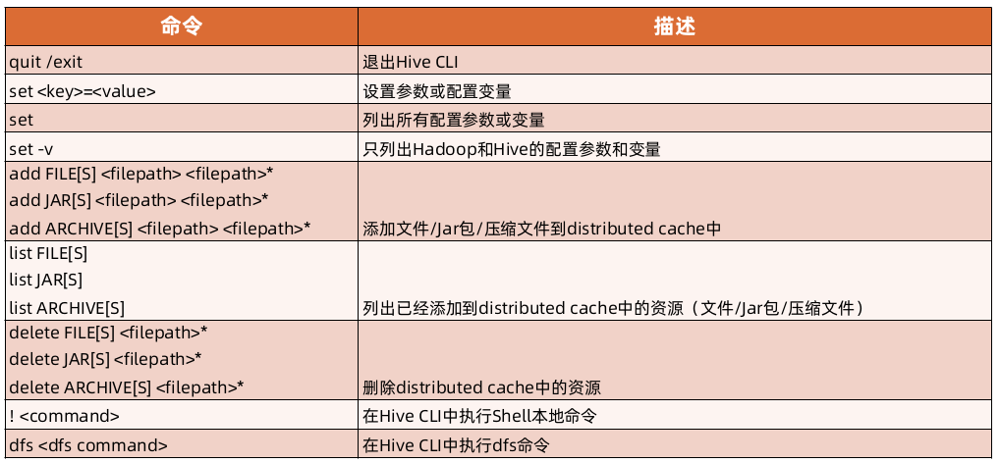

```
hive -e 'select a.col from tab1 a'
hive -f /home/my/hive-script.sql
```

**Hive参数**

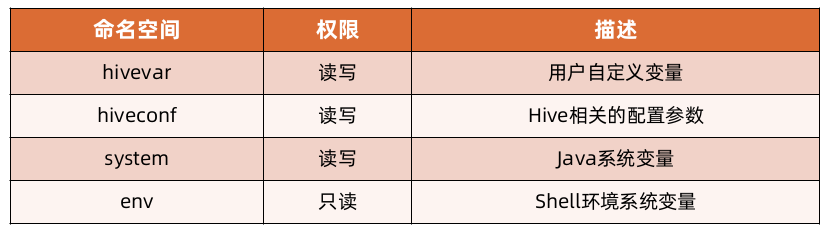

hivevar参数示例 hiveconf参数示例

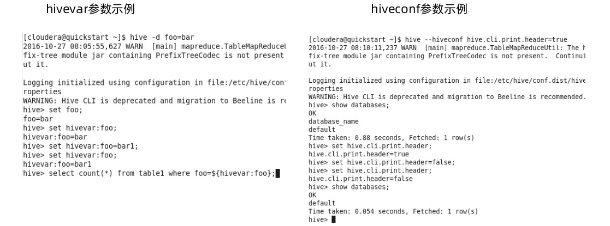

system变量示例 环境变量参数示例

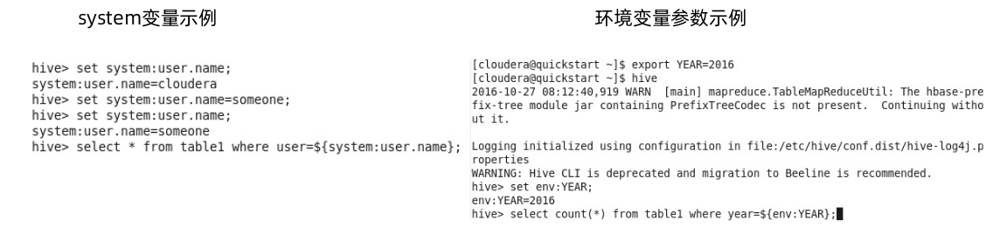

# Hive基本原理

## Hive系统架构

- 接口
  - CLI
  - HWI
  - ThriftServer
  - JDBC/ODBC

- 元数据存储
- 驱动器（Driver）
  - 编译器
  - 优化器
  - 执行器

- Hadoop
  - MapReduce计算
  - HDFS数据存储

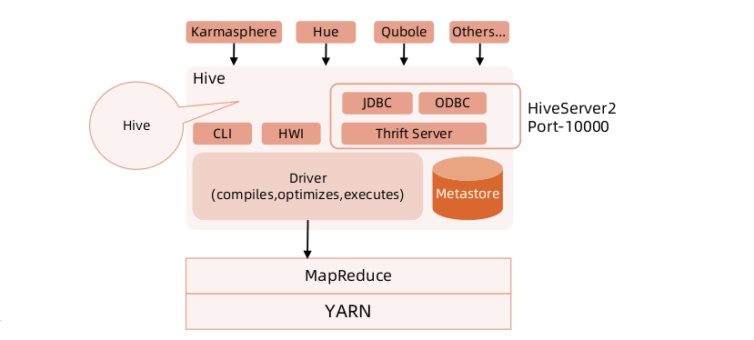

**用户接口**

- 用户接口主要有三个：CLI、ThriftServer和HWI。
- 最常用的是CLI，CLI启动的时候，会同时启动一个Hive Driver。
- ThriftServer是以Thrift协议封装的Hive服务化接口，可以提供跨语言的访问如Python、C++等，并实现了JDBC/ODBC协议。
- HWI提供了一个基于浏览器访问Hive的途径。

**元数据存储**

- Hive将元数据存储在数据库中，如 MySQL、Oracle、Derby。
-  Hive中的元数据包括表的名字、表的列和分区及其属性、表的属性（是否为外部表等）、表的数据所在目录等。

**驱动器（Driver）**

- 编译器
  - 完成词法分析、语法分析，将HQL查询解析成AST
  - AST生成逻辑执行计划
  - 逻辑执行计划生成物理MR执行计划
- 优化器
  - 对逻辑执行计划进行优化
  - 对物理执行计划进行优化
- 执行器
  - 生成的物理执行计划转变成MR Job
  - 提交到Hadoop上面执行

**与传统数据库的对比**

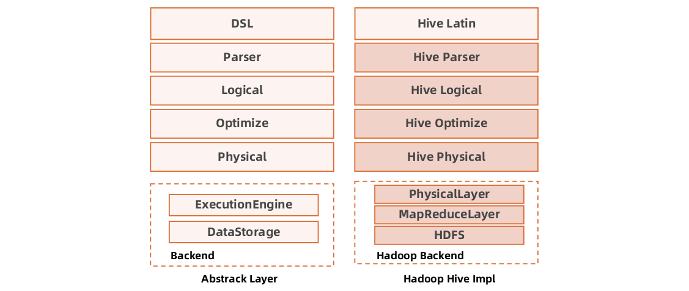

## 部署方式
**内嵌模式**

- CLI Shell/Driver/MetaStoreCLI均在一个JVM内部


**Remote MetaStoreServer**

- MetaStore作为一个独立的Thrift服务，而不是每个Driver自己维护一个瘦MetaStore访问DB


**实验**

- 启动Cloudera QuickStart虚拟机
- 熟悉Hive环境
- 尝试Hive CLI进行Hive命令操作

# HiveQL详解

## MapReduce如何实现SQL
Join的实现原理
select u.name, o.orderid from order o join user u on o.uid = u.uid;

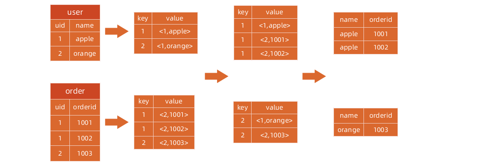

Group By的实现原理
select rank, isonline, count(*) from city group by rank, isonline;
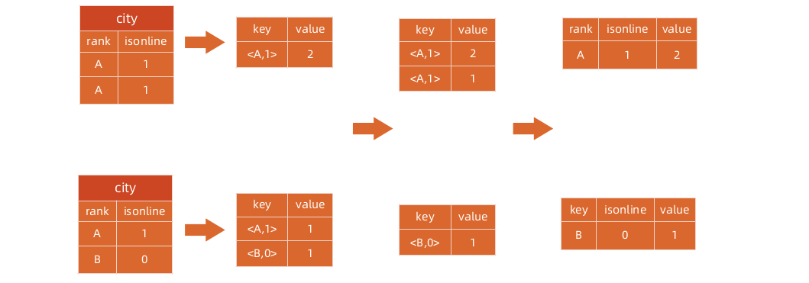

Distinct的实现原理
select dealid, count(distinct uid) num from order group by dealid;

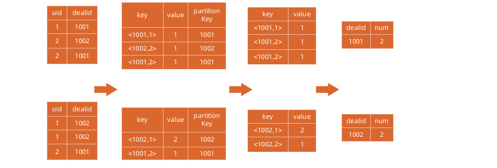

**SQL转化为MapReduce的过程**

- 1.词法语法解析: Antlr定义SQL的语法规则，完成SQL词法，语法解析，将SQL转化为抽象语法树（AST Tree）
- 2.语义解析: 遍历AST Tree，抽象出查询的基本组成单元查询块（QueryBlock）
- 3.生成逻辑执行计划: 遍历查询块，翻译为逻辑执行计划，Hive用操作树（OperatorTree）表示
- 4.优化逻辑执行计划: 对操作树进行变换，合并不必要的操作，减少shuffle数据量，得到优化过的逻辑执行计划
- 5.生成物理执行计划: 遍历操作树，翻译为MapReduce任务，即物理执行计划
- 6.优化物理执行计划: 继续对物理执行计划进行变换，生成最终的MapReduce任务

**Hive编译器**

- Parser：
  - 1.将SQL转换成抽象语法树
- 语法解析器：
  - 2.将抽象语法树转换成查询块
- 逻辑计划生成器：
  - 3.将查询块转换成逻辑计划
- 逻辑计划优化器：
  - 4.优化逻辑计划
- 物理计划生成器：
  - 5.将逻辑计划转换成物理计划
- 物理计划优化器：
  - 6.物理计划优化策略

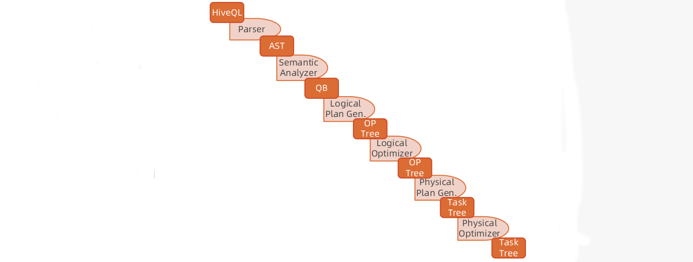

**Hive实现原理**

- Hive的编译器将HQL转换成一组操作符(Operator)
- 操作符是Hive的最小处理单元
- 每个操作符代表一道HDFS操作或者MR Job操作

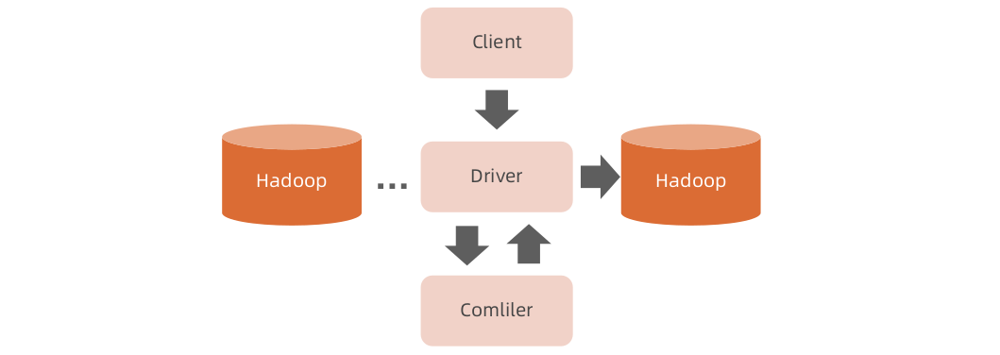

**Hive内部操作**

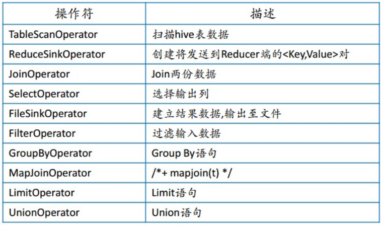

**SQL解析细节**


简单的讲，SQL在分析执行时经历如下4步：

- 1.语法解析
- 2.元数据绑定
- 3.优化执行策略
- 4.交付执行

**语法解析**
语法解析之后，会形成一棵语法树，如下图所示。树中的每个节点是执行的rule,整棵树称之为执行策略。

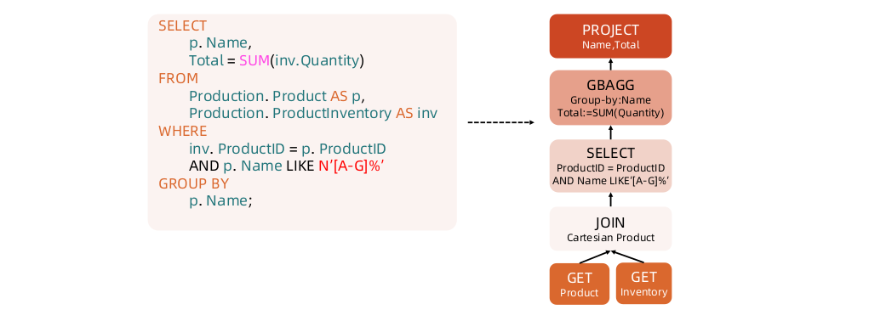

**元数据绑定**
QueryBlock中的ProductID，Name等标识符需要在Catalog里进行元数据绑定，并识别是否有效。


**策略优化**
形成上述的执行策略树还只是第一步，因为这个执行策略可以进行优化，所谓的优化就是对树中节点进行合并或是进行顺序上的调整。
以大家熟悉的join操作为例，下图给出一个join优化的示例。A JOIN B等同于B JOIN A，但是顺序的调整可能给执行的性能带来极大的影响，下图就是调整前后的对比图。

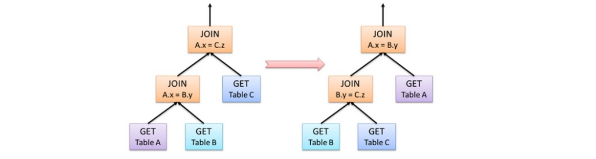

**Hive中的逻辑查询优化可以大致分为以下几类：**

- 投影修剪
- 推导传递谓词
- 谓词下推
- 将Select-Select，Filter-Filter合并为单个操作
- 多路 Join
- 查询重写以适应某些列值的Join倾斜

**交付执行**

根据优化的逻辑计划（操作树）生存物理计划（mapreduce）
操作树是由如下操作符号构成，操作符到MapReduce的转化在小结一开始的地方已经描述。

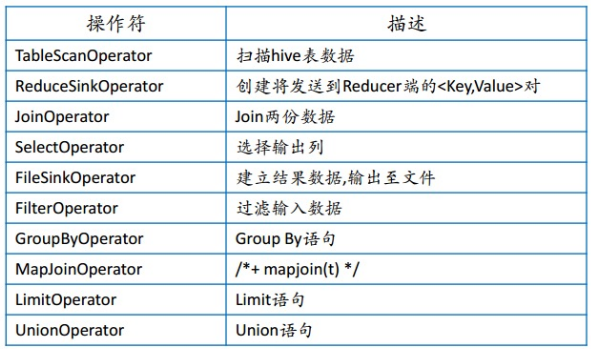

**Example**
select guid, count(1) from behaviourlog where dt=' 2020-09-01' group by guid limit 10;

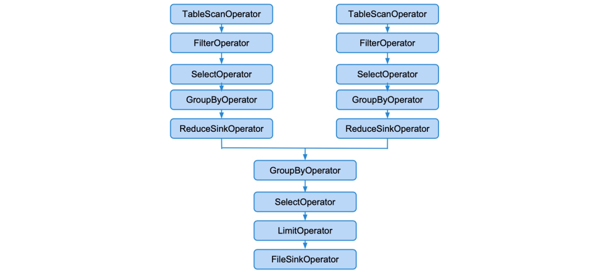

- 1.Antlr 生成 AST, AST => QueryBlock。
- 2.QB 里面的 tableAlias => TableScanOp。
- 3.根据Where中的谓词创建FilterOp作为TableScanOp的子节点。
- 4.根据出现的列创建selectOp，作为FilterOp的字节点。
- 5.GroupBy和聚合函数Count会在map-side进行部分聚合，创建GroupByOp作为selectOp的子节点。
- 6.添加ReduceSinkOp, 将GroupBy的列和distinct的列作为Key , 其他列作为值。
- 7.在Reduce-side同样需要添加GroupByOp用于合并前面Map-side的部分聚合。
- 8.Reduce端需要再次添加selectOp，最为SQL的输出列。
- 9.根据Limit，输出结构需要添加limitOp。
- 10.将结果写到临时目录，添加fileSinkOp。


**练习**

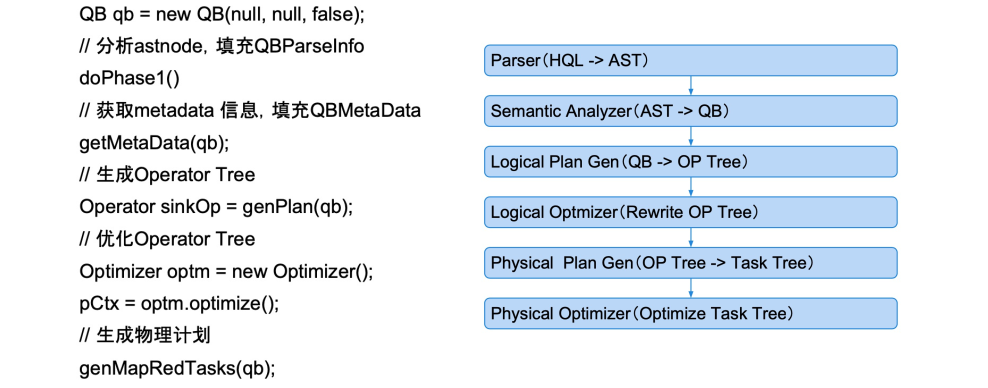