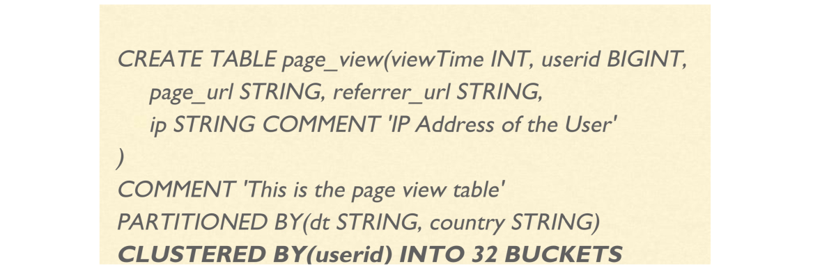

[TOC]

# DDL和DML

**关系模型**
Hive和传统数据库一样，也采用关系模型。使用结构化查询语言（SQL）进行数据检索


## 数据类型
Hive支持大多数关系数据库所支持的数据类型，包括基本数据类型和复杂组合数据类型
基本数据类型

- 数值类型
- 字符串类型
- 日期时间类型
- 其他

组合数据类型

- Array/Map/Struct/Union

**数值类型**


**字符类型**
Hive支持的字符类型为String，对应Java的String
使用引号（双引号或单引号）引用

- VARCHAR
  - 变长字符串序列
  - 必须指定一个最大长度，如VARCHAR(255)，如果超过最大长度，字符串将被截取
- CHAR
  - 固定长度字符串序列
  - 比如指定一个固定长度，最大255. 如CHAR(10)，如果不足长度，则用空字符补齐
- 示例：
  - ‘this is a string’
  - “this is a string”
  - Select count(*) from table where city =“shanghai”

**日期时间类型**

- Hive支持日期类型，并进行比较计算
  - TIMESTAMP， 兼容java.sql.Timestamp格式
- 示例：
  - 1327882394 （Unix纪元秒），对应Java Int类型
  - 1327882394.123456789 (Unix纪元秒和纳秒)，对应Java Float类型
  - “2016-10-25 12:34:56.123456789”，对应Java String类型

**更多类型**

- BOOLEAN
  - 相当于Java的Boolean类型
  - true/false
- BINARY
  - 任意字节序列，类似于传统RDBMS中的VARBINARY
  - BINARY字段仅作为二进制字节序列，不被Hive解析为基本类型
- 复合数据类型
  - ARRAY/MAP/STRUCT/UNIONTYPE

**Hive数据模型**
Hive通过以下模型来组织HDFS上的数据

- 数据库（Database）
- 表（Table）
- 分区（Partition）
- 桶（Bucket）


**Table管理表和外表**

- Hive中的表和关系型数据库中的表在概念上很类似
- 每个表在HDFS中都有相应的目录用来存储表的数据
- 根据数据是否受Hive管理，分为：
  - Managed Table（管理表）
  - External Table（外表）
- 区别：
  - Managed Table：
    - HDFS存储数据受Hive管理，在统一的路径下:${hive.metastore.warehouse.dir}/{database_name}.db/{tablename}
    - Hive对表的删除操作影响实际数据的删除
  - External Table：
    - HDFS存储路径不受Hive管理，只是Hive元数据与HDFS数据路径的一个映射
    - Hive对表的删除操作仅仅删除元数据，实际数据不受影响

**Table永久表和临时表**

- Permanent Table是指永久存储在HDFS之上的表，默认创建表为永久表
- Temporary Table是指仅当前Session有效的表，数据临时存放在用户的临时目录下，当前session退出后即删除
- 临时表比较适合于比较复杂的SQL逻辑中拆分逻辑块，或者临时测试
- 注意：
  - 如果创建临时表时，存在与之同名的永久表，则临时表的可见性高于永久表，即对表的操作是临时表的，用永久表无效
  -  临时表不支持分区

**Partition**

- 基于用户指定的分区列的值对数据表进行分区
- 表的每一个分区对应表下的相应目录，所有分区的数据都是存储在对应的目录中
  - ${hive.metastore.warehouse.dir}/{database_name}.db/{tablename}/{partitionkey}={value}
- 分区的优点
  - 分区从物理上分目录划分不同列的数据
  - 用于查询的剪枝，提升查询的效率
- 可以多级Partition，即指定多个Partition字段，但所有Partition的数据不可无限扩展（多级目录造成HDFS小文件过多影响性能）

**Bucket**

- 桶作为另一种数据组织方式，弥补Partition的短板（不是所有的列都可以作为Partition Key）
- 通过Bucket列的值进行Hash散列到相应的文件中，重新组织数据，每一个桶对应一个文件
- 桶的优点：
  - 有利于查询优化
  - 对于抽样非常有效
- 桶的数量一旦定义后，如果更改，只会修改Hive元数据，实际数据不会重新组织

**举个例子**




**Table相关DDL操作—创建表**


**Table相关DDL操作**

- SHOW TABLES [IN database_name] [‘identifier_with_wildcards’];   // 列出表
- SHOW CREATE TABLE ([db_name.]table_name|view_name);   //列出表创建语句
- SHOW PARTITIONS table_name;    //列出表的所有分区
- SHOW COLUMNS (FROM|IN) table_name [(FROM|IN) db_name];    //列出表的所有字段
- DESCRIBE [EXTENDED|FORMATTED] table_name   //描述表定义
- DESCRIBE [EXTENDED|FORMATTED] table_name PARTITION partition_spec;   //描述分区定义

- DROP TABLE [IF EXISTS] table_name [PURGE];   //删除表

- TRUNCATE TABLE table_name [PARTITION partition_spec];     //清空表数据

- ALTER TABLE table_name RENAME TO new_table_name;    //重命名表

- ALTER TABLE table_name SET TBLPROPERTIES table_properties;     //修改表属性

- ALTER TABLE table_name ADD [IF NOT EXISTS] PARTITION partition_spec [LOCATION ‘location1’] partition_spec [LOCATION ‘location2’] ...;    //增加分区

- ALTER TABLE table_name

  [PARTITION partition_spec]
  ADD|REPLACE COLUMNS (col_name data_type [COMMENT col_comment], ...)
  [CASCADE|RESTRICT]     //增加/替换表字段


- 理解Hive的数据存储模型，创建表后查看HDFS的数据路径
- 练习创建数据库、修改、删除数据库的语法
- 练习创建表、删除表、查看表定义、修改表属性的语法
- 理解外部表和临时表
- 练习创建分区表，查看、删除分区
- 练习创建分桶表
- 练习增加、修改表字段

## SELECT … FROM

**以employee表为例**

```
CREATE TABLE employees (
name STRING,
salary FLOAT,
subordinates ARRAY<STRING>,
deductions MAP<STRING, FLOAT>,
address STRUCT<street:STRING, city:STRING, state:STRING, zip:INT>
)
PARTITIONED BY (country STRING, state STRING);
```

- SELECT是投影操作符，FROM后可以操作表，也可以是子查询
- 表别名：
  - SELECT name, salary FROM employees;
  - SELECT e.name, e.salary FROM employees e;
- 字段值的计算：
  - 算术操作符
  - 函数：数学计算函数、聚集函数、表生成函数、字符处理函数等等
  - SELECT count(\*), avg(salary) FROM employees;
- 字段别名：
  - SELECT count(\*) as emp_count, avg(salary) as avg_salary FROM employees;

- LIMIT
  - SELECT name, salary FROM employees LIMIT 10;
- FROM子查询

```
> FROM (
> SELECT upper(name), salary, deductions["Federal Taxes"] as fed_taxes,
> round(salary * (1 - deductions["Federal Taxes"])) as salary_minus_fed_taxes
> FROM employees
> ) e
> SELECT e.name, e.salary_minus_fed_taxes
> WHERE e.salary_minus_fed_taxes > 70000;
```

- WHERE 条件过滤
  - 谓词表达式和谓词操作符
  - SELECT * FROM employees WHERE country = 'US' AND state = 'CA';


## JOIN

- Hive只支持等值JOIN
  - SELECT a.\* FROM a JOIN b ON (a.id = b.id AND a.department = b.department) √
  - SELECT a.\* FROM a JOIN b ON (a.id <> b.id) ×
- MAP-SIDE JOIN 优化
- 支持：
  - INNER JOIN
  - LEFT OUTER JOIN
  - RIGHT OUTER JOIN
  - FULL OUTER JOIN
  - LEFT SEMI JOIN

**JOIN 示例**


- SQL:
  - SELECT pv.pageid, u.age
  - FROM page_view pv JOIN user u ON (pv.userid = u.userid);

**JOIN MapReduce实现**


**Hive Join类型支持**

- INNER JOIN
- LEFT|RIGHT|FULL OUTER JOIN


- LEFT SEMI JOIN
- 实现IN/EXISTS查询

SELECT a.* FROM a WHERE a.key IN (SELECT b.key FROM b WHERE b.value > 100) 等价于 SELECT a.* FROM a LEFT SEMI JOIN b ON (a.key = b.key AND b.value > 100)


**ORDER BY/SORT BY**

- ORDER BY
  - 与传统RDBMS SQL语义一致，对结果集全局排序
  - 对于MapReduce的实现，是需要将结果集shuffle到一个reducer
  - 如果数据量非常大，则会导致reducer执行时间非常长
  - 通常会加LIMIT来限制排序结果的数量
- SORT BY
  - Hive特有，reducer本地排序，而非全局排序
  - 当reducer = 1时，与Order By语义相同，否则得到的结果集不同
- ORDER/SORT BY xxx，xxx ASC/DESC

**DISTRIBUTE BY/CLUSTER BY**

- DISTRIBUTE BY
  - 控制map输出的shuffle key
  - 默认是按照key的hashcode
  - 一般用于控制将相同key的数据shuffle到同一个reducer
- CLUSTER BY
  - 等于DISTRIBUTE BY … SORT BY …
  - DISTRIBUTE BY 和 SORT BY的字段相同，并正序排序

**UNION ALL**

- Union all 用于组合两个或多个表或者子查询的数据
- 组合的关系的字段数和字段类型必须完全一致

```sql
SELECT log.ymd, log.level, log.message
FROM (
SELECT l1.ymd, l1.level,
l1.message, 'Log1' AS source
FROM log1 l1
UNION ALL
SELECT l2.ymd, l2.level,
l2.message, 'Log2' AS source
FROM log1 l2
) log
SORT BY log.ymd ASC;
```

- 重点练习集中JOIN的不同
- ORDER BY和SORT BY的区别
- DISTRIBUTE BY和CLUSTER BY的用法

# 常用存储格式

**列存和行存**

- 行存储
  - 适合增加、插入、删除、修改的事务处理处理
  - 对列的统计分析却需要耗费大量的I/O。对指定列进行统计分析时，需要把整张表读取到内存，然后再逐行对列进行读取分析操作
- 列存储
  - 对增加、插入、删除、修改的事务处理I/O高、效率低
  - 非常适合做统计查询类操作，统计分析一般是针对指定列进行，只需要把指定列读取到内存进行操作


**文件格式**
Hive的数据存储在HDFS上，支持多种不同文件格式
在创建表时，通过STORED AS <FileFormat>语句指定存储文件格式


**TextFile**

- Hive默认格式（可通过hive.default.fileformat参数定义为默认其他格式）
- 可读性好，肉眼可读
- 磁盘开销大，数据解析开销大，不建议生产系统采用这种格式
- 可以配合压缩来缓解IO压力，比如lzo/gzip/bzip2，但压缩后不可Split
- 对于Schema的变动支持很弱，只能在最后字段新增字段，已存在的字段无法删除


**SequenceFile**

- SequenceFile是Hadoop API 提供的一种二进制文件，它将数据以<key,value>的形式序列化到文件中。这种二进制文件内部使用Hadoop 的标准的Writable 接口实现序列化和反序列化
- Hive 中的SequenceFile 继承自Hadoop API 的SequenceFile，它的key为空，使用value 存放实际的值， 避免MR 在运行map 阶段的排序过程
- 相比Text更紧凑，支持Split
- 没有Metadata，只能新增字段


**Avro**

- Avro是一种用于支持数据密集型的二进制文件格式。它的文件格式更为紧凑，若要读取大量数据时，Avro能够提供更好的序列化和反序列化性能。并且Avro数据文件天生是带Schema定义的，所以它不需要开发者在API 级别实现自己的Writable对象。最近多个Hadoop 子项目都支持Avro 数据格式，如Pig 、Hive、Flume、Sqoop和Hcatalog


**RCFile**

- RCFile是Hive推出的一种专门面向列的数据格式。 它遵循“先按列划分，再垂直划分”的设计理念
- 当查询过程中，针对它并不关心的列时，它会在IO上跳过这些列


**ORC**

- ORC（OptimizedRC File）存储源自于RCFile这种存储格式
- ORC在压缩编码，查询性能方面相比RCFile做了很多优化
- Metadata用protobuf存储，支持schema的变动，如新增或者删除字段


**Parquet\***

- 源自于google Dremel系统，Parquet相当于Google Dremel中的数据存储引擎
- Apache Parquet 最初的设计动机是存储嵌套式数据，比如Protocolbuffer，thrift，json等，将这类数据存储成列式格式，以方便对其高效压缩和编码，且使用更少的IO操作取出需要的数据，这也是Parquet相比于ORC的优势，它能够透明地将Protobuf和thrift类型的数据进行列式存储
- 存储metadata，支持schema变更


**自定义格式**

- 除了默认的几种文件格式，用户还可以自定义文件格式
- 通过继承InputFormat和OutputFormat来自定义文件格式
  - 参考Base64InputFormat和Base64OutputFormat的实现
  - https://github.com/cloudera/hive/tree/cdh5.8.0-release/contrib/src/java/org/apache/hadoop/hive/contrib/fileformat/base64
- 创建表时指定InputFormat和OutputFormat，来读取Hive中的数据
  

```sql
CREATE TABLE base64example(line string)
STORED AS
inputformat 'org.apache.hadoop.hive.contrib.fileformat.base64.Base64TextInputFormat'
outputformat 'org.apache.hadoop.hive.contrib.fileformat.base64.Base64TextOutputFormat';
```

