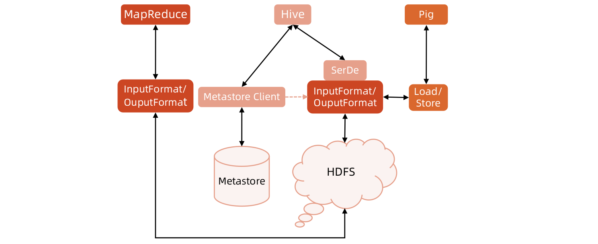

[TOC]

# Parquet

Parquet是面向分析型业务的列式存储格式，由Twitter和Cloudera合作开发，2015年5月从Apache的孵化器里毕业成为Apache顶级项目。

一个Parquet文件是由一个header以及一个或多个block块组成，以一个footer结尾。header中只包含一个4个字节的数字PAR1用来识别整个Parquet文件格式。文件中所有的metadata都存在于footer中。footer中的metadata包含了格式的版本信息、schema信息、key-value paris以及所有block中的metadata信息。footer中最后两个字段为一个以4个字节长度的footer的metadata，以及同header中包含的一样的PAR1。


**Parquet结构**
Row Group：
数据水平切分。
Column Chunk：
存储某一列数据。
Page：
最小逻辑存储单元。

一个File对应多个Row group；
一个Row group对应多个Column；
一个Column对应多个Page。

高效压缩：注意到每个Column都有一个type元数据，那么压缩算法可以通过这个属性来进行对应压缩，另外元数据中的额外k/v对可以用于存放对应列的统计信息


**Parquet项目结构**


parquet-format项目定义了Parquet内部的数据类型、存储格式等。
parquet-mr项目完成外部对象模型与Parquet内部数据类型的映射。
什么是对象模型？
对象模型可以简单理解为内存中的数据表示，Avro、Thrift、Protocol Buffers、Hive SerDe、Pig Tuple、Spark SQL InternalRow等这些都是对象模型。

https://github.com/apache/parquet-mr/tree/master/parquet-column/src/main/java/org/apache/parquet/example

**数据模型**

```
message Student{
	required string name;
	optinal int age;
	required double score;
	repeated group hobbies {
		required string hobby_name;
		repeated string home_page;
	}
}
```

Parquet格式的数据类型没有复杂的Map、List、Set等，而是使用repeated fields和groups来表示。例如List和Set可以被表示成一个repeated field，Map可以表示成一个包含有key-value对的repeated field，而且key是required的。


**Striping/Assembly算法**
对于嵌套数据类型，我们除了存储数据的value之外还需要两个变量Repetition Level（R）,Definition Level(D) 。

**Definition Level**
Definition level指的是截至当前位置为止，从根节点一路到此的路径上有多少可选的节点被定义了，因为是可选的，因此required类型不统计在内。


Definition level的计算公式如下：当前树深度 - 路径上类型为required的个数 - 1（如果自身为null）

**Repetition level**
针对repeated类型，它的Repetition level等于根节点到达它的路径上的repeated节点的个数。


**Project Pushdown**
Project Pushdown意味着在获取表中原始数据时只需要扫描查询中需要的列，由于每一列的所有值都是连续存储的，所以分区取出每一列的所有值就可以实现TableScan算子，而避免扫描整个表文件内容。

在Parquet中原生就支持Project Pushdown，执行查询的时候可以通过Configuration传递需要读取的列的信息，这些列必须是Schema的子集，每次会扫描一个Row Group的数据，然后一次性得将该Row Group里所有需要的列的Cloumn Chunk都读取到内存中，每次读取一个RowGroup的数据能够大大降低随机读的次数。

**Predicate Pushdown**
谓词下推是数据库最常用的优化手段，通过将过滤条件尽可能的在最底层执行可以减少数据量，从而提升性能，例如”select count(1) from A Join B on A.id = B.id where A.a > 10 and B.b <100″SQL查询中，在处理Join操作之前需要首先对A和B执行TableScan操作，然后再进行Join，再执行过滤，最后计算聚合函数返回，但是如果把过滤条件A.a > 10和B.b < 100分别移到A表的TableScan和B表的TableScan的时候执行，可以大大降低Join操作的输入数据。

无论是行式存储还是列式存储，都可以在将过滤条件在读取一条记录之后执行以判断该记录是否需要返回给调用者，在Parquet做了更进一步的优化，它对每一个Row Group的每一个ColumnChunk在存储的时候都计算对应的统计信息，包括该Column Chunk的最大值、最小值和空值个数。通过这些统计值和该列的过滤条件可以判断该Row Group是否需要扫描。另外Parquet还有Bloom Filter和Index等增强谓词下推。

# Hive性能优化

**优化思路**

- 编译器优化器优化
  - 采用合理的优化策略，生成高效的物理计划
- MapReduce执行层优化
  - 通过MR参数优化，提升Job运行效率
- HDFS存储层优化
  - 采用合理的存储格式和合理的Schema设计，降低IO瓶颈

**编译器优化器优化**

- 利用Explain命令查看执行计划
- 语法：EXPLAIN [EXTENDED] query
- 输出：
  - 查询语句的抽象语法树（AST）
  - 执行计划不同阶段间的依赖关系
  - 每个阶段的描述

```
EXPLAIN EXTENDED INSERT OVERWRITE DIRECTORY ‘/tmp/result’ SELECT o.date, sum(p.price*o.amount) AS total_amount FROM order o LEFT JOIN product p on o.oid = p.pid GROUP BY o.date ORDER BY o.date
```


**SQL层优化**

- 不必要的shuffle
- NestLoopJoin
- Window函数
- 全局排序
- 谓词下推异常
- 数据倾斜
- Join顺序
- Join膨胀
- MapJoin
- 特殊UDF（ percentile)

**MapReduce执行层优化**

- 并发度控制
  • Num_Map_tasks = \$inputsize / max(\$mapred.min.split.size, min(\$dfs.block.size,
  \$mapred.max.split.size))
  • Num_Reduce_tasks = min(\$hive.exec.reducers.max ,
  \$inputsize/\$​​​hive.exec.reducers.bytes.per.reducer)
- Job并行执行
  - set hive.exec.parallel=true;
- Task内存优化
- 本地执行
  - set hive.exec.mode.local.auto=true;
  - hive.exec.mode.local.auto.inputbytes.max（默认128MB）
  - hive.exec.mode.local.auto.input.files.max（默认4）
- JVM重用
  - set mapred.job.reuse.jvm.num.tasks=10 //每个jvm运行10个task
- 推测执行
  - set hive.mapred.reduce.tasks.speculative.execution=true
  - set mapreduce.map.speculative=true
  - set mapreduce.reduce.speculative=true
- 开启压缩
  - 中间结果压缩，减少Job跟Job之间的IO开销
  - set hive.exec.compress.intermediate=true
  - set mapred.map.output.compression.codec=<CodecClassName>
  - 最终结果压缩，减少存储空间
  - set hive.exec.compress.output=true
  - Set mapred.output.compression.codec=<CodecClassName>

**存储层优化**

- 列存储，高压缩比，列剪枝，过滤无用字段IO
  - Orc
  - Parquet
- 分区分桶
- 合并输入小文件
  - 如果Job输入有很多小文件，造成Map数太多，影响效率
  - set hive.input.format=org.apache.hadoop.hive.ql.io.CombineHiveInputFormat
- 小文件合并
  
  - set hive.merge.mapfiles=true; // map only job结束时合并小文件
  - set hive.merge.mapredfiles=true; // 合并reduce输出的小文件
  - set hive.merge.smallfiles.avgsize=256000000; //当输出文件平均大小小于该值，启动新job合并文件
  - set hive.merge.size.per.task=64000000; //合并之后的每个文件大小

**Hive优化器支持的几条优化**
**Limit优化**

- 查询hive数据时，用limit限制输出数据数目
- 正常情况，会执行全表查询，而只返回很少一部分数据，浪费时间和IO
- 优化手段：抽样查询，不需要进行全表查询
  - set hive.limit.optimize.enable=true;
  - hive.limit.row.max.size //每一行最大长度
  - hive.limit.optimize.limit.file //从多少个数据文件中进行抽样
- 弊端：
  - 有些需要的数据可能被忽略掉

**MapJoin优化**

- 方式一(自动判断）：
  - set.hive.auto.convert.join=true;
  - hive.mapjoin.smalltable.filesize // 默认值是25mb, 小表小于25mb自动启动mapjoin
- 方式二(手动显式）：
  - select /\*+mapjoin(A)\*/ f.a,f.b from A t join B f on (f.a=t.a)


**BucketJoin优化**

- 使用方式：
  - hive.optimize.bucketmapjoin= true
  - 和 mapjoin一起工作
  - 所有要Join的表都必须对Join key做了分桶 ，并且大表的桶数是小表的整数倍
- 由于对表设计有太多的限制， bucket key必须是join key的子集


**Skew优化**

- 在SQL上，一般是由于group by或者join shuffle key不均匀造成的
- 数据倾斜是业务数据问题导致的，如果从业务上下手避免是最好的
  - 比如由于Null值引起的，或者某一个特殊的key数据量特别大
  - 先过滤掉特殊key的数据再进行处理
- Hive自身的优化方案
  - 由group by引起的数据倾斜：
  - hive.map.aggr=true //做map端预聚合
  - hive.groupby.skewindata //将key的数据随机分发到Reduce端做聚合，然后再起一个Job对上一步的结果做聚合
  - 由Join引起的数据倾斜(Skew Join)
  - hive.optimize.skewjoin = true
  - hive.skewjoin.key = 100000 // 超过阈值就判断为skew key


# UDF和UADF

**Hive函数**

- 函数/UDF
  - 输入一行记录，输出一行记录
  - 示例：upper/lower/length
- 聚集函数/UDAF
  - 输入多行记录，输出一行记录
  - 示例：sum/count/avg
- 表生成函数/UDTF
  - 输入一行记录，输出多行记录
  - 示例：explode

**查看函数**

```sql
SHOW FUNCTIONS;
DESCRIBE FUNCTION <function_name>;
DESCRIBE FUNCTION EXTENDED <function_name>;
```


**Hive内置函数——数学计算相关**


**Hive内置函数——集合相关**


**Hive内置函数——日期相关**


**Hive内置函数——字符串处理函数**


**Hive内置聚集函数**


**Hive内置表生成函数**


**用户自定义函数**
虽然Hive已经提供了很多内存的函数，但是还是不能，满足用户的需求，因此有提供了自定义函数供用户自己开发函数来满足自己的需求。

Java开发，生成Jar包
使用方式：

- ADD JAR /full/path/to/your jar;
- CREATE TEMPORARY FUNCTION func_name AS ‘udf.class.name';
- DROP TEMPORARY FUNCTION IF EXISTS func_name;

**UDF开发**
继承UDF，重写evaluate方法即可
以length为例

```java
import org.apache.hadoop.hive.ql.exec.UDF;
public class UDFLength extends UDF {
	public String evaluate(String in) {
		// 请在此实现
	}
}
```

```java
@Description(name = "length",
            value = "_FUNC_(str | binary) - Returns the length of str or number of bytes in binary data",
            extended = "Example:\n"
            + " > SELECT _FUNC_('Facebook') FROM src LIMIT 1;\n" + "  8")
@VectorizedExpressions({StringLength.class})
public class UDFLength extends UDF {
    private final IntWritable result = new IntWritable();
    
    public IntWritable evaluate(Text s) {
        if (s == null) {
            return null;
        }
        
        byte[] data = s.getBytes();
        int len = 0;
        for (int i = 0; i < s.getLength(); i++){
            if (GenericUDFUtils.isUtfStartByte(data[i])) {
                len++;
            }
        }
        result.set(len);
        return result;
    }
}
```

**练习**

```java
import org.apache.hadoop.hive.ql.exec.UDF;
public class MD5Hash extends UDF {
	public String evaluate(String in) {
		// 请在此实现
	}
}
```

**UDAF**

```java
import org.apache.hadoop.hive.ql.exec.UDAF;
import org.apache.hadoop.hive.ql.exec.UDAFEvaluator;
import org.apache.hadoop.io.IntWritable;
public class MaxNumber extends UDAF{
	public static class MaxNumberIntUDAFEvaluator implements UDAFEvaluator{
		private IntWritable result;
		public void init() {
		}
		public boolean iterate(IntWritable value) {
		}
		public IntWritable terminatePartial() {
		}
		public boolean merge(IntWritable other) {
		}
		public IntWritable terminate() {
		}
	}
}


```

# HCatalog技术

**HCatalog介绍**

- HCatalog是Hadoop的元数据和数据表的管理系统。它基于Hive中的元数据层，通过类似SQL的 语言展现Hadoop数据的关联关系。
- HCatalog允许用户通过Hive，Pig，MapReduce共享数据和元数据。在用户编写应用程序时，无 需关心数据怎么存储，在哪里存储，避免用户因schema和存储格式的改变而受到影响。
- 通过HCatalog，用户能够通过工具访问Hadoop上的Hive metastore。它为MapReduce和Pig提 供了连接器，用户可以使用工具对Hive的关联列格式的数据进行读写。


**HCatalog架构**




# Hive on Tez/Spark

**Hive多引擎**


**Hive on Tez**
Tez是一种支持DAG作业的开源计算框架，它可以将多个有依赖的作业转换为一个作业从而大幅提升DAG作业的性能。


**Spark**


**Hive on Spark的目的**

虽然Spark SQL正在成为SQL on Spark的标准，但是确实有许多公司深度使用Hive， 然而，又没有足够的精力迁移到Spark SQL。Hive社区为该项目提出了一个新方案，将Spark添加为Hive的执行引擎之一


- 优势:
  - HQL不需要做任何变动，无缝的提供了另一种执行引擎支持
  - 有利于与Spark的其他模块如Mllib/Spark Streaming/GragphX等结合
  - 提升了执行效率
- 如何使用?
  - hive.execution.engine=spark; //使用Spark作为执行引擎
  - spark.master 默认提交到YARN
  - spark.executor.memory
  - spark.executor.cores
  - spark.yarn.executor.memoryOverhead
  - spark.executor.instances

# Hive应用和实践

**Hive只是数据仓库平台的一部分**
对于一个完整的数据平台来说，Hive数据仓库只是其中一个部分
构建一个完整的数据仓库平台，至少需要以下几个模块：

- 数据收集与传输
- 基础数据ETL处理
- 仓库建模与ETL
- 报表展示与获取
- 调度

**一个典型的数据平台组成**


**构建数据仓库平台需要考虑的几点**

- 日志：
  - 日志序列化：纯文本？Json？Thrift？Protobuf？Avro？
  - HDFS存储格式：Text？SequenceFile？Elephantbird？
  - 是否需要Kafka做队列？
  - 如何ETL？如何入仓库？
- 数据库数据传输：
  - 全量？增量？
  - 实时？定时任务？
- 仓库建模：
  - ODS、事实表、维度表、数据集市、Cube
  - 星型模型、雪花模型
- 报表展示：
  - 如何快速查询？
  - 结果如何反哺线上服务？
- 调度、主数据、权限……

**Hive仓库ETL流程**


**参考文献**

- https://www.jianshu.com/p/6e7c8a4b5c37
- http://tech.meituan.com/hive-sql-to-mapreduce.html
- http://www.antlr.org/
- http://www.slideshare.net/recruitcojp/internal-hive
- https://cwiki.apache.org/confluence/display/Hive/DesignDocs
- http://www.slideshare.net/oom65/optimize-hivequeriespptx


