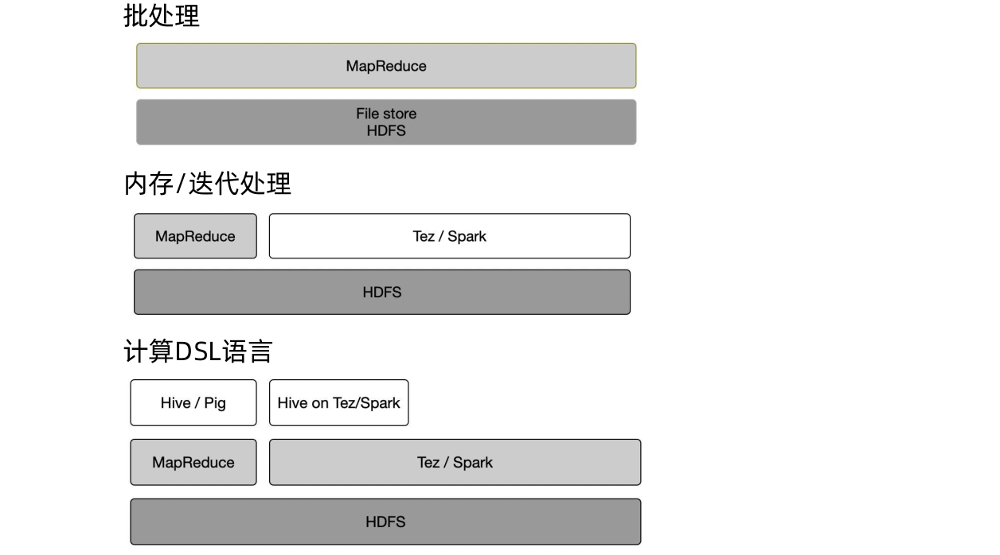
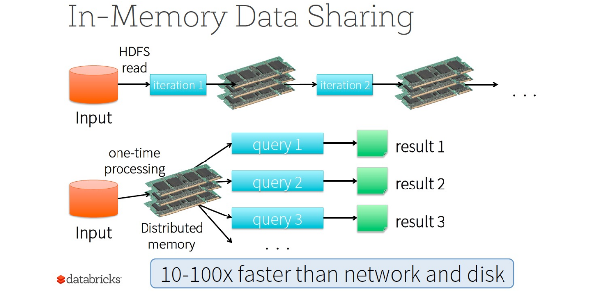

[TOC]

# 大数据处理技术基础

**何为大数据处理**
大数据处理就是从海量的原始数据中抽取出有价值的信息，即数据转换成信息的过程。

- 大数据处理数据时代理念的三大转变：
  - 要全体不要抽样
  - 要效率不要绝对精确
  - 要相关不要因果
- 大数据处理方法有很多，我们可以根据应用的实际需求对数据采取灵活的处理方式。

**影响海量数据处理的主要因素**

- 大容量数据
  - 大数据需要处理的数据大小通常达到PB(1024 TB)或EB(1024 PB)级；巨大的数据量和种类繁多的数据类型给大数据系统的存储和计算带来很大挑战。
- 多格式数据
  - 海量数据包括了越来越多不同格式的数据，数据的类型多种多样，包括结构化数据、半结构化数据和非结构化数据；不同格式的数据需要不同的处理方法。
- 速度
  - 速度是指数据从端点移动到处理器和存储的速度。

## 集中式处理阶段

**大型主机的特点**

- RAS
  - RAS（Reliability、Availability、Serviceability 高可靠性、高可用性、高服务性）是一个IBM常用来描绘它的大型机的词。大型主机一般都在系统内集成了高程度的冗余和错误检查技术，防止系统发生灾难性问题。每个处理器核心都有两个完全的执行通道来同时执行每一条指令。如果两个通道的计算结果不一致，CPU的状态就会复原，重新执行该条指令，结果还是不一致的话，一个空闲状态的CPU将会被激活替代当前的CPU。
- ISA系统指令架构
  - 作为大型主机市场的绝对霸主，IBM大型机的整体指令集（IBM System Architecture）保持了对应用程序的向后兼容。这样客户使用新的硬件就更为容易，只需换上新系统而无须做额外的软件测试工作。持续的对系统指令架构的支持对于保持大型机客户是十分重要的一环。
- I/O吞吐量
  - 除了RAS外，大型主机还被设计用来处理大容量I/O的应用。大型主机的设计中包括一些辅助电脑来管理I/O吞吐量的通道，让CPU解放出来只处理高速内存中的数据，每个I/O通道都能同时处理许多I/O操作和控制上千个设备。

**大型主机所面临的问题**

- 价格昂贵
  - 一台IBM大型机售价高达上百万美金，只有政府、金融、银行、电信等企业才有能力采购。
- 培养成本高
  - 大型机具有非常复杂的精密组件，对于运维人员掌握其细节提出了非常高的要求。
- 故障级别严重
  - 大型机并不是总是无故障的，一旦出现故障，将对其依赖的业务造成非常严重的停机，随着访问量的迅速提高，扩容也变得困难。
- 市场占有率低
  - 随着PC技术和网络技术的提升，大型机的市场份额越来越小。很多企业开始放弃大型机，改用小型机或普通PC服务器来搭建分布式计算环境。

**超级计算机（超算）**

- 什么是超级计算机？
  - 超级计算机是与通用计算机相比具有极高计算性能的计算机。其性能以每秒浮点运算（FLOPS）而不是每秒百万指令（MIPS）来衡量的。
- 什么地方用到了超级计算机？
  - 超级计算机在计算科学领域发挥着重要的作用，被用于包括量子力学、天气预报、气候研究、资源勘探、分子建模、生物工程和武器模拟等计算密集型领域。
- 超级计算机目前的发展如何？
  - 美国一直以来是超级计算机的领军者，日本同样有着不错的进展，我国在超级计算机领域最近几年也有重大进步。 中国的“天河二号”超级计算机就在2013年正式登顶世界冠军之位，并成功实现了六连冠。 然后在2016年被我国的神威·太湖之光超越，从此神威·太湖之光开启了四连冠之路。 直到2018年中旬，才被美国的“顶点”超级计算机超越，此后又被美国“山脊”超算超越，神威·太湖之光成为第三名，而“天河二号”也就成为了第四名。

**超算和大数据处理**
超级计算机能够为大数据应用提供强大的计算能力、海量的空间支持。但是，超级计算机是主要面向高性能计算应用来设计的计算系统。高性能计算与大数据处理存在多方面差异。


## 分布式处理阶段


**单机计算**
单机计算是最简单的计算形式，即利用单台计算机进行计算，此时计算机不与任何网络互联，因而只能使用本计算机系统内可被即时访问的所有资源。与单机计算模式不同，分布式计算包括在通过网络互联的多台计算机上执行的计算，每台计算机都有自己的处理器及其他资源。


**并行计算**
并行计算是相对于串行计算的概念（如下图所示），指在并行计算机上所作的计算，即采用多个处理器来执行单个命令。并行计算可分为时间上的并行和空间上的并行。

并行运算与分布式计算的区别是：
分布式计算强调的是任务的分布执行；
而并行计算强调的是任务的并发执行。

**网格计算**
网格计算指利用互联网把地理上广泛分布的各种资源（计算、存储、带宽、软件、数据、信息、知识等）连成一个逻辑整体，组成一个“虚拟的超级计算机”，为用户提供一体化信息和应用服务（计算、存储、访问等）。网格计算是由数以万计个“节点”组成的“一张网格”，是专门针对复杂科学计算的计算模式。

云计算
云计算是一种借助互联网提供按需的、面向海量数据处理和完成复杂计算的平台。云计算是网格计算、并行计算、分布式计算、网络存储、虚拟化、负载均衡等计算机技术和网络技术发展融合的商业产物。 云计算的特点是通用，超大规模、高可扩展，虚拟化、按需服务，高可用、极其廉价！

**集中式和分布式计算的比较**

- 分布式，即根据业务功能、模块设计或行政部门及机构的不同，采用相对分散的中小型服务器;
- 集中式，即将所需的主机资源集中到少数的几台大型服务器中。这两种方式，在投资成本、业务支撑及扩展能力、维护管理、方案拓展、使用灵活性、资源利用有效性等方面，存在着比较显著的差异。

## 大数据分析

**数据查询分析计算系统**


**批量数据及处理系统**


**批处理模式**
Hadoop的处理功能来自MapReduce引擎。MapReduce的处理技术符合使用键值对的map、 shuffle、reduce算法要求。


**批处理模式的优势和局限**

- 优势
  - 可以处理非常海量的数据集
  - 可以在廉价硬件上运行
  - 具备极高的缩放潜力，生产环境中曾经出现过包含数万个节点的应用
- 局限
  - 这种方法严重依赖持久存储
  - 每个任务需要多次执行读取和写入
  - 速度相对较慢
  - 学习曲线较为陡峭

**流式数据及处理系统**
流数据(或数据流)是指在时间分布和数量上无限的一系列动态数据集合体，数据的价值随着时间的流逝而降低，因此必须采用实时 计算的方式给出秒级响应 。

- 流量计算可以实时处理来自不同数据源的、连续到达的数据流。
- 目前业内已经涌现出许多的流计算框架与平台。
- 流处理系统会对随时进入系统的数据进行计算，流处理方式无需针对整个数据集执行操作，而是对通过系统传输的每个数据项执行操作。

**Apache Storm**
Storm是个免费、开源的分布式实时计算系统，Storm对于实时计算的意义类似于Hadoop对于批处理的意义，Storm可以简单、高效、可靠地处理流数据，并支持多种编程语言。

**Apache Storm概念**
Storm的流处理可对框架中名为Topology(拓扑)的DAG(有向无环图) 进行编排，Topology包括：


**Apache Samza**

- Apache Samza是一种与Apache Kafka消息系统紧密绑定的流处理框架。
- Samza可以更好地发挥Kafka独特的架构优势和保障，可通过Kafka提供容错、缓冲以及状态存储。
- Samza可使用YARN作为资源管理器。


**迭代计算系统**
针对MapReduce不支持迭代计算的缺陷，人们对Hadoop的MapReduce进行了大量改进，HaLoop、Twister、Spark等都是典型的迭代计算系统。


**内存计算系统**

- 随着内存价格的不断下降、服务器可配置内存容量的不断增长，使用内存计算完成高速的大数据处理已成为大数据处理的重要发展 方向。
- 目前常用的内存计算系统有分布式内存计算系统Spark、全内存式分布式数据库系统HANA、 Google的可扩展交互式查询系统Dremel。


**Google Dremel**
设想一个使用场景：当数据分析师有一个新的想法要验证，需要在一个上亿条数据上面跑一个查询，看看结果是不是和想法一致，最好几秒钟就能得到结果，并在一定时间内，不断调整查询语句。最后，当想法得到验证，这个查询语句将成一个长期运行的任务。Dremel系统有下面几个主要的特点：

- Dremel是一个大规模系统。在一个PB级别的数据集上面，将任务缩短到秒级，无疑需要大量的并发。
- Dremel是MR交互式查询能力不足的补充。和MapReduce一样，Dremel也需要和数据运行在一起，将计算移动到数据上面，所以它需要GFS这样的文件系统作为存储层。
- Dremel的数据模型是嵌套(nested)的，互联网数据常常是非关系型的。

**论文导读**
http://net.pku.edu.cn/vc/read/dremel.pdf

**HANA**

- HANA是SAP公司开发的，一款支持企业预置型部署和云部署模式的内存计算平台，提供高性能的数据查询功能。
- SAP内存数据库的数据并不是只在内存里，也会不停写到硬盘里。
- SAP提供一系列前所未有的新型企业应用，其中结合了大量交易与实时分析能力，能够显著优化现有的计划流程、预测流程、定价优化流程等数据密集型流程。

**图数据及处理系统**
在大数据时代，许多大数据都是以大规模图或网络的形式呈现，许多非图结构的大数据也常会被转换为图模型后再进行处理分析。

针对大型图的计算，需要采用图计算模式，目前已经出现了不少相关图计算产品。其中最具有代表性的就是Google Pregel和Spark GraphX。

**Google Pregel**
Pregel是一个可扩展、具有容错并且提供了可以灵活表示各种图算法的API的分布式系统。
Pregel计算模型以有向图作为输入：

- 有向图的每个顶点都有一个String类型的顶点ID；
- 每条有向边都和其源顶点关联，并记录了其目标顶点ID。

Pregel在概念模型上遵循BSP模型。整个计算过程由若干顺序运行的超级步（Super Step）组成，系统从一个“超级步”迈向下一个“超级步”，直到达到算法的终止条件。


**拓展*BSP模型(Bulk Synchronous Parallel）**
BSP模型是一种异步模型，其支持消息传递系统、块内异步并行、块间同步。BSP程序的设计准则是整体同步(Bulk Synchrony)，其独特之处在于超步(Super Step)概念的引入。一个BSP程序同时具有水平和垂直两个方向的结构。

- 从垂直上看，一个BSP程序由一系列串行的超步(Super Step)组成，这种结构类似于一个串行程序结构。
- 从水平上看，在一个超步中，所有的进程并行执行局部计算。一个超步可分为三个阶段。


**分布式计算的演变**




# Spark发展历程和现状

**什么是Spark**
Apache Spark™ is a unified analytics engine for large-scale data processing.

- 该项目发起于2009年UC Berkeley
- 贡献给了Apache开源基金会(Apache 2.0)
- 最新的版本是: v3.1.2 (2021/06/01)
- 80万行代码(73% Scala)
- 由来自355个组织的超过1600名贡献者
- 目前后面支持的商业公司是Databricks

**Spark 1.0 做了什么？**


**内存计算**




**丰富的API**

- 支持Java、Scala、Python、R多语言API
- 代码量减少5倍


**统一的引擎**


**多部署方式**


# RDD编程模型

**编程模型：多线程编程模型**

- 并行处理
- 数据共享
- 需要通过锁协调
- 写操作复杂


**编程模型：数据驱动型编程模型**


**编程模型：MapReduce编程模型**

- 特殊的数据驱动型
- 分为map和reduce两个阶段
- 并发只在同一个作业中发生
- 不同作业的数据访问不需要协调


**MapReduce**


**编程模型：DAG编程模型**

- 任意个操作节点
- 并行化操作定义为高阶函数
- 有向无环图


**Spark是如何做到的？**


## RDD


**RDD-分区**


**RDD-分布式**


**RDD-容错**


问题: 什么是 “RDD”?
A: 分布在磁盘上的一组对象的集合
B: 分布在内存里的一组对象的集合
C: 分布在Cassandra集群里的一组对象的集合
答案: 以上都对!

- 物理上
  - RDD是一组记录的集合。
  - 一个RDD可以分成多个分区，每个分区是不可变的，分散在集群的各个地方。
- 逻辑上
  - RDD是一个编程的数据抽象，可以对它进行各自操作。
  - RDD操作都是高阶函数，这些操作内部都是并发执行
  - 由两种类型的操作: 转换和执行。


## RDD-操作


Allow us to define partitioning/caching behavior after defining the RDD but before calculating the contents.

允许我们在定义 RDD 之后但在计算内容之前定义分区/缓存行为。


- Transformations 从一个RDD生成另一个RDD
- Actions获得一个确定的值


## RDD-依赖和容错

**依赖**


**容错**


**Flume API**

```
val textFile = sc.textFile(”hdfs://data.txt")
val topWordCount = textFile.flatMap(line => line.split(" "))
				. map(word => (word, 1))
				.reduceByKey(_+_)
				.collect()
```

## Word Count

```
scala> val textFile = sc.textFile(”hdfs://data.txt")
scala> val topWordCount = textFile.flatMap(line => line.split(" "))
			. map(word => (word, 1))
			.reduceByKey(_+_)
			.collect()
```


## MAP


**After map() has been applied...**


**Return a new RDD by applying a function to each element of this RDD.**


## FLATMAP


**After flatmap() has been applied...**


**Return a new RDD by first applying a function to all elements of this RDD, and the flattening the results**


## GroupByKey


**REDUCEBYKEY VS GROUPBYKEY**

```
val words = Array("one", "two", "two", "three", "three", "three")
val wordPairsRDD = sc.parallelize(words).map(word => (word, 1))

val wordCountsWithReduce = wordPairsRDD
		.reduceByKey(_ + _)
		.collect()

val wordCountsWithGroup = wordPairsRDD
		.groupByKey()
		.map(t => (t._1, t._2.sum))
		.collect()
```

**REDUCEBYKEY**


## COLLECT


