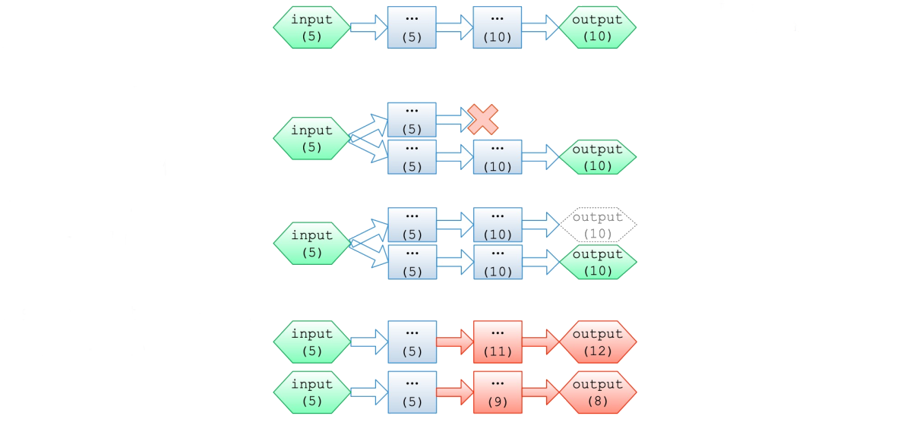

[TOC]

# Spark Core架构和原理

**用户写的程序是怎么在Spark集群上执行的？**

**Spark运行架构**


**RDD-依赖**


**Stage**


**Job/Stage/Task**


**提交流程**


# Spark任务调度

## Stage的调度
- 为了方便理解，Stage（阶段）我们也可以称为“调度阶段”。
- Stage是在DAGScheduler中进行划分的。
- DAGScheduler会从最后一个RDD出发使用广度优先遍历整个依赖树，从而划分Stage， Stage的划分是以是否为宽依赖进行的，即当某个RDD的操作是Shuffle时，以该Shuffle操作为界限划分成前后两个调度阶段。
- 分为两类Stage： ShuffleMapStage和ResultStage。
- 包含最后一个RDD的Stage为ResultStage。 然后根据getParentsStages()找出其依赖的祖先RDD，根据其是否具有Shuffle进行划分。若存在shuffle，那么Shuffle之前的Stage为ShuffleMapStage。


**ShuffleMapTask和 MapStatus**

对于ShuffleMapTask，它的计算结果会写到BlockManager之中，最终返回给DAGScheduler的是一个MapStatus。该对象管理了ShuffleMapTask的运算结果存储到BlockManager里的相关存储信息，而不是计算结果本身，这些存储信息将会成为下一阶段的任务需要获得的输入数据时的依据。


# 开发第一个Spark程序

LocalPi

```scala
package spark.training

import scala.math.random
object LocalPi {
    def main(args: Array[String]): Unit = {
        var count = 0;
        for (i <- 1 to 100000) {
            val x = random * 2 - 1
            val y = random * 2 - 1
            if (x*x + y*y <= 1) count += 1
        }
        println(s"Pi is roughly ${4 * count / 100000.0}")
    }
}
```

SparkPi

```scala
package spark.training

import org.apache.spark.sql.SparkSession

import scala.math.random

/** Computes an approximation to pi */
object SparkPi {
    def main(args: Array[String]): Unit = {
        val spark = SparkSession
        .builder
        .master("local") // remove this line if needs
        .appName("Spark Pi")
        .getOrCreate()
        val slices = if (args.length > 0) args(0).toInt else 2
        val n = math.min(100000L * slices, Int.MaxValue).toInt //avoid overflow
        val count = spark.sparkContext.parallelize(1 until n, slices).map{ i => 
        	val x = random * 2 - 1
            val y = random * 2 - 1
            if (x*x + y*y <= 1) 1 else 0
        }.reduce(_ + _)
        println(s"Pi is roughly ${4.0 * count / (n - 1)}") 
        //spark.stop()
        Thread.sleep(100000)
    }
}
```

JavaSparkPi

```scala
package spark.training;

import org.apache.spark.api.java.JavaRDD;
import org.apache.spark.api.java.JavaSparkContext;
import org.apache.spark.sql.SparkSession;

import java.util.ArrayList;
import java.util.List;

/**
 * Computes an approximation to pi
 * Usage: JavaSparkPi [partitions]
 */
public final class JavaSparkPi {
    public static void main(String[] args) throws Exception {
        SparkSession spark = SparkSession
                  .builder()
                  .master("local") //remove this line if needs
                  .appName("JavaSparkPi")
                  .getOrCreate();
        JavaSparkContext jsc = new JavaSparkContext(spark.sparkContext());
        
        int slices = (args.length == 1) ? Integer.parseInt(args[0]) : 2;
        int n = 100000 * slices;
        List<Integer> l = new ArrayList<>(n);
        for (int i = 0; i < n; i++) {
            l.add(i);
        }
        JavaRDD<Integer> dataSet = jsc.parallelize(l, slices);
        
        int count = dataSet.map(integer -> {
            double x = Math.random() * 2 - 1;
            double y = Math.random() * 2 - 1;
            return (x * x + y * y <= 1) ? 1 : 0;
        }).reduce((integer, integer2) -> integer + integer2);
        
        System.out.println("Pi is roughly " + 4.0 * count / n);
        
        spark.stop();
    }
}
```


```
spark-submit --class spark.training.SparkPi --master yarn \
--deploy-mode cluster /path/geekbang-bigdata-1.0-SNAPSHOT.jar 10
```

https://github.com/LantaoJin/geekbang-bigdata

# Spark Streaming

**Streaming Computation**


**Spark Streaming**


**分类**


**Micro Batch模式**
接收实时输入数据流并将数据分成批处理，然后由Spark引擎进行处理，以分批生成最终结果流。

称为DStream Model。


**DStream API**
高层抽象表示连续的数据流。DStream中的每个RDD都包含来自特定间隔的数据。
应用于Dstream的任何操作都转换为对基础RDD的操作。


**DStream**

```
pageViews = readStream("http://...", "1s")
ones = pageViews.map(event => (event.url, 1))
counts = ones.runningReduce((a, b) => a + b)
```


**Exactly Once**

- 实时计算有三种语义，分别是At-most-once、At-least-once以及Exactly-once。
- Exactly-Once不是指对输入的数据只处理一次，指的是：在流计算引擎中, 算子给下游的结果是Exactly-Once的(即给下游的结果有且仅有一个，且不重复、不少算)。
- 在Spark Streaming处理过程中，从一个算子(Operator)到另一个算子(Operator)，可能会因为各种不可抗力如机器挂掉等原因，导致某些Task处理失败，Spark内部会基于Lineage或Checkpoint启动重试Task去重新处理同样的数据。因不可抗力的存在，流处理引擎内部不可能做到一条数据仅被处理一次。所以，当流处理引擎声称提供Exactly-Once语义时，指的是从一个Operator到另一个Operator，同样的数据，无论重复处理多少次，最终的结果状态是Exactly-Once。

## Exactly Once

- Spark执行单元
  - 任务(即一批数据)
  - 一批数据全部成功/全部失败
- Task重做
  - 失败重做：task重做、stage重做
  - 推测执行：另一个节点同时做
  - Committer：任务唯一成功
- 其它系统
  - Storm：at-most-once、at-least-once
  - MapReduce：exactly-once



**E2E Exactly Once**
同时满足3个条件：

- 1.Source支持Replay。
- 2.流计算引擎本身处理能保证Exactly-Once。
- 3.Sink支持幂等或事务更新。

具体到Spark Streaming流处理程序，包含三个步骤：

- 1.接收数据：从Source中接收数据。
- 2.转换数据：用DStream和RDD算子转换。
- 3.储存数据：将结果保存至外部系统。

**E2E Exactly Once - 接收数据**
不同的数据源提供不同的保证。
如HDFS中的数据源，支持Exactly-Once语义；如基于Kafka Direct API从Kafka获取数据，也能保证Exactly-Once。

**E2E Exactly Once - 转换数据**
Spark Streaming内部是天然支持Exactly-once语义的。任务失败，不论重试多少次，一个算子给另一个算子的结果有且仅有一个，不重不丢。

**E2E Exactly Once - 存储数据**
Spark Streaming中的输出操作foreachRDD默认具有At-Least Once语义，因此当任务失败时会重试多次输出，这样就会重复多次写入外部存储。如果储存数据想实现Exactly-once，有两种途径： 幂等输出和事务输出。

- 幂等输出，即同样的数据输出多次，结果一样。一般需要借助外部存储中的唯一键实现。具体步骤:
  - 将kafka参数enable.auto.commit设置为false。
  - 打开Spark Streaming的Checkpoint特性，用于存放Kafka偏移量。
  - 有的时候Checkpoint无法保存时，需要手动提交Kafka偏移量offset。
- 事务输出，即数据输出和Kafka Offset提交在同一原子性事务中。具体步骤:
  - 将kafka参数enable.auto.commit设置为true。
  - 在使用事务型写入时，我们需要生成一个唯一ID，这个ID可以使用当前批次的时间、分区号、或是Kafka偏移量Offset来生成。
  - 结果存储与ID/Offset提交在同一事务中原子执行，并写入数据库。

**DStream的问题**

- 使用Processing Time而不是Event Time
- 复杂，low-level API
- 无法保证E2E语义一致
- 批流代码不统一

**Structured Streaming**


**Structured Streaming API**

- 区分Processing Time和Event Time
- 增量查询API
- 提供的connector和sink保障E2E语义
- 批流代码统一

**Unbounded Table Model**


**编程模型**


**例子**

```scala
// Create DataFrame representing the stream of input lines from connection to localhost:9999
val lines = spark.readStream
    .format("socket")
    .option("host", "localhost")
    .option("port", 9999)
    .load()

// Split the lines into words
val words = lines.as[String].flatMap(_.split(" "))

//Generate running word count 
val wordCounts = words.groupBy("value").count()
```


## Event Time

在滑动的event time窗口上的聚合对于结构化流是简单的，非常类似于分组聚合。在分组聚合中，聚合的值对分组的列保持唯一的。在基于窗口的聚合中，聚合的值对每个窗口的event time保持唯一。

```scala
import spark.implicits._

val words = ... // streaming DataFrame of schema { timestamp: Timestamp, word: String }

// Group the data by window and word and compute the count of each group
val windowedCounts = words.groupBy(
    window("eventTime", "10 minutes", "5 minutes"),
    $"word"
).count()
```

**Window with Event Time**


产生一行句子时，附加一个时间戳。我们想每5分钟统计一次10分钟内的单词数。例如，12:00 - 12:10, 12:05 - 12:15, 12:10 - 12:20等。注意到12:00 -12:10是一个窗口，表示数据12:00之后12:10之前到达。比如12:07到达的单词，这个单词应该在12:00 - 12:10和12:05 - 12:15两个窗口中都要被统计。


**延迟数据**


如果一个事件延迟到达这个应用将会发生什么？
例如，12:04产生了一个word，可能在12:11才能被应用接收到。应用应该使用12:04这个时间去更新窗口12:00-12:10中的单词计数，而不是12:11。延迟数据在12:11才被应用接受到，事实上，它在12:04已经产生。在之前的结果表中未被统计，而是统计到了最后一次的结果表中。


**Watermark**

```scala
import spark.implicits._

val words = ... // streaming DataFrame of schema {timestamp: Timestamp, word: String}

// Group the data by window and word and compute the count of each group 
val windowedCounts = words
    .withWatermark("eventTime", "10 minutes")
    .groupBy(
        window("eventTime", "10 minutes", "5 minutes"),
        $"word")
    .count()
```

**Event Time with Watermark**

**黄色圆点：**
准时到达应用的数据
**红色圆点：**
延迟到达但在水位线内的应用的数据
**红色圆圈：**
延迟到达但在水位线外应用的数据


## Structured Streaming的E2E Exactly Once

**能重放数据的Sources**


**能幂等写入的Sinks**


所以在 Structured Streaming中，支持end-to-end exactly once语义，要求：

- 1.Offset tracking in WAL
- 2.State management
- 3.Fault-tolerant sources and sinks

**Structured Streaming的问题**

- 实时性短板
- 不支持复杂算子如Join 

## Continuous Processing

连续处理（Continuous Processing）是Spark 2.3中引入的一种新的流执行模式，它支持低延迟(~1 ms)端到端，并保证at-least-once。与默认的微批（Micro Batch）处理引擎相比，减少了调度延迟，可以选择在不修改应用程序逻辑（即不更改DataFrame /Dataset操作）的情况下以哪种模式执行它们。

**Continuous Processing支持的算子**
（基于2.4版本）
在连续模式下仅支持dataset/dataframe的类似于map的操作，即支持projection（select、map、flatMap、mapPartitions等）和selection（where、filter等）。除了聚合函数（因为尚不支持聚合）、current_timestamp（）和current_date（）（使用时间的确定性计算具有挑战性）之外，支持所有SQL函数。

**执行模式对比 – Micro Batch**
Structured Streaming默认使用微批处理执行模型。 这意味着Spark流式计算引擎会定期检查流数据源，并对自上一批次结束后到达的新数据执行批量查询。 在高层次上，它看起来像这样。


为确保端到端语义，在处理下一个微批数据之前，要先将该微批数据中的偏移量保存到预写日志中。所以，前面的微批处理作业完成且偏移量被写入日志后，新到的数据才能得到处理。在细粒度上，时间线看起来像这样。


**执行模式对比 – Continuous Processing**
在连续处理模式中，Spark不再是启动周期性任务，而是启动一系列连续读取，处理和写入数据的long running的任务。


Micro Batch执行模式会导致数据到达和得到处理之间的延时超过100ms。而Continuous Processing模式由于事件在到达时会被立即处理和写入结果，所以端到端延迟只有几毫秒。


## Reference
https://databricks.com/session/a-deep-dive-into-structured-streaming
https://databricks.com/blog/2016/07/28/continuous-applications-evolving-streaming-in-apache-spark-2-0.html
https://databricks.com/blog/2016/07/28/structured-streaming-in-apache-spark.html
https://databricks.com/blog/2017/05/08/event-time-aggregation-watermarking-apache- sparks-structured-streaming.html
http://spark.apache.org/docs/latest/structured-streaming-programming-guide.html


