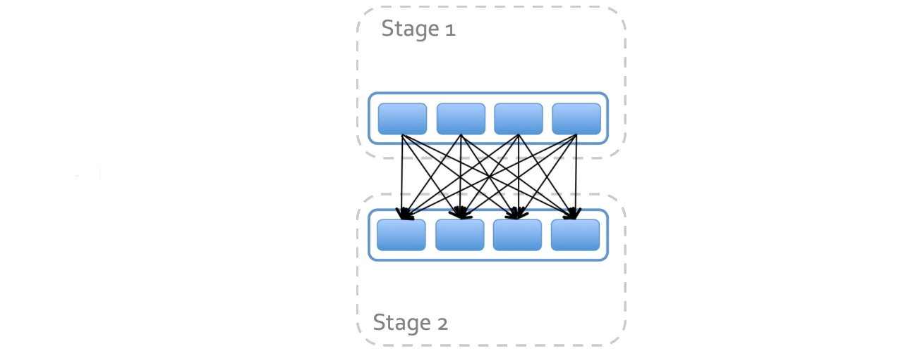
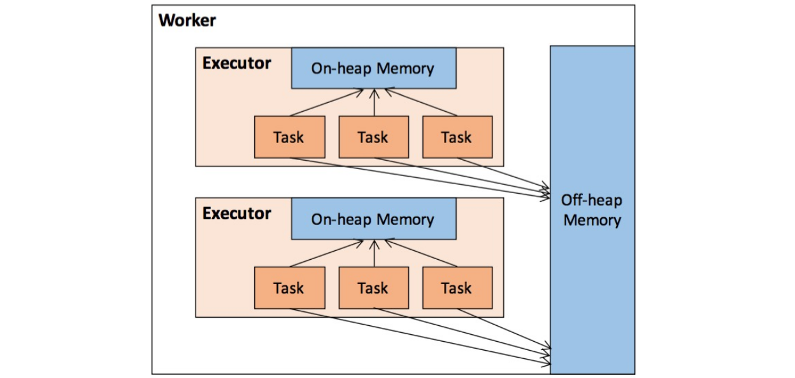

[TOC]

# Spark Shuffle

**什么是Shuffle**

- Shuffle只发生在两个Stage之间
- 在Partition内部重新排布数据



## Shuffle过程
Map的输出文件写到本地磁盘


Reducer把Map的输出文件拉到本地


Reducer对输出结果进行排序


小问题：为什么要Shuffle?


## Work Count

Scala

```scala
val textFile = sc.textFile("hdfs://...")
val counts = textFile.flatMap(line => line.split(" ")).map(word => (word, 1))
 .groupByKey().map((word, count) => (word, sum(count))
counts.saveAsTextFile("hdfs://....")
```

Python

```python
textFile = sc.textFile("hdfs://...")
counts = textFile.flatMap(lambda x: x.split(' ')).map(lambda x: (x, 1)) \
.groupByKey().map(lambda (word, count):(word, sum(count)))
counts.saveAsTextFile("hdfs://...")
```


```
textFile.flatMap(line => line.split(" ")) .map(word => (word, 1))
```

**groupByKey**


**Shuffle的实现**

**Shuffle读写**

- Shuffle分为shuffle write阶段（map side）和shuffle read阶段（reduce side）。
  - Write阶段（map side） 的任务个数是根据RDD的分区数决定的。
    - 假设从HDFS中读取数据，那么RDD分区个数由该数据集的block数决定，也就是一个split对应生成RDD的一个partition。
  - Read阶段（reduce side）的任务个数是通过配置spark.sql.shuffle.partitions决定的。
- Shuffle中间的数据交互
  - Write阶段（map side） 会将状态以及Shuffle文件的位置等信息封装到MapStatue对象中，然后发送给Driver。
  - Read阶段（reduce side）会从Driver拉取MapStatue，解析后开始执行reduce操作。
- Spark1.2前使用HashShuffle算法，1.2之后主要使用SortShuffle。

## HashShuffle


Shuffle read阶段，从各个节点上通过网络拉取到reduce任务所在的节点，然后进行key的聚合或连接等操作。 一般来说，拉取Shuffle中间结果的过程是一边拉取一边聚合的。每个shuffle read task都会有一个自己的buffer缓冲区，每次只能拉取与buffer缓冲区相同大小的数据，然后在内存中进行聚合。聚合完一批数据后，再拉取下一批数据，直到最后将所有数据到拉取完，得到最终的结果。


Shuffle write阶段，每个task根据记录的Key进行哈希取模操作（hash(key) % reduceNum），相同结果的记录会写到同一个磁盘文件中。会先将数据写入内存缓冲区，当内存缓冲填满之后，才会溢写（spill）到磁盘文件中。

**优化的HashShuffle**


将spark.shuffle.consolidateFiles设为true，shuffle write阶段并不会为每个task创建reduceNum个文件，而是一个cpu core具有一个逻辑上shuffleFileGroup，每个Group会生成reduceNum个文件，这样大量减少了shuffle中间文件个数。

## SortShuffle

SortShuffle运行机制又分成两种：

- 普通运行机制
- bypass运行机制

**磁盘小文件的个数=map Task * 2**


Task的数据会先写入一个内存数据结构中，当内存满了之后，会根据Key进行排序，然后分批溢写到本地磁盘（示例图演示为3批次）。溢写过程只会产生2个磁盘文件，一个是数据文件，一个是索引文件(其中标识了各个task的数据在文件中的start offset与end offset)。

**SortShuffle（bypass）**


BypassSortShuffle的触发条件为：

- 1.shuffle map task数量小于spark.shuffle.sort.bypassMergeThreshold(默认200)
- 2.不是聚合类的shuffle算子（比如reduceByKey）。

此时task会创建reduceNum个临时磁盘文件，并将数据按key进行hash取模，写入对应的磁盘文件。类似HashShuffle，写入磁盘文件时也是先写入内存缓冲，缓冲写满之后再溢写到磁盘文件的。最后，将所有临时磁盘文件都合并成一个磁盘文件，并创建一个单独的索引文件。
该Shuffle会生成大量中间文件，虽然最后都合并了。且不需要对数据进行排序。

**为什么尽量避免Shuffle?**

**Shuffle昂贵**

- Shuffle将数据从内存中移出
- 数据通过网络传输必须进行序列化和反序列化
- 为了减少数据的网络传输而进行压缩
- 一个数据块有多次IO读写

**Work Count改进**

Scala

```scala
val textFile = sc.textFile("hdfs://...")
val counts = textFile.flatMap(line => line.split(" ")) .map(word => (word, 1))
.reduceByKey(_ + _)
counts.saveAsTextFile("hdfs://...")
```

Python

```python
val textFile = sc.textFile("hdfs://...")
val counts = textFile.flatMap(lambda x: x.split(' ')).map(lambda x: (x, 1)) \
.reduceByKey(add)
counts.saveAsTextFile("hdfs://...")
```

**ReduceByKey**


**Shuffle优化原则**

- 减少shuffle的数据量
  - 部分聚合函数
- 避免shuffle
  - 数据预分布
  - Map Join

**避免Shuffle的场景**
表A和表B进行连接(Join): A join B on A.id = B.id

如果

- B表是比A表小的多的表
- 或者B表是比A表更新频次高很多的表


**Shuffle参数优化**


**复习**

- Shuffle是什么？
- Shuffle造成的问题是什么？
- 如何避免shuffle？
- Shuffle参数调优

# 数据倾斜及其优化

**数据倾斜的问题**

- 绝大多数task执行得都非常快，但个别task执行极慢。比如，总共有1000个task，997个task都在1分钟之内执行完了，但是剩余两三个task却要一两个小时。
- 原本能够正常执行的Spark作业，某天突然报出OOM（内存溢出）异常。反复执行几次都在某一个task报出OOM错误，此时可能出现了数据倾斜，作业无法正常运行。


**数据倾斜的原因**

- 80%的流量来自20%的任务，大多数的数据都符合二八原则
- 大多数大数据引擎默认的哈希分区算法都无法使数据分散均匀
- 某些记录存在异常，例如null
- 真正决定作业执行快慢的是最长的任务

**数据倾斜的定位**
经验法：

- 数据倾斜一般都发生在shuffle过程中。可能会触发shuffle操作的算子有：distinct、groupByKey、reduceByKey、aggregateByKey、join、cogroup、repartition等。

页面法：


## 数据倾斜的解决思路

- Map端聚合
  - groupByKey -> reduceByKey
- 聚合多个列
  - select ... from ... group by city_id，street_id，area_id
- 聚合随机值

- 增加reduce个数
  - 没有从根本上改变数据倾斜的本质
  - 但非常容易，可避免OOM


- Map Join
  - 彻底避免了shuffle
  - 只适合小表，并非所有join都能走map join


- 获取倾斜的记录进行两轮join
  - 单个或几个key倾斜


- 扩容后进行join
  - 多个key倾斜
  - 未知key倾斜
- 只对倾斜的key打上随机数


**Spark如何自动处理数据倾斜？**

- 对倾斜端切更多的task


# Spark内存管理

**Executor内存**



**Spark内存模型**


## 统一内存管理

Spark 1.6之后引入的统一内存管理机制，存储内存和执行内存共享同一块空间，可以动态占用对方的空闲区域。


**RDD的缓存和持久化**
RDD的持久化具体实现由Driver端和Executor端的Storage模块构成了主从式的架构，即Driver端的BlockManager为Master，Executor端的BlockManager为Slave。逻辑上以Block为基本存储单位，RDD的每个Partition唯一对应一个Block（BlockId的格式为rdd_rddId_partitionId）。Master负责元数据信息的管理，而Slave需要将Block的状态上报到Master，同时接收Master的命令，例如新增或删除一个RDD。


- RDD的缓存就是将RDD数据放在Storage内存中的。
- 从缓存到Storage内存之间，Partition中的数据以迭代器（iterator）来访问。
- 将Partition由不连续的存储空间转换为连续存储空间的过程，Spark称之为“展开”（Unroll）。


# Spark消息通讯机制

**Akka**
Spark RPC在2.0之前是使用Akka类库实现的，Akka用Scala语言开发，基于Actor*并发模型实现，Akka具有高可靠、高性能、可扩展等特点，使用Akka可以轻松实现分布式RPC功能。

**拓展*Scala Actor**
Actor是计算机科学领域中的一个并行计算模型，它把actors当做通用的并行计算原语：一个actor对接收到的消息做出响应，进行本地决策，可以创建更多的actor，或者发送更多的消息，同时准备接收下一条消息。

一个Actor指的是一个最基本的计算单元。它能接收一个消息并且基于其执行计算。

Actor与Actor之前只能用消息进行通信，当某一个Actor给另外一个Actor发消息，消息是有顺序的。你只需要将消息投寄到相应的邮箱，至于对方Actor怎么处理消息你并不知道，当然你也可以等待它的回复。


**Netty**
Spark2.0使用Netty*作为master与worker的通信框架。Netty是一个基于JAVA NIO类库的异步通信框架，它的架构特点是：异步非阻塞、基于事件驱动、高性能、高可靠性和高可定制性。


**实验：利用Akka和Netty开发分布式程序**

## Spark RPC

- RpcEndpoint：Spark的每个节点（Client/Master/Worker）都有一个RpcEndpoint。一个RpcEndpoint经历的过程依次是：构建->onStart→receive→onStop。其中onStart在接收任务消息前调用，receive和receiveAndReply分别用来接收另一个RpcEndpoint的send和ask过来的消息。
- RpcEndpointRef：是对远程RpcEndpoint的一个引用。当我们需要向一个具体的RpcEndpoint发送消息时，一般我们需要获取到该RpcEndpoint的引用，然后通过该应用发送消息。
- RpcAddress: 表示远程的RpcEndpointRef的地址，Host:Port。
- RpcEnv：RPC上下文环境，每个RpcEndPoint运行时依赖的上下文环境称之为RpcEnv。RpcEnv负责RpcEndpoint整个生命周期的管理。
- Dispatcher：消息分发器。


**Spark运行时消息通信**


## Reference
https://www.cnblogs.com/frankdeng/p/9301783.html
https://blog.csdn.net/s294878304/article/details/98674901
《图解Spark：核心技术与案例实战》


