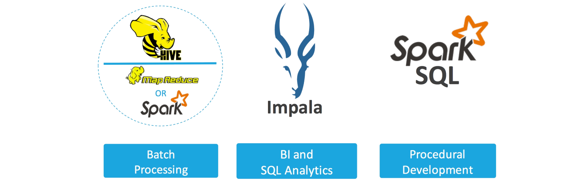
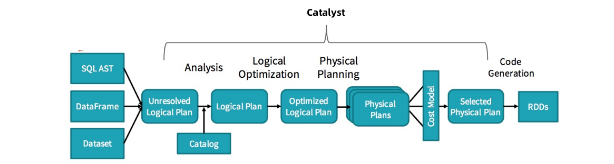
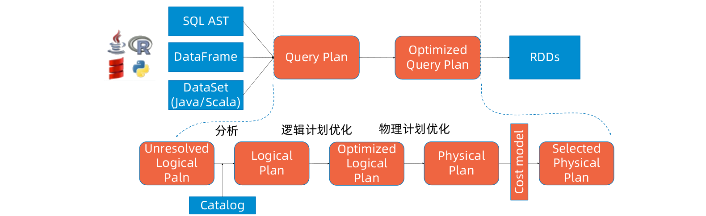
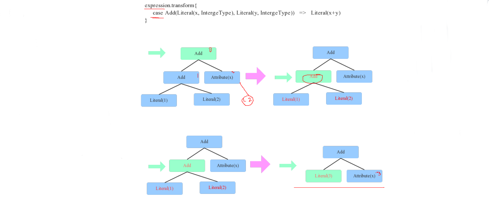

[TOC]

# Spark SQL的基本架构

**Spark 1.0的主要问题**

- 内存计算带来了大量内存管理问题
- IO的性能瓶颈开始偏向CPU性能瓶颈
- Shark对Hive的依赖太大，迫切的SQL优化需求
- Micro Batch的流式计算接口不通用

**Spark 2.0做了什么？**


**大数据查询技术演进**


**SQL on Hadoop代表**



**批处理Hive**

- 用户
  - 使用SQL的ETL开发者
- 场景
  - 并发比较困难，长时间运行的批处理作业
- 优势
  - 自定义文件格式
  - 长时间运行的ETL，数据准备类型的批处理
  - 带有大量复杂join操作的ETL

**商务智能和分析师Impala/Presto**

- 用户
  - BI用户、数据分析师
- 场景
  - 交互式查询，即席查询
- 优势
  - 多租户可扩展
  - 交互延迟低
  - 兼容性好（BI工具，标准SQL，供应商SQL）
  - 可用性强，学习成本低

**调和大师Spark SQL**

- 用户
  - 数据开发工程师，数据科学家
- 场景
  - Hive的替代品，Presto的替代品
- 优势
  - 完全胜任ETL工作，并能获得更好的性能
  - Join性能强，交互延迟可接受
  - 兼容性好（BI工具，标准SQL）
  - 可用于机器学习
  - Spark一站式平台

**Spark SQL特点**

- Spark社区非常强大
- 可以跑在YARN等多种调度器上
- 开发者可使用多种语言：Scala、Python、R&SQL
- 强大的SQL特性
- 强大的SQL优化器Catalyst
- 号称比MapReduce快100倍
- 支持HiveQL，可以利用Hive metastore
- JDBC、OBDC等

**Spark SQL架构体系**


**Spark SQL**


**Catalyst**



**SQL & Dataframe接口**


**Tungsten**


**火山模型 vs 手写代码**

**火山模型**

```scala
class Filter {
    def next(): Boolean = {
        var found = false
        while (!found && child.next()) {
            found = predicate(child.fetch())
        }
        return found
    }
    def fetch(): InternalRow = {
        child.fetch()
    }
    ...
}
```

**手写代码**

```java
long count = 0
for (ss_item_sk in store_sales) {
    if (ss_item_sk == 1000) {
        count += 1;
    }
}
```


**Codegen**


# 结构化数据和DataFrame

**Spark SQL内部流程**



**DataFrame & DataSet**


**API历史**


**Spark SQL API**


RDD + Schema (aka SchemaRDD) = DataFrame

## 为什么我们需要新的API

Using RDDs

```scala
data = sc.textFile(...).split("\t") 
data.map(lambda x: (x[0], [int(x[1]), 1]))  \
    .reduceByKey(lambda x, y: [x[0] + y[0], x[1] + y[1]]) \
    .map(lambda x: [x[0], x[1][0] / x[1][1]]) \
    .collect()
```

能写更少的代码


## DataFrame的优化
不同的DSL将可以使用相同的优化器和代码生成期


## DataSet

DataFrame的优化 + 强类型语法(编译时) = DataSet


## 实验（REPL）


**实验：生成DataFrame**
测试数据目录：spark/examples/src/main/resources/people.txt


**方式一：通过case class创建DataFrames（反射）**

```scala
//定义case class，相当于表结构
case class People(var name:String,var age:Int)
object TestDataFrame1 {
    def main(args: Array[String]): Unit = {
        val conf = new SparkConf().setAppName("RDDToDataFrame").setMaster("local")
        val sc = new SparkContext(conf)
        val context = new SQLContext(sc)
        // 将本地的数据读入 RDD， 并将 RDD 与 case class 关联
        val peopleRDD = sc.textFile("E:\\666\\people.txt")
        .map(line => People(line.split(",")(0), line.split(",")(1).trim.toInt))
        import context.implicits._
        // 将RDD 转换成 DataFrames
        val df = peopleRDD.toDF
        //将DataFrames创建成一个临时的视图
        df.createOrReplaceTempView("people")
        //使用SQL语句进行查询
        context.sql("select * from people").show()
    }
}
```

**方式二：通过structType创建DataFrames（编程接口）**

```scala
object TestDataFrame2 {
    def main(args: Array[String]): Unit = {
        val conf = new SparkConf().setAppName("TestDataFrame2").setMaster("local")
        val sc = new SparkContext(conf)
        val sqlContext = new SQLContext(sc)
        val fileRDD = sc.textFile("E:\\666\\people.txt")
        // 将 RDD 数据映射成 Row，需要 import org.apache.spark.sql.Row
        val rowRDD: RDD[Row] = fileRDD.map(line => {
            val fields = line.split(",")
            Row(fields(0), fields(1).trim.toInt)
        })
        // 创建 StructType 来定义结构
        val structType: StructType = StructType(
            //字段名，字段类型，是否可以为空
            StructField("name", StringType, true) ::
            StructField("age", IntegerType, true) :: Nil)

        /**
        * rows: java.util.List[Row],
        * schema: StructType
        * */
        val df: DataFrame = sqlContext.createDataFrame(rowRDD,structType)
        df.createOrReplaceTempView("people")
        sqlContext.sql("select * from people").show()
    }
}
```

**方式三：通过JSON文件创建DataFrames**

```scala
object TestDataFrame3 {
    def main(args: Array[String]): Unit = {
        val conf = new SparkConf().setAppName("TestDataFrame2").setMaster("local")
        val sc = new SparkContext(conf)
        val sqlContext = new SQLContext(sc)
        val df: DataFrame = sqlContext.read.json("E:\\666\\people.json")
        df.createOrReplaceTempView("people")
        sqlContext.sql("select * from people").show()
    }
}
```

**实验：相互转换**


# Spark SQL中的“树”

**回顾Hive**


这些操作细节都和Tree有关，在数据库解析（Parse）SQL语句的时候，会将SQL语句转换成一个树型结构来进行处理，如下面一个查询，会形成一个含有多个节点（TreeNode）的Tree，然后在后续的处理过程中对该Tree进行一系列的操作。


**Spark SQL Tree**

Spark SQL对SQL语句的处理和关系型数据库对SQL语句的处理采用了类似的方法，首先会将SQL语句进行解析（Parse），然后形成一个Tree，在后续的如绑定、优化等处理过程都是对Tree的操作，而操作的方法是采用Rule，通过模式匹配，对不同类型的节点采用不同的操作。


如上图所示，箭头左边表达式有3种数据类型（Literal表示字面量、Attribute表示变量、Add表示运算），表示x+(1+2)。映射到右边树状结构后，每一种数据类型就会变成一个节点。另外，Tree还有一个非常重要的特性，可以通过一定的规则进行等价变换。

**Tree Rule**
等价变换规则(Rule)：

- 两个Integer类型的常量相加可以等价转换为一个Integer常量，这个规则其实很简单，对于上文中提到的表达式x+(1+2)来说就可以转变为x+3。

树的遍历：

- 如何找到两个Integer常量呢？其实就是简单的二叉树遍历算法，每遍历到一个节点，就模式匹配当前节点为Add、左右子节点是Integer常量的树结构，然后将这个三个节点替换为一个Literal



**TreeNode体系**
TreeNode是Spark SQL中所有树节点的基类，定义了通用集合操作和树遍历接口。


**表达式（expression）**
表达式（expression）：由变量（attribute）、字面量（literal）、运算符（operator）组成的一个式子， 通常要有一个结果。

```
int b = 10; // b为变量，10为字面量，=为赋值运算符
```

Spark的表达式一般指的是不需要触发执行引擎而能够直接计算的单元，例如加减乘除四则运算、逻辑操作、转换操作、过滤操作等。

**Expression体系**
在Expression类中，主要定义了5个方面的操作，包括基本属性、核心操作、输入输出、字符串表达式和等价性判断。


**表达式属性介绍**

- Folderable：该属性用来标记表达式能否在查询执行之前直接静态计算。
- Deterministic：该属性用来标记表达式是否为确定性的，即每次执行eval函数的输出是否相同。该属性对于是否能进行谓词下推非常必要。
- Nullable：该属性用来标记表达式是否可能输出Null值，一般用在codeGen的判空。
- References：返回值为AttributeSet类型，表示该Expression涉及的属性值。
- Canonicalized：返回经过规范化处理后的表达式。
- semanticEquals：判断两个表达式在语义上是否等价。基本就是两个表达式都是且其canonicalized后相同。

**Spark中的部分表达式**

- LeafExpression
  叶子节点类型的表达式，不包含任何子节点，如Star、CurrentData、Pi
- UnaryExpression
  一元类型表达式，输入涉及一个子节点，如Abs
- BinaryExpression
  二元类型表达式，如加减乘除、RLike
- TernaryExpression
  三元类型表达式


**Expression解析规则**

- 1.ReuseSubquery
- 2.ImplicitTypeCasts
- 3.UpdateOuterReferences

**Expression优化规则**
org/apache/spark/sql/catalyst/optimizer/expressions.scala下：

1. ConstantFolding
2. ConstantPropagation
3. OptimizeIn
4. BooleanSimplification
5. SimplifyBinaryComparison
6. SimplifyConditionals
7. FordablePropagation
8. SimplifyCasts

**InternalRow体系**
InternalRow是用来表示一行数据的类，根据下标来访问和操作元素，其中每一列都是Spark Catalyst内部定义的数据类型，最终由物理算子树产生的RDD为RDD[InternalRow]。


**内部数据类型**


# SQL编译器和ANTLR

**为什么要使用DSL**
DSL是领域专用语言，常见的DSL有SQL、CSS、Shell等等，这些DSL语言有别于其他通用语言如C++、Java、C#等，DSL常在特殊的场景或领域中使用。

领域专用语言通常是被领域专家使用，领域专家一般不熟悉通用编程语言，但是他们一般对业务非常了解。


**ANTLR**

- ANTLR（Another Tool for Language Recognition）是可以根据输入自动生成语法树并可视化的显示出来的开源语法分析器。
- ANTLR主要包含词法分析器，语法分析器和树分析器。
- 词法分析器又称Scanner、Lexer或Tokenizer。词法分析器的工作是分析量化那些本来毫无意义的字符流，将他们翻译成离散的字符组（也就是一个一个的Token），包括关键字、标识符、符号（symbols）和操作符供语法分析器使用。
- 语法分析器又称编译器。在分析字符流的时候，Lexer不关心所生成的单个Token的语法意义及其与上下文之间的关系。语法分析器则将收到的Token组织起来，并转换成为目标语言语法定义所允许的序列。
- 树分析器可以用于对语法分析生成的抽象语法树进行遍历，并能执行一些相关的操作。

**Spark Parser**
Spark Parser简单来说是利用ANTLR4将SQL字符串切分成一个一个的Token，再根据一定语义规则将其解析为一棵语法树AST。

下图是一个示例性的SQL语句（有两张表，其中people表主要存储用户基本信息，score表存储用户的各种成绩），通过Parser解析后的AST语法树。

1. 词法分析生成Token流
2. 语法分析生成语法树


**sql text经过SqlParser解析成Unresolved LogicalPlan**


## Unresolved Logical Plan
生成语法树之后，使用AstBuilder将语法树转换成LogicalPlan，这个LogicalPlan也被称为Unresolved LogicalPlan。解析后的逻辑计划如下：


**SqlBase.g4**


**SparkSqlParser**


