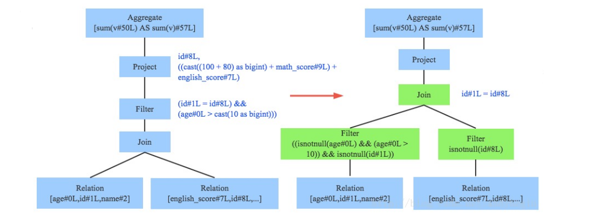
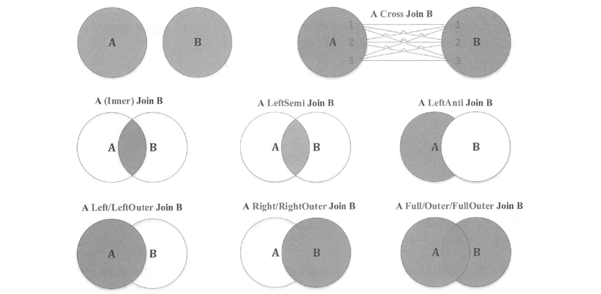
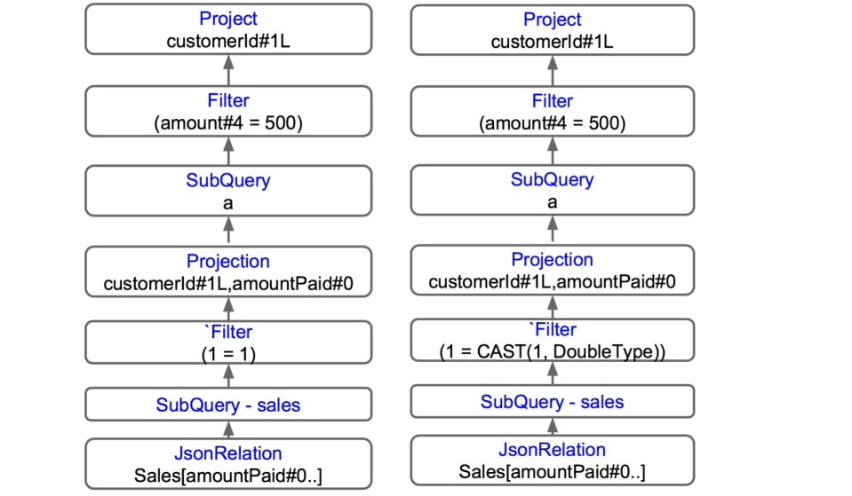

[TOC]

# Catalog和HiveCatalog

**数据绑定**

- Unresolved LogicalPlan仅仅是一种数据结构，不包含任何数据信息，比如不知道数据源、数据类型、不同的列来自于哪张表等。接下来我们需要对其进行“数据绑定”。
- 数据绑定需要用到Catalog。
- Catalog是一种数据库用语。 在英文原意中为编目的意思，但是在数据库中完全可以不用翻译。

**Catalog**

- Catalog主要用于各种函数资源信息和元数据信息（数据库、数据表、数据视图、数据分区与函数等）的统一管理。
- Spark的Catalog管理类叫SessionCatalog，此类管理着临时表、view、函数及外部依赖元数据（如hive metastore），是Analyzer进行绑定的桥梁。


**HiveExternalCatalog**
SessionCatalog实际上只是接口，具体的Catalog实现为ExternalCatalog，目前有两种实现，一个是InMemoryCatalog，一个是HiveExternalCatalog。前者用于测试，而生产环境一般用的是后者： HiveExternalCatalog是实际存储与操作数据的类。


## Analyzer

1.sql text经过SqlParser解析成Unresolved LogicalPlan

2.Analyzer模块结合Catalog进行绑定，生成Resolved LogicalPlan


**那么Analyzer是如何结合Catalog的呢？**

- Analyzer会使用事先定义好的Rule以及SessionCatalog对Unresolved LogicalPlan进行transform操作。
- Rule是定义在Analyzer里面的。
- 多个性质类似的Rule组成一个Batch，多个Batch构成一个Batches。
- Batches由RuleExecutor执行，执行顺序如下图：


**Rule举例**
Rule的种类有非常多，之前所说的和SessionCatalog结合一起对数据库、表、列的解析就是其中的几种Rule（ResolveRelations，ResolveReference等）。


## Resolved Logical Plan
Analyzer通过遍历整个语法树，对树上的每个节点进行数据类型绑定以及函数绑定，比如people词素会根据元数据表信息解析为包含age、id以及name三列的表，people.age会被解析为数据类型为int的变量，sum会被解析为特定的聚合函数，如下图所示：


# 逻辑计划树和优化器

**逻辑计划生命周期**
三个阶段：

- 1.由SparkSqlParser中的AstBuilder将语法树的各个节点转换为对应逻辑计划节点，组成Unresolved的逻辑算子树，不包含数据信息与列信息。
- 2.Analyzer结合Catalog将一系列规则作用在Unresolved的逻辑算子树上，生成Analyzed的逻辑算子树。
- 3.Optimizer将一系列优化规则应用在逻辑算子树中，确保结果正确的前提下改进低效结构，生成优化后的逻辑算子树。

**逻辑计划树的分类**

- LeafNode
  - RunnableCommand
- UnaryNode
  - RedistributeData
  - basicLogicalOperators
- BinaryNode
  - Join
  - CoGroup


## Optimizer

- 优化器是整个Catalyst的核心，优化器分为基于规则优化和基于代价优化两种。
- 基于规则的优化策略实际上就是对语法树进行一次遍历，对模式匹配能够满足特定规则的节点进行相应的等价转换。因此，基于规则优化说到底就是一棵树等价地转换为另一棵树。
- SQL中经典的优化规则有很多，下文结合示例介绍三种比较常见的规则：谓词下推（将过滤尽可能地下沉到数据源端）、常量累加（比如1 + 2事先计算好）和列剪枝（减少读取不必要的列）。

- 1.Sql text经过SqlParser解析成Unresolved LogicalPlan
- 2.Analyzer模块结合Catalog进行绑定，生成Resolved LogicalPlan
- 3.Optimizer 模块对Resolved LogicalPlan进行优化，生成Optimized LogicalPlan


**谓词下推（Predicate Pushdown）**
谓词下推是由PushDownPredicate规则实现，这个过程主要将过滤条件尽可能地下推到底层，最好是数据源。

例如， 语法树中两个表先做join，之后再使用age>10对结果进行过滤。**join算子通常是一个非常耗时的算子，耗时多少一般取决于参与join的两个表的大小**，如果能够减少参与join两表的大小，就可以大大降低join算子所需时间。

谓词下推能将过滤条件下推到join之前进行，如图中过滤条件age>0以及id!=null两个条件就分别下推到了join之前。这样，系统在扫描数据的时候就对数据进行了过滤，参与join的数据量将会得到显著的减少，join耗时必然也会降低。



**常量累加（Constant Folding）**
常量累加其实很简单，就是上文中提到的规则 x+(1+2) -> x+3示例如果没有进行优化的话，每一条结果都需要执行一次100+80的操作，然后再与变量math_score以及english_score相加，而优化后就不需要再执行100+80操作。


**列剪枝（Column Pruning）**
列值裁剪是另一个经典的规则，示例中对于people表来说，并不需要扫描它的所有列值，而只需要id列，所以在扫描people之后需要将其他列进行裁剪，只留下列id。这个优化一方面大幅度减少了网络、内存数据量消耗，另一方面对于列存格式（Parquet）来说大大提高了扫描效率。


**Rule举例**


# 物理计划树和策略器

**物理计划树**

- 经过Optimizer优化后的逻辑计划并不知道如何执行，例如算子节点Relation（实际上是LogicalRelation）虽然代表本次查询会从一张确定的表中获取数据，如marketing.buyers，但是这张表是什么类型的表（Hive还是HBase），如何获取（JDBC还是读HDFS文件），数据分布是什么样的（Bucketed还是HashDistributed）此时并不清楚。
- 需要将逻辑计划树转换成物理计划树，以获取真实的物理属性。例如，Relation算子变为FileSourceScanExec，Join算子变为SortMergeJoinExec。
- 一般的，物理算子以Exec结尾。

**SparkPlan=PhysicalPlan**

- SparkPlan实际上就是我们所说的物理计划，它是所有物理计划抽象类。
- 有了SparkPlan Tree，才能将其转换成RDD的DAG。
- SparkPlan也有四类：
  - LeafExecNode 叶子节点 主要和数据源相关，用户创建RDD
  - UnaryExecNode 一元节点 主要是针对RDD的转换操作
  - BinaryExecNode 二元节点 join操作就属于这类
  - 其他类型的节点
- 在物理算子树中， LeafExecNode是创建一个RDD开始，遍历Tree过程中每个非叶子节点做一次Transformation，通过execute函数转换成新的RDD，最终会执行Action算子把结果返回给用户。

**SparkPlanner**

- Sql text经过SqlParser解析成Unresolved LogicalPlan
- Analyzer模块结合Catalog进行绑定，生成Resolved LogicalPlan
- Optimizer 模块对 resolved LogicalPlan进行优化,生成Optimized LogicalPlan
- SparkPlanner将LogicalPlan转换成PhysicalPlan（SparkPlan）


**Strategies**

- SparkPlanner也是类似Analyzer和Optimizer，使用类似基于规则（Rules和Batches）的方式对逻辑计划树进行转换，这里的规则称为策略（Strategy）。
- SparkPlanner通过在Optimizer LogicalPlan树上应用策略（Strategy），从而生成SparkPlan列表，即Iterator[PhysicalPlan]。
- SparkPlanner中定义了一组Strategy，称为Strategies，类似生成逻辑执行计划中的Batches。


**JoinSelection**



**build table的选择**

- Spark SQL主要有三种实现join的策略，分别是broadcast hash join、shuffle hashjoin、sort merge join。对应物理算子就是BroadcastHashJoinExec、ShuffledHashJoinExec、SortMergeJoinExec。
- join的两边分别是流式表(streamed side)和构建表(build side)。
- 构建表被作为查找表数据结构，流式表作为顺序遍历的数据结构。通常通过一条条迭代流式表中数据，并在构建表中查找与当前流式表数据join键值相同的数据来实现两表的join。
- JoinSelection的第一步就是build side的选择。
  - Hash join将两表之中较小的那一个构建哈希表，这个小表就是build table。大表叫做probe table。
  - 当join类型为inner-like（包含inner join与cross join两种）或right outer join时，左表才有可能作为build table。而在join类型为inner-like或者left outer/semi/anti join时，右表有可能作为build table。

**join策略的选择**
策略的选择会按照效率从高到低的优先级来排：

- 1.broadcast hash join
  a.先根据broadcast hint来判断
  b. 其次是广播阈值

- 2.hash join

  a.spark.sql.join.preferSortMergeJoin配置项为false

  b.右表能够作为build table，构建本地HashMap（先右后左）

  c.右表的数据量比左表小很多（3倍）

- 3.sort merge join

  a.如果上面两种策略都不符合，并且参与join的key是可以排序的

**broadcast hash join**


**shuffled hash join**


**sort merge join**


**join策略的选择（续）**
前面提到的策略选择都是在等值连接时，即join条件一般为A.id = B.id，如果是非等值连接，如join条件为A.id > B.id，则只能使用nest loop join（ 即二重循环扫描+比对）或者计算两表的笛卡尔积：

- 1.broadcast nest Join
  a. 广播阈值

- 2.cartesian join

  a.join类型是inner join或者cross join
  b. 广播阈值

- 3.broadcast nest join
  a.如果上面两种策略都不符合，则将较小的表broadcast

**prepareForExecution**


**prepareForExecution()**

1. SQL text经过SqlParser解析成Unresolved LogicalPlan
2. Analyzer模块结合Catalog进行绑定，生成Resolved LogicalPlan
3. Optimizer 模块对 resolved LogicalPlan进行优化,生成Optimized LogicalPlan
4. SparkPlanner将LogicalPlan转换成PhysicalPlan（SparkPlan）
5. prepareForExecution()将PhysicalPlan转换成可执行物理计划

prepareForExecution

- 经过SparkPlanner和Strategies，相当于生成了物理计划数组，之后获取第一条便是计算需要的物理计划树了，但是在真正提交之前，还有一步prepareForExecution。
- prepareForExecution的主要的目的是为了优化物理计划，使之满足shuffl数据分布，数据排序和内部行格式等。


**preparations**


**EnsureRequirements**

- 1.添加ExChange节点，遍历子节点，会依次判断子节点的分区方式(partitioning)是否满足所需的数据分布(distribution)，如果不满足，则考虑是否能以广播的形式来满足，如果不行的话就添加ShuffleExChangeExec节点，之后会查看所要求的子节点输出（requiredChildDistributions），是否有特殊需求，并且要求有相同的分区数，针对这类对子节点有特殊需求的情况，则会查看每个子节点的输出分区数目，如果匹配不做改变，不然会添加ShuffleExchangeExec节点。
- 2.查看requiredChildOrderings针对排序有特殊需求的添加SortExec节点

## Execution
Spark Plan的Execution方式均为调用其execute()方法生成RDD。


**Execute()**

1. Sql text经过SqlParser解析成Unresolved LogicalPlan
2. Analyzer模块结合Catalog进行绑定，生成Resolved LogicalPlan
3. Optimizer 模块对 resolved LogicalPlan进行优化,生成Optimized LogicalPlan
4. SparkPlanner将LogicalPlan转换成PhysicalPlan（SparkPlan）
5. prepareForExecution()将PhysicalPlan转换成可执行物理计划
6. 使用execute()执行可执行物理计划


# 一个例子

**Code example:**
StepsInQueryPlanning.scala

```sql
select a.customerId
from
(select customerId , amountPaid as amount from sales
where 1 = '1’
) a
where amount=500.0
```


**Parsed Plan**


**ResolvedRelation Rules**

- 这条规则用于解析plan中所有的relations (tables)
- 当发现一个unresolved relation时，就会通过访问Catalog来解析该relation
- 如果发现表不存在，就会抛出table not exists异常。

**Resolved Relation Logical Plan**


**ResolvedReference Rules**

- 这条规则用于解析plan中当references (columns)
- 所有别名(aliases)和列名(column)都有一个唯一的编号，用于解析器定位和识别
- 这个唯一的编号可以用在删除子查询等优化中，以达到更好的优化效果

**Resolved Reference Logical Plan**


**Promote String Rules**

- 这条规则允许分析器将字符串转换成合适的数据类型
- 在本查询中，Filter( 1=’1’) 是用double类型和string类型进行比较
- 这条规则会添加一个cast，将string转换成double，以获得更好的比较语义

**Promote String Logical Plan**



**Eliminate Subqueries Rules**

- 该规则允许分析器消除多余的子查询
- 正是由于每个引用都有一个唯一ID，我们才能做到这一点
- 删除子查询允许我们在后续步骤中进行更深入的优化

**Eliminate Subqueries optimized Logical Plan**


**Constant Folding Rules**

- 简化那些可以变成常量的表达式
- 在本例中，Filter(1=1) 总是返回true
- 所有常量折叠规则将其替换成true

**Constant Folding optimized Logical Plan**


**Simplify Filters Rules**

- 该规则用于简化过滤器Filter算子：
  - 移除始终为true的过滤器
  - 如果过滤器为false，可以删除整个子树
- 在本例中, 始终为true的过滤器算子被删除
- 通过简化过滤器规则，我们可以避免数据的多次无效迭代

**Simplify Filters optimized Logical Plan**


**PushPredicateThrough Rules**

- 为了更好地进行优化，将过滤器尽量靠近数据源总是好的
- 该规则将过滤器下推到靠近JsonRelation的地方
- 此外，当我们重新排列树节点时，我们需要确保重写的规则与列名匹配
- 在我们的示例中，过滤器规则被重写为使用别名amountPaid而不是amount

**PushPredicateThrough optimized Logical Plan**


**Project Collapsing Rules**

- 该规则用于删除不必要的projects（投影）
- 在本例中，我们不需要第二个投影，即(customerId, amountPaid)，因为我们只需要投影customerId
- 所有应用该规则消去了第二个投影
- 完成本优化后，我们得到了最优的计划

**PushPredicateThrough optimized Logical Plan**


**Generating Physical Rules**

- 最总Catalyst将logical plan转成physical plan（也叫Spark plan）
- 在queryExecutor中，有一个惰性的变量executedPlan，它用于生成物理计划
- 在物理计划上，我们可以调用executeCollect或executeTake来evaluating计划，生成RDD


