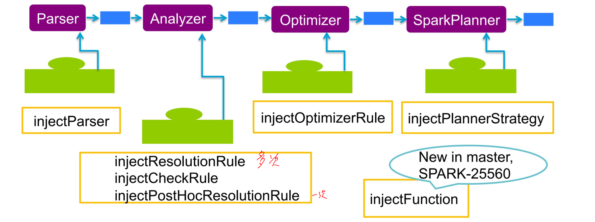
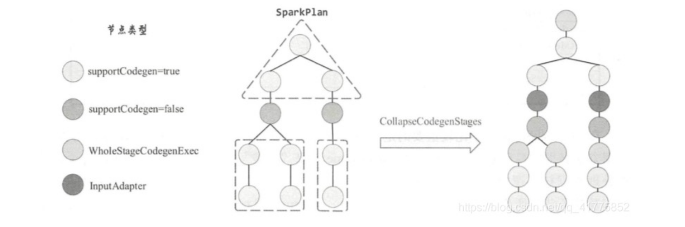
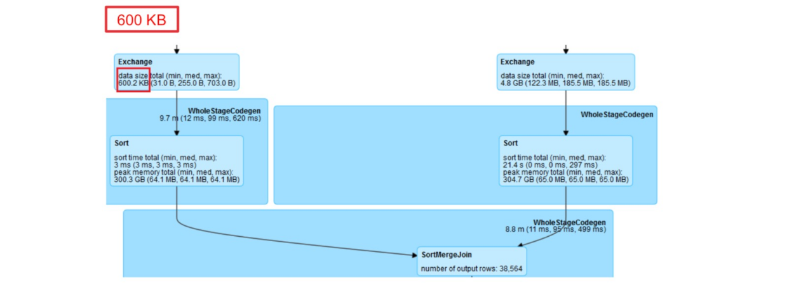
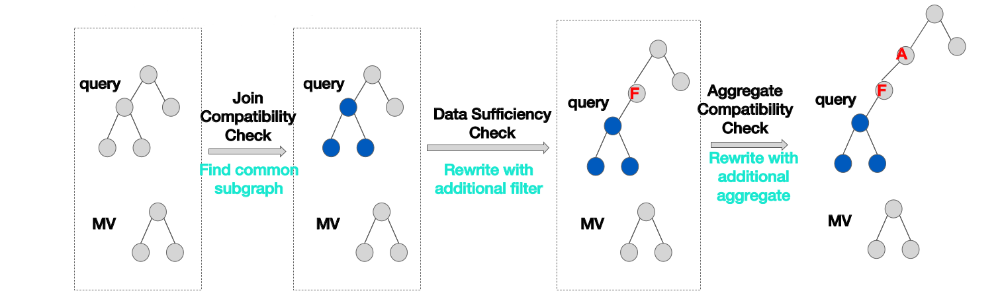

[TOC]

# 自定义Catalyst规则

**Catalyst规则 Catalyst规则分类：**

- 分析规则
  一般在 org.apache.spark.sql.catalyst.analysis
  继承 Rule[LogicalPlan]
- 优化规则
  一般在 org.apache.spark.sql.catalyst.optimizer
  继承 Rule[LogicalPlan]
- 策略规则
  一般在 org.apache.spark.sql.execution
  继承 Rule[SparkPlan]

**定制化规则**
增加和修改Catalyst规则需要修改源码，但有时候我们需要定制化一些临时或者和业务有关的规则。


scala继承 (SparkSessionExtensions => Unit)
java继承 Function1[SparkSessionExtensions, Unit]
参数指定 spark.sql.extensions

**规则注入**



**例子：delta-lake**


## 练习：实现自定义优化规则

第一步 实现自定义规则：

```scala
case class MyPushDown(spark: SparkSession) extends Rule[LogicalPlan] {
    def apply(plan: LogicalPlan): LogicalPlan = plan transform { …. }
}
```

第二步 创建自己的Extension并注入

```scala
class MySparkSessionExtension extends (SparkSessionExtensions => Unit) {
    override def apply(extensions: SparkSessionExtensions): Unit = {
        extensions.injectOptimizerRule { session =>
            new MyPushDown(session)
        }
    }
}
```


第三步 通过spark.sql.extensions提交

```
bin/spark-sql --jars my.jar --conf spark.sql.extensions=com.jikeshijian.MySparkSessionExtension
```

# 代码生成技术

## Tungsten项目
- 致力于提升Spark程序对内存和CPU的利用率，使性能达到硬件的极限，主要工作包含以下三个方面：

1. 内存管理和二进制数据编码：off-heap管理内存，降低对象的开销和消除JVM GC带来的延时。
2. 向量化，缓存感知计算：优化存储，提升CPU L1/ L2/L3缓存命中率。
3. 代码生成计算：优化Spark SQL的代码生成部分，提升CPU利用率。

**Tungsten内存管理和数据编码**
在相当多的场景中IO经常作为大数据开发的瓶颈，我们批处理,基于列存储,分区甚至是倒排索引,这一切的努力都是在解决磁盘的IO瓶颈。但是如果数据完全放入了内存之后,我们面临的新问题是什么呢?CPU不够用。

对于大数据的场景，其实我们没有把CPU的资源用在刀刃上，面对海量数据，**CPU第一件事情就是序列化与反序列化和压缩与解压数据**。在Spark这样的分布式计算模型下，需要大量的数据shuffle，必然需要将Java对象在不同的进程和机器间挪动。

CPU的**第二件事情就是创建对象**，在海量数据情况下，CPU需要把海量对象写回到内存中。

CPU的**第三件事情就是Java垃圾回收**了。

**Tungsten数据编码**


**Tungsten序列化性能**


**Tungsten计划**

单行所用时间 (纳秒, 单线程)


**Tungsten代码生成**

- 代码生成其实是数据库领域的通用技术之一。
- 代码生成往往用在代码不好写或者改写复杂的系统中。
- 动态代码生成方式有很多，例如JavaCompiler和Janino等等。

**为什么需要代码生成**

- 在Apache Spark 2.0之前，Spark SQL的底层实现是基于Volcano Iterator Model。
- 当今绝大多数数据库系统处理SQL在底层都是基于这个模型的。
- 这个模型的执行可以概括为：
  - 首先数据库引擎会将SQL翻译成一系列的关系代数算子或表达式；
  - 然后依赖这些关系代数算子逐条处理输入数据并产生结果。
  - 每个算子在底层都实现同样的接口，比如都实现了 next() 方法，然后最顶层的算子 next() 调用子
  - 算子的 next()，子算子的 next() 在调用孙算子的 next()，直到最底层的 next()。


**preparations**


**Volcano Iterator Model**

http://paperhub.s3.amazonaws.com/dace52a42c07f7f8348b08dc2b186061.pdf


**火山模型的优缺点**

- 优点是抽象起来很简单，很容易实现。
- 缺点是存在大量的虚函数调用，会引起CPU的中断，最终影响了执行效率


**火山模型 vs 手写代码**

- 火山模型

```scala
class Filter {
    def next(): Boolean = {
        var found = false
        while (!found && child.next()) {
            found = predicate(child.fetch())
        }
        return found
    }
    def fetch(): InternalRow = {
        child.fetch()
    }
    ...
}
```

- 手写代码

```scala
long count = 0;
for (ss_item_sk in store_sales) {
    if (ss_item_sk == 1000) {
        count += 1;
    }
}
```


## Codegen


- 通过引入全阶段代码生成，大大减少了虚函数的调用，减少了CPU的调用，使得SQL的执行速度有很大提升。
- Spark使用Janino*将生成的代码进行编译然后加载到同一个JVM中去。
- 相比Volcano Iterator Model，全阶段代码生成的执行过程如下。


**拓展*Janino**
Janino是一个超级小但又超级快的Java编译器。它不仅能像javac工具那样将一组源文件编译成字节码文件，还可以对一些Java表达式、代码块、类中的文本(class body)或者内存中源文件进行编译，并把编译后的字节码直接加载到同一个JVM中运行。
Janino不是一个开发工具，而是作为运行时的嵌入式编译器。

**Janino编译器实践**


**核心接口和类**

- CodegenContext：
  代码生成的管理类
- CodegenSupport：
  继承该接口的算子必须实现produce()和consume()
- WholeStageCodegenExec：
  CodegenSupport的实现类之一，将同一个Stage所有继承CodegenSupport的算子进行合并，合并的逻辑封装到一个Wrapper类中，将其作为Janino编译时的输入参数。
- InputAdapter：
  胶水类，连接WholeStageCodegenExec和未实现CodegenSupport的算子。
- BufferedRowIterator：
  WholeStageCodegenExec生成的代码的父类，主要的成员函数为InternalRow next()和append(InternalRow row)

**算子的生产消费模型**
相邻的算子通过Produce-Consume模型进行代码生成。
Produce代码框架如下：

```java
if (!initialized) {
    // call child.produce()
    initialized = true;
}
while (hashmap.hasNext()) {
    row = hashmap.next();
    // call consume(), which will call parent.doConsume()
    if (shouldStop()) return;
}
```

Consume生成当前算子处理上游输入的Row的代码。
如Filter算子，生成的代码如下：

```java
if (!isNull1 && value2) {
    // call consume(), which will call parent.doConsume()
}
```

**consume/doConsume 和 produce/doProduce**
consume 和doConsume 用来“消费”，返回的是算子处理数据核心逻辑所对应生成的代码。
consume 方法会调用其父节点的 doConsume 方法。
produce/doProduce 则用来“生产”，返回的是该算子及其子节点所生成的代码。
produce 方法会调用 doProduce 方法。

**全阶段代码生成**
对于物理算子树中的不支持代码生成的节点时，CollapseCodegenStages规则会在其上插入一个名为InputAdapter的物理节点对其进行封装。



**WholeStageCodegenExec**

- WholeStageCodegenExec是物理计划节点，所以其主要逻辑在execute()方法中。其execute方法具体分为数据获取与代码生成两部分。假设物理算子节点A支持代码生成，物理算子节点B不支持代码生成，因此B会采用InputAdapter封装。
- 数据的获取比较直接，调用inputRDDs递归得到整段代码的输入数据。
- 代码生成可以看作是两个方向相反的递归过程：代码的整体框架由produce/doProduce方法负责，父节点调用子节点；代码具体处理逻辑由consume/doConsume方法负责，由子节点调用父节点。


**全阶段代码生成步骤**


**练习：查看SQL生成的代码**

```
> explain codegen select a.customerId
from
(select customerId , amountPaid as amount from sales where 1 = '1'
) a
where amount=500.0;
```

# 向量化技术

**SIMD**
SIMD全称Single Instruction Multiple Data，单指令多数据流，即一条指令处理多条数据，是对CPU基本指令集对扩展。


**Spark的向量读**
See VectorizedParquetRecordReader


# SparkThriftserver

HiveServer2
HiveServer2通过ThriftCLIService监听服务器端口。
将请求转发给CLIService进行处理。最终请求传给OperationManager，OperationManager根据请求的类型创建一个具体的Operation进行处理。


**SparkThriftServer2**
Spark Thrift Server最主要的区别是实现了自己的SQL Operation——SparkExecuteStatementOperation。其他例如创建表，删除表等请求处理完全复用HiveServer2的代码。

其外，对于Session的管理，实现了自己的SparkSQLSessionManager和SparkSQLOperationManager。


**Spark Thriftserver流程**


**Spark Thriftserver的项目实践**

- 使用Spark Thriftserver作为OLAP的服务
  - 用于即席查询
  - 多租户管理
  - doAs
  - Driver并行度优化
  - MemoryLeak修复
- 使用Spark Thriftserver作为DDL only服务
  - 用于ETL

# Spark的AQE和DPP加速

**Adaptive Query Execution**

- AQE的动机
  - 传统数据库和早期Spark：先构建“执行计划”再“执行”
  - 存在的问题：即便使用CBO技术，因为UDF、压缩率等因素的存在，Spark无法找出最佳的执行计划

- AQE的方案
  - 在“执行”的过程中不断构建新的“执行计划”


## 缺少AQE时的挑战

- 如何设置Shuffle分区数（reducer个数）
- 1.P为设置的分区数：spark.sql.shuffle.partition（默认200）C为应用的并发总数：spark.executor.instances * spark.executor.cores一个Stage需要跑（P/C）轮才能跑完所有任务
- 2.如果Partition数设置的太小：造成并发度低，任务跑的慢，OOM
- 3.如果Partition数设置的太大：造成调度压力大，大量小文件，随机IO
- 4.同一个应用中Shuffle的数据量往往会逐渐减少，但Partition数在整个应用执行过程中不能改变


- 如何选择Join算子类型
  - SELECT xxx FROM A JOIN B ON A.key1 = B.key2;


- 默认的Broadcast阈值是10MB
- 对于复杂的查询，join会使用中间结果作为输入，此时Spark SQL无法获得准确的数据量，从而进行错误的估算。能进行BCJ的也被错误的执行成SMJ。



- 数据倾斜的自动处理
  - 数据倾斜是Spark SQL性能杀手


- 几种简单的处理办法
  - 增加Partition个数
  - 增加BCJ阈值
  - 找出倾斜的key并“加盐”


## AQE架构


**AQE自动设置Reducer数**


**AQE SMJ->BCJ**


- 转成BCJ的收益：
  - Shuffle读：远程读，随机IO
  - Broadcast读：本地读，连续IO
  - SMJ容易造成数据倾斜


**Skew join optimization**

- Partition 0中使用N个task代替1个task
- Join的结果再合并起来（A0-0 Join B0，A0-1 Join B0，…A0-N Join B0）


## Dynamic Partition Pruning

时至今日，如何让查询再有100倍的提升？


**Static Partition Pruning**

```sql
SELECT * FROM Sales WHERE day_of_week = ’Mon’;
```


```sql
SELECT * FROM Sales Join Date WHERE Date.day_of_week = ’Mon’;
```

**Dynamic Partition Pruning**


```sql
SELECT * FROM Sales Join Date WHERE Date.day_of_week = ’Mon’;
```


通过维度条件在5年的数据中只使用1个月的数据进行join

非常适用于星型模型的查询


# Spark SQL优化技术

## TeraData

目标

- 易于使用
- 查询性能
  - 匹配当前TD查询性能，总体性能无明显下降
- 易于调优，自适应优化
  - 能对错误的SQL和有问题的SQL进行优化
- 语法兼容
  - 语法层面减少迁移成本
  - 支持增删改查操作
- 数据安全
  - 数据分级加密
  - 用户细粒度权限管理
- 资源和流量管理

**架构图**


**易于使用**

- 符合用户使用习惯
- 支持目前各类BI工具
- 提供JDBC/ODBC标准接口
  - 开源的JDBC和开发的多操作系统ODBC
- 记录用户的查询历史
  - QueryLog
- 提供全新的作业历史服务器
  - ViewPoint
  - Seesion粒度

**Zeta: 分析查询工具**

- 数据工程师用来开发新的数据管道
- 数据分析师用来探索大型数据集和即席查询
- 数据科学家从事机器学习的特征工程部分


## 查询优化

- Spark Driver优化
- Bucketing优化
- Range Partition优化
- File Index优化
- Relation Cache优化
- Query Rewrite优化
- Catalyst Rule增强

### Spark Driver优化

- 修改调度器，提高并发，提高吞吐
- 大查询Spill到磁盘
- Thriftserver和Driver内存泄露
- 表元信息缓存，计划缓存，广播缓存

**稳定性 - Driver**
FullGC问题的优化

- Broadcast 造成的内存问题 (Fixed)
- List 太多文件造成的 Driver 内存问题 (Fixed)
- 复杂的filter 转成 DNF 造成的内存问题(Fixed)
- 复杂的SQL如case when在代码生成阶段造成的内存问题 (Fixed)
- 带有复杂子查询的 DPP 造成内存问题(Fixed)
- Delta 表的 metrics 造成的内存问题 (Fixed)
- 太多Union造成的内存问题 (Fixed)
- 子查询并行执行的内存问题 (Fixed)
- 表大小膨胀造成的内存问题 (Fixed)
- InferFiltersFromConstraints 规则bug, expression集合太大造成的内存问题(Fixed)
- SpillableTaskResultGetter 的内存泄漏 (Fixed)
- LiveTask等UI对象内存泄漏 (Fixed)

Shuffle 内存控制，速度控制
UDF加载过程的改进
SortMergeJoin 代码生成改进避免OOM
为Executor设置多个阈值:

- spark.shuffle.spill.numElementsForceSpillThreshold=10000000
- spark.sql.sortMergeJoinExec.buffer.in.memory.threshold=10000000
- spark.sql.sortMergeJoinExec.buffer.spill.threshold=10000000
- spark.sql.windowExec.buffer.spill.threshold=10000000

其他的Executor参数调整如: stacksize, heartbeat timeout interval等等

### Bucketing优化

- 一个Bucket一个文件
- Bucket列默认有序
- Join keys是Bucket keys的子集
- 部分排序的RDD，将排序下推到Scan时
- 支持rebucketing提高并发


**Bucket Join**
TableA bucket by a1 into 1000, TableB bucket by b1 into 2000 TableA join TableB on a1=b1

- merge sort
- rebucketing


**什么时候使用bucket表**

1. 表的大小一般不小于500GB.
2. 如果是小表，它必须和大表做join.
3. SMJ在没有bucket时慢的原因是因为shuffle，而非数据倾斜

**如何选择bucket列/Sort by列**
Bucket列：

- 必须分布平均，不容易造成数据倾斜。
- 好的bucket列: guid, user_id.
- 不好的bucket列: page_id, agent_id.

SORT BY列：

- Bucket列
- 能帮助跳过数据的日期类型的列
- 不添加sort by列

**Bucket Join 例子**
一对一bucket join.

1. The join keys totally match the bucket keys in both side.
2. The bucket number in both side equals with each other.


**一对多bucket join.**

1. The join keys totally match the bucket keys in both side.
2. The bucket number in one side is multiple times of the other side.


**Bucket columns are the subset of join keys.**

1. The bucket keys are the subset of join keys in both side or in one side.
2. The bucket number in both side equals with each other.


**Bucket columns are the subset of join keys.**

1. The bucket keys are the subset of join keys in both side or in one side.
2. The bucket number in both side equals with each other.


**Bucket columns are the subset of join keys.**

1. The bucket keys are the subset of join keys in both side or in one side.
2. The bucket number in both side equals with each other.


### Range Partition + Bucket优化

- 减少小文件


```sql
create ebay_range.dw_lstg_item
PARTITIONED BY RANGE (AUCT_END_DT DATE)
(
PARTITION p_20050101 VALUES LESS THAN ('2005-01-01'),
PARTITION p_20060101 VALUES LESS THAN ('2006-01-01'),
PARTITION p_20070101 VALUES LESS THAN ('2007-01-01'),
PARTITION p_20080101 VALUES LESS THAN ('2008-01-01'),
PARTITION p_20090101 VALUES LESS THAN ('2009-01-01'),
PARTITION p_20100101 VALUES LESS THAN ('2010-01-01'),
PARTITION p_20110101 VALUES LESS THAN ('2011-01-01'),
PARTITION p_20120101 VALUES LESS THAN ('2012-01-01'),
PARTITION p_20130101 VALUES LESS THAN ('2013-01-01'),
PARTITION p_20140101 VALUES LESS THAN ('2014-01-01'),
PARTITION p_20150101 VALUES LESS THAN ('2015-01-01'),
PARTITION p_20160101 VALUES LESS THAN ('2016-01-01'),
PARTITION p_20170101 VALUES LESS THAN ('2017-01-01'),
PARTITION p_20180101 VALUES LESS THAN ('2018-01-01'),
PARTITION p_20190101 VALUES LESS THAN ('2019-01-01'),
PARTITION p_20200101 VALUES LESS THAN ('2020-01-01'),
PARTITION p_99991231 VALUES LESS THAN ('9999-12-31')
)
CLUSTERED BY (ITEM_ID)
SORTED BY (ITEM_ID, AUCT_END_DT)
INTO 1000 BUCKETS AS
select * from access_views.dw_lstg_item;
```

### File Index优化

- BloomingFilter索引
- Parquet row group


**Index**
支持 Bloom Filter索引


- 一个Index 文件对应多个数据文件
- 一个Index meta 文件用于定位Index 文件和具体数据文件的关系


**读写Index**


### Relation Cache优化

- 缓存远程热点表到本地SSD
- 同语句表元数据缓存
- 跨session的Hive元数据缓存


比远程HDFS的Scan读快3-4倍
对用户透明


### Query Rewrite优化

- 物化视图自动重写



**物化视图重写的一些原理**
https://calcite.apache.org/docs/materialized_views.html


### Runtime Filter Join优化
- 添加BuildBloomFilter和InBloomFilter UDF
- 添加规则DynamicBloomFilterPruning
- 支持AQE OptimizeBloomFilterJoin

**Runtime Filter Join**
https://issues.apache.org/jira/secure/attachment/13007418/q16-default.jpg
https://issues.apache.org/jira/secure/attachment/13007416/q16-bloom-filter.jpg
https://user-images.githubusercontent.com/5399861/132151002-fa12614c-aa7a-4d4e-814b-c1a92234d234.png
https://user-images.githubusercontent.com/5399861/132150972-de6fe669-8a99-46ed-ab1a-7812f2de5af7.png

### 其他优化

- 支持临时表
- Limit优化
- 多线程Scan算子
- DPP和AE的结合
- Shuffle内存优化
- Shuffle fetch优化
- 自动小文件合并
- 惰性Listing支持
- Hive操作拆分读写锁
- Zombie任务优化
- 新一代CBO

## AQE

- 支持多表Skew Join
- 支持带Union的Skew Join
- 优化NAAJ（Null-Aware-Anti-Join）
- 优化CTAS和Insert
- Join膨胀率检测
- 支持部分提交任务
- 支持Join下推

**Skew Join的增强**
Distribution用于表示算子input数据分布情况。
ClusteredDistribution表示所有具有相同key的记录被分配在同一个partition内。
HashClusteredDistribution不仅具有相同key的记录被分配在同一个partition，而且保证了对每一个key分配到的partition id也都是确定的。

Partitioning用于表示算子output数据分布情况。
HashPartitioning表示相同hash值的记录会聚集到相同的“桶”里，也就是同一个shuffle partition中。
UnspecifiedPartitioning

例子：SMJ Distribtion -> (Sort.partitioning, Sort. distribution ->) Exchange.partitioning
要不要加exchange：某个算子的partitioning是不是满足其父亲的distribution（EnsureRequiments）

SortMergeJoinExec举例：
input为HashClusteredDistribution
output为HashPartitioning（left join/right join/inner join）


**社区Skew Join的不足**
目前社区Skew Join的不足：
现有的skew join只支持最基本的sort merge join的pattern。如图所示，join左右两边必须是sort和shuffle，而线上的SQL千变万化，这样的pattern不足以覆盖所有的场景。


**对社区Skew Join的增强**
支持单边是bucket表的skew join：


让skew join支持更复杂的plan：


- 在shuffle开销可以接受的情况下，尽可能应用skew join：
- AQE的CoalesceShufflePartitions，用来合并shuffle partition，从而减少shuffle read task的数量。
- 由于CustomShuffleReaderExec会合并不同的shuffle partition，它会改变input数据的分布情况，所以CustomShuffleReaderExec的outputPartitioning是UnknownPartitioning。在这种情况下，再执行一遍EnsureRequirements会引入新的ShuffleExchangeExec，如图


- 优化方案：
- 对于一个SMJ operator，如果发现其已经apply skew join，改变它的requiredChildDistribution，让其对子节点的outputPartitioning不再有特殊要求，从而避免引入不必要的shuffle。在执行完EnsureRequirements后，再通过模式匹配来去掉一些不必要的shuffle。


## 语法兼容

- Teradata UDF
- UPDATE/DELETE/MERGE
- QUARLITY
- Upload/Dowdload
- Volatile Table

**Update/Delete**

- Delta Lake 0.4.0
- Full Update/Delete SQL syntax
- 支持跨表Update/Delete操作
- Delta table管理功能
- Details:
  - https://mp.weixin.qq.com/s/L64xhtKztwWhlBQrreiDfQ
  - Delta Lake模块讲解

```sql
UPDATE e
FROM events e, transaction t
SET e.eventDate = t.transactionDate, e.tid = t.id
WHERE e.id = t.id;
```

**Upload/Download API**

- 支持上传 csv 文件到表和parititon
- 从服务端下载大的结果集, 支持超过200G文件的下载
- 支持csv/parquet 文件格式
- 集成 ODBC 驱动器, 比原始的thrift api 快4倍


**Volatile Table**

- Teradata支持临时表Temporary/Volatile table但是Spark不支持
- 临时表是物化的表，但在session退出是可以自动进行清理
- 太多的temp view会造成执行计划非常复杂，造成作业卡住

```sql
CREATE [TEMPORARY|TEMP|VOLATILE] TABLE [db_name.]table_name [USING parquet] ...
```

**其他功能**

- 支持 Like any/all 语法
- 支持 QUARLITY 语法
- 支持 Drop partition with expression
- 支持 Compact table 命令
- 支持在 insert into 语句中指定列字段


## 数据安全

- Parquet文件footer加密
- Impersonation
- SQL访问控制
- 列级数据加解密
- 系统审计
- 和TD相同的Access Bundle


**访问控制**

- 通过Gataway进行权限管理和集群/队列/资源的访问控制
- 基于SQL based 访问控制
- 底层的HDFS不能被直接访问
- 数据文件进行加密处理


**Authorization**


**资源和流程管理**

- 通过Gateway进队列管理
- Spark Thrift Servers on Yarn
- 支持多级用户认证
- 支持Impersonation
- 自动化session分发
- 多维度监控和告警
- 系统审计记录


**监控和运维**

**告警**
long running SQL


**当前状态**


**Spark 2.0的主要问题**

- 一成不变的执行计划缺少更多优化的可能
- 最大化的提高不同数据源的吞吐
- 缺乏基本的数仓管理功能
- 大规模数据科学支持

# Spark 3.0

**Spark 3.0做了什么？**


**DataSource V2**

- 可插拔的Catalog
- 强化Pushdown
- 统一批流一体API

**Spark的成功能让我们学到**

- 核心问题
- 灵活架构
- 强易用性
- 构建生态
- 拥抱云服务
- 未雨绸缪

**References**
https://www.jianshu.com/p/b719c6415411
https://blog.csdn.net/qq_41775852/article/details/105471662

