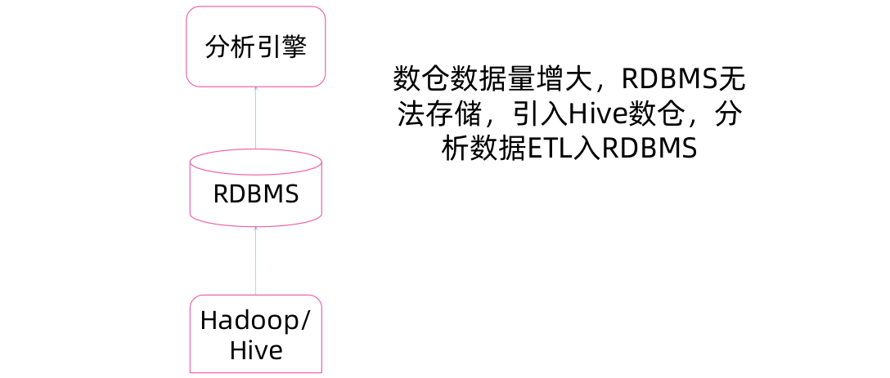

[TOC]

# OLAP概述

**OLAP技术发展背景**
60年代，关系型数据库之父E.F.Codd提出了关系模型，促进了OLTP（ OnLineTransaction Processing，联机事务处理）模型的发展。

1993年，E.F.Codd提出了OLAP（OnLine Analytical Processing联机分析处理）概念，认为OLTP已不能满足终端用户对数据库查询分析的需要，SQL对大型数据库进行的简单查询也不能满足终端用户分析的要求。用户的决策分析需要对关系数据库进行大量计算才能得到结果，而查询的结果并不能满足决策者提出的需求。因此，E.F.Codd提出了多维数据库和多维分析的概念，即OLAP。

**OLAP vs. OLTP**
从数据角度看，OLTP系统与OLAP系统的主要差异如下：

| OLTP数据                              | OLAP数据                                                   |
| :------------------------------------ | :--------------------------------------------------------- |
| 原始数据                              | 导出数据                                                   |
| 细节性数据                            | 综合性和提炼性数据                                         |
| 当前值数据                            | 历史数据                                                   |
| 可更新                                | 不可更新*，但周期性刷新                                    |
| 一次处理的数据量小                    | 一次处理的数据量大                                         |
| 面向应用，事务驱动 面向分析，分析驱动 | 面向操作人员，支持日常操作 面向决策人员，支持管理需要      |
|                                       | *不可更新*：近些年数据湖技术的发展，开始支持海量数据的更新 |

**OLAP定义**

- 定义1 ：OLAP(联机分析处理)是针对特定问题的联机数据访问和分析。通过对信息(维数据)的多种可能的观察形式进行快速、稳定一致和交互性的存取，允许管理决策人员对数据进行深入观察。
- 定义2 ：OLAP(联机分析处理) 是使分析人员、管理人员或执行人员能够从多种角度对从原始数据中转化出来的、能够真正为用户所理解的、并真实反映企业维特性的信息进行快速、一致、交互地存取，从而获得对数据的更深入了解的一类软件技术。(OLAP委员会的定义) 。
- OLAP的目标：满足决策支持或多维环境特定的查询和报表需求，它的技术核心是“维”这个概念，因此OLAP也可以说是多维数据分析工具的集合。

**OLAP相关基本概念**

- 维（ Dimension ）：是人们观察数据的特定角度，是考虑问题时的一类属性，属性集合构成一个维（时间维、地理维等） 。
- 维的层次（ Generation，Level ）：人们观察数据的某个特定角度（即某个维）还可以存在细节程度不同的各个描述方面（时间维：日期、月份、季度、年） 。
- 维的成员（ Member ）：维的一个取值。是数据项在某维中位置的描述。（“某年某月某日”是在时间维上位置的描述）
- 多维数组：维和变量的组合表示。一个多维数组可以表示为：（维1，维2，……，维n，变量）。（时间，地区，漫游类型，通话费）
- 度量（ Measure）：多维数组的取值。（2000年1月1日，上海，国际漫游，通话费XXXX元）

**OLAP的基本特征**

- ,快速性：用户对OLAP的快速反应能力有很高的要求。系统对用户的大部分分析要求的响应速度应该为秒级。
- 可分析性：OLAP系统能处理与应用有关的任何逻辑分析和统计分析。
- 多维性：多维性是OLAP的关键属性。系统提供对数据的多维视图和分析,包括对层次维和多重层次维的完全支持。
- 信息性：不论数据量有多大，也不管数据存储在何处，OLAP系统应能及时获得信息，并且具有管理大容量信息的能力。

**OLAP的多维数据结构**

- 数据超立方体（Cube）：数据超立方体也叫数据立方体，指用三维或更多的维数来描述一个对象,每个维彼此垂直。数据的测量值发生在维的交叉点上,数据空间的各个部分都有相同的维属性。

OLAP分类
按照存储类型，OLAP可以分为以下三种类型：

- 1.MOLAP（Multidimensional OnLine Analytical Processing ） ：数据以多维方式存储，每一个数据单元（Cell）都可以通过维度的定位直接访问。 db2
- 2.ROLAP（Relational OnLine Analytical Processing ） ：数据存放于关系型数据库中，用户的多维查询请求由ROLAP引擎处理为SQL查询，结果以多维方式呈现。
- 3.HOLAP（Hybrid online analytical processing ）： MOLAP与ROLAP的结合形式，兼具MOLAP的查询效率高和ROLAP的存储效率高的优点，预存储。

**OLAP分类之MOLAP**

- MOLAP的逻辑存储模型：
- 以多维立方体和预计算来存储，实际数据的稀疏分布以及预计算是导致MOLAP空间急剧膨胀的主要因素。


**OLAP分类之ROLAP**
ROLAP存储模式：ROLAP数据以星型模式（Star Schema）或雪花型模式存储：

- 事实表：用来存储事实的度量值和各个维的码值。
- 维表：用来存放维的元数据（维的层次、成员类别等描述信息） 。


**ROLAP VS MOLAP**
ROLAP的优势：

- 没有大小限制。（因为Star Schema本身不需要额外的存储空间） 。
- 现有的关系数据库的技术可以沿用。
- 可以通过SQL实现详细数据与概要数据的存储。
- 现有关系型数据库已经对OLAP做了很多优化，包括并行存储、并行查询、并行数据管理、基于成本的查询优化、位图索引、SQL 的OLAP扩展（cube，rollup）等大大提高ROALP的速度

MOLAP的优势：

- 性能好、响应速度快。
- 专为OLAP所设计。
- 支持高性能的决策支持计算。

ROLAP的缺点：

- 比MOLAP响应速度相差。
- 不支持有关预计算的读写操作。
- SQL无法完成部分计算。
- 所有计算和分析都是基于内存去完成的，对内存的需求比较大。

MOLAP的缺点：

- 增加系统复杂度，增加系统培训与维护费用。
- 需要进行预计算，可能导致数据急剧膨胀。
- 支持维的动态变化比较困难。

**ROLAP架构**


**MOLAP架构**


**HOLAP架构**


# OLAP多维数据分析技术

**多维数据模型**

- 数据仓库和OLAP服务器基于多维数据模型。
- 多维数据模型将数据看作数据方体(Data Cube)，它通过维(dimension)和度量(measure)进行定义。
- 维可以有层次。

**多维数据模型实际上是把度量看成是由维组成的多维空间上的值**


**多维数据模型的实现**

- 基于关系数据库
  - 星型模式
  - 雪片模式
  - 事实群模式
- 基于多维数组

**星型模型**


**雪花模型**


**事实群模型**


**多维数组存储**
多维数组只存储数据方体的度量值，维值由数组的下标隐式给出。


**关系存储 vs 多维存储**

关系存储 
- 适应性、伸缩性和扩展性好
- 不存在稀疏数据问题
- 访问速度不如多维数组快 ü 存储效率高

**多维数组存储**

- 访问速度快
- 不同维的访问效率差别很大
- 在数据稀疏的情况下，由于大量无效值的存在，存储效率下降

**拓展*多维数据存储优化**

解决数据稀疏造成空间浪费的问题：

- 采用数据压缩技术，如头文件压缩方法，ZW压缩方法等

解决不同维的访问效率差别大的问题：

- 将一个n维数组分成多个小的n维数据块 (chunk)的方法。


**多维分析操作**

- 建立在关系聚集操作上的一组复合操作
- 基本的分析是求聚集函数(aggregation)

**聚集Aggregation**


求第一天的销售总额
`SELECT sum(amt) FROM SALE WHERE date = 1`
按照每天求销售总额
`SELECT date, sum(amt) FROM SALE GROUP BY date`
按照每天和产品求销售总额
`SELECT prodId, date, sum(amt) FROM SALE GROUP BY prodId, date`

**聚集函数**

- 分布型
  - 可以分布计算的聚集函数。
  - 例如:sum(), count(), max(), min()
- 代数型
  - 可以由一个具有M个参数的代数函数计算得到，其中每个参数可以用一个分布型聚集函数得到。
  - 例如:AVG()
- 整体型
  - 描述它的子聚集所需的存储没有一个常数界。
  - 例如:median(); rank()

**OLAP多维分析方法**
OLAP的四种基本分析手段：多维视图

- 切片和切块(Slice and Dice) ：在确定某些维数据的确定情况下对其他维进行观察，在多维数据结构中,按二维进行切片,按三维进行切块,可得到所需要的数据。如在“城市、时间、漫游”三维立方体中进行切块和切片,可得到各城市、各漫游类型的费用情况。
- 钻取(Drill)：在一个维内沿着从高到低或者从低到高的方向考察数据，钻取包含向下钻取（Drill-down）和向上钻取（Drill-up） / 上卷（Roll-up）操作， 钻取的深度与维所划分的层次相对应。
- 旋转(Rotate) / 转轴(Pivot):通过旋转可以得到不同视角的数据，按不同的顺序组织维，对结果进行考察
- 穿透(Drill-through)：是指从多维数据库向关系型数据库读取明细数据

**OLAP分析之切片/切块**


**OLAP分析之钻取**
考察一个特定的维（从上至下，从左至右）

- 时间维，包括每一个地区漫游业务量
- 钻取到下面的层次来考察详细情况


**OLAP分析之旋转**

按照不同的顺序组合维，对数据进行考察


**OLAP分析之穿透**


# 大数据背景下的OLAP需求和变革

**大数据时代OLAP困境(一)**

- 大数据时代 数据量爆炸，上百 TB 甚至上 PB 数据不足为奇。
- 传统 RDBMS已无法满足存储需求

**大数据时代OLAP困境(二)**

- 查询性能要求高：数据量在猛烈增长， 但是查询的性能要求反而变得越来越高
- 大数据量下传统RDBMS查询速度慢，ETL效率低

**大数据时代OLAP困境(三)**

- 数据形式多种多样：不再是传统的DB关系数据，还有很多非结构化数据
- 传统RDBMS无法处理半结构化/非结构化数据

**大数据时代的OLAP**

- 受限于数据量和技术栈的变化，大数据下数仓架构与传统数仓已经不同，传统数仓的OLAP已经不能满足需求，衍生出了一些新的OLAP引擎。
- 虽然引擎技术在变化，OLAP分析方法是不变的

初期数仓数据量不大，全部数据在RDBMS，如Greenplum，对接分析引擎如Tableau或者自研的拖拽式UI


数仓数据量增大，RDBMS无法存储，引入Hive数仓，分析数据ETL入RDBMS



分析数据需求增多，数据量增大，采用分布式Presto引擎替代RDBMS


对查询延迟要求提升，Presto中数据采用Alluxio内存加速


数据及时性要求提升，不仅仅要支持T+1的离线数仓，实时数据流需要进行实时分析，引入Druid支持Kafka中实时数据的摄入与分析


**OLAP在大数据中的作用**


# 大数据OLAP引擎Presto概述

**目前主流的大数据OLAP引擎**

- Impala
- Kylin 
- Druid 
- Presto n
- ClickHouse

OLAP引擎选型考量：

- 查询性能和写入性能
- SQL支持度和OLAP操作支持度
- 时效性
- 生态与工具完备性

**Presto的发展历程和现状**

- Facebook的数据仓库存储在大型Hadoop/HDFS集群。Hive是Facebook在几年前专为Hadoop打造的一款数据仓库工具。在以前，Facebook的科学家和分析师一直依靠Hive来做数据分析。
- 但Hive使用MapReduce作为底层计算框架，是专为批处理设计的。但随着数据越来越多，使用Hive进行一个简单的数据查询可能要花费几分到几小时，显然不能满足交互式查询的需求。
- Facebook也调研了其他比Hive更快的工具，但它们要么在功能有所限制要么就太简单，以至于无法操作Facebook庞大的数据仓库。
- 2012年开始试用的一些外部项目都不合适，他们决定自己开发，这就是Presto。该项目上线后很快就在Facebook内部，被数千名员工使用，每天运行超过30000个查询，每日的数据在PB级别。Facebook称Presto的性能比Hive要好上10倍多。2013年Facebook正式宣布开源Presto。

**Presto简介**

- 开源分布式SQL引擎
- 兼容标准ANSI SQL语法
- 为交互式查询设计
- 跨源数据支持
- 易于部署
- 易扩展

**SQL on Anything**


**Presto特点**

| 特点     | 说明                                                         |
| -------- | ------------------------------------------------------------ |
| 多数据源 | 支持MySQL/PostgreSQL/Cassandra/Hive/Kafka等                  |
| 支持SQL  | 完全支持ANSI SQL，提供SQL Shell，也支持JDBC/ODBC             |
| 扩展性   | connector机制，很容易扩展开发自定义connector对接特定数据源   |
| 混合计算 | 针对一种类型的connector配置一个或多个catalog，支持混合多个catalog进行join查询计算 |
| 高性能   | 充分利用内存，平均性能是Hive的10倍以上，秒级/毫秒级响应      |
| 流水线   | Pipeline设计，数据像自来水管道一样，一旦开始计算，数据就立即产生呈现到终端直到结束 |

**Presto架构**
Presto查询引擎是一个Master-Slave的架构，由一个Coordinator节点，一个DiscoveryServer节点，多个Worker节点组成，Discovery Server通常内嵌于Coordinator节点中。Coordinator负责解析SQL语句，生成执行计划，分发执行任务给Worker节点执行。Worker节点负责实际执行查询任务。Worker节点启动后向Discovery Server服务注册，Coordinator从Discovery Server获得可以正常工作的Worker节点。如果配置了HiveConnector，需要配置一个Hive MetaStore服务为Presto提供Hive元信息，Worker节点与HDFS交互读取数据。


**Presto比Hive快的原因**


MapReduce:MR结构 

Presto:DAG结构

**Presto应用场景**
数仓OLAP加速，ETL/Adhoc


**实验：Docker环境尝鲜**

```
docker pull alluxio/alluxio-presto-sandbox
docker run -d \
--shm-size 1G \
-p 19999:19999 \
-p 8080:8080 \
--name alluxio-presto-sandbox \
alluxio/alluxio-presto-sandbox
docker exec -it alluxio-presto-sandbox bash
presto --catalog hive --debug
```

**阿里云实验环境集成部署**

1.下载安装包
https://repo1.maven.org/maven2/com/facebook/presto/presto-server/0.240/presto-server-0.240.tar.gz
2.解压部署


3.配置文件


4.启动集群  

  ```
  export JAVA_HOME=/usr/java/jdk1.8.0_181-cloudera/
  export PATH=$JAVA_HOME/bin:$PATH
  bin/launcher start
  ```

5.下载客户端命令行并使用

  ```
 bin/presto-cli --server localhost:8080 --catalog hive
  ```

 **参考资料**

- Presto官网：https://prestodb.io/
- Presto下载安装包：https://prestodb.io/download.html
- Presto与Alluxio集成Docker环境上手指南：https://www.alluxio.io/alluxio-presto-sandbox-docker/
- Presto安装配置文档：https://prestodb.io/docs/current/installation/deployment.html
- Presto与Hive集成文档：https://prestodb.io/docs/current/connector/hive.html
- Presto SQL语法文档：https://prestodb.io/docs/current/sql.html


