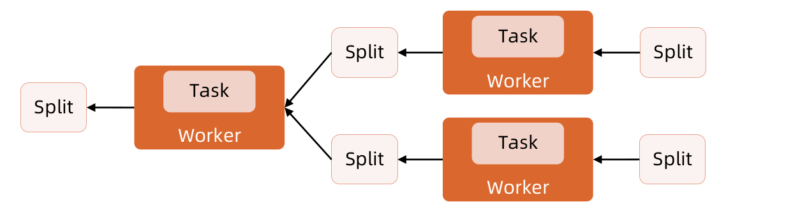
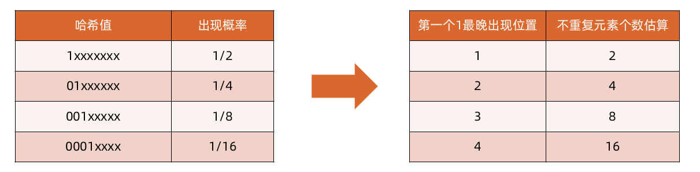
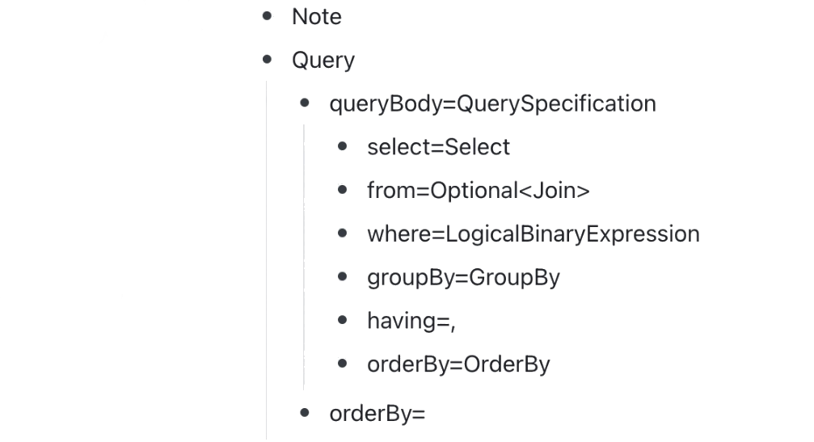

[TOC]

# OLAP技术发展新特征

- 聚集存储数据库 (Aggregate Storage Database)：支持聚集存储数据库（由新的聚集存储核心提供）实现了在数据库聚集时间和维度可量测性两方面的动态可量测性的提高。聚集存储数据库典型只满足只读，“机架堆叠”具有大量维度的应用聚集数据可以同时满足读取和计算
- 存储高效性能，存储量很小
- 存储高效性和读取效率可以取得平衡点
- 预计算可以在数据读取是进行，也可以预处理计算节点

**OLAP在日常分析的应用**


**OLAP分析方法的应用**


**OLAP分析方法思路**


# Presto架构和原理

**Presto架构**


**组件-Coordinator**

- Coordinator负责接收来自用户的查询语句，解析这些语句，安排执行计划，并且管理Worker节点。用于连接客户端，同时也是Presto的大脑。
- 用户可以通过Presto CLI与coordinator进行交互。应用程序可以使用JDBC或者ODBC驱动。Coordinator接受来自客户端的SQL语句，例如SELECT查询。
- Coordinator会跟踪每个Worker的活动，并安排查询的执行。一旦接受到SQL查询，Coordinator就会负责parsing，analyzing, planning这个查询，并在Worker节点上进行调度。这个查询会被转化成一系列Task，在Worker上运行。Worker处理之后的数据会被Coordinator检索并且通过Output buffer暴露给客户端。


**组件-Discovery Service**

- Presto通过Discovery Service来发现集群中的所有节点。Worker在启动的时候会向Discovery Service注册，并且定时发送心跳信号。因此Coordinator可以获得当前可用的Worker列表，以便于为查询安排调度。
- 如果Worker发送心跳信号失败，Discovery Service出发故障检测，此时该Worker将不会接收之后的Task。
- Presto Coordinator通常运行一个嵌入版的Discovery Service服务。

**组件-Worker**

- Worker负责执行Coordinator分配给他的Tasks并且处理数据。
- Worker使用Connectors从数据源获取数据，并彼此交换中间数据。
- 最终的结果数据会传送给Coordinator，Coordinator会负责从Worker中收集结构数据，将合并之后的结果数据提供给Client。


**Connector-based架构**

- Presto的存储与计算分离的核心在于Connector为基础的架构。Connector为Presto提供了一个可以访问任意数据源的接口。用户可以自己实现一个Connector。
- 每一个connector在基础数据源之上提供了一个表的抽象。
- Presto系统已经提供了多个Connector，例如HDFS/Hive ,Mysql，PostgreSQL，MSSQL Server ,Kafka，Cassandra，Redis等等。
- 每个connector都实现了API的三个功能：
  - 获取Table/View/Schema元数据信息的操作
  - 生成数据分区对应的逻辑单元的操作，这样Presto可以并行的读写数据
  - 按照Presto执行引擎需要的方式转换原始数据存入内存，或者从内存中读取数据并转换


**Catalog/Schema/Table**

- Presto通过使用Connector-based的架构来处理所有的查询。
- 每个Catalog配置使用一个Connector来访问一个特定的数据源。
  Presto的Catalog相当于我们经常说的mysql实例，可以在$PRESTO_HOME/etc/catalog/下通过新增.properties文件来新增Catalog，其中文件名就是catalog名，我们可以通过定义不同的Catalog来接入不同的数据存储，比如hive、mysql等
- 这个Catalog的数据源会对外暴露一个或多个Schema。
  Schema就相当于我们平常用的数据库了，当Presto访问hive或者mysql数据库时，Schema就会转换为目标数据库中相同的概念。
- 每一个Schema包含一些Table，这些表以Row的方式提供数据，每一个Row中包含多个不同数据类型的Column。
  Presto中的数据表定义与其他数据库中的表定义是一样的。

**执行模型**
我们知道Coordinator接受来自客户端的SQL语句。然后Coordinator触发Workers从数据源读取数据，创建结果集，并使将结果集提供给客户端。

首先，Coordinator内部发生了什么？

SQL以文本的形式被提交到Coordinator之后，Coordinator获取该文本并对其进行解析和分析， 然后，它通过使用Presto中称为 Query Plan 的内部数据结构创建执行计划。


**SPI**
Query Plan使用Metadata SPI和Data Statistics SPI来创建查询计划， 使用DataLocation SPI来收集关于数据源的表等元数据信息。

- Metadata SPI用于获取关于表、列和类型的信息。它们用于验证查询在语义上是否有效，并对原始查询和安全检查中的表达式执行类型检查。
- Data Statistics SPI用于获取关于行数和表大小的信息，以便在计划期间执行基于成本(cost-based)的查询优化，
- Data Location SPI 是为了用于分布式查询计划的生成。它可以生成关于表内容的逻辑Splits。Splits是工作分配和并行化的最小单位。


**分布式查询计划（Distributed Query Plan）**
分布式查询计划是由逻辑查询计划转换而来。分布式查询计划是由一个或多个Stage组成的。Stage包含了一组Task。

Coordinator将计划进行打散，以方便在集群中的Worker上并行地处理，加速整体查询速度。当Plan拥有多个Stage时会导致Stage依赖树的创建。Stage的数量取决于查询的复杂度。


**Stage**
Presto中一个Stage就对应一个PlanFragment。在Presto的Web UI里可以看到如下的Stage连接图，整个执行计划被划分为若干Stage，每个Stage里都有一个PlanFragment。Stage之间通过Exchange连接。


**Presto的Stage、SubPlan、PlanFragment**
在Presto中SubPlan、Stage、PlanFragment其实对应的都是同一个层面的东西，即一个Query拆分成的若干个Stage的名词表示。那为什么还有3个名词呢？

SubPlan：一个SQL语句会切分成若干个Stage，每个Stage的逻辑表示就是SubPlan，即Query的逻辑切分，尚未对应到Worker执行。

PlanFragment：每个SubPlan包含若干个PlanNode，例如joinnode，exchange node，project node，filter node等等，这些PlanNodes封装到一个PlanFragment的对象中。SubPlan的概念用于关联上下游其他SubPlan，PlanFragment的概念则用于管理和维护本SubPlan中的PlanNode。

Stage：当SubPlan和具体执行这个SubPlan的Workers关联起来时，就叫Stage了。Stage里包含若干个Task，这些Tasks会分发到不同的Workers上进行执行。


**SubPlan的Distribution和Partitioning**
planDistribution有三种类型：

- Source：数据源，会根据数据源大小确定分配多少个节点
- Fixed：分配到固定个数的节点执行（query.initial-hash-partitions参数配置，默认是8）
- None：这个SubPlan只分配到一个节点执行

outputPartitioning有两种类型：

- Hash：发生Shuffle
- None：不进行Shuffle

**PlanNodes和Operations**
PlanNodes其实也不是最终实际执行的Operations（算子），PlanNodes在分发到Workers后，会将PlanNode做进一步的拆解，形成最终形态的Operation。
如上图的Stage1的Operations为：


**Task和Split**

一个Stage被分解成多个Task，每个Task处理一个或者多个split，每个Task都有相应的输入和输出，一个Stage被分解成多个task，从而可以并行的执行一个Stage。

Task中处理数据的单元被称为 Split ，他是一个逻辑概念，用于描述可以被Worker检索和处理的底层数据的划分，他是并行化和工作分配的最小单元。每个Task可以处理一个或多个Split。

例如，Hive Connector以文件路径的形式描述Split，其中偏移量和长度表示需要处理文件的哪个部分。



**Driver和Pipeline**
一个Task包含一个或多个Driver。
一个Driver其实就是作用于一个Split的一系列Operators的集合，因此一个Driver用于处理一个Split。
每一个Driver由一串Operator组成，负责接收一组输入数据，并产生一组输出数据。
Pipeline其实是一个虚拟的概念，它的实例就叫Driver。可以说Pipeline就是DriverFactory，用来创建Driver的。Driver里不再有并行度，每个Driver都是单线程的。

每个Task可以处理一个或多个Split，一个Task又被分成一个或多个Driver，由此可见，一个Driver处理一个Split。


**Page和Block**
Page是Presto中处理的最小数据单元，每个Page是列式存储的行的集合 。一个Page最大为1M，最多为16*1024行数据。
一个Page对象包含多个Block对象，而每个Block对象是一个字节数组，存储一个字段的若干行，多个Block横切的一行的真实的一行数据。
Operator根据其语义处理和生成相应的Page。例如Filter Operator会删除一些Row，Projection Operator产生一些衍生的Column等等。

**Operator & Pipeline**

不同的Operator根据其语义处理和生成相应的Page。例如Filter Operator会删除一些Row，Projection Operator产生一些衍生的Column等等。Task中一些Operator组成Pipeline。通常Pipeline中最后一个Operator会将它输出的Page放到他所在Task的Output Buffer中。下游Task中的Exchange Operator会消费上游Task Output Buffer中的Page，所有的这些操作是在不同的Worker上并行进行的。每一个Driver是一个Pipline的实例，并且执行并处理Split中的数据


**执行模型总结**

1. Coordinator接受来自客户端的SQL查询。
2. 为了处理这个查询， Coordinator对其进行解析和分析，构建由Stage组成的QueryPlan。
3. 然后基于从Connector中获取的元数据信息创建了一些列的Splits。
4. 使用这些Split，Coordinator开始在Worker上调度Task并收集Split中的数据。
5. 当查询执行期间，Coordinator会跟踪所有可以执行的Split，以及正在执行的Split位置和正在运行的Task所在的Worker。当Task完成处理并为下游产生跟多的Split时，Coordinator将继续调度Task直到没有可以处理的Split。
6. 一旦Worker上的所有的Split都被处理完，所有的数据可用，此时Coordinator就可以将最终结果暴露给客户端。


**Presto的优缺点**

- 优势
  - 完全基于内存的并行计算
  - 流水线计算
  - 本地化计算
  - 动态编译执行计划
  - GC控制
  - 类BlinkDB的近似查询（ HyperLogLog* ）
- 缺点
  - 因为Presto的全部数据是存在内存中的，限制了内存中数据集的大小，例如多个大表的join操作。因此，Presto是取代不了Hive或Spark的。
  - 不适合计算太大的数据量(目前1TB以上不建议)
  - 容错处理较差，如果某个节点失败，整个查询也将失败
  - UDF支持不完善、不能完全兼容hive语法

**拓展*HyperLogLog**

- 考虑PV和UV的例子
- 近似去重，使用极少空间计算不重复数据个数
- SQL的cardinality，count distinct，spark的approx_count_distinct
- 只能计算集合中有多少个不重复的元素，不能计算每个元素的出现次数或是判断一个元素是否之前出现过
- 原理：求每个值的hash，通过所有hash二进制的第一个1最晚出现的位置来估算不重复hash的个数。（抛硬币，伯努利实验）



**Java例子**

```java
final HLL hll2 = new HLL(13, 5); //number of bucket and bits per bucket
for (int i = 0; i < 100000; i++) {
    final long value = hash.newHasher().putInt(i).hash().asLong();
    hll2.addRaw(value);
}
System.out.println("Distinct count = " + hll2.cardinality());
```

**开发Java程序访问Presto**
Presto-JDBC
https://github.com/prestodb/presto
https://github.com/trinodb/trino

```xml
<dependency>
    <groupId>io.prestosql</groupId>
    <artifactId>presto-jdbc</artifactId>
    <version>338</version>
    <scrope>provided</scrope>
</dependency>
```

# Presto SQL编译过程

**Presto中的SQL流程**


**SQL的编译过程**
TPCH Q3


**词法分析和语法分析**

词法分析和语法分析是把原始 SQL 解析为一颗抽象语法树 (AST). 在代码层面是由一个 String 对象获得一个Statement 对象. 对于本例子, AST 示例图：

Coordinator 调用创建 QueryExecution 过程中, 调用SqlParser#invokeParser 完成对 SQL 的词法分析和语法分析, 相关功能代码位于 presto-parser 模块, 使用ANTRL 框架自动生成主要基础类



**语义分析**
语义分析代码入口是 SqlQueryExecution 构造过程中调用的SqlQueryExecution#analyze 方法, 它本质是调用 Analyzer#analyze, 后者包含三个步骤:

- 语句重写: StatementRewrite#rewrite
  语句重写把特定的 describe, show, explain 语句按照内置规则调整 AST 的形状. Presto 内置 5 项重写规则 (详见 StatementRewrite 类源码).
- 语义分析: StatementAnalyzer#analyze
  语义分析主要过程是按照 Visitor 模式递归遍历 AST (Statement) 上的每个节点. 在遍历过程中, 识别节点元信息, 并更新在一个 Analysis 对象中. 节点元信息, 包括名字解析与绑定(表名,列名, 函数名等), 查询形状描述信息 (aggregates, orderByExpressions等).
- 权限检查: AccessControl#checkCanSelectFromColumns
  语义分析完成之后得到 Analysis, 可以拿到当前语句访问的表和列.Analysis#tableColumnReferences 把访问控制信息, 表和列组织为这样一个数据结构Map<AccessControlInfo, Map<QualifiedObjectName, Set<String>>>. 通过遍历这个Map, 即可实现表和列维护的权限控制.

**逻辑计划生成**
在查询被资源组调度时, 首先进行逻辑计划的生成和优化, 入口方法是 SqlQueryExecution#planQuery. 实际执行过程又可以细分为3个步骤:

- 计划生成
  方法 LogicalPlanner#plan(Analysis) 从经过语义分析的 AST 创建一颗逻辑计划树 (Plan). Presto 做逻辑计划优化也是采用基于规则的方式. 逻辑计划过程便是依次应用优化规则, 不断调整树的形状. PlanOptimizers构造方法包含了 Presto 的全部优化规则.
- 提取输入和输出
- 计划分解


**逻辑计划生成**

- 计划生成
- 提取输入和输出
  提取输入和输出采用Visitor模式遍历上一步生成的逻辑计划, 从中提取去本次查询的输入输出.
- 计划分解
  为了让执行计划在分布式环境下可运行, 需要把它分解为不同的子计划 (入口方法 PlanFragmenter#createSubPlans ), 得到 SubPlan 树.


**分布式执行计划生成**

对于上一步生成的逻辑计划, Coordinator 不会直接生成一个物理计划. 在 Presto 中, 物理计划生成实质上发生在 Worker 端. Coordinator 调度一个 Task 给 worker, 其实是下发一个逻辑计划的子计划 (SubPlan) 给 worker. Worker 在完成逻辑子计划到物理子计划的编译后开始运行。

在此之前会有一个环节：分布式执行计划生成 (入口方法DistributedExecutionPlanner#plan ). 简单理解, 就是把逻辑子计划 SubPlan 封装 (加上输入输出等相关信息) 为 StageExecutionPlan, 后者以树的形式组织, 用于Coordinator 的 Stage 调度.

至此Coordinator端的编译过程完成，接下来是Worker端的编译过程。

**物理子计划生成**

和 Hive 以及 SparkSQL 不同, Coordinator 调度 Worker 时, 仅仅下发逻辑子计划, 并没有直接可用的可执行代码. Worker 进程实际工作前, 先把逻辑子计划编译为物理子计划.代码入口 LocalExecutionPlanner#plan.

Pipeline 何时创建?

1. LocalExecutionPlanner 在遍历到 Exchange, SemiJoin, Join, SpatialJoin 等算子
时, 会新建一条 pipeline;
2. LocalExecutionPlanner 对于 right-join 和 full-join 类的 Join 算子会额外新建一条
pipeline.

**PrestoSQL代码流程(仅供参考）**

- 代码
  - https://github.com/prestodb/presto
- 查询入口
  - Query query = Query.create(sessionContext, statement, ...); //创建query
  - queries.put(query.getQueryId(), queryExecution);; //放入执行队列
- 词法语法分析生成AST
  - ANTLR4
  - RelationPlanner类遍历ASTNode(visit方法）
- 语义分析&生成逻辑执行计划
  - Analysis analysis = analyzer.analyze(statement); //开始语义分析
  - Plan plan = logicalPlanner.plan(analysis);//生成逻辑执行计划
- 逻辑执行计划优化
  - root = optimizer.optimize(root, session, ...)


- 逻辑执行计划分段
  - SubPlan fragmentedPlan = PlanFragmenter.createSubPlans
- 生成分布式执行计划
  - PlanRoot plan = analyzeQuery();
  - planDistribution(plan);//生成分段的执行计划
  - SqlQueryScheduler scheduler = new SqlQueryScheduler //创建SqlQuery调度
  - StageExecutionPlan doPlan() //产生stage执行计划
- 产生stage执行
  - List<SqlStageExecution> stages = createStages()
- 生成stage调度器和分配策略
  - SplitPlacementPolicy placementPolicy = new DynamicSplitPlacementPolicy
  - stageSchedulers.put(stageId, new FixedSourcePartitionedScheduler)

- stage调度器开始调度
  - public synchronized ScheduleResult schedule()
- 生成RemoteTask任务
  - private synchronized RemoteTask scheduleTask() //产生task任务下发到worker
- Worker接收Task任务
  - public Response createOrUpdateTask(@PathParam("taskId") TaskId taskId) //通过http rest请求将task任务分发到对应的worker上
  - TaskInfo taskInfo = taskManager.updateTask(session, taskId, ...) //更新任务状态
  - createSqlTaskExecution(TaskStateMachine taskStateMachine, TaskContexttaskContext) //创建SqlTaskExecution
- Worker启动执行
  - TaskExecutor.start()//Worker启动后，调用TaskExecutor类的start方法
  - class TaskRunner implements Runnable

# Presto高可用

**Coordinator HA**

- 主节点缺乏HA的机制
  - Coordinator存在单点故障。Coordinator不可用，会严重影响线上业务。此外，Coordinator对集群升级也带来比较大的风险。
- 整体流程
  - 1.Presto Client端发送查询请求给Coordinator
  - 2.Coordinator查询Hive Metastore获取元数据
  - 3.Coordinator再将任务转发给对应的Worker
  - 4.Worker节点从文件系统拉数据并进行计算

**主备Coordinator**


**Reference**
http://prestodb.io/
https://www.facebook.com/notes/facebook-engineering/presto-interacting-with-petabytes-of-data-at-facebook/10151786197628920
http://www.slideshare.net/zhusx/presto-overview?from_search=1
http://www.slideshare.net/frsyuki/hadoop-source-code-reading-15-in-japan-presto
https://tech.meituan.com/2014/06/16/presto.html
https://mp.weixin.qq.com/s/h2xEbWIQJ8YuZuT6-tfmBQ


