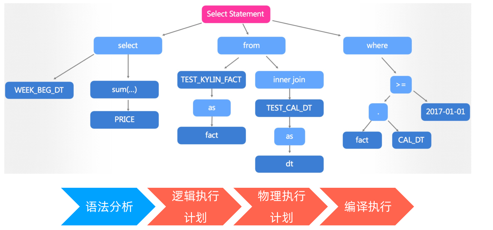

[TOC]

# Kylin的发展历程和现状

大数据时代

- Hadoop的数据规模越来越大
- 已有的BI工具（business intelligence）存着的不足：
  - 对Hadoop缺乏支持
  - 需要查询的数据呈指数级增长
  - 交互式查询延迟高
- 纵向扩展（Scala-up）架构
  - 使用Hadoop作为交互式查询引擎的挑战：
  - 分析师一般只有SQL背景
  - Hadoop没有成熟的SQL接口
  - OLAP各种特性在Hadoop上不够成熟

**大数据分析的业务需求**

- 上亿行数据的秒级查询需求


- 分析师和数据工程师都使用ANSI SQL接口


- 无缝链接BI工具


- OLAP高级特性
- 对大数据规模和多维度的支持


- 上亿行数据的秒级查询需求
- 分析师和数据工程师都使用ANSI SQL接口
- 无缝链接BI工具
- OLAP高级特性
- 对大数据规模和多维度的支持
- 多租户和高并发——上千终端用户同时使用
- 分布式和横向扩容（Scale-out）架构
- 开源解决方案

**从传统数仓到大数据**

- 针对关键业务分析进行了优化
- 千锤百炼的数据模型
- 行业最佳实践
- 丰富的生态系统
- 大量训练有素的分析师


- 有非常多SQL on Hadoop系统
- 缺乏传统数仓建模方式（Kimball）
- 未针对交互式查询今天优化
- 不支持ANSI SQL
- 兼容性问题
- 需要了解太多底层知识


**将OLAP/DW带回大数据**

- Hadoop上的OLAP/DW
- 支持传统建模方式(Kimball)
- 为交互式分析进行优化
- ANSI SQL
- 原生Hadoop应用
- 支持云计算
- 支持高并发、关键型应用


**Kylin发展历史**


- 用户行为分析
- 流量日志分析
- 数据集市/数据仓库
- 大数据自助分析平台
- 零售/电商分析
- 资产管理平台
- 广告效果分析
- 数据服务平台
- 实时分析
- 游戏分析

# Kylin的工作原理和架构

**传统SQL执行逻辑**


**物化视图（Materialized View）**
一个只包含3个维度的查询


**Kylin的黑科技在哪**
预计算加速查询


**预计算和Cube**

- OLAP Cube理论基础
- Model和Cube定义预计算范围
- Build Engine执行预计算任务
- Query Engine在预计算结果上完成查询


**查询的算法复杂度**


**Kylin的位置**


**Kylin架构图**


**Kylin功能**
统一查询接口


可拓展的架构


支持JDBC/ODBC
多种大数据可视化


多数据源支持


# Kylin SQL执行

**SQL执行流程**

```sql
select
  WEEK_BEG_DT, sum(PRICE)
from
  TEST_KYLIN_FACT as fact
  inner join TEST_CAL_DT as dt
    on fact.CAL_DT = dt.CAL_DT
where
  fact.CAL_DT >= '2017-01-01'
```


**SQL词法分析**



**逻辑执行计划**


**物理执行计划**


**编译执行**
使用Calcite+HBase


# Cube优化

- Cube：利用空间换时间
- Cuboid = 多个维度的组合
- Cube = 多个Cuboid的组合（所有维度的组合）


**Cubing**


**Cubing ETL**

- Extract:从Hive/Kafka等数据源提取数据：构建大宽表（ 中间 表）
- Transform:编码，聚合计算数据并构建Cube： 提取 维度值，构建字典表，构建Cube
- Load:将Cube加载到存储引擎（HBase/ Parquet ）：存成HFile

**Cubing by MapReduce**


**Cubing流程**
Entry class: BatchCubingJobBuilder2.java


**全量Cube和部分Cube**

- 全量Cube

  - 预计算所有的维度
  - 维度爆炸：N个维度Cube具有2^N个Cuboid

- 部分Cube

  - 避免维度爆炸，将维度划分成不同的聚合组

    $2^{N+M+L} \rightarrow 2^N + 2^M + 2^L$

  - 例如30个维度的Cube，如果分为3个组，Cuboid的数据将从10亿减少到3千

    $2^{30} \rightarrow 2^{10} + 2^{10} + 2^{10}$

  - 在在线Agg和离线预计算直接进行衡量

**部分Cube**


**聚合组Cube剪枝**

- 聚合组（Aggregation Group）是一种强大的剪枝工具。聚合组假设一个Cube的所有维度均可根据业务需求划分成若干组
  - 强制维度（Mandatory）如果一个维度被定义为强制维度，那么这个分组产生的所有Cuboid中每一个Cuboid都会包含该维度。在后续的查询中是否每次group by都会包含某维度。
  - 层级维度（Hierarchy）每个层级包含两个或更多个维度。
  - 联合维度（Joint）每个联合中包含两个或更多个维度，如果某些列形成一个联合，那么在该分组产生的任何Cuboid中，这些联合维度要么一起出现，要么都不出现。
    - 例如用户的查询语句中仅仅会出现 group by A, B, C，而不会出现 group by A, B 或者group by C 等等这些细化的维度组合。这一类问题就是联合维度所解决的问题。例如将维度 A、B 和 C 定义为联合维度，Apache Kylin 就仅仅会构建 Cuboid ABC，而 Cuboid AB、BC、A 等等Cuboid 都不会被生成。A B C为联合维度，则要么都在，要么都不在，最终的Cuboid 数目从 16 减少到 4。

**层级维度（Hierarchy）**
例如对于国家（country）、省份（province）和城市（city）这三个维度，从上而下来说国家／省份／城市之间分别是一对多的关系。
也就是说，用户对于这三个维度的查询可以归类为以下三类:

1. group by country
2. group by country, province（等同于group by province）
3. group by country, province, city（等同于 group by city）如果ABCD 四个维度中ABC这三个被设置为层级维度，abc=ac=bc 则 abcd=acd=bcd,所以剪掉acd，bcd，保留abcd足以，则最终生成的cube：


**字典编码**

- 数据的Cube具有非常的重复维度值
- 通过字典将维度值映射到IDs来减少内存的使用
- 字典树是基于Trie树


**增量构建**


# HBase/Spark/Parquet和Cube

**HBase存储**

- cuboid (D1,D3,D5)
- where all dimensions are:
- (D1,D2,D3,D4,D5)


**为什么选择HBase**

- 和Hadoop集成方便
- Block级别的编码可以减少存储的footprint
- Seek和Scan操作性能好
- HBase的Coprocessors可以将计算靠近数据
- 作为数据存储具有很好的横行扩展性和弹性  

**Kylin查询HBase**  


**HBase的问题**

- 通过Calcite生成的代码难以debug。
- HBase的运维成本高。
- Kylin依赖HBase的架构在查询的时候会存在单点问题，因为一次查询任务在通过Coprocessor获取到数据之后的处理是在查询结点单机上完成的。
- HBase是KV，不是一个真正的列式存储，它通过RowKey来保留每一行的数据，之所以称之为“列式”，是因为它通过列族的结构管理列数据。Cube是通过将所有的维度和度量分别压缩成一列进行存储的，这样在查询的时候还需要对这一列进行反序列化、分割等操作，额外增加了计算压力。  

**Kylin on Parquet**

- Kylin on Parquet是在Kylin原来架构的基础上实现了新的查询、构建引擎和存储模块。通过Spark实现的查询引擎，能够提交计算任务到Yarn上，实现分布式的处理。
- 存储层去掉了HBase，最终构建完成的Cube数据都是通过Parquet的形式直接存储在文件系统中。  


**Cubing by Spark**

- 逻辑上等同于使用MR进行Cubing。
- 区别在于使用RDD作为Cuboid，通过父亲RDD来生存子RDD，可以更好的利用Spark的Cache进行加速。  


**优势**

- 用一个Spark App代替多个MR job，调度的性能更好
- Main entry: SparkCubingByLayer  


# Kylin在eBay的实践  

Kylin在eBay诞生

- Kylin是eBay贡献给Apache开源基金会的首个项目。
- Kylin在eBay内外完成由国人主导开发和设计。
- 2013年，为了解决在Hadoop大型数据集上的OLAP查询性能需求，Kylin项目在eBayCCOE中启动。
- 在2015年11月毕业成为Apache顶级项目。  


**eBay的持续贡献 - Cube Planner**

- Kylin 2.3.0版本中的Cube Planner是来自eBay贡献的一项主要功能。
- 平衡在线查询速度和离线Cube构建成本。
- 选择性地只预构建那些最有价值的Cube。
- 智能地构建partial cube，在运行时从查询中学习其模式和规律，并相应地动态地推荐cuboids。可以根据查询统计信息为现有的Cube 对cuboid列表作出建议。  


**eBay的持续贡献 - 实时OLAP**
Kylin 3.0提供了实时OLAP功能：

- 添加了Streaming Coordinator和Streaming Receiver。Streaming Coordinator负责管理接收器的操作。Streaming Receiver负责从流式数据源获取数据并回答实时数据查询。
- 一旦Streaming Receiver接收了流数据，Cube的预计算就会在内存中进行，那时实时Cube已经能够回答查询请求。
- 支持Lambda架构，从批处理源（例如Hive）刷新Cube历史记录。
- 扩展了Query Engine查询引擎和Build Engine构建引擎，以支持实时数据查询和Cube构建。  

**实时OLAP**  


**Kylin在eBay的应用**

- 目前在eBay中，Kylin平台是为决策分析用户案例提供支持的主要服务。
- 数据能够以安全方式从Hadoop和Rheos中提取。拥有专用的HBase集群来稳定服务器的查询延迟。
- 我们在40个项目中分配了300多个Cube。
- 最大的Cube在源表中具有1.18万亿个原始数据，最终的Cube大小为96.2 TB。
- 平均构建时间为16s/MB源数据，平均Cube膨胀率为0.46。
- 我们每天处理大约80万条查询，平均延迟时间约为0.68秒。  


**决策分析服务**

- 星型模式或雪花模式，它具有清晰的过滤维度和按维度分组以及目标度量。
- 库存计划员和采购员可以进行站点过滤和类别分析和汇总分析，以获取深刻的见解。  


**自助分析服务**

- 将在数据集上构建Cube，在UI上拖放不同的维度和度量组合以进行特定分析。
- 实例：用户可以从30个维度和200个度量中选择一种组合来分析B2C业务绩效  


**实时OLAP服务**

- 最重要的需求是数据处理后的度量的实时反映。
- 实例：BU需要实时监视站点电子邮件号码以了解其性能。  


**Kylin在eBay未来的发展**

- 提供更多自助服务和智能数据分析功能，配合增强分析解决方案。
- 替代HBase的存储解决方案。Kylin社区已经开始了使用Parquet提供轻量、列式存储、云友好的解决方案。
- eBay的Carmel-Spark会考虑将Kylin用作整个蓝图中的加速层之一。  

**美团：PB级大数据分析平台**

- 支持外卖、酒店、电影、LBS、机票等业务线
- Cube Storage: 971TB (almost PB)
- Cube numbers: 973 Cube
- Data Records: 8.9 Trillion rows
- 90%ile latency: <1.2s
- Frequency: 3.8 million queries / day  

**今日头条：万亿级日志分析平台**

- 痛点
  - 数据规模大，日志明细每天1000亿+
  - 维度多，宽表列数300+
  - 要求查询响应时间在秒级
- 解决方案
  - 采用Apache Kylin作为多维分析平台，60 HBase region server
  - 头条用户视频展示分析，最大Cube 4+TB，膨胀率4%（明细数据3+万亿，100+TB）
  - APP性能监控及分析，服务研发部门，1000+用户
  - 新闻日志分析，100+Cube服务不同产品线
- 收益
  - 查询速度快，90%+查询毫秒级（比Hive快上万倍）
  - 节省计算资源，一次构建，长期受益
  - 通过程序化方式自动创建100+Cube  

