[TOC]

# ClickHouse的产生和发展  

**ClickHouse**
ClickHouse是产生自Yandex公司的Metrica产品，Metrica是一款Web流量分析工具：根据用户行为数据采集，进行数据OLAP分析。
数据采集的Event由页面的点击（click）产生，然后进入数据仓库进行OLAP分析。
ClickHouse的全称为Click Stream，Data WareHouse，简称ClickHouse。
2021年9月20号，ClickHouse团队从Yandex独立，成立公司。  

**ClickHouse产生和发展历史**
第一阶段：MySQL时期的MyISAM表引擎
第二阶段：MOLAP时期的Metrage
第三阶段：HOLAP时期的OLAPServer
第四阶段：ClickHouse  

**MyISAM表引擎**
MySQL有多种表引擎，最知名的是InnoDB和MyISAM。

- MyISAM在分析场景下具有更好的性能。
- InnoDB支持事务，MyISAM不支持。
- InnoDB支持外键，而MyISAM不支持。
- InnoDB支持表、行(默认)级锁，而MyISAM支持表级锁。
- InnoDB和MyISAM都使用B+Tree作为索引结构，但InnoDB数据文件是和主键索引绑在一起的（叶子结点），而MyISAM的数据则是使用另外单独的存储文件。  

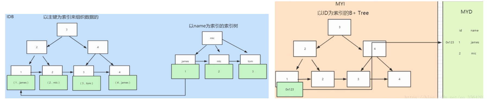

**Metrage**

- 由于MySQL的局限性，Yandex自研了MOLAP架构的Metrage。
- 使用LSM树代替B+树索引（顺序写，提高了写吞吐）。
- LSM树本质是将大树切成很多小树，小树构建的过程完全基于内存（辅助写预写日志），然后内存达到某个阈值后进行合并并flush到磁盘，并形成一个小的数据段（Segment），数据段中数据局部有序。
- Metrage对需要分析的数据进行预先聚合，类似Kylin Cube，然后把聚合数据按照KV存储。但是同时也带来了维度爆炸的问题。  

**OLAPServer**

- MOLAP的分析需要进行预计算，系统无法满足Yandex面向个人的自定义分析功能。
- 从而又回归到ROLAP，自研了OLAPServer，分别吸取了MyISAM和LSM树的长处。
- 在索引方面，使用稀疏索引了。
- 在数据文件上，沿用LSM树的数据段内数据有序，借助稀疏索引定位数据段。
- 在存储方面，类似MyISAM，将索引文件和数据文件分开，同时引入列存，将索引文件和数据文件
- 按照列字段粒度进行拆分，每个列独立存储。  

**ClickHouse适用于**

- 数据实时更新的SQL交互式查询
- 无法进行预聚合的SQL查询场景

例如：TopN聚合查询。（某段时间范围内网站的前10名推荐人）  

```sql
SELECT Referer, count(*) AS count
FROM hits
WHERE CounterID = 111
	AND Date BETWEEN '2018-04-18' AND '2018-04-24'
GROUP BY Referer
ORDER BY count DESC
LIMIT 10
```

**如何加速查询**

- 读加速
  - 列存，只读取部分列：CounterID、Date、Referer
  - 通过索引减少扫描
  - 数据压缩减少IO
- 计算加速
  - 向量化执行
  - 高度并行化
  - 极致的算法和优化  

**索引概述**

- 索引必须能装入内存
- 8192行作为一个粒度
- 不构建唯一键约束
- 点查性能不保证
- 根据索引键（主键）排序
  - 利用MergeTree来维护一段数据  

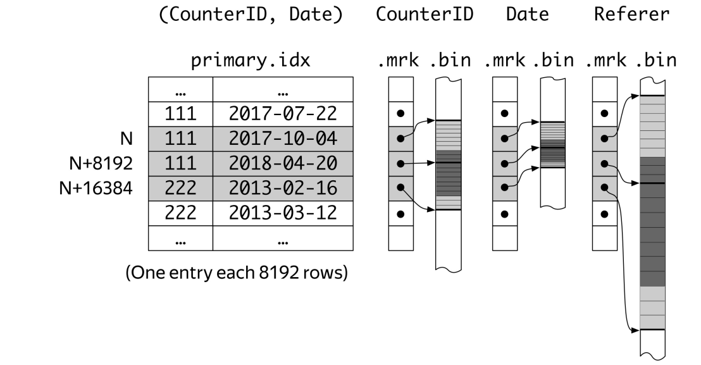

**ClickHouse不适用**
Yandex的Metrica，在数据总量超过20万亿行的情况下，ClickHouse 90%的查询能够在1秒内返回。
但ClickHouse不适用的场景也很多：

- 不支持事务
- 不擅长低延迟的Update/Delete操作
- 稀疏索引使得ClickHouse不擅长通过其键检索单行的点查询
- 不擅长大数据量Join  

**ClickHouse有多快？**  

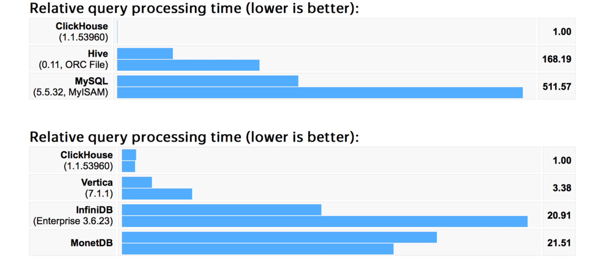

https://clickhouse.yandex/benchmark.html

**ClickHouse为什么快？**  

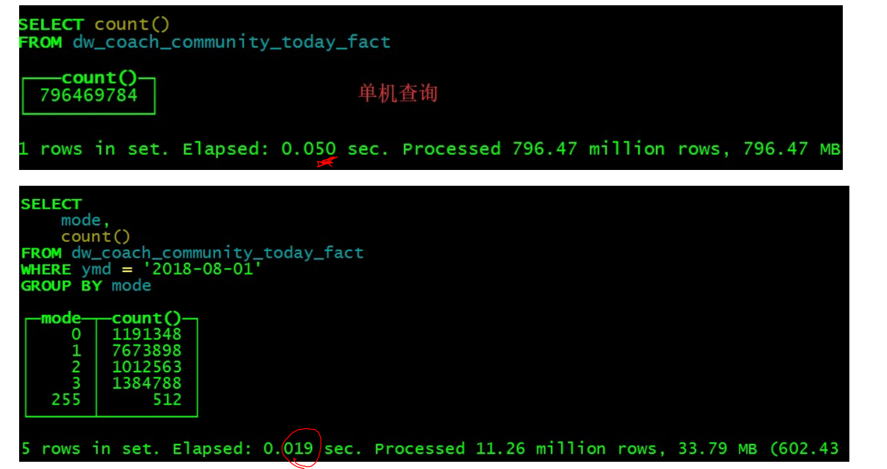

- 列存和数据压缩
- 向量化和SIMD
- 动态代码生成
- 多线程和分布式
- 多种表引擎
- 细节优化
- 算法优化
- 充分测试
- 持续改进  

# ClickHouse的使用  

**Docker环境Demo**

- 1.打开Docker Desktop
- 2.docker pull yandex/clickhouse-server
- 3.docker pull yandex/clickhouse-client
- 4.启动clickhouse-server
   docker run -d --name some-clickhouse-server --ulimit nofile=262144:262144 yandex/clickhouse-server
- 5.使用clickhouse-client连接server
   docker run -it --rm --link some-clickhouse-server:clickhouse-server  yandex/clickhouse-client --host clickhouse-server  

**安装包安装**  

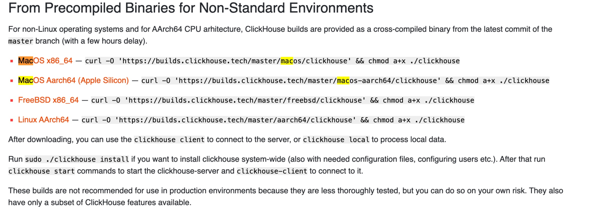

**Demo**
准备数据：
curl https://datasets.ClickHouse.tech/hits/tsv/hits_v1.tsv.xz | unxz --threads=`nproc` > hits_v1.tsv
curl https://datasets.ClickHouse.tech/visits/tsv/visits_v1.tsv.xz | unxz --threads=`nproc` > visits_v1.tsv
解压xz文件需要按照xz压缩库：

```
wget http://tukaani.org/xz/xz-5.2.3.tar.gz
tar -zxf xz-5.2.3.tar.gz
cd xz-5.2.3
./configure
make
make install
xz -V  
```

https://ClickHouse.com/docs/en/getting-started/tutorial/
更多例子：
https://ClickHouse.com/docs/en/getting-started/example-datasets/  

# ClickHouse的表引擎原理  

**ClickHouse表引擎概述**
- 1. MergeTree表引擎：允许根据主键和日期创建索引。
  -  a. ReplacingMergeTree：该引擎和MergeTree的不同之处在于它会删除具有相同主键的重复项。数据的去重只会在合并的过程中出现。因此，ReplacingMergeTree适用于在后台清除重复的数据以节省空间，但是它不保证没有重复的数据出现。
  -  b. SummingMergeTree：把所有具有相同主键的行合并为一行，并添加合并行的聚合值。如果单个键值对应于大量的行，则可以显著的减少存储空间并加快数据查询的速度。
  - c. AggregatingMergeTree：将相同主键的所有行（在一个数据片段内）替换为单个存储一系列聚合函数状态的行。可以使用AggregatingMergeTree表来做增量数据统计聚合，包括物化视图的数据聚合。
- 2. Distributed分布式引擎本身不存储数据，但可以在多个服务器上进行分布式查询。
- 3. 外部存储表引擎，如HDFS、MySQL、JDBC、Kafka、File，相当于外部数据源。
- 4. 内存表引擎，如Memory、Set、Join、Buffer，实现内存加速和各种功能。
- 5. 还有其他如日志表引擎、接口引擎（自定义）、Null表引擎、URL表引擎等。  

## MergeTree的种类

- 用于数据更新/替换
  - ReplacingMergeTree
  - CollapsingMergeTree
- 用于预聚合
  - SummingMergeTree
  - AggregatingMergeTree
- 用于metrics统计
  - GraphiteMergeTree  

**ReplacingMergeTree引擎**
设计为相同分区的数据进行数据去重。

- 使用ORDER BY排序键作为唯一键。
- 以分区为单位进行去重，只在分区合并时触发。
- 如果参数没设置列，则保留重复数据的最后一行。
- 如果参数设置了列，则保留重复数据中取值最大的一行。  

```sql
CREATE TABLE replace_table (
  id String,
  code String,
  time DateTime
) ENGINE = ReplacingMergeTree()
PARTITION BY toYYYYMM(time)
ORDER BY (id, code)
PRIMARY KEY id
```

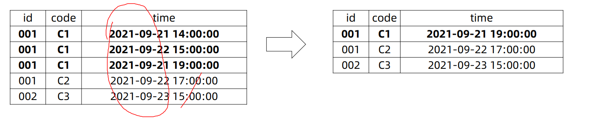

```sql
CREATE TABLE replace_table (
  id String,
  code String,
  time DateTime
) ENGINE = ReplacingMergeTree(time)
PARTITION BY toYYYYMM(time)
ORDER BY (id, code)
PRIMARY KEY id
```

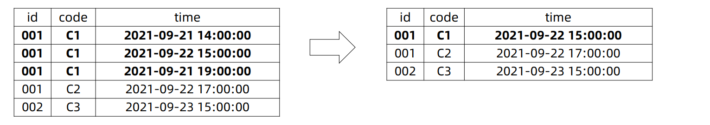

**SummingMergeTree引擎**
只需要根据GROUP BY条件得到汇总结果（SUM），不关心明细数据。
解决存储和查询的开销。

- 使用ORDER BY排序键作为聚合汇总的条件Key。
- 以分区为单位进行聚合，只在分区合并时触发。
- 如果指定了columns汇总列，则SUM汇总在这些列字段。
- 如果未指定columns汇总列，则SUM汇总在所有非主键的数值类型字段。
- 如果ORDER BY和PRIMARY KEY的字段不相同，PK列字段必须是ORDER BY的前缀，即ORDER BY(B, C) PRIMARY KEY A不合法。
- 非聚合字段，使用第一行数据的取值。  

```sql
CREATE TABLE summing_table (
id String,
code String,
v1 UInt32,
v2 Float64,
time DateTime
) ENGINE = SummingMergeTree()
PARTITION BY toYYYYMM(time)
ORDER BY (id, code)
PRIMARY KEY id
```

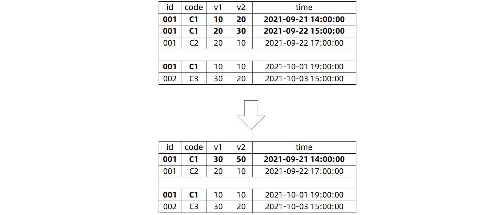

**AggregatingMergeTree引擎**
AggregatingMergeTree是SummingMergeTree的升级版。聚合函数需要通过
AggregateFunction实现。

- 使用ORDER BY排序键作为聚合数据的条件Key。
- 以分区为单位进行聚合，只在分区合并时触发。
- 不需要指定列，但需要通过AggregateFunction声明。
- 写入数据时，需要调用*State；读取数据时，需要调用*Merge。
- 通常用于物化视图。
- 数据不能通过普通的insert插入，而只能通过insert into select。  

```sql
CREATE TABLE agg_table (
  id String,
  code AggregateFunction(uniq, String),
  v1 AggregateFunction(sum, UInt32),
  time DateTime
) ENGINE = AggregateMergeTree()
PARTITION BY toYYYYMM(time)
ORDER BY (id, code)
PRIMARY KEY id
```

```
INSERT INTO TABLE agg_table
SELECT '001', uniqState('C1'), sumState(toUInt32(10)), xx
INSERT INTO TABLE agg_table
SELECT '001', uniqState('C1'), sumState(toUInt32(20)), yy
...
```

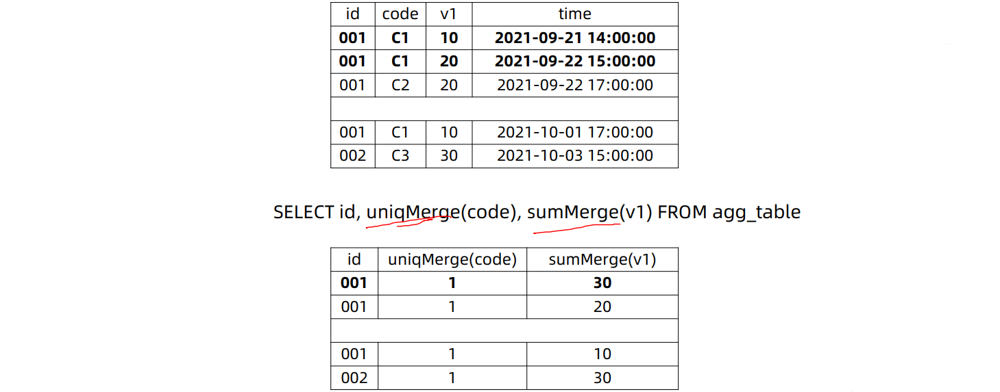

**CollapsingMergeTree和VerstionedCollapsingMergeTree引擎**

设计用于支持行级删除和修改。通过定义sign标记字段（-1，1）。

- 以分区为单位进行折叠，只在分区合并时触发。
- 如果sign=1比sign=-1多，则保留最后一行的sign=1的数据。
- 如果sign=-1比sign=1多，则保留第一行的sign=-1的数据。
- 如果sign=1和sign=-1一样多，且最后一行是sign=1，则保留第一行sign=-1和最后一行sign=1的数据。
- 如果sign=1和sign=-1一样多，且最后一行是sign=-1，则什么也不保留。
- 为了解决上述顺序问题，产生了VerstionedCollapsingMergeTree。
- Max和Min的指标无法通过该引擎实现  

```sql
CREATE TABLE collapse_table (
  id String,
  code String,
  time DateTime,
  sign Int8
) ENGINE = CollapsingMergeTree(sign)
PARTITION BY toYYYYMM(time)
ORDER BY id
```

```sql
CREATE TABLE ver_collapse_table (
  id String,
  code String,
  time DateTime,
  sign Int8,
  ver Int8
) ENGINE = VersionedCollapsingMergeTree(sign,ver)
PARTITION BY toYYYYMM(time)
ORDER BY id
```

**Replicated*MergeTree引擎**
在之前MergeTree的基础上增加了分布式协同能力，需要ZooKeeper广播。  

```sql
CREATE TABLE table_name (
  x UInt32
) ENGINE = ReplicatedMergeTree('/clickhouse/tables/{shard}/{database}/table_name', '{replica}')
ORDER BY x;
```

**MergeTree的分区**
MergeTree … PARTITION BY toYYYYMM(Date)

- ClickHouse的表可以根据任何表达式进行分区
- 不同分区不会进行合并
- 可以对分区进行操作
  - ALTER TABLE DROP PARTITION
  - ALTER TABLE DETACH/ATTACH PARTITION
- MinMax索引在分区列上
- 合并在后台进行
- 合并可以通过OPTIMIZE table命令触发
- 每8192行抽取一行作为稀疏索引
- 语法:ENGIN = MergeTree(EventDate, (CounterID, EventDate), 8192)  

**创建分区表**

```sql
CREATE TABLE sdata (
  DevId Int32,
  Type String,
  MDate Date,
  MDateTime DateTime,
  Value Fload64
) ENGINE = MergeTree()
PARTITION BY toYYYYMM(MDate)
ORDER BY (DevId, MDateTime)
```

假设分区为202109，分区目录的命名为202109_1_1_0  

**分区目录的合并**
在MergeTree引擎下，每次INSERT INTO，即使数据属于同一个分区，但数据在存储上都会生成一个新的分区目录。目录名为202109_1_1_0
命名规范：
partitionId_minBlockNum_maxBlockNum_level
BlockNum：
数据表全局自增，初始值从1开始，新建分区minNum和maxNum相同
Level：
合并的次数，初始值从0开始  

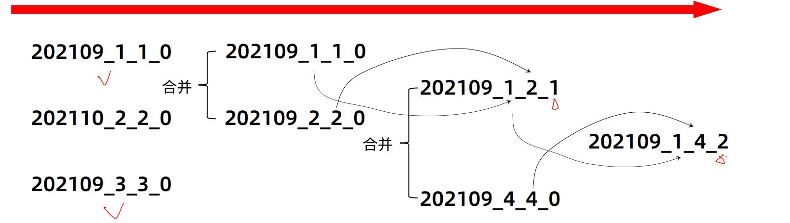

```sql
insert into sdata values (..., '202109')
insert into sdata values (..., '202110')
insert into sdata values (..., '202109')
insert into sdata values (..., '202109')
```

**MergeTree的存储结构**
每隔8192行数据，是1个block，主键会每隔8192，取一行主键列的数据，同时记录这是第几个block。  

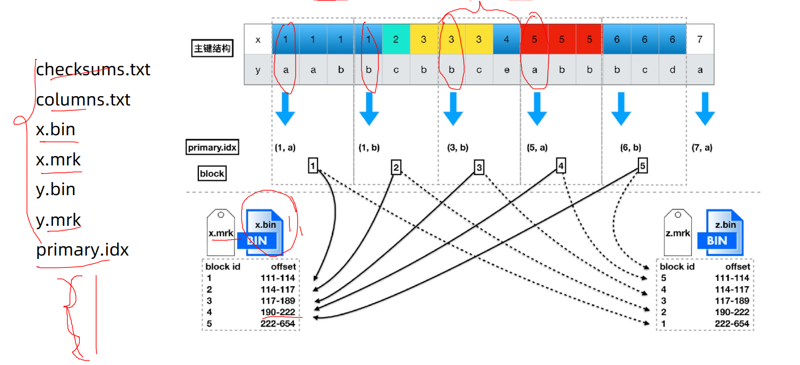


**查询的过程**
通过索引定位到block，然后找到这个block对应的mrk文件，mrk文件里记录的是某个block的数
据集在整列bin文件的哪个物理偏移位，加载数据到内存，之后并行化过滤：
- 1. 查询条件
- 2. 根据primary.idx找到数据在block的哪个位置
- 3. 根据mrk文件将数据加载到内存
- 4. 根据偏移量找到bin中的数据段  

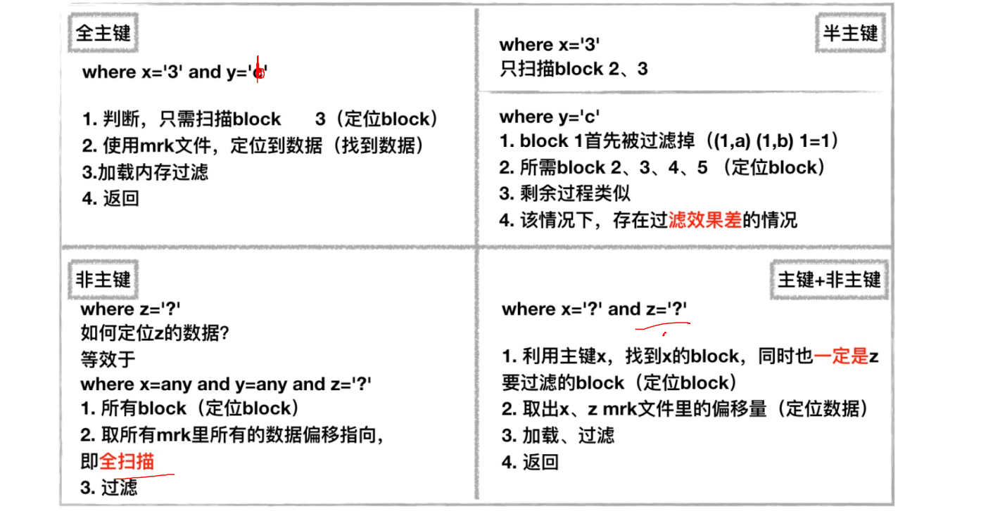

**分布性和高可用性**
以上过程的ClickHouse更像是个单机数据库，可以达到高性能和一致性。
如何做到分布性以及在分布式环境下同时获得高可用性，又回到了CAP理论。  

## Sharding和分布式表

- 一个节点只能放一个分片
- 分布式表只是逻辑的视图  

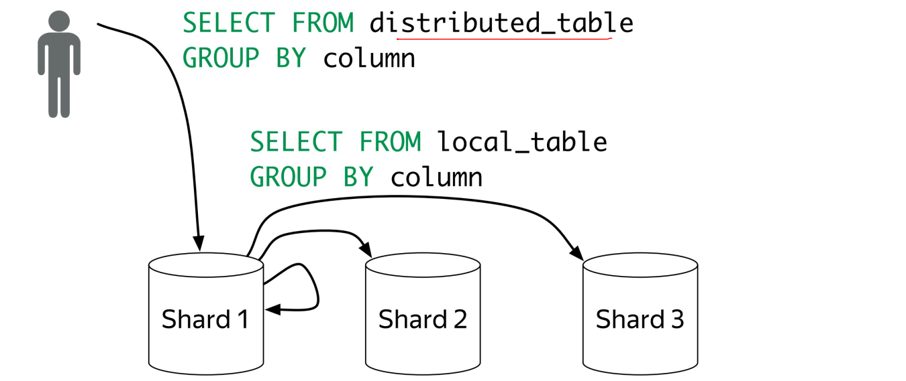

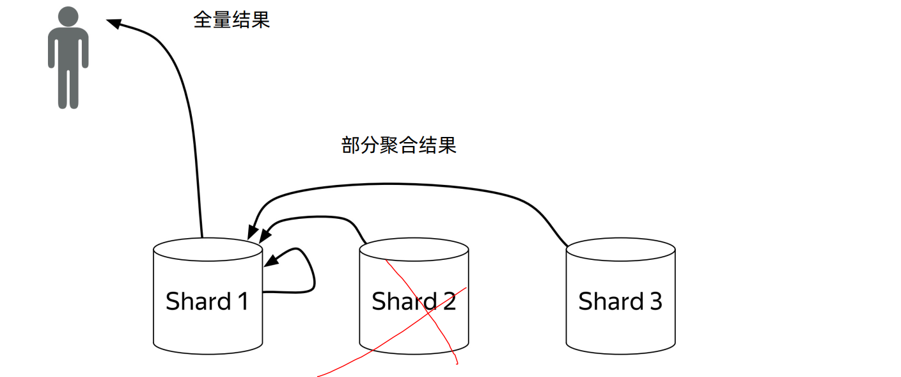

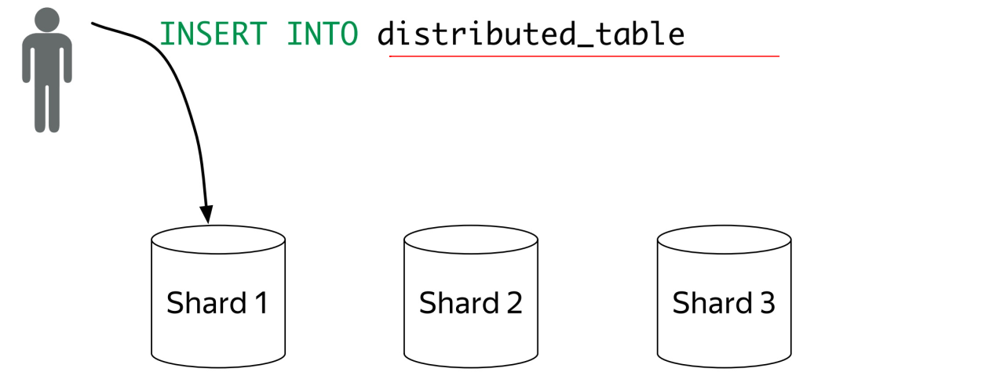

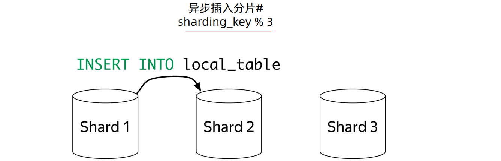

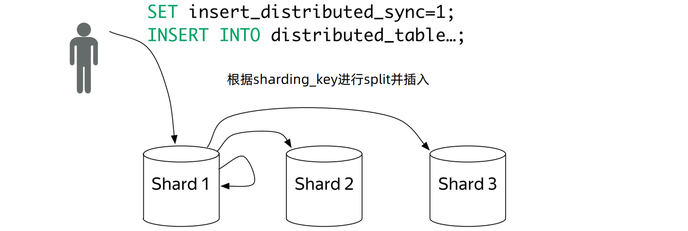

**一个例子**
SELECT passenger_count, avg(total_amount) FROM trips GROUP BY passenger_count
CSV 227 Gb, ~1.3 bln rows  

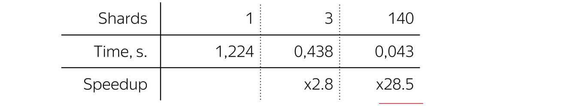

**如何创建分区和分布式表**  

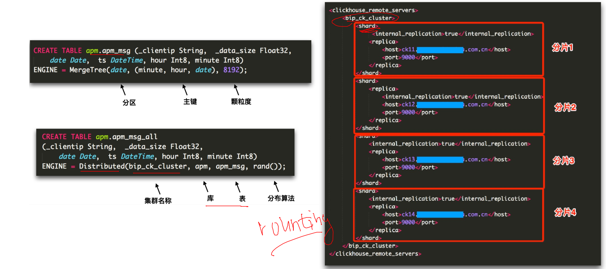

**如何创建复制达到高可用性**

- ClickHouse能在读写时进行容错
- 通过ReplicatedMergeTree
- master-master复制
- 表粒度  

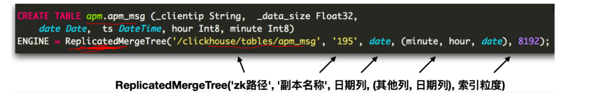

**复制的实现**

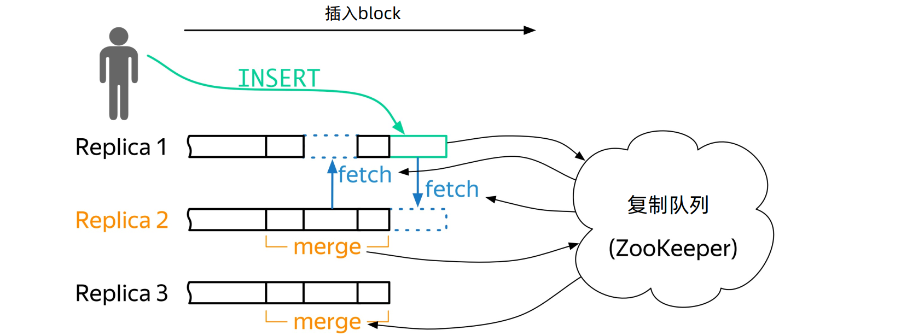

**分片+复制  **

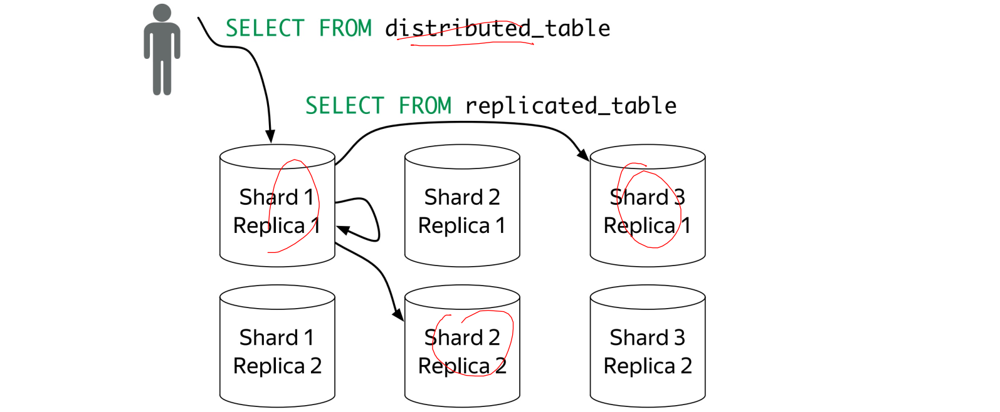

# ClickHouse的应用  

**eBay广告系统从Druid迁移至ClickHouse**  

eBay广告数据平台为eBay第一方广告主（使用Promoted Listing服务的卖家）提供了广告流量、用户行为和效果数据分析功能。
这一系统上线之初使用了自研的分布式SQL引擎，构建在对象存储系统之上。3年前随着广告流量增加，我们把数据引擎切换到Druid上。
主要挑战:

- 数据量大：每日的插入数据记录有数百亿条，每秒的插入峰值接近一百万条。
- 离线数据摄入：在不影响实时数据摄入的情况下，每天需要对前1-2天的数据进行在线替换。根据上游数据团队发布清洗过的每日数据，广告数据平台需要在不影响查询的情况下每日替换实时数据，数据切换要求实现跨节点的全局原子操作。
- 完整性和一致性：面向卖家的财务数据，离线更新后的数据要求不能有遗漏和重复；实时数据要求端对端的延迟在十秒内。  

**Druid vs ClickHouse**
Druid于2011年由Metamarkets开发，是一款高性能列式在线分析和存储引擎。它于2012年开源，2015年成为Apache基金会旗下项目。Druid在业界使用广泛，为千亿级数据提供亚秒级的查询延迟，擅长高可用、水平扩展；另外为数据摄入提供了很多非常方便的聚合、转换模版，内建支持多种数据源，最快可以在几十分钟内配置好新的数据表，包括数据定义和数据摄入链路（Lambda架构），大大提高了开发效率。那为什么还要切换呢？  

**痛点一：运维成本**
Druid虽然提供了很多非常方便的数据摄入功能，但它的组件构成也较为复杂，节点类型有6种（Overload、Coordinator、Middle Manager、Indexer、Broker和Historical）。除了自身的节点，Druid还依赖于MySQL存储元数据信息、ZooKeeper选举Coordinator和Overlord、HDFS备份历史数据。

ClickHouse的架构采用了对等节点的设计，节点只有一种类型，没有主从节点。如果使用了副本功能，则依赖于ZooKeeper保存数据段的同步进度。  

**痛点二：延时数据插入**
Druid通过引入实时数据的索引任务，把实时数据处理成一个个分段数据(segment)，并归档成历史数据。成为分段数据之后，该时段数据即不可写入。由于并发实时索引任务数的限制，我们设置了3个小时的窗口长度（每个小时一个任务），因此超过3个小时的数据就无法写入。在某些极端情况下，例如上游数据延迟或者实时数据消费过于滞后，就会导致离线数据替换前这部分数据的缺失。

ClickHouse则没有这个限制，任意分区都可以随时写入。  

**痛点三：排序键优化**
ClickHouse支持的主键并不是传统意义下关系型数据库的主键。传统的主键要求每条表记录都有唯一的键值，通过查询主键可以唯一地查询到一条表记录。而在ClickHouse中，主键定义了记录在存储中排序的顺序，允许重复，所以称之为排序键似乎更加合理。事实上在ClickHouse里的主键定义通过ORDER BY声明，仅在个别场景中允许和排序键不一致（但必须是排序键的前缀）。

由于我们的产品是给卖家提供分析功能，几乎所有的查询限定在了单一卖家维度，因此通过主键按照卖家排序，可以极大地提高查询效率以及数据压缩率。  

## 系统架构  

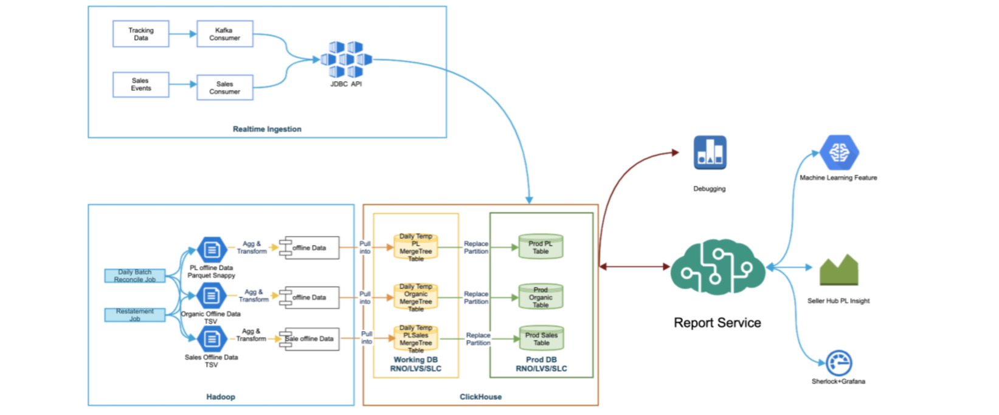

如图所示，系统由4个部分组成：

- 实时数据获取模块，接入eBay的行为和交易实时消息平台；
- 离线数据替换模块，接入eBay内部的数据仓库平台；
- ClickHouse部署和外围数据服务；
- 报表服务，支撑广告主、商家后台和eBay公开API。  

**Schema设计：表引擎和索引**
ClickHouse的存储引擎的核心是合并树(MergeTree)，以此为基础衍生出汇总合并树（SummingMergeTree）、聚合合并树（AggregationMergeTree）、版本折叠树（VersionCollapsingTree）等常用的表引擎。

另外上述所有的合并树引擎都有复制功能（ReplicatedXXXMergeTree）的对应版本。我们的广告数据平台的展示和点击数据选择了ReplicatedSummingMergeTree。

这两类用户行为数据量极大，减小数据量节省存储开销并提升查询效率是模式设计的主要目标。ClickHouse在后台按照给定的维度汇总数据，降低了60%的数据量。

销售数据选择了普通的复制合并树，一方面由于销售数据对某些指标有除汇总以外的聚合需求，另一方面由于本身数据量不大，合并数据的需求并不迫切。  

**Schema设计：索引**
一般情况下，ClickHouse表的主键（Primary Key）和排序键（Order By Key）相同，但是采用了汇总合并树引擎（SummingMergeTree）的表可以单独指定主键。

把一些不需要排序或者索引功能的维度字段从主键里排除出去，可以减小主键的大小（主键运行时需要全部加载到内存中），提高查询效率。

值得一提的是，对于基数较低的列，可以使用LowCardinality来降低原始存储空间。如果在使用压缩算法的情况下对一字符串类型的列使用LowCardinality，还能再缩小25%的空间量。  

**离线数据替换：挑战**

- 广告系统每天需要处理的用户离线数据量近1TB，在此之前，需要耗费大量时间将数据从Hadoop导入Druid。另外，导入期间的I/O、CPU和内存的开销对查询的压力不小。如何在保证数据一致性的同时，亦确保数据迁移的效率，是问题的关键。
- 如何在数据替换期间，确保用户可见的数据波动最小。这就要求数据替换操作是原子性的，或者至少对每个广告主都是原子的。
- 除了日常的离线数据更新，在数据仓库数据出现偏差遗漏时，需要支持大范围的数据修正和补偿。作业调度要求保证日常工作及时完成，并尽快完成数据修正工作。此外还需要监控数据更新中的各种指标，以应对各种突发状况。

Druid原生支持数据离线更新服务，我们与基础架构团队合作，在ClickHouse平台实现了这一功能。  

**离线数据替换：分区**

- ClickHouse里数据分区(partition)是一个独立的数据存储单元，每一个分区都可以单独从现有表里脱离(detach)、引入(attach)和替换(replace)。通过对数据表内数据分区的单个替换，我们可以做到查询层对底层数据更新的透明，也不需要额外的逻辑进行数据合并。
- 为了降低ClickHouse导入离线数据性能压力，我们引入了Spark任务对原始离线数据进行聚合和分片。每个分片可以分别拉取并导入数据文件，节省了数据路由、聚合的开销。
- 为了保证数据替换的原子性，在离线数据导入的过程中，首先创建目标分区的临时分区。当数据替换完毕并且校验完成之后，目标分区会被临时分区替换。
- 每一个数据分区，都有对应的活跃版本号。直到待替换数据分区的所有分片都成功导入之后，分区的版本号进行更新。上游应用的同一条SQL只能读取同一分区一个版本的数据。  

**离线数据替换：Spark数据更新**
对于每一张需要更新的表，启动一个Spark任务对数据进行聚合与分片。根据ClickHouse服务端返回的表结构与分片拓扑将数据写入Hadoop。系统通过Livy Server API提交并轮询任务状态，在有任务失败的情况下进行重试。离线数据更新不但要满足每天的批量数据更新需求，还需要支持过往数据的再次更新，以便同步上游数据在日常定时任务更新之外的数据变动。  

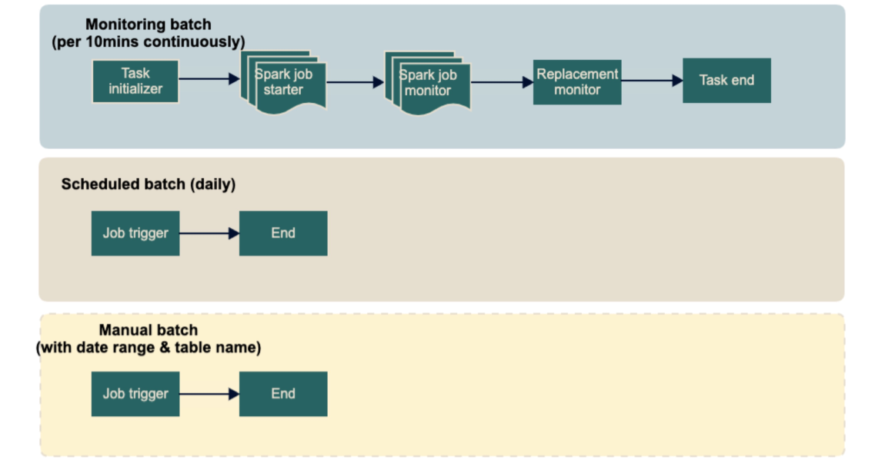

**离线数据替换：数据替换**
在所有Spark Job完成后，离线数据更新系统会调用基础架构团队提供的数据替换接口，发起数据替换请求。服务端按照定义好的分区，将数据从Hadoop直接写入ClickHouse，如图：  

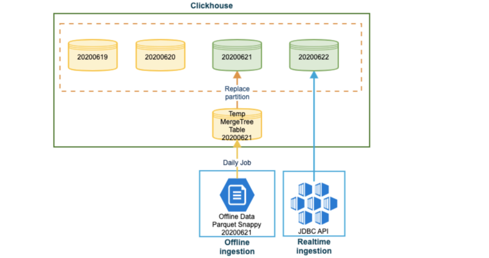

**离线数据更新系统的整体架构**  

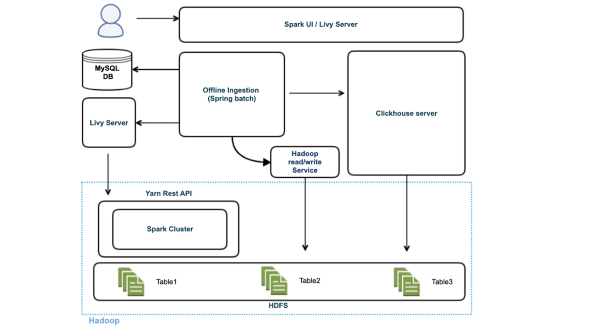

**查询服务API**
Ebay Seller Hub通过Reports Service接入ClickHouse查询。
Reports Service提供了Public和Internal两套API。
Internal API提供给Seller Hub以及其他内部的已知应用使用。
Public API开放给第三方开发者。
https://developer.ebay.com/  

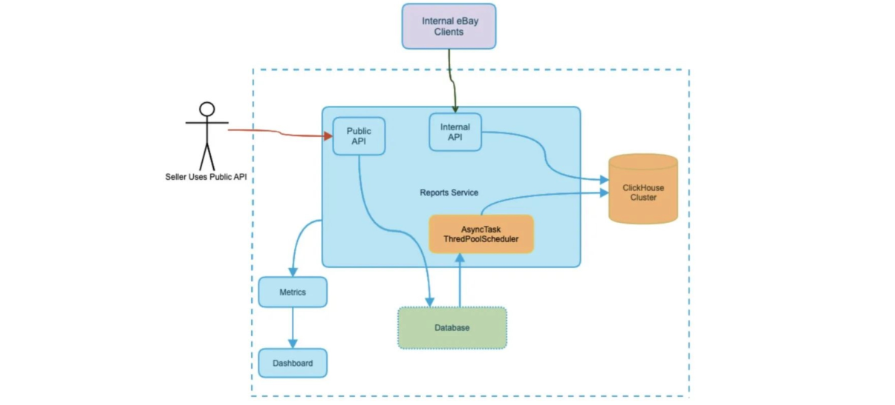

**查询服务GUI**
数据可视化方面，我们需要提供类似Turnilo的可视化工具给开发、测试和BI人员使用。
ClickHouse支持多种商业和开源的产品接入，我们选用了Cube.JS，并进行了简单的二次开发。  

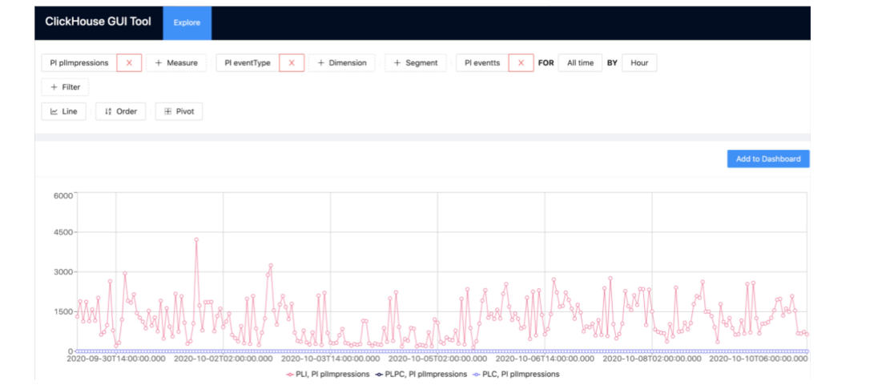


