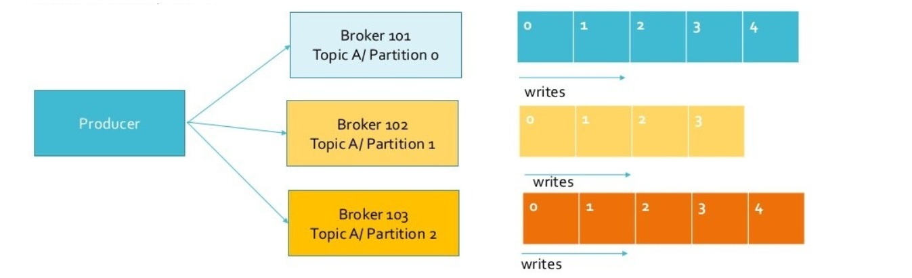

[TOC]

# 消息系统概述  

**为什么需要消息系统**

- 解耦
- 冗余
- 扩展性
- 灵活性 & 峰值处理能力
- 可恢复性
- 顺序保证
- 缓冲
- 异步处理
- 消息通信  

**需求开端**

- 直接建立连接  

**需求增加**

- 越来越多的连接建立  

**重构**

- 独立应用程序  

**重复**

- 重复的工作  

**统一Kafka**

- 独立应用程序  

**消息系统**

- 现在比较流行的MQ有：ActiveMQ、Kafka、RabbitMQ、Redis、Jafka、ZeroMQ  

**相关开源消息系统**

- RabbitMQ
  - RabbitMQ是使用Erlang编写的一个开源的消息队列，本身支持很多的协议：AMQP、XMPP、SMTP、STOMP，也正因如此，它非常重量级，更适合于企业级的开发。
  - 同时实现了Broker构架，这意味着消息在发送给客户端时先在中心队列排队。
  - 对路由、负载均衡或者数据持久化都有很好的支持。
- ZeroMQ
  - ZeroMQ号称最快的消息队列系统，尤其针对大吞吐量的需求场景。
  - ZeroMQ能够实现RabbitMQ不擅长的高级/复杂的队列，但是开发人员需要自己组合多种技术框架。
  - 但是ZeroMQ仅提供非持久性的队列，也就是说如果宕机，数据将会丢失。
- ActiveMQ
  - ActiveMQ是Apache下的一个子项目。 类似于ZeroMQ，它能够以代理人和点对点的技术实现队列。
  - 同时类似于RabbitMQ，它少量代码就可以高效地实现高级应用场景。  

**生产者/消费者模型**

- 在生产者／消费者模型中，生产者Producer负责生产数据，而消费者Consumer负责使用数据。多个生产者会在同一时间生产数据，并放到内存中一个共享的区域。  

# Kafka的发展和现状  

**Apache Kafka History**  

**KSQL  **

# Kafka系统架构和原理  

**Topics和Append Log**

- Kafka提供的一个抽象概念：topic。
- 一个topic是对一组消息的归纳。
- 每个topic将被分成多个partition。
- 每个partition会生成一个append log文件。
- 每条消息在文件中的位置称为offset（偏移量），唯一标记一条消息。  

**Producer和Consumer**

- Producer即生产者，向Kafka集群发送消息，消息会安装Topic进行分类。
- Consumer即消费者，消费者通过与Kafka集群建立长连接的方式，不断地从集群中拉取消息，然后可以对这些消息进行处理。它需要保存消费消息的offset：当consumer正常消费消息时，offset将会“线性”的增加，即消息将依次顺序被消费。通过设置offset，consumer可以从任意位置消费消息。
- Consumer可以在本地保存最后消息的offset，并向ZooKeeper注册offset。  

**Consumer Group**

- 这是Kafka用来实现一个topic消息广播的手段。即多个不同的group来同时消费同一个topic下的消息。他们消费的offset各不相同，各不干扰。
- 一个group中，Consumer的数量不应该多于Partition的数量，即一个消费者可以消费多个分区，但一个分区只能给一个消费者消费。若一个group中的消费者数量大于Partition数量的话，多余的消费者将不会收到任何消息。  

**Broker**

- 消息保存在一组服务器中，它们被称为代理（Broker）或Kafka集群。
- 每个Broker有一个Broker id。
- 每个Broker存储Topic的部分数据。
- Kafka的存储文件按照offset.kafka来命名，用offset做名字的好处是方便查找。例如你想找位于2049的位置，只要找到2048.kafka的文件即可。第一个个存储文件是00000000000.kafka。  

**整体架构图**

**消息传送机制**

- 对于传统消息系统，消息传输担保非常直接：有且只有一次(exactly once)。在Kafka中稍有不同：
  - at most once：消息最多发生一次，无论消费者是否接受到，都不会重发。
  - at least once：消息至少发送一次，如果消息未能接受成功，会重发直到接收成功。
  - exactly once：消息只会发送一次。  

**Kafka中各语义如何实现**

- at most once：消费者fetch消息，先保存消息的offset，然后处理消息。当消费者保存offset之后，但是在消息处理过程中出现了异常，导致部分消息未能继续处理。那么此后“未处理”的消息将不能被fetch到，这就是“at most once”。
- at least once：消费者fetch消息，先处理消息，然后保存offset。如果消息处理成功之后，但是在保存offset阶段，ZooKeeper异常导致保存操作未能执行成功，这就导致接下来再次fetch时可能获得上次已经处理过的消息，这就是“at least once”。
- exactly once：Kafka中并没有严格的去实现（基于2阶段提交、事务），我们认为这种策略在Kafka中是没有必要的。  

# 可靠消息传输  

**Replica**

- Kafka将每个partition数据复制到多个server上，任何一个partition有一个leader和零个或多个follower（ISR），称为partition的副本（replica）。
- Leader处理所有的读写请求，follower需要和leader保持同步。Follower和consumer一样，消费消息并保存在本地日志中。
- 当所有的follower都将一条消息保存成功，此消息才被认为是“committed”。只有committed的消息，consumer才能消费它。
- 当leader失效时，需在followers中选取出新的leader。可能此时follower落后于leader，因此需要选择一个尽可能“新”的follower。  

**容灾**  

**Producer ACK**

- ACK=0，即没有ack，可能会造成数据丢失（at most once）
- ACK=1，producer会等接收到Leader的ack再发生下一条消息（at most once）
- ACK=all，producer会等接收到Leader+Follower的ack再发生下一条消息（at leastonce / exactly once）  

**Producer Key**

- Producer可以为发送的消息设置Key来进行发生模式选择。
- 当key=null，数据才用轮训（Round Robin）方式进行发送。
- 当key!=null，数据可以根据散列键（Hash）方式进行发送，相同Key的数据能发送到同一个Partition。  

**Consumer Rebalance**

- Consumer记录每个partition所消费的maximum offset，并定期commit到offsetmanager。
- 属于同一个group的consumer（group id一样）平均分配partition，每个partition只会被一个consumer消费。  

- ZooKeeper会管理broker与consumer的动态关系。
- 当broker或consumer加入或离开时会触发负载均衡算法，使得一个consumergroup内的多个consumer的订阅负载平衡。
- ZooKeeper还维护每个partition的消费offset。
- 算法：
  - 假如topic1,具有如下partitions: P0,P1,P2,P3
  - 假如group中,有如下consumer: C1,C2
  - 首先根据partition索引号对partitions排序: P0,P1,P2,P3
  - 根据consumer.id排序: C0,C1
  - 计算倍数: M = [P0,P1,P2,P3].size / [C0,C1].size,本例值M=2(向上取整)
  - 然后依次分配partitions: C0 = [P0,P1],C1=[P2,P3]
  - Ci = [P(i * M),P((i + 1) * M -1)]  

# PageCache和Zero Copy  

**文件存储**

- 在Kafka文件存储中，同一个topic下有多个不同partition，每个partition为一个目录，partiton目录的命名规则为topic名称+有序序号，第一个partiton序号从0开始。
- 每个partition目录存储着多个segment数据文件。Segment数据文件size固定，但消息数量不一定相等。默认保留7天。
- 每个segment由index file（.index后缀）和data file（.log后缀）”组成。
- Partition全局的第一个segment从0开始，后续每个segment文件名为上一个segment文件最后一条消息的offset值。  

**Segment存储**

- 疑问一：为什么要分区呢？
  为了性能考虑，如果不分区每个topic的消息只存在一个broker上，那么所有的消费者都是从这个broker上消费消息，那么单节点的broker成为性能的瓶颈，如果有分区的话生产者发过来的消息分别存储在各个broker不同的partition上，这样消费者可以并行的从不同的broker不同的partition上读消息，实现了水平扩展。
- 疑问二：为什么有了partition还需要segment ？
  如果不引入segment，那么一个partition只对应一个文件（log），随着消息的不断发送这个文件不断增大，由于Kafka的消息不会做更新操作都是顺序写入的，如果做消息清理的时候只能删除文件的前面部分删除，不符合Kafka顺序写入的设计，如果多个segment的话那就比较方便了，直接删除整个文件即可保证了每个segment的顺序写入。
- 疑问三：分区文件下到底存了那些东西？
  其实每个分区下保存了很多文件，而概念上我们把他叫segment，即每个分区都是又多个segment构成的，其中index（索引文件）、log（数据文件）、time index（时间索引文件）统称为一个segment。  

**消费者如何通过offset查找message**
假如我们想要读取offset=1066的message，需要通过下面2个步骤查找：
- 1. 查找segment file
0000.index表示最开始的文件，起始偏移量(offset)为0。第二个文件1018.index的消息量起始偏移量为1019(1018 +1)。同样，第三个文件2042.index的起始偏移量为2043(2042 + 1)。只要根据offset进行二分查找文件列表，就可以快速定位到具体文件。当offset=1066时定位到1018.index|log。
- 2. 通过segment file查找message
通过第一步定位到segment file，当offset=1066时，依次定位到1018.index的元数据物理位置和1018.log的物理偏移地址，此时我们只能拿到1065的物理偏移地址，然后再通过368769.log顺序查找直到offset=1066为止。  

**高性能**

- Kafka官方测试其数据读写速率能达到600M/s，那么为什么性能会这么高呢？
- sequence IO
- PageCache
- Zero Copy (SendFile)  

**sequence IO**
• Kafka在将数据持久化到磁盘时，采用只追加的顺序写，有效降低了寻址时间，提高效率。  

**PageCache**

- PageCache是Linux系统级别的缓存，它把尽可能多的空闲内存当作磁盘缓存使用来进一步提高IO效率。
- 当写操作发生时，操作系统只是将数据写入PageCache，同时标记Page属性为Dirty。当读操作发生时，先从PageCache中查找，如果发生缺页才进行磁盘调度，最终返回需要的数据。  

**PageCache**

- Producer把消息发到broker后，数据并不是直接落入磁盘的，而是先进入PageCache。PageCache中的数据会被内核中的处理线程采用同步或异步的方式写回到磁盘。
- Consumer消费消息时，会先从PageCache获取消息，获取不到才回去磁盘读取，并且会预读出一些相邻的块放入PageCache，以方便下一次读取。  

**Zero Copy**
传统的网络I/O过程：
- 1.操作系统从磁盘把数据读到内核区
- 2.用户进程把数据从内核区copy到用户区
- 3.然后用户进程再把数据写入到内核区的socket buffer上
- 4.最后把数据从socket buffer中发送到到网卡  

- 通过SendFile（又称Zero Copy）优化后，数据从内核区copy到socket，然后发送到网卡，避免了数据在内核态和用户态的来回拷贝。
- 从Linux内核2.4版本开始，对于网卡支持SG-DMA的，SendFile进一步减少通过CPU把内核缓冲区里的数据拷贝到socket缓冲区的过程。  

# KSQL  

需求和产生

- 有什么方法能直接查询Kafka中已有的数据呢？
KSQL是一个用于Apache Kafka的流式SQL引擎，KSQL降低了进入流处理的门槛，提供了一个简单的、完全交互式的SQL接口，用于处理Kafka的数据，可以让我们在流数据上持续执行 SQL查询，KSQL支持广泛的强大的流处理操作，包括聚合、连接、窗口、会话等等。
- 与传统SQL的主要区别？
KSQL与关系型数据库中的SQL还是有很大不同的。传统的SQL都是即时的一次性操作，不管是查询还是更新都是在当前的数据集上进行。而KSQL则不同，KSQL的查询和更新是持续进行的，而且数据集可以源源不断地增加。KSQL所做的其实是转换操作，也就是流式处理。  

**适用场景**

- 实时监控
  CREATE TABLE error_counts AS
  SELECT error_code, count(\*)FROM monitoring_stream
  WINDOW TUMBLING (SIZE 1 MINUTE)
  WHERE type = 'ERROR';
  定义实时计算的自定义业务级别度量指标，你可以监控并发出警报，就像监控CPU负载那样。
- 安全检测
  CREATE STREAM possible_fraud AS
  SELECT card_number, count(\*)
  FROM authorization_attempts
  WINDOW TUMBLING (SIZE 5 SECONDS)
  GROUP BY card_number
  HAVING count(\*) > 3;
  KSQL查询将事件流转换成数值时间序列聚合，这些聚合使用Kafka-Elastic连接件输入到Elastic，并在Grafana UI中加以可视化。  

**适用场景**

- 联机数据整合
  CREATE STREAM vip_users AS
  SELECT userid, page, action
  FROM clickstream c
  LEFT JOIN users u ON c.userid = u.user_id
  WHERE u.level = 'Platinum';
  KSQL能够实现由批量数据整合转变为联机数据整合。可以使用数据流-表连接，或者将数据流加载到另一个系统之前，对PII（个人身份信息）数据执行简单的过滤。
- 应用程序开发
  使用Kafka的原生数据流API编写Java应用程序，可以做更复杂的应用开发。同时可以提供简单的SQL界面进行业务分析。  

**部署架构**

- 由一个KSQL服务器进程执行查询。
- 可以通过启动更多的KSQL实例来动态添加更多的处理能力。
- 这些KSQL实例是容错的，如果一个实例失败了，其他的就会接管它的工作。
- 查询是使用交互式的KSQL命令行客户端启动的，该客户端通过REST API向集群发送命令。
- KSQL内部是使用Kafka的Stream API构建的，它继承了它的弹性可伸缩性、先进的状态管理和容错功能。  

**Stream API**
KSQL集成了stream和table的概念。Apache Kafka中的一个topic可以表示为KSQL中的STREAM或TABLE，具体取决于topic处理的预期语义。  

**Stream**  

**KStream和KTable**  

**KSQL**

**练习**  

**Docker练习**

- https://docs.confluent.io/5.4.2/ksql/docs/installation/install-ksql-withdocker.html
- https://hub.docker.com/r/confluentinc/cp-ksql-server
- https://hub.docker.com/r/confluentinc/cp-ksql-cli/  

如何自定义去消费已经消费过的数据？  

