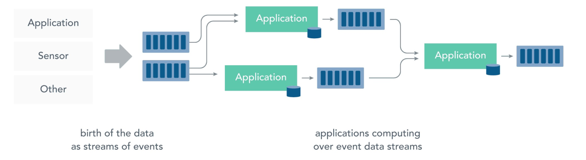
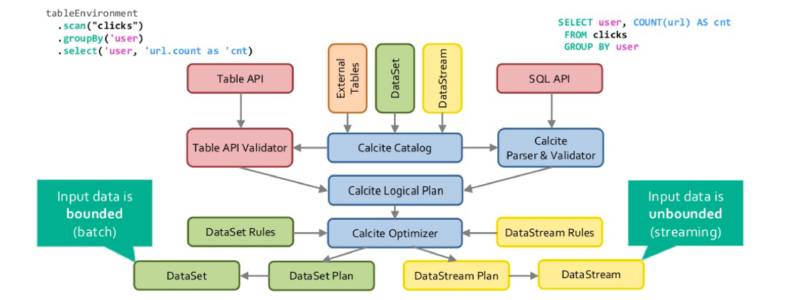
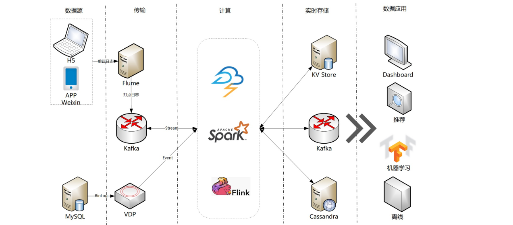
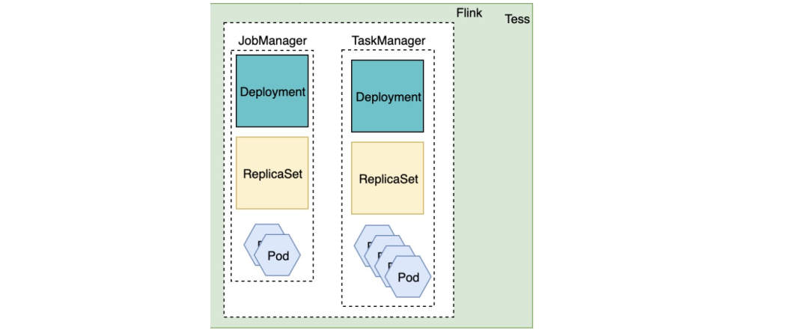

[TOC]

# 流式计算概念和基础  

**什么是流处理/流式计算**

- 流处理是对运动中的数据的处理，换句话说，在生成或接收数据时直接计算数据。
- 大多数数据都是连续的流：传感器事件、网站上的用户活动、金融交易等等。所有这些数据都是随着时间的推移而创建的。
- 在流处理之前，此数据通常存储在数据库、文件系统或其他形式的大容量存储中。应用程序将根据需要查询数据或计算数据。  


**什么是流处理/流式计算**

- 流处理改变了这种模式：应用逻辑，分析和查询始终存在，数据不断地流经它们。
- 在从流中接收到事件时，流处理应用程序对该事件作出反应。它可以触发动作，更新聚合或其他统计，或“记住”该事件以供将来参考。以及连接多个数据流，并产生数据流。  



**有状态流处理**

- 有状态流处理是流处理的子集。此状态用于存储从先前看到的事件派生的信息。
- 大多数的流处理都需要处理状态：
  -  防欺诈应用程序会保留信用卡的最后交易。将新的状态与保留的状态中进行比较，标记为有效或欺诈，并更新状态。
  - 在线推荐应用程序将保留描述用户偏好的参数。
- 有状态流处理需要支持状态管理的流处理器。  


**数据流**

- 数据流图被称为逻辑流图。为了执行一个数据流程序，Flink会将逻辑流图转换为物理数据流图。  


- 数据流可以改变执行的并行度：
  - 对输入数据进行分区，并在数据的子集上并行执行具有相同算子的任务并行。
  - 将不同算子在相同或不同的数据上并行执行。即任务并行，可以更好地利用资源。  

**数据交换**

- 数据交换策略定义了在数据流图中如何给数据分配给任务。
- Forward策略将数据从一个任务发送到接收任务。如果两个任务都位于同一台物理计算机上，这种交换策略可以避免网络通信。
- Broadcast策略将所有数据发送到算子的所有的并行任务上面去。因为这种策略会复制数据和涉及网络通信，所以代价相当昂贵。
- Key-based策略通过Key(键)对数据进行分区保证具有相同Key的数据将由同一任务处理。
- Raddom策略统一将数据分配到算子的任务中去，以便均匀地将负载分配到不同的计算任务。  


**性能指标**

流处理程序是连续的，输入是无界的，所以数据流处理中没有总执行时间的概念。相反，流处理必须尽可能快地计算。因此，引入延迟和吞吐量来表征流处理的性能要求。

- 延迟
  延迟表示处理事件所需要的时间，是接收事件和看到输出中处理此事件的效果之间的时间间隔。
- 吞吐量
  吞吐量以每个时间为单位系统所能处理的事件数量或操作数量来衡量。我们主要关心峰值吞吐量是多少，当系统处于最大负载性能怎样。  

## 算子

- 转换算子  


- 滚动聚合  


- 窗口函数
  转换和滚动聚合一次处理一个事件产生输出事件并更新状态。但是，有些操作必须收集并缓冲一些数据以计算其结果。窗口函数不断从无限事件流中创建有限的事件集，好让我们执行有限集的计算。常见窗口类型的语义：
- 滚动窗口是将事件分配到固定大小的不重叠的窗口中。  


- 滑动窗口事件将分配到固定大小的重叠的窗口中去。  


- 会话窗口事先没有定义窗口的长度，而是取决于数据的实际情况。  


- 将一条流分流成多个逻辑流并定义并行窗口。  


**时间语义**

- 真实世界的系统、网络和通信渠道远非完美，流数据经常被推迟或无序(乱序)到达。理解如何在这种条件下提供准确和确定的结果是至关重要的。
- 处理时间
  处理时间是处理流的应用程序的机器的本地时钟的时间。
- 事件时间
  事件事件是流中的事件实际发生的时间。事件时间基于流中的事件所包含的时间戳。通常情况下，在事件进入流处理程序前，事件数据就已经包含了时间戳。
  事件时间使得计算结果的过程不需要依赖处理数据的速度。基于事件时间的操作是可以预测的，而计算结果也是确定的。
  无论流处理程序处理流数据的速度快或是慢，事件时间窗口的计算结果都是一样的。  

**水位线Watermarks**

- 因为处理时间和事件时间总是不能完全一致，我们如何知道事件是迟到的？我们需要确定一个时间点之前的所有事件都已经到达之前，需要等待多久。
- 水位线是全局进度的度量标准。系统可以确信在一个时间点之后，不会有早于这个时间点发生的事件到来了。
- 当一个算子接收到含有时间T的水位线时，这个算子会认为早于时间T的发生的事件已经全部都到达了。
- 对于事件时间窗口和乱序事件的处理，水位线非常重要。算子一旦接收到水位线，算子会认为一段时间内发生的所有事件都已经观察到，可以触发针对这段时间内所有事件的计算了。
- 水位线提供了一种结果可信度和延时之间的妥协。激进的水位线设置可以保证低延迟，但结果的准确性不够。如果水位线设置得过于宽松，计算的结果准确性会很高，但可能会增加流处理程序不必要的延时。  

**流和Flink**

- 无界流：我们不能等到所有数据都到达再处理，因为输入是无限的。数据通常要求以特定顺序摄取。
- 有界流：可以在摄取所有数据后再进行计算。有界流所有数据可以被排序。  


Apache Flink是一个分布式处理引擎，用于在无边界和有边界数据流上进行有状态的计算。  

**状态和Flink**

- 状态是Flink中的一等公民
- 持久化和checkpoint
- 精确一次语义  


Apache Flink是一个针对无界和有界数据流进行有状态计算的框架。状态访问都在本地进行，这有助于其提高吞吐量和降低延迟。可以是在内存中，也可以将其以结构化数据格式存储在高速磁盘中。  


# Flink发展和现状  

**Flink的发展历史**


**Flink的应用场景**
- 1.基于实时数据流的数据处理（Streaming Processing），通常在数十毫秒到数百毫秒之间。
- 2.典型的事件驱动类应用， 包括欺诈检测(Fraud detection)、异常检测(Anomaly detection)、基于规则的告警(Rule-based alerting)、业务流程监控(Business process monitoring)、Web应用程序(社交网络)等。
- 3.实时的数据分析应用（Real-time Data Analytics Applications）。
- 4.管道式ETL（Data Pipeline Applications），比如启动一个Flink实时应用，数据源（比如数据库、Kafka）中的数据不断的通过Flink Data Pipeline流入或者追加到数据仓库（数据库或者文件系统），或者Kafka消息队列。  

**事件驱动型应用**

- 根据到来的事件触发计算、状态更新或其他外部动作  


- 典型的事件驱动型应用实例
  - 反欺诈
  - 异常检测
  - 监控和报警  

- 实时数据分析应用
  - 和传统模式下读取有限数据集不同，流式查询或应用会接入实时事件流，并随着事件消费持续产生和更新结果。  


- 典型的实时数据分析应用实例
  - 电信网络质量检测
  - 消费数据实时分析  

**数据管道应用**

- 数据管道应用是一种类似于ETL作业的应用，都可以转换、丰富数据，并将其从某个存储系统移动到另一个。但数据管道是以持续流模式运行，而非周期性触发。  


- 典型的数据管道应用实例
  - 电子商务中的实时查询索引构建
  - 持续ETL  

**Flink生态圈**  


# Flink架构  

**统一计算引擎**

- Apache Flink是统一的大数据分析和流计算、批计算以及机器学习引擎。  


**Flink运行时**  


**Flink API**

- Flink根据抽象程度不同，提供了三种不同的API。每一种API在简洁性和表达力上有着不同的侧重，并且针对不同的应用场景。
  - ProcessFunction：提供了基于事件的对于时间和状态的细粒度控制。
  - DataStream：提供了流处理原语，预定义了map()、reduce()、aggregate() 等函数。
  - SQL/Table API：借助了Apache Calcite，将无边界流和有边界数据进行统一。  


**Flink程序与数据流结构**  


**Flink架构图**

- Flink运行时由两种类型的进程组成：一个JobManager和一个或者多个TaskManager。  


**JobManager**

- ResourceManager
  - ResourceManager负责Flink集群中的资源管理（它管理task slots）
  - Flink为不同的环境（例如YARN、Kubernetes和standalone）实现了对应的ResourceManager
- Dispatcher
  - 提供了一个REST接口，用来提交Flink应用程序执行
  - 为每个提交的作业启动一个新的JobMaster
  - 运行Flink WebUI
- JobMaster
  - JobMaster负责管理单个JobGraph的执行  

**TaskManager**

- TaskManager（也称为worker）执行作业流的task，并且缓存和交换数据流。
- 每个worker（TaskManager）都是一个JVM进程。
- Task slots控制一个TaskManager中接受多少个task。
- Flink允许subtask共享slot，即便它们是不同的task的subtask，只要是来自于同一作业即可。
  - 允许subtask共享slot：可以获得更好的资源利用。  

**Task和SubTask**


**Task并行度**


**Flink的三种集群**

- Flink Session集群
  在Flink Session集群中，客户端连接到一个预先存在的、长期运行的集群，该集群可以接受多个作业提交。即使所有作业完成后，集群（和JobManager）仍将继续运行直到手动停止session为止。因此，Flink Session集群的寿命不受任何Flink作业寿命的约束。
- Flink Job集群
  在Flink Job集群中，可用的集群管理器（例如YARN）用于为每个提交的作业启动一个集群，并且该集群仅可用于该作业。在这里，客户端首先从集群管理器请求资源启动JobManager，然后将作业提交给在这个进程中运行的Dispatcher。然后根据作业的资源请求惰性的分配TaskManager。一旦作业完成，Flink Job集群将被拆除。
- Flink Application集群
  Flink Application集群是专用的Flink集群。将应用程序逻辑和依赖打包成一个可执行的作业JAR中，使用（ApplicationClusterEntryPoint）调用main()方法来提取JobGraph。可以在Kubernetes上部署Flink应用程序。  

**Flink的三种集群**  


**Flink初体验**
步骤 1：下载（http://flink.apache.org/zh/downloads.html）

- $ tar -xzvf flink-1.14.0-bin-scala_2.12.tgz
- $ cd flink-1.14.0

步骤 2：启动集群（Flink附带了一个bash脚本，可以用于启动本地集群）

- $ ./bin/start-cluster.sh

步骤 3：提交作业（Job）

- $ ./bin/flink run examples/streaming/WordCount.jar
- $ tail log/flink-*-taskexecutor-*.out

步骤 4：查看UI

- http://localhost:8081/#/overview

步骤 5：停止集群

- ./bin/stop-cluster.sh  

**Flink应用——事件计数**

- Click Event Count（事件计数作业）需要一对输入输出，分别使用两个Kafka Topic（input和output）。
- 该Job负责从input topic消费点击事件ClickEvent，每个点击事件都包含一个timestamp和一个page属性。这些事件将按照page属性进行分组，然后按照每15s窗口windows进行统计， 最终结果输出到output topic中。  


**Flink应用——环境搭建**

- 配置文件位于flink-playgrounds仓库中， 首先检出该仓库并构建docker镜像：
  - git clone https://github.com/apache/flink-playgrounds.git
  - cd flink-playgrounds/operations-playground
  - docker-compose build
- 接下来在开始运行之前先在Docker主机上创建检查点和保存点目录
  - mkdir -p /tmp/flink-checkpoints-directory
  - mkdir -p /tmp/flink-savepoints-directory
- 然后启动环境：
  - docker-compose up -d
- 接下来执行如下命令来查看正在运行中的Docker容器：
  - docker-compose ps
- 执行如下命令停止docker环境：
  - docker-compose down -v  

**Flink应用——更多操作**

- Flink WebUI界面
  - 打开浏览器并访问http://localhost:8081
- 日志
  - 查看JobManager日志：docker-compose logs -f jobmanager
  - 查看TaskManager日志：docker-compose logs -f taskmanager
- 使用Flink CLI
  - docker-compose run --no-deps client flink --help
- 使用Flink REST API
  - curl localhost:8081/jobs
- 查看Kafka Topics
  - docker-compose exec kafka kafka-console-consumer.sh --bootstrap-server localhost:9092 --topic input
  - docker-compose exec kafka kafka-console-consumer.sh --bootstrap-server localhost:9092 --topic output  

**Flink应用——Job失败与恢复**
在Job (部分)失败的情况下，Flink对事件处理依然能够提供精确一次的保障：

- 观察输出（通过控制台命令消费output topic）
  - docker-compose exec kafka kafka-console-consumer.sh --bootstrap-server localhost:9092 --topic output
- 模拟失败
  - kill掉一个TaskManager：docker-compose kill taskmanager（紫色代表SCHEDULED）  


- 失败恢复
  - TaskManager重启：docker-compose up -d taskmanage
  - 有的任务将会从失败前最近一次成功的checkpoint进行恢复  

**Flink DataStream API**

- Flink中的DataStream程序是对数据流（例如过滤、更新状态、定义窗口、聚合）进行转换的常规程序。
- Source + Stream Operation + Sink
- 流程：
  - 1.获取一个执行环境（execution environment）；
  - 2.加载/创建初始数据；
  - 3.指定数据相关的转换；
  - 4.指定计算结果的存储位置；
  - 5.触发程序执行  

**DataStream API WordCount**
基于流窗口的单词统计应用程序，计算5秒窗口内来自Web套接字的单词数。
要运行示例程序，首先从终端使用netcat启动输入流：nc -lk 9999  

```scala
import org.apache.flink.streaming.api.scala._
import org.apache.flink.streaming.api.windowing.time.Time
object WindowWordCount {
    def main(args: Array[String]) {
        val env = StreamExecutionEnvironment.getExecutionEnvironment
        val text = env.socketTextStream("localhost", 9999)
        val counts = text.flatMap { _.toLowerCase.split("\\W+") filter { _.nonEmpty } }
        .map { (_, 1) }
        .keyBy(_._1)
        .window(TumblingProcessingTimeWindows.of(Time.seconds(5)))
        .sum(1)
        counts.print()
        env.execute("Window Stream WordCount")
    }
}
```

**WordCount Java**

```java
import org.apache.flink.api.java.tuple.Tuple2;
import org.apache.flink.streaming.api.datastream.DataStream;
import org.apache.flink.streaming.api.environment.StreamExecutionEnvironment;
import org.apache.flink.streaming.api.windowing.time.Time;
import org.apache.flink.util.Collector;
public class WindowWordCount {
    public static void main(String[] args) throws Exception {
        StreamExecutionEnvironment env = StreamExecutionEnvironment.getExecutionEnvironment();
        DataStream<Tuple2<String, Integer>> dataStream = env
            .socketTextStream("localhost", 9999)
            .flatMap(new Splitter())
            .keyBy(value -> value.f0)
            .window(TumblingProcessingTimeWindows.of(Time.seconds(5)))
            .sum(1);
        dataStream.print();
        env.execute("Window WordCount");
    }
    public static class Splitter implements FlatMapFunction<String, Tuple2<String, Integer>> {
        
        @Override
        public void flatMap(String sentence, Collector<Tuple2<String, Integer>> out) throws Exception {
            for (String word: sentence.split(" ")) {
                out.collect(new Tuple2<String, Integer>(word, 1));
            }
        }
    }
}
```

**提交任务**

- ./bin/start-cluster.sh（首先得启动集群）
- UI提交  


- 命令提交
  ./flink run -c flink.StreamWordCount -p 2 myspark-1.0-SNAPSHOT.jar
- 取消任务
  ./flink cancel 97e8af8af740098de8e80a8aedd16839  

# Flink核心算子  

**算子**
**用户通过算子能将一个或多个DataStream转换成新的DataStream。**

- Map (DataStream → DataStream)
  - dataStream.map { x => x * 2 }
- FlatMap (DataStream → DataStream)
  - dataStream.flatMap { str => str.split(" ") }
- Filter (DataStream → DataStream)
  - dataStream.filter { _ != 0 }
- KeyBy (DataStream → KeyedStream)
  - dataStream.keyBy(_._1)
- Reduce (KeyedStream → DataStream)
  - keyedStream.reduce { _ + _ }  

**Window算子**

- Window (KeyedStream → WindowedStream)
  - dataStream.keyBy(_._1).window(TumblingEventTimeWindows.of(Time.seconds(5)))
- WindowAll (DataStream → AllWindowedStream)
  - dataStream.windowAll(TumblingEventTimeWindows.of(Time.seconds(5)))
- Window Apply (WindowedStream/AllWindowedStream → DataStream)
  - windowedStream.apply { WindowFunction }
  - allWindowedStream.apply { AllWindowFunction }
- WindowReduce (WindowedStream → DataStream)
  - windowedStream.reduce { _ + _ }
- Window Join (DataStream,DataStream → DataStream)
  - dataStream.join(otherStream).where(<key selector>).equalTo(<key
    selector>).window(TumblingEventTimeWindows.of(Time.seconds(3))).apply { ... }  


**Partition算子**
Flink提供以下方法让用户根据需要在数据转换完成后对数据分区进行更细粒度的配置：

- Custom Partitioning (DataStream → DataStream)
  - dataStream.partitionCustom(partitioner, "someKey")
- Random Partitioning (DataStream → DataStream)
  - dataStream.shuffle()
- Rescaling (DataStream → DataStream)
  - dataStream.rescale()
- Broadcasting (DataStream → DataStream)
  - dataStream.broadcast()  

**Chain算子**
将两个算子链接在一起能使得它们在同一个线程中执行，从而提升性能。Flink默认会将能链接的算子尽可能地进行链接。

- Start New Chain
  - someStream.filter(...).map(...).startNewChain().map(...)
- Disable Chaining
  - someStream.map(...).disableChaining()
- Set Slot Sharing Group
  - someStream.filter(...).slotSharingGroup("name")

更多算子可以参考: https://zhuanlan.zhihu.com/p/356616078  

**窗口**

- 在窗口计算之前对一个DataStream按照Key进行分组。
- 经过keyBy的数据流将形成多组数据，下游算子可以并行计算。
- windowAll不对数据流进行分组，所有数据将发送到下游算子单个实例上，相当于并发度为1。  

````
// Keyed Window
stream
	.keyBy(...) <- 按照一个Key进行分组
	.window(...) <- 将数据流中的元素分配到相应的窗口中
	[.trigger(...)] <- 指定触发器Trigger（可选）
	[.evictor(...)] <- 指定清除器Evictor(可选)
	.reduce/aggregate/process() <- 窗口处理函数Window Function

// Non-Keyed Window
stream
	.windowAll(...) <- 不分组，将数据流中的所有元素分配到相应的窗口中
	[.trigger(...)] <- 指定触发器Trigger（可选）
	[.evictor(...)] <- 指定清除器Evictor(可选)
	.reduce/aggregate/process() <- 窗口处理函数Window Function
````


**滚动窗口/滑动窗口/会话窗口**
窗口在Flink源码中，用TimeWindow表示。
滑动窗口可以根据Event Time或Processing Time分为：

- TumblingEventTimeWindows
- TumblingProcessingTimeWindows

滑动窗口以一个步长（Slide）不断向前滑动，窗口的长度固定。

- SlidingEventTimeWindows
- SlidingProcessingTimeWindows

会话窗口根据Session gap切分不同的窗口，当一个窗口在大于Session gap的时间内没
有接收到新数据时，窗口将关闭。

- EventTimeSessionWindows
- ProcessingTimeSessionWindows  

**滚动窗口例子**

```scala
val input: DataStream[T] = ...
// tumbling event-time windows
input
	.keyBy(<key selector>)
	.window(TumblingEventTimeWindows.of(Time.seconds(5)))
	.<windowed transformation>(<window function>)

// tumbling processing-time windows
input
	.keyBy(<key selector>)
	.window(TumblingProcessingTimeWindows.of(Time.seconds(5)))
	.<windowed transformation>(<window function>)

// daily tumbling event-time windows offset by -8 hours.
input
	.keyBy(<key selector>)
	.window(TumblingEventTimeWindows.of(Time.days(1), Time.hours(-8)))
	.<windowed transformation>(<window function>)
```


**滑动窗口例子**

```
val input: DataStream[T] = ...
// sliding event-time windows
input
	.keyBy(<key selector>)
	.window(SlidingEventTimeWindows.of(Time.seconds(10),Time.seconds(5)))
	.<windowed transformation>(<window function>)
// sliding processing-time windows
input
	.keyBy(<key selector>)
	.window(SlidingProcessingTimeWindows.of(Time.seconds(10),Time.seconds(5)))
	.<windowed transformation>(<window function>)
// sliding processing-time windows offset by -8 hours
input
	.keyBy(<key selector>)
	.window(SlidingProcessingTimeWindows.of(Time.hours(12),Time.hours(1), Time.hours(-8)))
	.<windowed transformation>(<window function>)
```


**会话窗口例子**  

```
val input: DataStream[T] = ...
// event-time session windows with static gap
input
	.keyBy(<key selector>)
	.window(EventTimeSessionWindows.withGap(Time.minutes(10)))
	.<windowed transformation>(<window function>)
// event-time session windows with dynamic gap
input
	.keyBy(<key selector>)
	.window(EventTimeSessionWindows.withDynamicGap(new SessionWindowTimeGapExtractor[String] {
		override def extract(element: String): Long = {
			// determine and return session gap
		}
	})).<windowed transformation>(<window function>)
// processing-time session windows with static gap
input
	.keyBy(<key selector>)
	.window(ProcessingTimeSessionWindows.withGap(Time.minutes(10)))
	.<windowed transformation>(<window function>)
// processing-time session windows with dynamic gap
input
	.keyBy(<key selector>)
	.window(DynamicProcessingTimeSessionWindows.withDynamicGap(new SessionWindowTimeGapExtractor[String] {
		override def extract(element: String): Long = {
			// determine and return session gap
		}
	}))
	.<windowed transformation>(<window function>)
```


## 窗口函数

数据经过了window后，数据已经被分配到不同的窗口里，接下来使用窗口函数，在个窗口上对窗口内的数据进行处理。窗口函数分为两种，一种用于增量计算，一种用全量计算。

- ReduceFunction
  ReduceFunction将中间结果和新流入数据两两合一，生成新的数据替换之前的状态数据 。

  ```scala
  // reduce的返回类型必须和输入类型StockPrice一致
  val sum = input
  	.keyBy(s => s.symbol)
  	.timeWindow(Time.seconds(10))
  	.reduce((s1, s2) => StockPrice(s1.symbol, s1.price + s2.price))
  ```

- AggregateFunction
- ProcessWindowFunction           

- AggregateFunction
  AggregateFunction保存了一个中间状态数据。  

```scala
val average = input
	.keyBy(s => s.symbol)
	.timeWindow(Time.seconds(10))
	.aggregate(new AverageAggregate)
```

```scala
case class StockPrice(symbol: String, price: Double)
// IN: StockPrice
// ACC：(String, Double, Int) - (symbol, sum, count)
// OUT: (String, Double) - (symbol, average)
class AverageAggregate extends AggregateFunction[StockPrice, (String,Double, Int), (String, Double)] {
    override def createAccumulator() = ("", 0, 0)
    override def add(item: StockPrice, accumulator: (String, Double, Int)) =
    (item.symbol, accumulator._2 + item.price, accumulator._3 + 1)
    override def getResult(accumulator:(String, Double, Int)) = (accumulator._1,accumulator._2 / accumulator._3)
    override def merge(a: (String, Double, Int), b: (String, Double, Int)) =
    (a._1 ,a._2 + b._2, a._3 + b._3)
}
```

```java
public interface AggregateFunction<IN, ACC, OUT> extends Function,Serializable {
    // 在一次新的aggregate发起时，创建一个新的Accumulator，
    Accumulator是我们所说的中间状态数据，简称ACC
        // 这个函数一般在初始化时调用
        ACC createAccumulator();
    // 当一个新元素流入时，将新元素与状态数据ACC合并，返回状态数据ACC
    ACC add(IN value, ACC accumulator);
    // 将两个ACC合并
    ACC merge(ACC a, ACC b);
    // 将中间数据转成结果数据
    OUT getResult(ACC accumulator);
}
```


- ProcessWindowFunction
  ProcessWindowFunction要对窗口内的全量数据都缓存。  

```scala
val frequency = input
	.keyBy(s => s.symbol)
	.timeWindow(Time.seconds(10))
	.process(new FrequencyProcessFunction)
```

```scala
class FrequencyProcessFunction extends ProcessWindowFunction[StockPrice,(String, Double), String, TimeWindow] {
    override def process(key: String, context: Context, elements: Iterable[StockPrice],
                         out: Collector[(String, Double)]): Unit = {
        // 股票价格和该价格出现的次数
        var countMap = scala.collection.mutable.Map[Double, Int]()
        for(element <- elements) {
            val count = countMap.getOrElse(element.price, 0)
            countMap(element.price) = count + 1
        }
        // 按照出现次数从高到低排序
        val sortedMap = countMap.toSeq.sortWith(_._2 > _._2)
        // 选出出现次数最高的输出到Collector
        if (sortedMap.size > 0) {
            out.collect((key, sortedMap(0)._1))
        }
    }
}
```

```java
/**
* IN 输入类型
* OUT 输出类型
* KEY keyBy中按照Key分组，Key的类型
* W 窗口的类型
*/
public abstract class ProcessWindowFunction<IN, OUT, KEY, W extends Window> extends AbstractRichFunction {
    /**
    * 对一个窗口内的元素进行处理，窗口内的元素缓存在Iterable<IN>，进行处理后输出到
    Collector<OUT>中
    * 我们可以输出一到多个结果
    */
    public abstract void process(KEY key, Context context, Iterable<IN> elements,Collector<OUT> out) throws Exception;
    /**
    * 当窗口执行完毕被清理时，删除各类状态数据。
    */
    public void clear(Context context) throws Exception {}
```

**Window Join**
Window Join是将具有相同key并位于同一个窗口中的事件进行Join。  

```scala
stream.join(otherStream)
	.where(<KeySelector>)
	.equalTo(<KeySelector>)
	.window(<WindowAssigner>)
	.apply(<JoinFunction>)
```

包含了Tumbling Windows Join、Sliding Windows Join和Session Windows Join。  

**Tumbling Windows Join**
定义了一个大小为2毫秒的滚动窗口，该窗口的形式为[0,1], [2,3], ...。该图显示了每个窗口中所有元素的成对组合，这些元素将传递给JoinFunction。注意，在最后一个窗口中上面的流不存在与6，7joined连接的元素。  


```scala
val orangeStream: DataStream[Integer] = ...
val greenStream: DataStream[Integer] = ...
orangeStream.join(greenStream)
	.where(elem => /* select key */)
	.equalTo(elem => /* select key */)
	.window(TumblingEventTimeWindows.of(Time.milliseconds(2)))
	.apply { (e1, e2) => e1 + "," + e2 }
```

**Sliding Windows Join**
使用的滑动窗口大小为2毫秒，滑动1毫秒，x轴以下是每个滑动窗口的Join结果。在这里你还可以看到下面的2与上面的3得到Join(2、3)，但没有1和2的Join(1、2)。  


```scala
orangeStream.join(greenStream)
	.where(elem => /* select key */)
	.equalTo(elem => /* select key */)
	.window(SlidingEventTimeWindows.of(Time.milliseconds(2) /* size */,
Time.milliseconds(1) /* slide */))
	.apply { (e1, e2) => e1 + "," + e2 }
```

**Session Windows Join**
定义一个会话窗口连接，其中每个会话被至少1ms的间隔所分割。有三个会话，在前两个会话中，来自两个流的连接元素被传递给JoinFunction。在第三次会话中绿色流没有元素，所以8，9不会Join。  


```scala
orangeStream.join(greenStream)
	.where(elem => /* select key */)
	.equalTo(elem => /* select key */)
	.window(EventTimeSessionWindows.withGap(Time.milliseconds(1)))
	.apply { (e1, e2) => e1 + "," + e2 }
```

**Interval Join**
Interval Join仅支持Event Time，表示A流 Join B流，B流中事件时间戳在A流所界定的范围内的数据Join起来，实现的是Inner Join。
我们将两个流“橙色”和“绿色”连接在一起，其下限为-2毫秒，上限为+1毫秒。图中时间戳为4的橙流没有Join到任何数据。  


```scala
orangeStream
	.keyBy(elem => /* select key */)
	.intervalJoin(greenStream.keyBy(elem => /* select key */))
	.between(Time.milliseconds(-2), Time.milliseconds(1))
	.process(new ProcessJoinFunction[Integer, Integer, String] {
        override def processElement(left: Integer, right: Integer, ctx: ProcessJoinFunction[Integer, Integer, String]#Context,
                                    out: Collector[String]): Unit = {
            out.collect(left + "," + right);
        }
    });
});
```


# Flink SQL  

**Table API和SQL**

- Apache Flink有两种关系型API来做流批统一处理：Table API和SQL。
- Table API是用于Scala和Java语言的查询API，它可以用一种非常直观的方式来组合使用选取、过滤、join等关系型算子。
- Flink SQL是基于Apache Calcite来实现的标准SQL。无论输入是连续的（流式）还是有界的（批处理），在两个接口中指定的查询都具有相同的语义，并指定相同的结果。  


**如何使用**


java

```
<dependency>
<groupId>org.apache.flink</groupId>
<artifactId>flink-table-api-java-bridge_2.11</artifactId>
<version>1.14.0</version>
<scope>provided</scope>
</dependency>
```
scala

```
<dependency>
<groupId>org.apache.flink</groupId>
<artifactId>flink-table-api-scala-bridge_2.11</artifactId>
<version>1.14.0</version>
<scope>provided</scope>
</dependency>
```

依赖

```
<dependency>
<groupId>org.apache.flink</groupId>
<artifactId>flink-table-planner_2.11</artifactId>
<version>1.14.0</version>
<scope>provided</scope>
</dependency>
<dependency>
<groupId>org.apache.flink</groupId>
<artifactId>flink-streaming-scala_2.11</artifactId>
<version>1.14.0</version>
<scope>provided</scope>
</dependency>
```


**例子**

```scala
import org.apache.flink.table.api._
import org.apache.flink.connector.datagen.table.DataGenOptions
// Create a TableEnvironment for batch or streaming execution.
// See the "Create a TableEnvironment" section for details.
val tableEnv = TableEnvironment.create(/*…*/)
// Create a source table
tableEnv.createTemporaryTable("SourceTable", TableDescriptor.forConnector("datagen")
                              .schema(Schema.newBuilder()
                                      .column("f0", DataTypes.STRING())
                                      .build())
                              .option(DataGenOptions.ROWS_PER_SECOND, 100)
                              .build())
// Create a sink table (using SQL DDL)
tableEnv.executeSql("CREATE TEMPORARY TABLE SinkTable WITH ('connector' = 'blackhole') LIKE SourceTable");
// Create a Table object from a Table API query
val table1 = tableEnv.from("SourceTable");
// Create a Table object from a SQL query
val table2 = tableEnv.sqlQuery("SELECT * FROM SourceTable");
// Emit a Table API result Table to a TableSink, same for SQL result
val tableResult = table1.executeInsert("SinkTable");
```

**API转换**
Table API和SQL最终会经过Calcite优化之后转换为DataStream和DataSet。批处理的API为DataSet，流处理的API为DataStream。  




**统一批流**  


**底层的统一**
增加了QP/QE/QO层，在这一层进行统一的流和批的查询优化和底层算子的转换。  


**Flink SQL执行流程**
Stream SQL的执行流程:
- 1.Sql Parser：将SQL语句通过java cc解析成AST(语法树)，在Calcite中用SqlNode表示AST;
- 2.Sql Validator：结合Catalog去验证SQL语法；
- 3.生成Logical Plan：将sqlNode表示的AST转换成LogicalPlan, 用relNode表示;
- 4.生成Optimized LogicalPlan：基于Calcite rules优化Logical Plan，再基于Flink定制的一些优化rules优化Logical Plan；
- 5.生成Flink PhysicalPlan：基于Flink里头的rules，将Optimized LogicalPlan转成成Flink的物理执行计划；
- 6.通过代码生成技术（CodeGen ）生成transformation后进一步编译为可执行的JobGraph提交运行。  

## Flink SQL执行流程


**Flink SQL执行流程：生成逻辑计划**


SQL

```sql
SELECT
	t1.id, 1 + 2 + t1.value AS v
FROM t1, t2
WHERE
	t1.id = t2.id AND
	t2.id < 1000
```

Logical Plan

```
LogicalProject(id=[$0], v=[+(+(1, 2), $1)])
+- LogicalFilter(condition=[AND(=($0, $3), <($3, 1000))])
	+- LogicalJoin(condition=[true], joinType=[inner])
		:- LogicalTableScan(table=[[default_catalog, default, t1]])
		+- LogicalTableScan(table=[[default_catalog, default, t2]])
```


**Flink SQL执行流程：逻辑计划优化**

- Expression Reduce
  优化器在优化过程中会递归遍历树上节点，尽可能预计算出每个表达式的值，这个过程就称为表达式折叠。  


**Flink SQL执行流程：逻辑计划优化**

- PushDown Optimization
  常见的下推优化有谓词下推（Predicate Pushdown）、列裁剪（Projection Pushdown）等。  


**Flink SQL执行流程：物理计划生成**

- 物理执行计划会考虑物理实现的特性，根据每一个节点的Cost，生成具体实现方式。
  比如Join是使用SortMergeJoin、HashJoin或BroadcastHashJoin等。  


**Flink SQL执行流程：代码生成**

- 代码生成（Code Generation）在计算机领域是一种广泛使用的技术。在PhysicalPlan到生成Transformation Tree过程中就使用了Code Generation。
- Flink SQL引擎会将Physical Plan通过Code Generation翻译为Transformations，再进一步编译为可执行的JobGraph。  


**测试**

- 启动集群
  - ./bin/start-cluster.sh
- 启动SQL Client
  - ./bin/sql-client.sh  

**Flink SQL作业——环境搭建**

- 配置文件位于flink-playgrounds仓库中， 首先检出该仓库并构建docker镜像：
  - git clone https://github.com/apache/flink-playgrounds.git
  - 开发（实现report方法）
  - cd flink-playgrounds/table-walkthrough
  - docker-compose build
- 接下来在开始运行之前先在Docker主机上创建检查点和保存点目录：
  - mkdir -p /tmp/flink-checkpoints-directory
  - mkdir -p /tmp/flink-savepoints-directory
- 然后启动环境：
  - docker-compose up -d
- 接下来执行如下命令来查看正在运行中的Docker容器：
  - docker-compose ps
- 执行如下命令停止docker环境：
  - docker-compose down -v  

**Flink SQL作业——更多操作**

- Flink WebUI界面
  - 打开浏览器并访问http://localhost:8081
- 日志
  - 查看JobManager日志：docker-compose logs -f jobmanager
  - 查看TaskManager日志：docker-compose logs -f taskmanager
- 把结果导入MySQL
  - docker-compose exec mysql mysql -Dsql-demo -usql-demo -pdemo-sql
  - mysql> use sql-demo;
  - mysql> select count(*) from spend_report;
- 在Grafana查看最终结果
  - http://localhost:3000/d/FOe0PbmGk/walkthrough?viewPanel=2&orgId=1&refresh=5s  

# Flink运营实践  

**实时平台**  



**eBay的实时统一平台Rheos**  


**Rheos SQL**  


**Rheos架构图**    


**Rheos使用方式**  


**例子**  


**监控**  


## Rheos上云
Rheos构建于Tess之上，Tess是eBay对Kubernettes的定制和增强，是eBay内部使用的云平台。我们采用Tess Deployment来构建Flink cluster的TaskManager(TM)和JobManager(JM)。Deployment的特性使得单个Pod即便因为各种原因被异常销毁或退出，也能被Controler自动带起，实现一定程度上的高可用和容错机制。  



JM的持续健康对集群至关重要，因为JM掌控着job的状态管理，以及统筹job的checkpoint机制。为此，我们支持JM的Active-Standby架构，通过Zookeeper来实现主备之间的快速切换。  


跟Tess交互，实现集群从构建、配置更改、伸缩扩展到销毁删除，这些过程涉及到复杂的元数据管理和事件处理。NAP Service(MilkyWay)是eBay内部广泛使用的Tess应用管理平台，通过定义CRD(Custom Resource Definition)来管理应用的状态和组件之间的依赖，并提供接口以操作相应组件，此处可类比成k8s的Operator。在这一过程中，我们设计实现了丰富的运维工作流，以支持不同业务场景下集群的演化和伸缩，这些工作流运行于eBay自研的工作流引擎NAP Workflow之上。  


在Flink服务化的过程中，我们也构建了精细的权限管理和Quota管理，以实现不同租户（一个租户通常对应一个业务小组）之间资源的隔离性，同时避免资源竞争。此外，为保证服务的稳健性，我们也内建了自动重试机制和熔断机制。  


**Rheos上云：Job生命周期管理**
平台构建的Flink集群运行于会话模式（Session Mode），意味着集群的生命周期与job的生命周期是互相独立的。这带来的好处是，允许job多次启停调试而无需重建集群，节省了集群频繁重建的耗时。同时，多个job能共用一个集群，也在一些场合下提升了资源利用率。
我们集成了Flink的restful接口来实现job的生命周期管理。通常情况下，在提交job之前，用户需要上传job jar包到Flink集群里，而后基于此jar包来提交job执行。另一方面，具备复杂业务逻辑且包含了依赖的jar包，通常都比较大。当增长到几百兆的大小时，本地上传jar包的体验就非常差，因为本地到线上集群的网络传输效率普遍较低，而本地到生产环境的集群甚至是隔离的。
为此，我们在Flink内部增强了jar包管理模块，使得集群能从就近的存储系统主动下拉jar包到本地，而后基于此jar包提交任务。同时，我们还开发了一个maven插件，当用户在项目中引用插件后，就能一键实现打包和上传jar包到存储系统。为了让提交到集群后的job和平台中维护的job元数据状态同步，我们在Flink端增强了一个回调机制，每次当job状态切换时，就会生成一个事件，而后这个事件会推送到平台端以更新元数据状态。  


**Rheos上云：Job快照管理**
Flink原生支持job的checkpoint机制，通过定期给任务内部的状态数据打快照而实现job的容错能力。为实现高可用，这些快照数据都需要落盘存储到指定的集群内共享目录。然而，在云环境下，用户很难知道哪些目录可用。为此，我们设计实现了一系列的定制和增强，使得用户透明无感地享受到job的容错能力。

首先，我们为集群内的每个Pod以local-volume的形式挂载Cephfs到指定路径。而后，我们定制了Flink job状态数据的管理机制，使得触发出来的checkpoint数据都能落到指定目录。

此外，我们还设计了合理的Cephfs目录结构，使得多租户环境下，同一租户建的集群之间能互通数据，而不同租户之间集群的数据互相隔离。

Job的checkpoint是由Flink运行时自动触发和管理的。而savepoint则由用户按需触发的状态数据保存方式，以便job下次启动时能达到断点续传的效果。我们在平台端实现了给job定期触发savepoint的功能，以便在碰到错误或需要replay数据的场景下，让job能穿梭到过去的任何时间点继续运行，详见下图。为了避免savepoint数据膨胀，我们也引入了retention机制，以清理过期数据。  


**Reference**

- https://zhuanlan.zhihu.com/p/102325190
- https://zhuanlan.zhihu.com/p/356616078
- https://nightlies.apache.org/flink/flink-docs-release-1.14/zh/docs/dev/datastream/operators/windows/
- https://developer.aliyun.com/article/765311  


